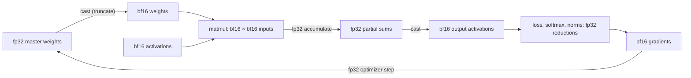

# Breakdown - bfloat16

> A 16-bit floating-point format designed at Google Brain and first deployed in the TPU's matrix units (v2/v3 era, ~2017–2018), publicly detailed around 2019. It is fp32 with the bottom 16 bits torn off: same 8-bit exponent, only 7 mantissa bits. That deliberately lopsided trade — full fp32 dynamic range, ~2–3 decimal digits of precision — is what made large-model training in 16 bits boring instead of fragile. As of 2026 it is the default training dtype on effectively every accelerator: TPUs, NVIDIA Ampere onward, AMD CDNA, and CPU vector extensions (AVX-512 BF16).

## The headline numbers

| Property | bfloat16 | fp16 (the rival it beat) | fp32 (the parent) |
|---|---|---|---|
| Bit layout (sign/exp/mantissa) | 1 / 8 / 7 | 1 / 5 / 10 | 1 / 8 / 23 |
| Exponent bias | 127 | 15 | 127 |
| Max finite | ~3.39 × 10³⁸ | 65 504 | ~3.40 × 10³⁸ |
| Min normal | ~1.18 × 10⁻³⁸ | ~6.10 × 10⁻⁵ | ~1.18 × 10⁻³⁸ |
| Machine epsilon (2⁻ᵐᵃⁿᵗⁱˢˢᵃ) | 7.8 × 10⁻³ | 9.8 × 10⁻⁴ | 1.19 × 10⁻⁷ |
| ~Decimal digits | 2–3 | ~3.3 | ~7.2 |
| Consecutive integers exact up to | 256 | 2 048 | 16 777 216 |
| Bytes per value | 2 | 2 | 4 |

Concrete consequence of the last row: a 7B-parameter model is 14 GB of weights in bf16 vs 28 GB in fp32 — the 2× that decides whether a model fits on a GPU at all (see [[Concept - GPU Memory Hierarchy]]).

## How it actually works

The value formula is standard IEEE-style: $(-1)^{s} \times 1.m \times 2^{e-127}$. What defines bf16 is *which bits it keeps* from fp32:

```
fp32   [S][E E E E E E E E][M M M M M M M M M M M M M M M M M M M M M M M]
        │  8 exponent bits │            23 mantissa bits
        │                  │
bf16   [S][E E E E E E E E][M M M M M M M]          ← the top 16 bits of fp32
        1        8               7

fp16   [S][E E E E E][M M M M M M M M M M]          ← different exponent width:
        1      5             10                        different (tiny) range
```

Because the exponent field is bit-identical to fp32's, every fp32 magnitude — from ~1.18 × 10⁻³⁸ to ~3.4 × 10³⁸ — is representable in bf16 (coarsely). Conversion fp32 → bf16 is truncating (or round-to-nearest-even on) the low 16 bits; bf16 → fp32 is appending 16 zero bits. No rescaling, no range check, no special cases beyond rounding.

The format never operates alone. The training-time dataflow that makes 7 mantissa bits survivable:



Multiplies read bf16; the multiply-accumulate chain inside [[Concept - Tensor Cores]] and the TPU MXU accumulates in fp32; the optimizer updates fp32 master weights. This is the [[Concept - Mixed Precision Training]] recipe with the loss-scaling stage deleted.

## The clever parts

**1. Spending the bit budget on range, not precision.** Gradients and activations in a deep net span many orders of magnitude, and their distribution shifts over training. fp16's 5-exponent-bit window (6.1 × 10⁻⁵ to 65 504) sits in the wrong place for both tails: Micikevicius et al. (2017) documented real gradient mass below fp16's representable range, which is what forced loss scaling. The bf16 insight is that *training tolerates coarse mantissas but not clipped exponents* — SGD's own gradient noise dwarfs 2⁻⁷ relative rounding error, but a gradient flushed to zero is information destroyed. Precision degrades gracefully; range fails catastrophically. Put the bits where failure is catastrophic.

**2. bf16 is a prefix of fp32.** The truncation-conversion property is a hardware gift: casting is a 16-bit shift, mixed fp32/bf16 storage needs no format conversion units, and any fp32 value can be "read as" a coarse bf16 by ignoring half its bits. Compare fp16, which needs genuine exponent re-biasing and overflow/underflow handling on every conversion. This is a large part of why bf16 support spread so fast across vendors — it is nearly free to bolt onto existing fp32 datapaths.

**3. Never letting bf16 near a long sum.** A dot product of length $k$ accumulated at precision $\epsilon$ carries error growing roughly $\sqrt{k}\,\epsilon$; with $\epsilon = 7.8 \times 10^{-3}$ and $k = 4096$ (one attention-head dot product in a modest model), pure-bf16 accumulation would be ~50% noise. So the MAC units accumulate in fp32, and the format's contract is explicitly "storage and multiplier input only" (see [[Concept - Matrix Multiplication as the Atom of Deep Learning]] for the accumulation-error mechanism, and [[Gotchas - Numerical Stability]] for what happens when someone forgets).

**4. Deleting a hyperparameter class.** fp16 training required a loss scale — a fiddly, run-crashing knob with its own dynamic-adjustment state machine, skipped steps, and distributed-synchronization corner cases (the whole saga: [[Lore - Loss Scaling and the fp16 Underflow Crisis]]). bf16's fp32-equal range means gradients essentially never underflow the *format* (they can still land in the subnormal band — see [[Concept - Subnormal Numbers and Gradual Underflow]] — but that band starts 33 orders of magnitude lower than fp16's). Removing the scaler removed an entire class of 3 a.m. pages. The quiet lesson: a numerics decision bought a *reliability* win, not a speed win.

## What it got wrong / what's dated

- **7 mantissa bits are too coarse for weight updates.** An update $w \mathrel{-}= \eta g$ is lost whenever $|\eta g| < \epsilon |w|$ — with $\epsilon \approx 7.8 \times 10^{-3}$ this happens constantly for mature weights and small learning rates. So you still pay for fp32 master weights (4 extra bytes/param in the optimizer state) or adopt stochastic rounding. The Gopher report (Rae et al. 2021) tested this directly at scale: pure-bf16 parameter storage degraded quality, and fp32 master weights (or stochastic rounding as a partial substitute) were needed to recover it. bf16 simplified the *forward/backward*; it never simplified the optimizer.
- **Reductions still need fp32.** Softmax, norm statistics, and losses computed natively in bf16 lose the tail of the sum. The format's success bred complacency; "bf16 everywhere" is a recurring self-inflicted wound.
- **It is a training format in an inference world.** For serving, bf16 leaves 2× memory and bandwidth on the table versus fp8/int8; post-training quantization formats (see [[Concept - Post-Training Quantization Formats]]) dominate deployment.
- **The lineage moved on and brought scaling back.** fp8 (e4m3/e5m2 on Hopper) and fp4/mxfp block formats (Blackwell-class, as of 2026) don't have the range to go scale-free, so per-tensor and per-block scale factors — loss scaling's descendants — returned in finer-grained form. DeepSeek-V3's fp8 training with block-wise scaling is the prominent public example (as of 2026). bf16's "no scaling needed" property was a local sweet spot at 16 bits, not a permanent victory.

## What to steal

- **Match the numeric format to the error tolerance of the specific computation.** Weights, activations, gradients, optimizer moments, and reductions have different failure modes; giving each its own precision is the design move bf16 pioneered and every quantization scheme since has copied.
- **Classify failure modes as graceful vs catastrophic, then spend resources on the catastrophic one.** Precision loss is graceful (noise-like); range loss is catastrophic (information destroyed). This asymmetry argument transfers far beyond floats.
- **Make the cheap-conversion property a design constraint.** bf16-as-fp32-prefix is why adoption was frictionless. When designing any interchange format, "is the conversion a no-op?" is worth real design effort.
- **Count deleted failure modes as a benefit, alongside speed.** The strongest argument for bf16 over fp16 was never throughput (both are 16-bit); it was the removal of the loss-scaling failure class. Reliability wins compound; benchmark wins don't page you.

## Connections

- [[Concept - Floating Point for Deep Learning]] — the general range-vs-precision mechanism this format is the purest expression of; read it first.
- [[Reference - Floating Point Formats]] — the full constants table where bf16 sits alongside fp16, tf32, fp8, and fp4.
- [[Concept - Subnormal Numbers and Gradual Underflow]] — what happens below bf16's min normal, and the FTZ hardware behavior that interacts with it.
- [[Lore - Loss Scaling and the fp16 Underflow Crisis]] — the crisis bf16 was built to end; the contrast that explains every design choice here.
- [[Gotchas - Numerical Stability]] — the catalog of ways 7 mantissa bits still bite (swamped updates, bf16 reductions) after you adopt the format.
- [[Concept - Matrix Multiplication as the Atom of Deep Learning]] — why accumulation precision, not storage precision, dominates matmul error, justifying the bf16-in/fp32-accumulate split.
- [[Concept - Mixed Precision Training]] — the operational recipe bf16 slots into: low-precision compute, fp32 master weights and reductions.
- [[Concept - Tensor Cores]] — the hardware units whose bf16-multiply/fp32-accumulate contract implements this format's design intent.
- [[Concept - GPU Memory Hierarchy]] — where the 2 bytes/value shows up as capacity and bandwidth wins across HBM, L2, and SRAM.
- [[Concept - Post-Training Quantization Formats]] — the deployment-side descendants that push below 16 bits by reintroducing explicit scale factors.
- [[Reference - Model Genealogy]] — checkpoint dtype is part of a model's identity: virtually every open-weights release since ~2021 ships bf16 weights, a direct trace of this format's victory.

## Sources

- Kalamkar et al. (2019) — *A Study of BFLOAT16 for Deep Learning Training.* The systematic evaluation showing bf16 matches fp32 training quality across workloads without loss scaling.
- Micikevicius et al. (2017) — *Mixed Precision Training.* The fp16 baseline: gradient-underflow measurements and the loss-scaling machinery bf16 rendered unnecessary.
- Wang & Kanwar (2019) — *BFloat16: The secret to high performance on Cloud TPUs* (Google Cloud blog). The public design rationale from the format's builders.
- Rae et al. (2021) — *Scaling Language Models: Methods, Analysis & Insights from Training Gopher.* Appendix lessons on bf16 at 280B scale: fp32 master weights vs stochastic rounding, measured.
- Micikevicius et al. (2022) — *FP8 Formats for Deep Learning.* The successor generation, and evidence that below 16 bits scaling metadata returns.
