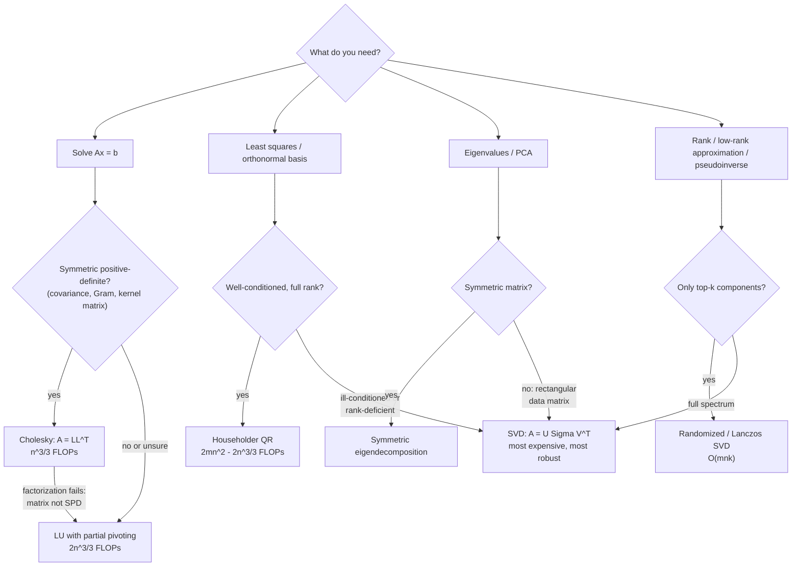

# Decision - Choosing a Matrix Factorization

> Match the factorization to the problem and the matrix's structure. Cholesky for symmetric positive-definite solves, LU for general square solves, QR for least squares and orthogonalization, eigendecomposition for symmetric spectra, and [[Concept - Singular Value Decomposition]] when you need rank, a pseudoinverse, or maximum stability. The 80% default is **factor once, solve many, and never compute `inv(A)`**. `solve(A, b)` costs roughly half as much as forming the inverse and doesn't amplify error by an extra factor of the condition number.

## Decision flow

## Tradeoff matrix

FLOP counts are leading terms for a dense $n \times n$ (or $m \times n$, $m \ge n$) matrix. Underneath, a factorization is a handful of big GEMMs, so wall-clock follows [[Concept - Matrix Multiplication as the Atom of Deep Learning]] economics.

| Factorization | Cost (FLOPs) | Stability | What you get | Canonical ML/DL uses |
|---|---|---|---|---|
| Cholesky $A = LL^\top$ | $n^3/3$ | Backward stable **iff** SPD; fails loudly otherwise | Triangular solve, log-det for free ($2\sum_i \log L_{ii}$) | Gaussian process regression, multivariate Gaussian sampling ($x = \mu + Lz$), K-FAC / natural-gradient solves, ridge regression |
| LU (partial pivoting) $PA = LU$ | $2n^3/3$ | Stable in practice; worst-case growth factor $2^{n-1}$ (Wilkinson) essentially never seen | General solve, determinant | Generic `solve()` — what `torch.linalg.solve` / LAPACK `getrf` run |
| Householder QR $A = QR$ | $2mn^2 - 2n^3/3$ (≈ $4n^3/3$ square) | Unconditionally backward stable | Orthonormal basis $Q$, triangular $R$ | Least squares, orthogonalization (the numerically safe Gram–Schmidt replacement), orthogonal init of weight matrices |
| Symmetric eig $A = Q\Lambda Q^\top$ | $\approx 4n^3$–$9n^3$ depending on algorithm (divide-and-conquer vs QR iteration, vectors included) | Stable for symmetric input | Full spectrum + eigenvectors | PCA via covariance, spectral clustering, Shampoo's inverse-$p$th-root preconditioners |
| SVD $A = U\Sigma V^\top$ | $O(mn\min(m,n))$, constant ~2–10× QR's | The gold standard: works for any matrix, reveals rank | Singular values, pseudoinverse, best rank-$k$ approximation (Eckart–Young) | LoRA/PiSSA initialization, whitening, spectral norm, low-rank compression of weight matrices |
| Randomized SVD (Halko et al. 2011) | $O(mnk + k^2(m+n))$ | Near-exact for spectra with decay; add power iterations for flat spectra | Top-$k$ singular triplets | PCA at scale, compressing embedding matrices, spectral analysis of weight updates |

Two rules sit above the table:

1. **Never form the explicit inverse.** `inv(A) @ b` costs $2n^3$ (vs $2n^3/3$ for LU-solve), loses roughly a factor-$\kappa$ more accuracy, and destroys sparsity. The inverse belongs in proofs, not code.
2. **Never form the normal equations for least squares.** Solving $A^\top A x = A^\top b$ squares the condition number: $\kappa(A^\top A) = \kappa(A)^2$ (see [[Concept - The Condition Number]]). fp32 arithmetic dies around $\kappa \sim 10^7$. With normal equations that budget drops to $\kappa(A) \sim 3 \times 10^3$, which an ordinary design matrix blows through. QR pays ~2× the FLOPs of the normal equations and keeps the full budget. In fp32 or bf16 that's the difference between an answer and noise.

## What flips the decision

- **You're not sure the matrix is SPD.** Cholesky on a non-SPD matrix fails (a negative pivot under the sqrt), so an *attempted* Cholesky is the cheapest SPD test there is. If you expect indefiniteness, use LDLᵀ or fall back to QR/SVD. Kernel and covariance matrices that are "SPD in theory" routinely go numerically indefinite from accumulated rounding. The standard fix is jitter: add $\epsilon I$ with $\epsilon \sim 10^{-6}\,\mathrm{tr}(A)/n$ before factoring. That GP-regression folklore fix is really conditioning repair (see [[Gotchas - Numerical Stability]]).
- **You need gradients through the factorization.** Backprop through SVD/eig has terms $\propto 1/(\sigma_i^2 - \sigma_j^2)$ (Ionescu et al. 2015). They blow up to NaN at repeated or clustered singular values, and trained nets commonly have near-degenerate spectra. Mitigations: Taylor-expanded gradients, double precision for the decomposition, or restructuring so the graph never differentiates through a full SVD. Cholesky and QR have well-behaved gradients, so prefer them in differentiable pipelines.
- **You only need a few directions.** A full decomposition spends $O(n^3)$ on a rank-$k$ question. Power iteration gets $\sigma_{\max}$ in a few matvecs; spectral normalization (Miyato et al. 2018) runs *one* iteration per training step. Lanczos gets top-$k$ eigenpairs, and randomized SVD gets top-$k$ singular triplets at $O(mnk)$. That's how PiSSA initializes [[Deep Dive - LoRA]] adapters from the top singular directions of a pretrained weight without paying for a full SVD.
- **You're on a GPU in low precision.** Dense factorizations are sequential-ish, pivot-heavy and mostly tensor-core-hostile. Batched *small* Cholesky/LU solves are fine; one big SVD stalls the device. [[Concept - Muon Optimizer]] shows the tradeoff. Its update is mathematically the polar factor $UV^\top$ of the gradient's SVD, but an SVD per step in bf16 is a non-starter, so Muon approximates it with ~5 Newton–Schulz iterations: pure GEMMs, which tensor cores handle well. When exactness costs you the hardware's throughput model, an iterative approximation usually wins. Same logic in [[Concept - Second-Order Optimizers at Scale]]: Shampoo and K-FAC run their eigendecompositions/inverse-root solves on a stale, amortized cadence instead of every step.
- **The matrix is sparse or huge.** Dense factorization fill-in destroys sparsity. Switch families: conjugate gradients, Lanczos, sparse Cholesky with fill-reducing ordering. Everything above assumes dense.
- **The preconditioner view.** Adam's per-coordinate second-moment scaling is a *diagonal* approximation of the curvature preconditioner that Shampoo/K-FAC compute via factorizations (see [[Concept - Adam and AdamW]]). Going from diagonal to Kronecker-factored to full is a decision about how much factorization cost you'll pay for better conditioning.
- **Classical-ML plumbing.** On tabular data, before trees or nets, the linear baselines (ridge via Cholesky/QR, PCA via truncated SVD) cost milliseconds and set the bar [[Concept - Gradient Boosting]] has to beat. Embedding pipelines use this table constantly too: whitening, isotropy correction and dimensionality reduction of [[Concept - Embedding Models]] outputs are all truncated-SVD applications.

## Connections

- [[Concept - Singular Value Decomposition]] — the internals of the most powerful option in this decision: geometry, Eckart–Young, and randomized variants.
- [[Concept - The Condition Number]] — the quantity that decides *how much* stability you need, and why normal equations (κ²) are the classic self-inflicted wound.
- [[Concept - Matrix Multiplication as the Atom of Deep Learning]] — factorizations are structured GEMM sequences; their real cost model is matmul's.
- [[Gotchas - Numerical Stability]] — the failure catalog behind the stability column: cancellation, near-zero pivots, and the jitter fix.
- [[Deep Dive - LoRA]] — low-rank adaptation is applied Eckart–Young; SVD-based inits (PiSSA) seed adapters from top singular directions.
- [[Concept - Adam and AdamW]] — the diagonal end of the preconditioning spectrum whose full-matrix end is Cholesky/eig territory.
- [[Concept - Muon Optimizer]] — the flagship example of replacing an exact factorization (SVD/QR orthogonalization) with GPU-friendly Newton–Schulz iterations.
- [[Concept - Second-Order Optimizers at Scale]] — Shampoo/K-FAC in production: eigendecompositions and Cholesky solves amortized across steps.
- [[Concept - Gradient Boosting]] — the tabular-stack neighbor: the linear solves in this note are the baselines and feature-engineering plumbing around GBDT models.
- [[Concept - Embedding Models]] — whitening, isotropy fixes, and dimension truncation of embedding spaces route through truncated SVD/PCA.

## Sources

- Golub & Van Loan (2013) — *Matrix Computations*, 4th ed. The FLOP counts and stability results in the matrix above.
- Trefethen & Bau (1997) — *Numerical Linear Algebra.* The clearest treatment of why QR beats normal equations and what backward stability buys.
- Halko, Martinsson & Tropp (2011) — *Finding Structure with Randomness.* Randomized SVD: the algorithm and its error bounds.
- Ionescu et al. (2015) — *Matrix Backpropagation for Deep Networks with Structured Layers.* The SVD/eig gradient formulas and their degenerate-spectrum singularities.
- Miyato et al. (2018) — *Spectral Normalization for GANs.* Power iteration as a one-step-per-update σ_max estimator in production training.
- Jordan et al. (2024) — *Muon: An optimizer for hidden layers in neural networks.* Newton–Schulz orthogonalization as the GPU-era substitute for exact factorization.
