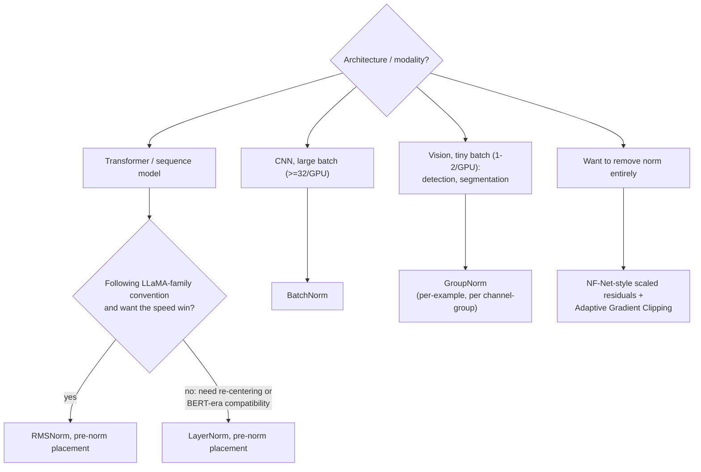

# Decision - Choosing a Normalization Layer

> For transformers and sequence models, default to RMSNorm in pre-norm placement. For large-batch CNNs, default to BatchNorm. That covers roughly 80% of cases (as of 2026). The other 20% turns on batch size, sequence-length variability, and how far you trust an unproven norm-free setup.

## Decision flow

## Tradeoff matrix

| Option | Batch-dependent? | Train/eval discrepancy | Relative speed (norm op) | Cross-example leakage | Extra learnable params | Typical home |
|---|---|---|---|---|---|---|
| BatchNorm | Yes: mean/var over the batch | Yes: batch stats vs. running EMA | Baseline | Yes | $\gamma, \beta$ | Large-batch CNNs (ResNet, EfficientNet) |
| LayerNorm | No: per-token, over features | No | Baseline | No | $\gamma, \beta$ | BERT-era transformers, RNNs |
| RMSNorm | No: per-token, over features | No | ~7–64% faster than LayerNorm (no mean subtraction, no $\beta$) | No | $\gamma$ only | LLaMA/T5-family and most modern LLMs |
| GroupNorm | No: per-example, per channel-group | No | Slightly slower than BatchNorm at large batch | No | $\gamma, \beta$ | Detection/segmentation at batch size 1–2 |
| No norm (NF-Net / Fixup / ReZero) | No | No | Fastest, since the op is gone | No | none, or one learnable scalar | Norm-free ResNets; unproven at frontier LLM scale |

## What flips the decision

- **Batch size 1–2 rules out BatchNorm.** Variance estimated from one or two samples isn't a meaningful statistic. Mask R-CNN-style detection and segmentation pipelines, often memory-constrained to batch size 1–2 per GPU, switched to GroupNorm for this reason.
- **Variable sequence length rules out BatchNorm.** Padded batches pollute batch statistics with masked positions, and single-token autoregressive decoding has no coherent batch dimension to normalize over. That's a first-order reason sequence models use [[Concept - RMSNorm and LayerNorm]] instead (full mechanism and failure catalog in [[Breakdown - Batch Normalization]]).
- **RL or distillation fine-tuning, where train/eval mismatch bites hardest, favors batch-independent norms.** Fine-tune a BatchNorm model on small RL-rollout batches and the running statistics drift away from the fine-tuning batch distribution. Eval quality degrades silently, with no error thrown. Per-example norms avoid the problem entirely.
- **Kernel fusion on your hardware can settle LayerNorm vs. RMSNorm.** RMSNorm's op-count edge only shows up with a fused kernel (Triton, Apex, or framework-native). A naive unfused implementation can erase it, so profile before trusting "faster" on new hardware.
- **LLM default (as of 2026): RMSNorm, pre-norm placement.** Placement itself (pre-norm vs. post-norm vs. DeepNorm) belongs to [[Deep Dive - The Transformer]], one layer downstream of this decision. **Classical CNN default: still BatchNorm**, though vision increasingly borrows the LayerNorm choice from [[Concept - Vision Transformers]] as ViT-style backbones spread.
- **"No norm" works but moves the burden elsewhere.** NF-Nets match or beat BatchNorm ResNets on ImageNet at higher training throughput, replacing normalization with scaled residuals and adaptive gradient clipping. Per [[Concept - Normalization-Free Networks]], this hasn't been shown to scale to frontier LLMs as of 2026. Treat it as a throughput or research play. I wouldn't default to it.

## Connections

- [[Concept - RMSNorm and LayerNorm]] — the two options that win by default for transformers; this Decision is the routing table into their mechanism note.
- [[Breakdown - Batch Normalization]] — full mechanism and failure-mode reverse-engineering of the CNN-era default this decision routes away from at small batch size or variable sequence length.
- [[Concept - Normalization-Free Networks]] — the "skip norm entirely" branch, and why it remains unproven at frontier scale.
- [[Deep Dive - The Transformer]] — owns the pre-norm vs. post-norm placement question that sits one layer downstream of "which norm."
- [[Concept - Vision Transformers]] — the architecture that carried LayerNorm out of NLP and into vision, shifting the CNN-era BatchNorm default.
- [[Concept - The Training Loop]] — `model.train()`/`model.eval()` is the switch whose behavior differs sharply depending on which norm you picked.

## Sources

- Ioffe & Szegedy (2015) — Batch Normalization: Accelerating Deep Network Training by Reducing Internal Covariate Shift. The option this decision routes away from at small batch/variable length.
- Zhang & Sennrich (2019) — Root Mean Square Layer Normalization. The RMSNorm mechanism and its speed argument.
- Wu & He (2018) — Group Normalization. The batch-independent fix for small-batch vision.
- Brock, De, Smith & Simonyan (2021) — High-Performance Large-Scale Image Recognition Without Normalization (NF-Nets). The norm-free branch's strongest evidence.
