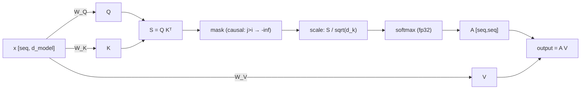

> **One-paragraph hook:** Attention is the operation that lets a transformer decide, per token, which other tokens matter — and it does so with a mechanism no more exotic than a differentiable, weighted dictionary lookup. Every LLM's ability to track long-range dependencies, resolve coreference, or copy a name from earlier in the prompt runs through this one formula, and its quadratic cost is the single biggest lever in modern architecture and systems work.

## The mechanism

Given an input sequence of token representations `x` (shape `[seq, d_model]`), attention projects each token into three roles via learned matrices:

$$Q = xW_Q, \quad K = xW_K, \quad V = xW_V$$

Queries ask "what am I looking for," keys advertise "what do I contain," and values carry "what do I actually pass along if selected" — the whole operation is a differentiable generalization of a dictionary lookup, historically invented (Bahdanau et al. 2014) as a fix for the fixed-vector bottleneck of encoder-decoder [[Concept - Recurrent Networks and the LSTM|RNNs]], where the entire source sequence had to be compressed into one hidden state before the decoder could use it. The raw compatibility between every query and every key is a dot product:

$$S = QK^T$$

`S` is a `[seq, seq]` matrix of similarity scores. Turning scores into a probability distribution over positions to attend to requires softmax, but first the scores are scaled:

$$A = \text{softmax}\left(\frac{S}{\sqrt{d_k}}\right), \quad \text{output} = AV$$

**Why divide by `sqrt(d_k)`.** Each entry of `S` is a sum of `d_k` products of roughly-independent, roughly-unit-variance terms, so `Var(S_ij) ∝ d_k`. As `d_k` grows (64, 128 in practice), unscaled dot products grow large in magnitude, which pushes softmax into a saturated, near-one-hot regime — a handful of positions get all the probability mass and the rest get vanishing gradient. Vaswani et al. (2017, section 3.2.1) introduce `1/sqrt(d_k)` specifically to keep the pre-softmax variance at roughly 1 regardless of head dimension, keeping softmax in a well-behaved entropy range. Skip this scaling (or scale by the wrong dimension, e.g. `d_model` instead of `d_head`) and you get attention entropy collapse and a loss curve that plateaus high — see [[Gotchas - Implementing Attention]].

**Causal masking.** For autoregressive generation, position `i` must never see position `j > i` — otherwise the model could "cheat" by reading its own answer. This is enforced by setting `S_ij = -\infty` for `j > i` before the softmax, so those positions receive exactly zero probability mass. This single trick is what makes parallel training against shifted next-token targets possible: every position's loss can be computed in one forward pass because each position is architecturally blind to its future, without needing a sequential unrolled loop like an RNN.

**Numerical precision.** Softmax must be computed in fp32 even inside an otherwise bf16 model — low precision here causes probability mass loss and instability, and it's standard practice to subtract the row max before exponentiating for numerical stability (`softmax(x) = exp(x - max(x)) / sum(exp(x - max(x)))`). This exact structure — the score matrix computed, masked, upcast, softmaxed, and multiplied by V — is precisely what [[Deep Dive - FlashAttention]] fuses into a single kernel to avoid ever materializing the full `[seq, seq]` score matrix in HBM, computing it tile-by-tile in SRAM instead.

**Complexity.** Both the `QK^T` matmul and the `AV` matmul cost `O(N^2 * d)` time, and naively the score matrix `S` costs `O(N^2)` memory. At `N=128k` tokens this is the dominant cost in the model, which is the entire motivation behind [[Concept - Sparse and Sliding-Window Attention]], linear-attention alternatives ([[Concept - Linear Attention]]), and state-space sequence mixers ([[Concept - State Space Models and Mamba]]).

**Permutation equivariance.** Attention as defined above has no notion of order: shuffle the input rows and the output rows shuffle identically ("dog bites man" and "man bites dog" produce the same set of attention outputs, just relabeled). This is why positional information is not optional — it must be injected somewhere, either additively into the embeddings or directly into the Q/K dot product, which is exactly the role of [[Concept - Positional Encoding]].

## In practice

In a real model, this operation runs `n_heads` times in parallel on disjoint `d_head`-wide slices (`d_head = d_model / n_heads`, typically 64 or 128), each head learning a different notion of "similarity" — see [[Concept - Multi-Head Attention Variants (MHA MQA GQA MLA)]] for how modern models reduce the memory cost of storing per-head keys and values. At inference time, once a token's key and value are computed they never change, so they're cached and reused for every subsequent decoding step — this is the [[Concept - KV Cache]], and its size grows linearly with sequence length, which is why attention's `O(N)` per-step *cache* cost (not just its `O(N^2)` training cost) dominates serving economics at long context.

Reference numbers: a 7B-class dense model typically runs `n_heads=32`, `d_head=128`; GPT-3's 96 attention heads at `d_head=128` per layer is a canonical example of the standard `d_head ∈ {64, 128}` convention (folklore-driven, not derived from theory — see the numerology discussion in domain 18). A minimal, correct implementation of the whole operation is in [[Snippet - Scaled Dot-Product Attention from Scratch]].

## Failure modes

- **Attention entropy collapse.** Deep stacks, particular initializations, or missing scaling can push softmax toward putting almost all weight on a single token per query, which starves gradient flow through the other positions and stalls learning. Detect by logging attention entropy per layer during training; a sharp drop to near-zero is diagnostic.
- **Rank collapse in deep stacks.** Without residual connections and normalization, stacking pure attention layers drives all token representations toward the same vector (Dong et al. show pure-attention networks collapse doubly exponentially in depth) — this is one of the reasons the residual stream ([[Concept - The Residual Stream]]) and normalization placement are load-bearing, not cosmetic.
- **Attention sinks / massive activations.** Trained models reliably dump a disproportionate amount of attention mass on the first token(s) regardless of content — a stable, learned "no-op" the model uses to avoid forcing softmax to commit fully. This has real serving consequences (evicting the sink token from a sliding KV cache tanks quality) and is covered in depth in [[Concept - Attention Sinks]].
- **fp16/bf16 softmax under/overflow.** Computing the softmax in low precision instead of upcasting to fp32 causes probability mass loss, especially at long sequence lengths with many small logit differences — a subtle correctness bug that trains but degrades quality unpredictably.

## The non-obvious

Attention is often taught as "the model learns what's important," which implies something semantic. In practice, empirical studies of trained models (see the [[Breakdown - Mixtral 8x7B]] expert-routing finding as an analogous case) repeatedly show attention patterns doing a lot of syntactic and positional bookkeeping — tracking induction patterns, copying nearby tokens, and maintaining the attention-sink no-op — rather than anything resembling topic-level "importance." The mechanistic interpretability finding of [[Concept - Induction Heads]] (a two-head circuit that implements "find the previous occurrence of the current token and predict what followed it") is the single best-understood example of what attention heads actually compute, and it looks nothing like a human notion of relevance — it's closer to a hard-coded string-matching algorithm the model discovered via gradient descent.

## Connections
- [[Concept - Recurrent Networks and the LSTM]] — attention was invented to fix the fixed-vector bottleneck of RNN encoder-decoders before it became the transformer's core operation.
- [[Concept - Softmax]] — the exact normalization function attention applies to scores, including the numerical-stability tricks (max-subtraction) that carry over directly.
- [[Concept - Multi-Head Attention Variants (MHA MQA GQA MLA)]] — how real models split this single-head formula into many heads and then economize on the KV storage those heads require.
- [[Concept - Positional Encoding]] — the family of fixes for attention's permutation equivariance, without which token order is invisible to this formula.
- [[Deep Dive - FlashAttention]] — the fused GPU kernel that computes exactly this formula without materializing the full score matrix in HBM.
- [[Concept - KV Cache]] — the memory structure that makes autoregressive decoding with attention tractable by reusing computed keys and values across steps.
- [[Concept - Attention Sinks]] — the reproducible failure/adaptation where trained attention dumps mass on early tokens as a learned no-op.
- [[Concept - Induction Heads]] — the best-understood concrete circuit built from this mechanism, discovered via mechanistic interpretability.
- [[Concept - Matrix Multiplication as the Atom of Deep Learning]] — attention is, at its core, three matmuls and a softmax; this note grounds why that substrate matters for hardware efficiency.

## Sources
- Vaswani et al. (2017) — "Attention Is All You Need." Introduces scaled dot-product attention and the `1/sqrt(d_k)` scaling rationale (section 3.2.1).
- Bahdanau et al. (2014) — "Neural Machine Translation by Jointly Learning to Align and Translate." The original additive-attention mechanism that scaled dot-product attention later displaced.
