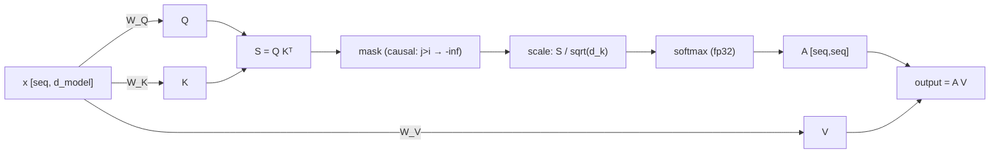

> **One-paragraph hook:** Attention is how a transformer decides, per token, which other tokens matter. Mechanically it's a differentiable, weighted dictionary lookup. Every LLM's ability to track long-range dependencies, resolve coreference, or copy a name from earlier in the prompt runs through this one formula, and its quadratic cost is the biggest lever in modern architecture and systems work.

## The mechanism

Given an input sequence of token representations `x` (shape `[seq, d_model]`), attention projects each token into three roles via learned matrices:

$$Q = xW_Q, \quad K = xW_K, \quad V = xW_V$$

Queries ask "what am I looking for," keys advertise "what do I contain," and values carry "what do I pass along if selected." The whole thing generalizes a dictionary lookup. It was invented (Bahdanau et al. 2014) to fix the fixed-vector bottleneck of encoder-decoder [[Concept - Recurrent Networks and the LSTM|RNNs]], where the entire source sequence had to be squeezed into one hidden state before the decoder could use it. The raw compatibility between every query and every key is a dot product:

$$S = QK^T$$

`S` is a `[seq, seq]` matrix of similarity scores. Softmax turns those scores into a probability distribution over positions, but the scores get scaled first:

$$A = \text{softmax}\left(\frac{S}{\sqrt{d_k}}\right), \quad \text{output} = AV$$

### Why divide by `sqrt(d_k)`

Each entry of `S` is a sum of `d_k` products of roughly-independent, roughly-unit-variance terms, so `Var(S_ij) ∝ d_k`. As `d_k` grows (64, 128 in practice), unscaled dot products get large, and softmax saturates into a near-one-hot regime: a handful of positions take all the probability mass and the rest get vanishing gradient. Vaswani et al. (2017, section 3.2.1) introduce `1/sqrt(d_k)` to hold pre-softmax variance at roughly 1 whatever the head dimension, which keeps softmax in a sane entropy range. Skip the scaling, or scale by the wrong dimension (`d_model` instead of `d_head`), and you get attention entropy collapse and a loss curve that plateaus high. See [[Gotchas - Implementing Attention]].

### Causal masking

For autoregressive generation, position `i` must never see position `j > i`, or the model could "cheat" by reading its own answer. You enforce this by setting `S_ij = -\infty` for `j > i` before the softmax, so those positions get zero probability mass. That one trick makes parallel training against shifted next-token targets possible. Each position is architecturally blind to its future, so every position's loss comes out of one forward pass, with no sequential unrolled loop like an RNN needs.

### Numerical precision

Compute softmax in fp32 even inside an otherwise bf16 model. Low precision here loses probability mass and causes instability. Standard practice is to subtract the row max before exponentiating (`softmax(x) = exp(x - max(x)) / sum(exp(x - max(x)))`). This whole sequence (score matrix computed, masked, upcast, softmaxed, multiplied by V) is what [[Deep Dive - FlashAttention]] fuses into one kernel. It computes tile-by-tile in SRAM and never materializes the full `[seq, seq]` score matrix in HBM.

### Complexity

The `QK^T` and `AV` matmuls each cost `O(N^2 * d)` time, and the naive score matrix `S` costs `O(N^2)` memory. At `N=128k` tokens that's the dominant cost in the model. It's the whole motivation for [[Concept - Sparse and Sliding-Window Attention]], linear-attention alternatives ([[Concept - Linear Attention]]), and state-space sequence mixers ([[Concept - State Space Models and Mamba]]).

### Permutation equivariance

As defined above, attention has no notion of order. Shuffle the input rows and the output rows shuffle identically: "dog bites man" and "man bites dog" produce the same set of attention outputs, just relabeled. So positional information has to be injected somewhere, either added to the embeddings or put directly into the Q/K dot product. That's the job of [[Concept - Positional Encoding]].

## In practice

A real model runs this `n_heads` times in parallel on disjoint `d_head`-wide slices (`d_head = d_model / n_heads`, typically 64 or 128), and each head learns a different notion of "similarity." [[Concept - Multi-Head Attention Variants (MHA MQA GQA MLA)]] covers how modern models cut the memory cost of storing per-head keys and values. At inference, a token's key and value never change once computed, so they're cached and reused on every later decoding step. That's the [[Concept - KV Cache]]. It grows linearly with sequence length, so at long context attention's `O(N)` per-step *cache* cost, on top of its `O(N^2)` training cost, dominates serving economics.

Reference numbers: a 7B-class dense model typically runs `n_heads=32`, `d_head=128`. GPT-3's 96 attention heads at `d_head=128` per layer is the canonical example of the `d_head ∈ {64, 128}` convention, which comes from folklore and not theory (see the numerology discussion in domain 18). A minimal, correct implementation is in [[Snippet - Scaled Dot-Product Attention from Scratch]].

## Failure modes

- **Attention entropy collapse.** Deep stacks, some initializations, or missing scaling can push softmax to put almost all weight on one token per query. Gradient to the other positions starves and learning stalls. Log attention entropy per layer during training; a sharp drop to near-zero is diagnostic.
- **Rank collapse in deep stacks.** Stack pure attention layers without residual connections and normalization and every token representation drifts toward the same vector (Dong et al. show pure-attention networks collapse doubly exponentially in depth). It's one reason the residual stream ([[Concept - The Residual Stream]]) and normalization placement aren't cosmetic.
- **Attention sinks / massive activations.** Trained models reliably dump a disproportionate share of attention on the first token(s) regardless of content. It's a stable, learned "no-op" that spares softmax from committing fully. It matters for serving: evict the sink token from a sliding KV cache and quality tanks. Covered in [[Concept - Attention Sinks]].
- **fp16/bf16 softmax under/overflow.** Running softmax in low precision without upcasting to fp32 loses probability mass, worst at long sequence lengths with many small logit differences. The model still trains, but quality degrades unpredictably, which makes it a subtle correctness bug.

## The non-obvious

Attention usually gets taught as "the model learns what's important," which sounds semantic. Empirical studies of trained models (the [[Breakdown - Mixtral 8x7B]] expert-routing finding is an analogous case) keep showing attention doing a lot of syntactic and positional bookkeeping: tracking induction patterns, copying nearby tokens, maintaining the attention-sink no-op. Not much of it resembles topic-level "importance." The best-understood example of what heads compute is [[Concept - Induction Heads]], a two-head circuit that implements "find the previous occurrence of the current token and predict what followed it." It looks nothing like a human notion of relevance. It's closer to a hard-coded string-matching algorithm the model found by gradient descent.

## Connections
- [[Concept - Recurrent Networks and the LSTM]] — attention was invented to fix the fixed-vector bottleneck of RNN encoder-decoders before it became the transformer's core operation.
- [[Concept - Softmax]] — the exact normalization function attention applies to scores, including the numerical-stability tricks (max-subtraction) that carry over directly.
- [[Concept - Multi-Head Attention Variants (MHA MQA GQA MLA)]] — how real models split this single-head formula into many heads and then economize on the KV storage those heads require.
- [[Concept - Positional Encoding]] — the family of fixes for attention's permutation equivariance, without which token order is invisible to this formula.
- [[Deep Dive - FlashAttention]] — the fused GPU kernel that computes exactly this formula without materializing the full score matrix in HBM.
- [[Concept - KV Cache]] — the memory structure that makes autoregressive decoding with attention tractable by reusing computed keys and values across steps.
- [[Concept - Attention Sinks]] — the reproducible failure/adaptation where trained attention dumps mass on early tokens as a learned no-op.
- [[Concept - Induction Heads]] — the best-understood concrete circuit built from this mechanism, discovered via mechanistic interpretability.
- [[Concept - Matrix Multiplication as the Atom of Deep Learning]] — attention is, at its core, three matmuls and a softmax; this note grounds why that substrate matters for hardware efficiency.

## Sources
- Vaswani et al. (2017) — "Attention Is All You Need." Introduces scaled dot-product attention and the `1/sqrt(d_k)` scaling rationale (section 3.2.1).
- Bahdanau et al. (2014) — "Neural Machine Translation by Jointly Learning to Align and Translate." The original additive-attention mechanism that scaled dot-product attention later displaced.
