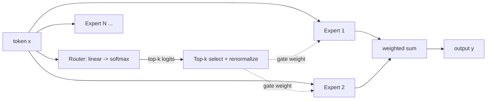

> **One-paragraph hook:** A Mixture of Experts (MoE) layer replaces the single FFN sublayer in a transformer block with N separate expert FFNs and a small learned router that sends each token to only a handful of them. The payoff is a model with far more total parameters — and therefore more capacity — while the FLOPs and latency per token stay pinned to a small "active" subset. DeepSeek-V3 is 671B parameters total but only 37B are touched per token; that gap is the entire reason MoE exists.

## The mechanism

A dense [[Deep Dive - The Transformer]] block runs every token through one FFN. An MoE block instead has $N$ expert FFNs $E_1 \ldots E_N$ (usually structurally identical to a normal [[Concept - Feed-Forward Networks and GLU Variants]] block) and a router: a linear layer $W_r \in \mathbb{R}^{d_{model} \times N}$ that produces logits, softmaxed into gate probabilities, from which the top-$k$ are kept and renormalized:

$$g = \text{softmax}(xW_r), \quad \mathcal{T} = \text{TopK}(g, k), \quad \hat{g}_i = \frac{g_i}{\sum_{j \in \mathcal{T}} g_j} \; \forall i \in \mathcal{T}$$
$$y = \sum_{i \in \mathcal{T}} \hat{g}_i \cdot E_i(x)$$

```python
router_logits = x @ W_router                     # [tokens, N]
gate_all = softmax(router_logits, dim=-1)
top_vals, top_idx = topk(gate_all, k)             # k=1 (Switch) or k=2 (GShard/Mixtral)
gate = top_vals / top_vals.sum(-1, keepdim=True)  # renormalize over the k chosen
y = zeros_like(x)
for i in range(k):
    y += gate[:, i:i+1] * expert_fn(top_idx[:, i], x)
```



Routing granularity has evolved. Switch Transformer (Fedus et al. 2021) uses top-1: one expert per token, simplest possible router, and the paper that first pushed sparse models past a trillion parameters (Switch-C, 1.6T). GShard (Lepikhin et al. 2020) and Mixtral popularized top-2, trading a bit more compute for materially better quality since two experts can average out routing mistakes. DeepSeekMoE (Dai et al. 2024) went further: many *fine-grained* small experts (finer-grained than one-expert-per-FFN-worth-of-params) selected top-8, plus one or more *shared* experts that are always active for every token — the shared expert absorbs common knowledge so the routed experts can specialize on the residual.

Each expert has a capacity: at most $C = \text{capacity\_factor} \times \frac{\text{tokens per batch}}{N}$ tokens per forward pass. Tokens that route to an already-full expert overflow and are dropped — they skip that layer's expert computation and pass straight through the residual stream unchanged. This is a deliberate systems tradeoff (fixed-size buffers are what makes expert-parallel dispatch tractable), not a bug, but it is a real source of quality loss when capacity_factor is set below 1.0 to save memory.

## In practice

Mixtral 8x7B ([[Breakdown - Mixtral 8x7B]]): 32 layers, 8 experts per layer, top-2, 47B total / ~13B active — only the FFN sublayers are MoE, attention stays dense. DeepSeek-V3 ([[Breakdown - DeepSeek-V3 Architecture]]): 671B total / 37B active, 61 layers, 256 fine-grained routed experts (top-8) plus a shared expert per layer. The decoupling is the entire pitch: at roughly the same *active* FLOPs as a 13B–37B dense model, you get the representational capacity of a much larger one — as long as you can afford to hold every expert resident in memory and, in distributed training, pay the all-to-all communication cost of dispatching tokens to whichever GPU holds their chosen expert (see [[Concept - Tensor and Pipeline Parallelism]] for how expert placement interacts with model-parallel layout). This memory/compute split is also why MoE is central to [[Concept - Cost Engineering for LLM Applications]]: the $/token math for a 671B-total model looks like a 37B model's compute bill but a 671B model's memory footprint.

## Failure modes

**Routing collapse** — without any balancing pressure, gradient descent finds it easiest to route everything to a handful of experts (a self-reinforcing loop: an expert that gets more tokens gets more gradient signal and becomes more attractive to the router). Symptom: a spiky per-expert token-count histogram with most experts near zero. Detect by logging expert utilization during training; fix via an auxiliary load-balance loss or (DeepSeek-V3's approach) an aux-loss-free per-expert bias nudged up/down by observed load.

**Capacity overflow / token dropping** — silent quality loss concentrated on whichever tokens happened to be co-located with a popular expert in that batch; gets worse as capacity_factor is tuned down for memory savings, and creates a train/eval mismatch if the two use different capacity settings.

**Batch-dependent nondeterminism at inference** — which tokens share a batch changes each expert's load, and with a capacity limit in play, that changes which tokens overflow — so the same prompt can produce different outputs depending on what else is in the batch. Production MoE serving generally either sets capacity_factor high enough that dropping never triggers, or removes the cap entirely at inference and eats the occasional load imbalance.

## The non-obvious

The intuitive story — "one expert learns math, one learns code, one learns French" — is largely wrong. Jiang et al. (2024, the Mixtral paper) looked at routing decisions on real text and found experts do not specialize by topic; routing is dominated by fairly syntactic/positional patterns and load is close to uniform across experts. The capacity gain from MoE is real, but it doesn't come from clean semantic division of labor the way marketing narratives imply.

The second non-obvious point is a serving trap: MoE's FLOP savings only materialize at large batch sizes, where enough tokens are in flight that every expert stays busy. At batch size 1 — a single interactive user — you still pay full memory-bandwidth cost to touch (at minimum) the router's chosen experts scattered across device memory, while getting only small-model compute. For low-batch, latency-sensitive serving, a same-active-params dense model can be a wash or even faster than the MoE, because the MoE's memory-bandwidth bill doesn't shrink even though its FLOP bill does (see [[Decision - Dense vs Mixture-of-Experts]] for the full tradeoff).

## Connections

- [[Deep Dive - The Transformer]] — MoE replaces one sublayer of this block; the full forward path is the prerequisite context.
- [[Concept - Feed-Forward Networks and GLU Variants]] — MoE is a sparsification of exactly this sublayer; understanding the dense FFN is the prerequisite.
- [[Decision - Dense vs Mixture-of-Experts]] — the practical decision framework for when the capacity gain is worth the memory/comms cost.
- [[Breakdown - Mixtral 8x7B]] — the cleanest documented top-2 MoE, including the expert-specialization myth-busting.
- [[Breakdown - DeepSeek-V3 Architecture]] — the current high-water mark: fine-grained experts, shared experts, and aux-loss-free balancing.
- [[Concept - Tensor and Pipeline Parallelism]] — expert placement across devices and the all-to-all dispatch cost that MoE adds to distributed training.
- [[Concept - Cost Engineering for LLM Applications]] — why MoE's active-vs-total parameter split reshapes the $/token calculation for production serving.
- [[Gotchas - Mixture of Experts]] — the inference- and fine-tuning-time pitfalls (routing collapse, quantization brittleness) that survive past training.
- [[Snippet - Top-2 MoE Routing Layer]] — a runnable version of the router/gate/dispatch logic sketched above.

## Sources
- Fedus, Zoph, Shazeer (2021) — Switch Transformer: top-1 routing, first trillion-parameter sparse model.
- Lepikhin et al. (2020) — GShard: top-2 expert routing at scale with expert parallelism.
- Jiang et al. (2024) — Mixtral of Experts: the routing-is-not-topical-specialization finding.
- Dai et al. (2024) — DeepSeekMoE: fine-grained experts plus always-on shared experts.
