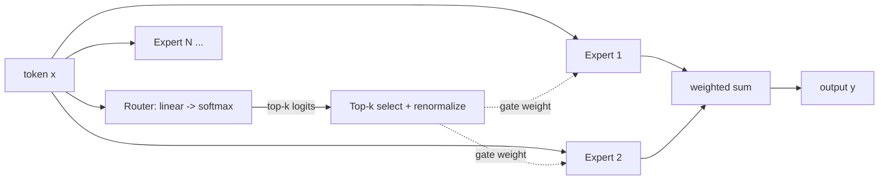

> **One-paragraph hook:** A Mixture of Experts (MoE) layer replaces the single FFN sublayer in a transformer block with N separate expert FFNs and a small learned router that sends each token to only a few of them. You get a model with far more total parameters, and so more capacity, while FLOPs and latency per token stay tied to a small "active" subset. DeepSeek-V3 has 671B parameters total but touches only 37B per token. MoE exists for that gap.

## The mechanism

A dense [[Deep Dive - The Transformer]] block runs every token through one FFN. An MoE block has $N$ expert FFNs $E_1 \ldots E_N$ (usually the same shape as a normal [[Concept - Feed-Forward Networks and GLU Variants]] block) plus a router. The router is a linear layer $W_r \in \mathbb{R}^{d_{model} \times N}$ whose logits are softmaxed into gate probabilities; the top-$k$ are kept and renormalized:

$$g = \text{softmax}(xW_r), \quad \mathcal{T} = \text{TopK}(g, k), \quad \hat{g}_i = \frac{g_i}{\sum_{j \in \mathcal{T}} g_j} \; \forall i \in \mathcal{T}$$
$$y = \sum_{i \in \mathcal{T}} \hat{g}_i \cdot E_i(x)$$

```python
router_logits = x @ W_router                     # [tokens, N]
gate_all = softmax(router_logits, dim=-1)
top_vals, top_idx = topk(gate_all, k)             # k=1 (Switch) or k=2 (GShard/Mixtral)
gate = top_vals / top_vals.sum(-1, keepdim=True)  # renormalize over the k chosen
y = zeros_like(x)
for i in range(k):
    y += gate[:, i:i+1] * expert_fn(top_idx[:, i], x)
```



Routing granularity has changed over time. Switch Transformer (Fedus et al. 2021) uses top-1, one expert per token, the simplest possible router; it was the paper that first pushed sparse models past a trillion parameters (Switch-C, 1.6T). GShard (Lepikhin et al. 2020) and Mixtral popularized top-2, which costs a bit more compute and buys materially better quality, since two experts can average out routing mistakes. DeepSeekMoE (Dai et al. 2024) went further with many *fine-grained* small experts (smaller than one FFN's worth of params each) selected top-8, plus one or more *shared* experts active for every token. The shared expert soaks up common knowledge and the routed experts specialize on what's left.

Each expert has a capacity of at most $C = \text{capacity\_factor} \times \frac{\text{tokens per batch}}{N}$ tokens per forward pass. Tokens routed to an expert that's already full overflow and get dropped: they skip that layer's expert computation and pass through the residual stream unchanged. That's a deliberate systems tradeoff, since fixed-size buffers are what make expert-parallel dispatch tractable. It still costs real quality when capacity_factor goes below 1.0 to save memory.

## In practice

Mixtral 8x7B ([[Breakdown - Mixtral 8x7B]]) has 32 layers, 8 experts per layer, top-2, 47B total / ~13B active. Only the FFN sublayers are MoE; attention stays dense. DeepSeek-V3 ([[Breakdown - DeepSeek-V3 Architecture]]) is 671B total / 37B active over 61 layers, with 256 fine-grained routed experts (top-8) plus a shared expert per layer. The pitch is the decoupling. At roughly the *active* FLOPs of a 13B–37B dense model you get the representational capacity of a much bigger one, provided you can hold every expert resident in memory and, in distributed training, pay the all-to-all cost of dispatching tokens to whichever GPU holds their expert. [[Concept - Tensor and Pipeline Parallelism]] covers how expert placement interacts with model-parallel layout. The same memory/compute split puts MoE at the center of [[Concept - Cost Engineering for LLM Applications]]: a 671B-total model's $/token looks like a 37B model's compute bill on top of a 671B model's memory footprint.

## Failure modes

**Routing collapse.** With no balancing pressure, gradient descent finds it easiest to route everything to a handful of experts. The loop feeds itself: an expert that gets more tokens gets more gradient signal and looks better to the router. You'll see a spiky per-expert token-count histogram with most experts near zero. Log expert utilization during training to catch it. Fix it with an auxiliary load-balance loss, or DeepSeek-V3's aux-loss-free approach, a per-expert bias nudged up or down by observed load.

**Capacity overflow / token dropping.** Quality loss is silent and lands on whichever tokens happened to share a batch with a popular expert. It gets worse as capacity_factor is tuned down for memory, and it creates a train/eval mismatch if the two use different capacity settings.

**Batch-dependent nondeterminism at inference.** Batch composition changes each expert's load. With a capacity limit in place, that changes which tokens overflow, so the same prompt can give different outputs depending on what else is in the batch. Production MoE serving generally either sets capacity_factor high enough that dropping never triggers or removes the cap at inference and accepts the occasional load imbalance.

## The non-obvious

The intuitive story ("one expert learns math, one learns code, one learns French") is largely wrong. Jiang et al. (2024, the Mixtral paper) looked at routing decisions on real text and found experts don't specialize by topic. Routing is dominated by fairly syntactic/positional patterns, and load is close to uniform across experts. MoE's capacity gain is real, but it doesn't come from the clean semantic division of labor that marketing narratives imply.

The second point is a serving trap. MoE saves FLOPs only at large batch sizes, where enough tokens are in flight to keep every expert busy. At batch size 1, a single interactive user, you still pay full memory-bandwidth cost to touch (at minimum) the router's chosen experts scattered across device memory, and you get only small-model compute for it. For low-batch, latency-sensitive serving, a dense model with the same active params can be a wash or even faster: the MoE's FLOP bill shrinks and its memory-bandwidth bill doesn't. [[Decision - Dense vs Mixture-of-Experts]] has the full tradeoff.

## Connections

- [[Deep Dive - The Transformer]] — MoE replaces one sublayer of this block; the full forward path is the prerequisite context.
- [[Concept - Feed-Forward Networks and GLU Variants]] — MoE is a sparsification of exactly this sublayer; understanding the dense FFN is the prerequisite.
- [[Decision - Dense vs Mixture-of-Experts]] — the practical decision framework for when the capacity gain is worth the memory/comms cost.
- [[Breakdown - Mixtral 8x7B]] — the cleanest documented top-2 MoE, including the expert-specialization myth-busting.
- [[Breakdown - DeepSeek-V3 Architecture]] — the current high-water mark: fine-grained experts, shared experts, and aux-loss-free balancing.
- [[Concept - Tensor and Pipeline Parallelism]] — expert placement across devices and the all-to-all dispatch cost that MoE adds to distributed training.
- [[Concept - Cost Engineering for LLM Applications]] — why MoE's active-vs-total parameter split reshapes the $/token calculation for production serving.
- [[Gotchas - Mixture of Experts]] — the inference- and fine-tuning-time pitfalls (routing collapse, quantization brittleness) that survive past training.
- [[Snippet - Top-2 MoE Routing Layer]] — a runnable version of the router/gate/dispatch logic sketched above.

## Sources
- Fedus, Zoph, Shazeer (2021) — Switch Transformer: top-1 routing, first trillion-parameter sparse model.
- Lepikhin et al. (2020) — GShard: top-2 expert routing at scale with expert parallelism.
- Jiang et al. (2024) — Mixtral of Experts: the routing-is-not-topical-specialization finding.
- Dai et al. (2024) — DeepSeekMoE: fine-grained experts plus always-on shared experts.
