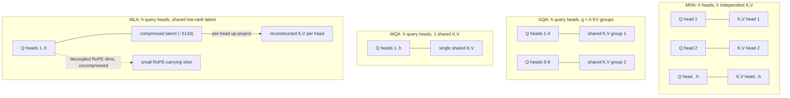

> **One-paragraph hook:** [[Concept - Attention Mechanism]] as originally specified gives every head its own K and V. At inference, every one of those K/V pairs gets cached and re-read on each later decode step. Once context lengths went from 2k to 128k+ tokens, that cache limited serving cost more than FLOPs did. The MQA→GQA→MLA lineage is the industry working out how much attention quality it can give up to shrink it.

## The mechanism

Standard multi-head attention (MHA) runs `h` independent heads, each with its own `d_head`-wide Q, K and V projection. At inference the K and V tensors for every token, layer and head are kept for future decode steps. That's the [[Concept - KV Cache]], and its size is:

$$\text{KV cache} = 2 \cdot n_{\text{layers}} \cdot h \cdot d_{\text{head}} \cdot \text{seq\_len} \quad \text{(elements per sequence)}$$

The 2 covers K and V. At long context this is the dominant memory term. It grows linearly with sequence length and with the number of *heads*, in addition to `d_model`. Every variant below goes after the `h` term.

**MQA (Multi-Query Attention, Shazeer 2019).** One shared K, V head serves all `h` query heads, and only Q stays per-head. The cache shrinks by a factor of `h`, so 32x for `h=32`. The quality hit is real but modest for many tasks. The decode win is large because autoregressive decoding is memory-bandwidth-bound: with one token per forward pass, the GPU spends most of its time re-reading the KV cache instead of doing arithmetic, so a smaller cache means lower decode latency.

**GQA (Grouped-Query Attention, Ainslie et al. 2023).** The middle ground: `g` KV head groups with `1 < g < h`, each shared by `h/g` query heads. `g=1` gives you MQA and `g=h` gives you MHA. LLaMA-2 70B uses `g=8` KV heads against `h=64` query heads, an 8x cache cut with quality close to full MHA. GQA is the standard default in essentially every serious open-weight model as of 2026, because one integer sets the quality/memory tradeoff and you don't have to commit to either extreme.

**MLA (Multi-head Latent Attention, DeepSeek-V2, 2024).** This one attacks a different axis. Instead of sharing K/V *heads*, MLA compresses K and V *jointly* into a low-rank shared latent (e.g. 512-dimensional), and that latent is what gets cached. At attention time a per-head up-projection reconstructs each head's full-width K and V from it. The latent is far narrower than `h * d_head` concatenated, so the cache comes out at roughly a quarter of GQA's, and DeepSeek-V2/V3 report matching or beating MHA quality. The compression is lossy in a way that apparently doesn't hurt, likely because what MLA throws away was largely redundant across heads to begin with.

**Decoupled RoPE, the part practitioners miss.** [[Concept - Rotary Position Embeddings (RoPE)]] rotates Q and K by an angle that depends on absolute position. That rotation doesn't commute with MLA's low-rank up-projection. You can't bake position into the compressed latent and reconstruct it correctly per head, since RoPE's position dependence would have to survive a lossy compression built around content. DeepSeek's fix is to carve out a few dimensions (e.g. 64) that carry RoPE explicitly and are cached *uncompressed*, separate from the content latent. The attention score becomes a compressed "content" dot product plus a small uncompressed "positional" one. Get this wrong in a from-scratch MLA and you either lose position information or bring back the full KV cost RoPE was meant to avoid.

## In practice

| Variant | KV heads | Cache vs MHA | Example |
|---|---|---|---|
| MHA | `h` | 1x | GPT-3, original transformer |
| GQA | `g`, `1<g<h` | `h/g`x smaller | LLaMA-2 70B (`g=8`, `h=64` → 8x) |
| MQA | 1 | `h`x smaller | original PaLM, some Falcon variants |
| MLA | shared latent | ~4x smaller than GQA | DeepSeek-V2/V3 |

Decode is [[Concept - The Roofline Model|memory-bandwidth-bound]], so a smaller KV cache does more than save memory. It raises the batch size that fits in a given amount of HBM, and batch size is what sets serving throughput. [[Reference - Memory Math for Transformers]] has the worked arithmetic from cache size to max concurrent sequences. MLA's cache reduction is also why [[Breakdown - DeepSeek-V3 Architecture]] can serve very long context economically at 671B parameters.

The savings compound with [[Concept - Speculative Decoding]]. A smaller per-sequence cache leaves headroom for the extra memory that draft-and-verify batching needs, so GQA/MLA and speculative decoding are frequently deployed together instead of competing.

## Failure modes

- **MQA training instability.** A single K/V head shared by every query is aggressive enough that MQA trained from scratch can noticeably underperform. The usual workaround is "uptraining": start from a trained MHA (or GQA) checkpoint, mean-pool the heads into the shared group, and keep training. That recovers most of the quality for a fraction of the cost of a fresh run.
- **Wrong GQA group count.** Too few groups (near MQA) gives up quality your context-length target didn't require. Too many (near MHA) leaves cache savings on the table. There's no universal answer; it's a knob tuned empirically per model scale, and papers rarely justify their `g` beyond "it worked."
- **`repeat` vs `repeat_interleave` porting bugs.** Expanding `g` KV heads up to `h` query heads has to pair each query head with the *correct* KV group. Use `torch.repeat` where the reference used `repeat_interleave` (or the reverse) and you silently reassign which queries see which keys/values. The model runs, the output looks plausible, and it's wrong. This is one of the most common bugs when porting weights between frameworks (see [[Gotchas - Implementing Attention]]), and it's very hard to catch without a numerical diff against a reference implementation.
- **Dropping the decoupled RoPE dims in an MLA reimplementation.** Apply RoPE to the compressed latent directly, instead of to a separate uncompressed slice, and you either break position information or have to cache full-width K, which defeats the point of MLA.

## The non-obvious

The intuitive story is that fewer KV heads means less capacity and a worse model. That undersells how much redundancy there is across heads at inference. GQA gets near-parity with MHA using 8x fewer KV heads (LLaMA-2 70B), which suggests most of what the heads' K/V vectors encode is shared "what kind of content is nearby" information. The head-specific work seems to happen more in the Q projection and in how each head *weights* the shared K/V than in the K/V content. MLA makes this explicit. Instead of a fixed, hand-picked sharing ratio, the network *learns* the shared low-rank basis. It's a case where learned compression beat a hand-designed one just by giving training a wider space to specialize into, and that pattern is worth watching for in other architecture decisions.

## Connections
- [[Concept - Attention Mechanism]] — the single-head formula that all four variants apply per-head; this note is entirely about how the K/V half of that formula is shared.
- [[Concept - KV Cache]] — the memory structure whose size these variants exist to shrink; the formula given here is the direct input to KV-cache sizing.
- [[Concept - Rotary Position Embeddings (RoPE)]] — the source of MLA's central implementation subtlety, since RoPE's position-dependence conflicts with low-rank K/V compression.
- [[Concept - Speculative Decoding]] — a serving technique that composes with smaller KV caches, since both compete for the same GPU memory budget.
- [[Reference - Memory Math for Transformers]] — turns this note's per-token cache formula into concrete max-batch-size and max-context-length numbers for real GPUs.
- [[Concept - The Roofline Model]] — explains *why* KV cache size matters so much: autoregressive decode is memory-bandwidth-bound, not compute-bound.
- [[Breakdown - DeepSeek-V3 Architecture]] — the production system where MLA is deployed at scale alongside fine-grained MoE.

## Sources
- Shazeer (2019) — "Fast Transformer Decoding: One Write-Head Is All You Need." Introduces MQA.
- Ainslie et al. (2023) — "GQA: Training Generalized Multi-Query Transformer Models from Multi-Head Checkpoints." Introduces GQA and the uptraining recipe.
- DeepSeek-AI (2024) — DeepSeek-V2 technical report. Introduces MLA and the decoupled-RoPE design.
