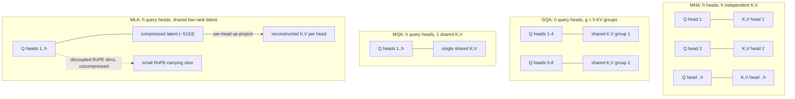

> **One-paragraph hook:** [[Concept - Attention Mechanism]] as originally specified gives every head its own K and V, and at inference time every one of those K/V pairs has to be cached and re-read on every subsequent decode step. As context lengths grew from 2k to 128k+ tokens, that cache — not FLOPs — became the binding constraint on serving cost, and the entire MQA→GQA→MLA lineage is the industry's answer to "how much attention quality can we give up to shrink it."

## The mechanism

Standard multi-head attention (MHA) runs `h` fully independent attention heads, each with its own `d_head`-wide Q, K, and V projection. At inference, the K and V tensors for every token, every layer, and every head must be retained for future decode steps — this is the [[Concept - KV Cache]]. Its size is:

$$\text{KV cache} = 2 \cdot n_{\text{layers}} \cdot h \cdot d_{\text{head}} \cdot \text{seq\_len} \quad \text{(elements per sequence)}$$

the factor of 2 for K and V separately. This is the dominant memory term at long context — it grows linearly with sequence length and with the number of *heads*, not just with `d_model`. The variants below all attack the `h` term.

**MQA — Multi-Query Attention (Shazeer 2019).** A single shared K, V head serves all `h` query heads; only Q stays per-head. The cache shrinks by a factor of `h` — for `h=32`, a 32x reduction. The quality hit is real but modest for many tasks, and the decode-time win is large because autoregressive decoding is memory-bandwidth-bound (one token generated per forward pass means the GPU spends most of its time re-reading the KV cache rather than doing arithmetic), so shrinking the cache directly shrinks decode latency.

**GQA — Grouped-Query Attention (Ainslie et al. 2023).** The middle ground: `g` KV head groups, with `1 < g < h`, each group shared by `h/g` query heads. `g=1` recovers MQA; `g=h` recovers MHA. LLaMA-2 70B uses `g=8` KV heads against `h=64` query heads — an 8x cache reduction with quality close to full MHA. GQA is the standard default in essentially every serious open-weight model as of 2026 because it lets you tune the quality/memory tradeoff with a single integer rather than committing to either extreme.

**MLA — Multi-head Latent Attention (DeepSeek-V2, 2024).** A different axis of attack: instead of sharing K/V *heads*, MLA low-rank-compresses K and V *jointly* into a shared latent vector (e.g. 512-dimensional) that is what actually gets cached. At attention time, each head's full-width K and V are reconstructed from that latent via a per-head up-projection. Because the latent is far narrower than `h * d_head` concatenated, the cache shrinks to roughly a quarter of GQA's while DeepSeek-V2/V3 report matching or beating MHA quality — the compression is lossy in a way that apparently doesn't hurt, likely because the redundancy MLA removes was largely redundant across heads to begin with.

**The decoupled-RoPE subtlety (the crux practitioners miss).** [[Concept - Rotary Position Embeddings (RoPE)]] rotates Q and K by an angle that depends on absolute position, and that rotation does not commute with MLA's low-rank up-projection — you cannot bake position into the compressed latent and then reconstruct it correctly per-head, because RoPE's position-dependence would have to survive a lossy compression step that was designed around content, not position. DeepSeek's fix: carve out a small number of dimensions (e.g. 64) that carry RoPE explicitly and are cached *uncompressed*, separate from the compressed content latent. The attention score is then the sum of a compressed "content" dot product and a small uncompressed "positional" dot product. Miss this and a from-scratch MLA implementation either drops position information or reintroduces the full KV cost RoPE was supposed to avoid.

## In practice

| Variant | KV heads | Cache vs MHA | Example |
|---|---|---|---|
| MHA | `h` | 1x | GPT-3, original transformer |
| GQA | `g`, `1<g<h` | `h/g`x smaller | LLaMA-2 70B (`g=8`, `h=64` → 8x) |
| MQA | 1 | `h`x smaller | original PaLM, some Falcon variants |
| MLA | shared latent | ~4x smaller than GQA | DeepSeek-V2/V3 |

Because decode is [[Concept - The Roofline Model|memory-bandwidth-bound]], not compute-bound, shrinking the KV cache doesn't just save memory — it directly increases the batch size that fits in a given amount of GPU HBM, which is the lever that determines serving throughput. See [[Reference - Memory Math for Transformers]] for the full worked arithmetic connecting cache size to max concurrent sequences. MLA's cache reduction is also why [[Breakdown - DeepSeek-V3 Architecture]] can serve very long context economically despite being a 671B-parameter model.

The KV-cache savings compound with [[Concept - Speculative Decoding]]: a smaller cache per sequence means more headroom for the extra memory speculative decoding's draft-and-verify batching requires, so GQA/MLA and speculative decoding are frequently deployed together rather than as competing techniques.

## Failure modes

- **MQA training instability.** Sharing a single K/V head across all queries is aggressive enough that training MQA from scratch can underperform noticeably; the practical workaround is "uptraining" — initialize from an already-trained MHA (or GQA) checkpoint and continue training with the heads mean-pooled into the shared group, recovering most of the quality at a fraction of the training cost of starting fresh.
- **Choosing the wrong GQA group count.** Too few groups (close to MQA) sacrifices quality you didn't need to sacrifice for your context-length target; too many groups (close to MHA) leaves cache savings on the table. There's no universal answer — it's a tuning knob validated empirically per model scale, and papers rarely justify the specific `g` they chose beyond "it worked."
- **`repeat` vs `repeat_interleave` porting bugs.** Expanding `g` KV heads back up to `h` query heads for the actual attention computation requires matching each query head to the *correct* KV group. Using `torch.repeat` where the reference implementation used `repeat_interleave` (or vice versa) silently reassigns which queries see which keys/values — the model runs, produces plausible-looking output, and is simply wrong; this is one of the most common bugs when porting weights between frameworks (link [[Gotchas - Implementing Attention]]) and is very hard to catch without a numerical diff against a reference implementation.
- **Forgetting the decoupled RoPE dims in an MLA reimplementation.** As described above, applying RoPE to the compressed latent directly (rather than to a separate uncompressed slice) either breaks position information or forces you to cache full-width K, defeating MLA's entire purpose.

## The non-obvious

The intuitive story — "fewer KV heads means less capacity means worse model" — undersells how much redundancy exists across attention heads at inference time. GQA's near-parity with MHA at 8x fewer KV heads (LLaMA-2 70B) suggests most of what different heads' K/V vectors encode is shared "what kind of content is nearby" information rather than head-specific detail; the head-specific work is happening more in the Q projection and in how each head *weights* the shared K/V than in the K/V content itself. MLA takes this further and treats it explicitly: rather than picking a fixed sharing ratio, it lets the network *learn* the optimal shared low-rank basis rather than hand-picking which heads to group — a case where a learned compression outperformed a hand-designed one just by giving the training process a wider design space to specialize into (a pattern worth recognizing in other architecture decisions).

## Connections
- [[Concept - Attention Mechanism]] — the single-head formula that all four variants apply per-head; this note is entirely about how the K/V half of that formula is shared.
- [[Concept - KV Cache]] — the memory structure whose size these variants exist to shrink; the formula given here is the direct input to KV-cache sizing.
- [[Concept - Rotary Position Embeddings (RoPE)]] — the source of MLA's central implementation subtlety, since RoPE's position-dependence conflicts with low-rank K/V compression.
- [[Concept - Speculative Decoding]] — a serving technique that composes with smaller KV caches, since both compete for the same GPU memory budget.
- [[Reference - Memory Math for Transformers]] — turns this note's per-token cache formula into concrete max-batch-size and max-context-length numbers for real GPUs.
- [[Concept - The Roofline Model]] — explains *why* KV cache size matters so much: autoregressive decode is memory-bandwidth-bound, not compute-bound.
- [[Breakdown - DeepSeek-V3 Architecture]] — the production system where MLA is deployed at scale alongside fine-grained MoE.

## Sources
- Shazeer (2019) — "Fast Transformer Decoding: One Write-Head Is All You Need." Introduces MQA.
- Ainslie et al. (2023) — "GQA: Training Generalized Multi-Query Transformer Models from Multi-Head Checkpoints." Introduces GQA and the uptraining recipe.
- DeepSeek-AI (2024) — DeepSeek-V2 technical report. Introduces MLA and the decoupled-RoPE design.
