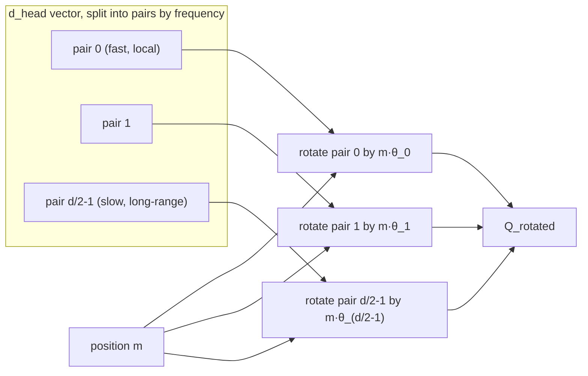

> **One-paragraph hook:** RoPE is the positional scheme under essentially every frontier open-weight LLM (LLaMA, Mistral, Qwen, DeepSeek) as of 2026, and the trick is worth knowing in detail. It doesn't add a position vector to the embedding. It *rotates* the query and key vectors by an angle proportional to position, and the geometry of rotation makes the attention dot product a function of relative position, with zero extra parameters.

## The mechanism

RoPE (Su et al. 2021, the RoFormer paper) applies a position-dependent rotation to `Q` and `K` before the attention dot product, working on 2D subspaces of the `d_head` dimension. Split the `d_head`-dimensional vector into `d_head/2` coordinate pairs. Pair `i` rotates in its own 2D plane by an angle that grows with both the token's position `m` and the pair index `i`:

$$\theta_i = \text{base}^{-2i/d}, \qquad \text{rotation angle for pair } i \text{ at position } m = m \cdot \theta_i$$

with `base = 10000` by default. For a 2D pair `(x_1, x_2)` at position `m`, RoPE applies the standard 2D rotation matrix:

$$\begin{pmatrix} x_1' \\ x_2' \end{pmatrix} = \begin{pmatrix} \cos(m\theta_i) & -\sin(m\theta_i) \\ \sin(m\theta_i) & \cos(m\theta_i) \end{pmatrix} \begin{pmatrix} x_1 \\ x_2 \end{pmatrix}$$

to every pair across the full `d_head` width independently. So `R_m` is block-diagonal: `d_head/2` independent 2D rotations, one per frequency band.

**Why you get relative position.** Rotations compose by angle addition. Rotate one vector by `m*θ`, another by `n*θ`, and their inner product depends only on the difference `(m-n)*θ`, not on `m` and `n` individually. For the rotated query at position `m` and rotated key at position `n`:

$$\langle R_m q, R_n k \rangle = q^T R_m^T R_n k = q^T R_{n-m} k$$

because rotation matrices satisfy `R_m^T R_n = R_{n-m}`. The attention dot product is the only place `Q` and `K` interact, so it becomes a function purely of the offset `(m-n)`. No learned relative-position bias table is needed (compare Shaw et al. 2018 or T5's bucketed bias), and not a single parameter is added. Absolute position goes into *how* Q and K rotate; only their relative rotation survives into the score.

**Implementation: `rotate_half`.** Nobody applies RoPE as literal 2×2 matrix multiplies. The standard implementation splits the `d_head` vector in half (instead of interleaving even/odd pairs) and computes:

```python
def rotate_half(x):
    x1, x2 = x.chunk(2, dim=-1)
    return torch.cat((-x2, x1), dim=-1)

q_rot = q * cos + rotate_half(q) * sin
k_rot = k * cos + rotate_half(k) * sin
```

which matches the pairwise rotation above under a particular choice of pair indexing. RoPE goes on **Q and K only, never V**. V carries content. Mixing position into V would make the *output* rotate with absolute position, when the goal is a purely relative-distance signal in the attention weights. It's applied after the head reshape, on the `d_head` dimension, independently per head.

**Frequency spectrum and length behavior.** `θ_i = base^{-2i/d}` decreases as `i` grows. Low-index pairs rotate fast: short wavelength, sensitive to small position changes, encoding fine local position. High-index pairs rotate slowly: long wavelength, coarse long-range position. The slowest pair's wavelength, roughly `2π · base^{(d-2)/d}`, sets the scale at which the rotation pattern would "wrap around". Whether that wavelength exceeds the training context length decides how gracefully (or catastrophically) the model handles positions past what it saw in training.



## In practice

RoPE beat learned absolute position tables (BERT/GPT-2 style) and sinusoidal absolute encoding for three practical reasons. It's relative, so it generalizes across length better than a hard-capped learned table. It's parameter-free, so there are no extra weights to train or port. And for many frequency bands its attention weights decay naturally with distance, which gives a soft locality bias nobody had to hand-engineer. It also composes cleanly with linear-attention formulations: the rotation is linear on Q and K individually and happens before any kernel trick.

**`base` is a folklore-laden knob that practitioners actively tune.** Raising it stretches every wavelength. LLaMA-3 raised `base` from the original 10000 to 500000 specifically to push the slow dimensions' wavelength well past the intended context length, leaving room to extrapolate before wraparound artifacts appear (extension-technique tradeoffs are in [[Concept - Context Length Extension]]; extrapolation folklore is catalogued in domain 18). This one scalar is among the most impactful and least theoretically justified hyperparameters in a modern LLM config. Bumping it is cheap to try, and it's commonly done alongside a short continued-pretraining phase at the new target length.

RoPE is also what makes [[Concept - Multi-Head Attention Variants (MHA MQA GQA MLA)|MLA's]] KV-cache compression tricky (see that note's decoupled-RoPE discussion). RoPE's effect depends on absolute position, so it can't be folded into a shared low-rank latent the way pure content can. DeepSeek's MLA has to carve out a small uncompressed slice of the cache to carry it.

## Failure modes

- **Naive extrapolation collapse.** Run a RoPE model on sequences longer than its training length and perplexity explodes instead of degrading gracefully. The fast-rotating dimensions cycle through angles the model never saw in training, and their rotation pattern becomes effectively out-of-distribution noise. This one failure mode motivated the whole Position-Interpolation / NTK-scaling / YaRN line of work in [[Concept - Context Length Extension]].
- **Interleaved vs. half-split ordering mismatch.** There are two conventions for pairing the `d_head` dimension, equivalent in theory but bit-incompatible: interleaved (even/odd indices form a pair) and half-split (first half paired with second half, the `rotate_half` convention above). Load a checkpoint trained with one into code that assumes the other and you get a model that runs and writes plausible-looking text but is numerically wrong, with quality silently degraded. It's one of the most common and hardest-to-spot bugs when reimplementing or converting a RoPE model; [[Gotchas - Implementing Attention]] covers it.
- **Precision loss in the angle computation.** `m * θ_i` for large `m` (long sequences) and small `θ_i` (slow dimensions) can lose precision in low-precision arithmetic. The convention is to compute and cache the cos/sin tables in fp32 even in a bf16 model. [[Concept - Floating Point for Deep Learning]] explains why this class of bug is easy to introduce and hard to see in loss curves alone.
- **Base/theta mismatch against a reference implementation.** Port a model trained with a scaled base (e.g. LLaMA-3's 500000) but silently keep the default `base=10000`, and it "works" on short sequences and degrades specifically at long context. Casual short-prompt testing won't catch it.

## The non-obvious

"No extra parameters, no learned relative-position table" makes RoPE sound like a free lunch. The choice of `base` does real work that's easy to underrate: before a single training token, it sets a *prior* over how far the model expects to need exact positional resolution versus coarse long-range awareness. That prior comes from one scalar, and it interacts with context length, sequence composition and even downstream fine-tuning length in ways theory hasn't fully characterized. So "just raise the base" is widely used and validated empirically, not derived. Practitioners push `base` well past what any published extrapolation theory rigorously justifies because in practice it reliably beats not doing so, and nobody has a tight closed-form answer for the "correct" base at a given target length.

## Connections
- [[Concept - Positional Encoding]] — the broader family (absolute, relative, ALiBi, NoPE) that RoPE is the dominant member of; this note is the deep treatment, that note is the map.
- [[Concept - Context Length Extension]] — the entire line of post-hoc techniques (Position Interpolation, NTK-scaling, YaRN) that exist specifically to manipulate RoPE's frequency spectrum for longer context.
- [[Concept - Attention Mechanism]] — RoPE modifies Q and K before this note's dot product; the relative-position property only matters because of how attention consumes Q and K.
- [[Snippet - RoPE Implementation]] — a runnable version of the `rotate_half` mechanism and frequency computation described here.
- [[Concept - Floating Point for Deep Learning]] — governs why the cos/sin angle tables need fp32 precision even in a low-precision model.
- [[Concept - Attention Sinks]] — a related positional pathology (mass dumped on early tokens) that interacts with RoPE's positional structure at long context.
- [[Concept - Context Rot]] — the broader quality-degradation-with-length phenomenon that RoPE's extrapolation limits directly contribute to.
- [[Gotchas - Implementing Attention]] — catalogs the interleaved-vs-half-split and base-mismatch bugs described above in the context of a full attention reimplementation.

## Sources
- Su et al. (2021) — "RoFormer: Enhanced Transformer with Rotary Position Embedding." Introduces RoPE and the relative-position derivation.
- Xiong et al. (2023) — "Effective Long-Context Scaling of Foundation Models." The base-change (ABF) approach later adopted by LLaMA-3.
