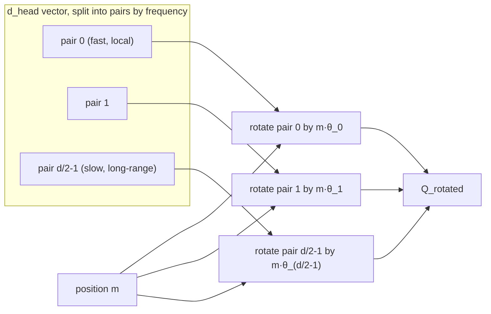

> **One-paragraph hook:** RoPE is the positional scheme underneath essentially every frontier open-weight LLM (LLaMA, Mistral, Qwen, DeepSeek) as of 2026, and its trick is elegant enough to be worth internalizing exactly: instead of adding a position vector to the embedding, it *rotates* the query and key vectors by an angle proportional to position, so that the geometry of rotation itself makes the attention dot product a function of relative position — for free, with zero extra parameters.

## The mechanism

RoPE (Su et al. 2021, the RoFormer paper) applies a position-dependent rotation to `Q` and `K` before the attention dot product, operating on 2D subspaces of the `d_head` dimension. Split the `d_head`-dimensional vector into `d_head/2` pairs of coordinates; pair `i` is rotated in its own 2D plane by an angle that grows with both the token's position `m` and the pair index `i`:

$$\theta_i = \text{base}^{-2i/d}, \qquad \text{rotation angle for pair } i \text{ at position } m = m \cdot \theta_i$$

with `base = 10000` by default. Concretely, for a 2D pair `(x_1, x_2)` at position `m`, RoPE applies the standard 2D rotation matrix:

$$\begin{pmatrix} x_1' \\ x_2' \end{pmatrix} = \begin{pmatrix} \cos(m\theta_i) & -\sin(m\theta_i) \\ \sin(m\theta_i) & \cos(m\theta_i) \end{pmatrix} \begin{pmatrix} x_1 \\ x_2 \end{pmatrix}$$

applied independently to every pair across the full `d_head` width, i.e. `R_m` is a block-diagonal matrix of `d_head/2` independent 2D rotations, one per frequency band.

**The relative-position property — why this works.** Rotations compose by angle addition: rotating by `m*θ` and then computing a dot product with something rotated by `n*θ` yields an inner product that depends only on the rotation *difference* `(m-n)*θ`, not on `m` and `n` individually. Formally, for the rotated query at position `m` and rotated key at position `n`:

$$\langle R_m q, R_n k \rangle = q^T R_m^T R_n k = q^T R_{n-m} k$$

because rotation matrices satisfy `R_m^T R_n = R_{n-m}`. The attention dot product — the only place `Q` and `K` interact — is therefore a function purely of the relative offset `(m-n)`, without any learned relative-position bias table (contrast with Shaw et al. 2018 or T5's bucketed bias) and without adding a single parameter. Absolute position information is baked into *how* Q and K rotate, but only their relative rotation survives into the score.

**Implementation: `rotate_half`.** In practice RoPE isn't applied as literal 2×2 matrix multiplies; the standard implementation splits the `d_head` vector in half (rather than interleaving even/odd pairs) and computes:

```python
def rotate_half(x):
    x1, x2 = x.chunk(2, dim=-1)
    return torch.cat((-x2, x1), dim=-1)

q_rot = q * cos + rotate_half(q) * sin
k_rot = k * cos + rotate_half(k) * sin
```

which is mathematically equivalent to the pairwise rotation above under a particular choice of how pairs are indexed. RoPE is applied to **Q and K only, never V** — V carries content, not position, and mixing position into V would make the *output* rotate with absolute position rather than leaving it purely as a relative-distance signal in the attention weights. It is applied after the head reshape, operating on the `d_head` dimension independently per head.

**Frequency spectrum and its consequence for length behavior.** Because `θ_i = base^{-2i/d}` decreases as `i` increases, low-index dimension-pairs rotate fast (short wavelength — sensitive to small position changes, encoding fine-grained local position) while high-index pairs rotate slowly (long wavelength — encoding coarse, long-range position). The wavelength of the *slowest* dimension pair, roughly `2π · base^{(d-2)/d}`, sets the scale at which the rotation pattern would need to "wrap around" — and whether that wavelength is longer than the training context length is exactly what determines how gracefully (or catastrophically) the model handles positions beyond what it saw in training.



## In practice

RoPE won out over learned absolute position tables (BERT/GPT-2 style) and sinusoidal absolute encoding for three practical reasons: it's relative (better length generalization than a hard-capped learned table), parameter-free (no extra weights to train or port), and its attention weights naturally decay with distance for many frequency bands, giving a soft locality bias without hand-engineering one. It also composes cleanly with linear-attention formulations because the rotation is a linear operation on Q and K individually, applied before any kernel trick.

**The `base` parameter is a folklore-laden knob practitioners actively tune.** Raising `base` stretches every wavelength — LLaMA-3 raised `base` from the original 10000 to 500000 specifically to push the slow dimensions' wavelength well past the intended context length, giving the model room to extrapolate before wraparound artifacts appear (see the extension-technique tradeoffs in [[Concept - Context Length Extension]], and the extrapolation folklore catalogued in domain 18). This single scalar is one of the highest-leverage, least-theoretically-justified hyperparameters in a modern LLM config — bumping it is cheap to try and commonly done alongside a short continued-pretraining phase at the new target length.

RoPE is what makes [[Concept - Multi-Head Attention Variants (MHA MQA GQA MLA)|MLA's]] KV-cache compression tricky (see that note's decoupled-RoPE discussion): because RoPE's effect depends on absolute position, it cannot be baked into a shared low-rank latent the way pure content can, forcing DeepSeek's MLA to carve out a small uncompressed RoPE-carrying slice of the cache.

## Failure modes

- **Naive extrapolation collapse.** Run a RoPE model on sequences longer than it was trained on and perplexity does not degrade gracefully — it explodes, because the fast-rotating dimensions cycle through angles the model never encountered during training and their rotation pattern becomes effectively out-of-distribution noise. This single failure mode motivated the entire Position-Interpolation / NTK-scaling / YaRN line of work in [[Concept - Context Length Extension]].
- **Interleaved-vs-half-split ordering mismatch.** There are two mathematically-equivalent-in-theory but bit-incompatible conventions for how the `d_head` dimension is paired for rotation: interleaved (even/odd indices form a pair) versus half-split (first half paired with second half, the `rotate_half` convention above). Porting weights from a checkpoint that uses one convention into code that assumes the other produces a model that runs, produces plausible-looking text, but is numerically wrong and silently degrades quality — this is one of the most common and hardest-to-spot bugs when reimplementing or converting a RoPE model, covered in [[Gotchas - Implementing Attention]].
- **Precision loss in the angle computation.** `m * θ_i` for large `m` (long sequences) and small `θ_i` (slow dimensions) can lose precision in low-precision arithmetic; the cos/sin tables are conventionally computed and cached in fp32 even in a bf16 model — see [[Concept - Floating Point for Deep Learning]] for why this class of bug is easy to introduce and hard to detect from loss curves alone.
- **Base/theta mismatch against a reference implementation.** Silently using the default `base=10000` when porting a model that was actually trained with a scaled base (e.g. LLaMA-3's 500000) produces a model that "works" on short sequences and degrades specifically at long context — a bug that passes casual short-prompt testing.

## The non-obvious

RoPE's "no extra parameters, no learned relative-position table" framing makes it sound like a free lunch, but the choice of `base` is doing real, non-obvious work that's easy to under-appreciate: it is implicitly setting a *prior* over how far the model expects to need exact positional resolution versus coarse long-range awareness, baked in before a single token of training happens. Because that prior is set once via a single scalar and interacts with context length, sequence composition, and even downstream fine-tuning length in ways that aren't fully characterized theoretically, "just raise the base" has become a widely-used but empirically-validated-rather-than-derived trick — practitioners increase `base` well past what any published extrapolation theory rigorously justifies, because in practice it reliably works better than not doing so, and nobody has a tight closed-form answer for the "correct" base at a given target length.

## Connections
- [[Concept - Positional Encoding]] — the broader family (absolute, relative, ALiBi, NoPE) that RoPE is the dominant member of; this note is the deep treatment, that note is the map.
- [[Concept - Context Length Extension]] — the entire line of post-hoc techniques (Position Interpolation, NTK-scaling, YaRN) that exist specifically to manipulate RoPE's frequency spectrum for longer context.
- [[Concept - Attention Mechanism]] — RoPE modifies Q and K before this note's dot product; the relative-position property only matters because of how attention consumes Q and K.
- [[Snippet - RoPE Implementation]] — a runnable version of the `rotate_half` mechanism and frequency computation described here.
- [[Concept - Floating Point for Deep Learning]] — governs why the cos/sin angle tables need fp32 precision even in a low-precision model.
- [[Concept - Attention Sinks]] — a related positional pathology (mass dumped on early tokens) that interacts with RoPE's positional structure at long context.
- [[Concept - Context Rot]] — the broader quality-degradation-with-length phenomenon that RoPE's extrapolation limits directly contribute to.
- [[Gotchas - Implementing Attention]] — catalogs the interleaved-vs-half-split and base-mismatch bugs described above in the context of a full attention reimplementation.

## Sources
- Su et al. (2021) — "RoFormer: Enhanced Transformer with Rotary Position Embedding." Introduces RoPE and the relative-position derivation.
- Xiong et al. (2023) — "Effective Long-Context Scaling of Foundation Models." The base-change (ABF) approach later adopted by LLaMA-3.
