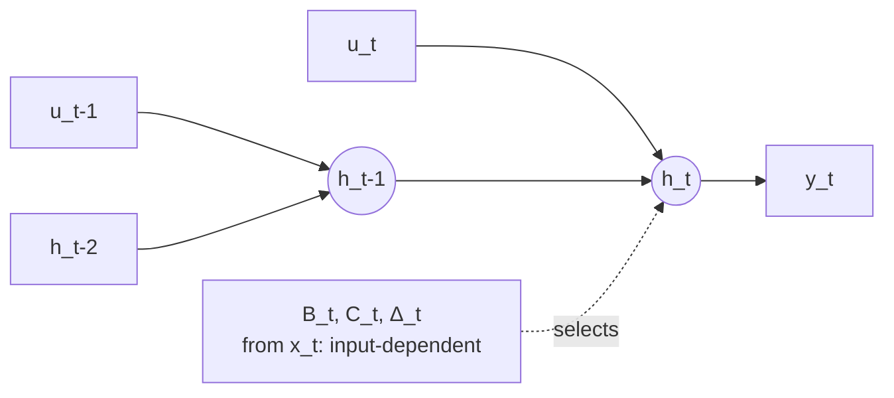

> **One-paragraph hook:** State Space Models (SSMs) mix tokens through a linear recurrence instead of pairwise attention, giving O(N) training and — critically — a *constant-size* hidden state at inference instead of a [[Concept - KV Cache]] that grows with every generated token. Mamba's contribution was making that recurrence input-dependent (selective) without losing the hardware efficiency that made SSMs fast in the first place, closing most of the quality gap to attention while keeping the constant-memory decode.

## The mechanism

The continuous-time SSM is a linear ODE: $h'(t) = Ah(t) + Bu(t)$, $y(t) = Ch(t)$, with $A, B, C$ learned matrices. Discretized with step size $\Delta$ (zero-order hold), it becomes a linear recurrence:

$$\bar{A} = \exp(\Delta A), \quad \bar{B} \approx \Delta B, \quad h_t = \bar{A} h_{t-1} + \bar{B} u_t, \quad y_t = C h_t$$

This recurrence can be evaluated two ways: sequentially in $O(N)$ time and $O(1)$ state per step (the RNN view), or — when $\bar A, \bar B, C$ are fixed across time (linear time-invariant, LTI) — unrolled into a long convolution and computed in $O(N \log N)$ via FFT (the CNN view). S4 (Gu, Goel, and Ré 2021) is the LTI case done right: it initializes $A$ using HiPPO theory, which gives the recurrence a mathematically principled way to compress arbitrarily long history into a fixed-size state (approximating a projection onto orthogonal polynomials), and uses a diagonal-plus-low-rank parameterization of $A$ to make the matrix exponentials tractable at training time.

Mamba (Gu and Dao 2023) breaks LTI on purpose: $B$, $C$, and $\Delta$ become linear functions of the input $u_t$ itself, not fixed weights. This is the *selection mechanism* — the model can now decide, per token, how much to write into the state and how fast to forget it, which is what lets it do content-based reasoning ("remember this token, ignore that one") that a time-invariant S4 cannot. The cost is that selection kills the FFT-convolution trick — you're back to a genuinely sequential recurrence. Mamba's actual speed comes from a hardware-aware **parallel scan**: a custom CUDA kernel that computes the recurrence via a parallel prefix-scan (so it's not literally sequential in wall-clock time) while keeping the state tensor in SRAM rather than materializing it in HBM at every step — mechanically the same trade [[Deep Dive - FlashAttention]] makes for attention: avoid the O(N) HBM round-trips by fusing the computation.

Mamba-2 (Dao and Gu 2024) introduces State Space Duality (SSD): it shows the selective-SSM recurrence is algebraically a form of masked linear attention with a structured, data-dependent decay matrix in place of softmax. Reframing it this way lets training run as chained matmuls (better GPU utilization than the scan kernel) and lets the state dimension grow much larger (roughly 16 in original Mamba up to 64–256 in Mamba-2), which directly improves recall quality.

## In practice

Complexity at inference is the entire value proposition: $O(N)$ time and $O(1)$ **constant** state per generated token, versus attention's KV cache that grows linearly with sequence length (see [[Concept - The Roofline Model]] for why that KV growth eventually makes decode memory-bandwidth-bound). Real systems: Mamba itself (open checkpoints 130M–2.8B); Jamba (AI21, 52B MoE hybrid interleaving Mamba, attention, and MoE layers, 256k context on a single GPU's worth of KV cache); Codestral Mamba (Mistral, pure Mamba for code); Falcon-Mamba (TII); and the Griffin / RecurrentGemma lineage (Google DeepMind's gated linear recurrence, architecturally a cousin rather than literal Mamba). None of these are pure-SSM at the frontier by themselves — they show up almost exclusively as one ingredient in a [[Concept - Hybrid SSM-Attention Architectures]] stack.

## Failure modes

A fixed-size state must losslessly-enough compress the *entire* prefix into $d_{state}$ numbers; it cannot do exact recall or verbatim copying the way attention can, because attention keeps every past token's key/value pair addressable while an SSM has already summarized them away. This shows up concretely as a sharp accuracy cliff on associative-recall benchmarks (e.g., multi-query associative recall, needle-in-a-haystack-style exact lookup) where pure SSMs trail attention by a wide margin even when their language-modeling perplexity looks competitive. Detection: run an in-context copy/recall eval, not just perplexity — perplexity alone hides this failure mode because most tokens in natural text don't require exact long-range lookup.

## The non-obvious

The thing that trips people up first: Mamba is *not* a free lunch RNN swap-in. Its selection mechanism is exactly what disqualifies it from the FFT-convolution speedup that made S4 practical, so Mamba's real-world throughput depends entirely on the custom parallel-scan kernel shipped in the `mamba-ssm` package — a naive PyTorch reimplementation of the recurrence is dramatically slower than a well-tuned FlashAttention call at the same sequence length, to the point of being unusable for real training runs. The "Mamba is O(N) so it's fast" story is algorithmically true but operationally misleading: the actual speed is a systems-engineering result (keep the scan's intermediate state in SRAM, never write it to HBM) in the same family as FlashAttention's trick, not a free consequence of the recurrence's asymptotic complexity.

## Connections

- [[Concept - KV Cache]] — the exact thing SSMs avoid at inference: a constant-size state versus a linearly growing cache is the entire value proposition.
- [[Concept - Linear Attention]] — Mamba-2's SSD result shows SSMs and linear attention are the same family with different decay/gating rules; understanding one illuminates the other.
- [[Concept - Hybrid SSM-Attention Architectures]] — how real production systems actually deploy SSMs: as most of the stack, with a thin layer of full attention restoring recall.
- [[Concept - Recurrent Networks and the LSTM]] — the RNN lineage SSMs revive, done right for modern hardware and gradient flow.
- [[Concept - Attention Mechanism]] — the O(N²)-but-exact-recall alternative that SSMs trade against; the recall-vs-cost axis is the whole story.
- [[Decision - Choosing a Sequence Mixer]] — where this tradeoff becomes an actual engineering decision with a decision flow.
- [[Deep Dive - FlashAttention]] — the closest mechanical analogue: both get their speed from SRAM-resident fused kernels, not from a different asymptotic complexity alone.
- [[Concept - The Roofline Model]] — why a linearly growing KV cache eventually dominates decode cost, the exact problem constant-state SSMs sidestep.
- [[Concept - Induction Heads]] — the attention circuit responsible for in-context copying that a fixed-size SSM state structurally cannot replicate.

## Sources
- Gu, Goel, and Ré (2021) — S4 / "Efficiently Modeling Long Sequences with Structured State Spaces": HiPPO-initialized structured SSMs.
- Gu and Dao (2023) — Mamba: input-selective SSM with a hardware-aware parallel-scan kernel.
- Dao and Gu (2024) — Mamba-2 / State Space Duality: SSMs reframed as structured linear attention, enabling larger states.
