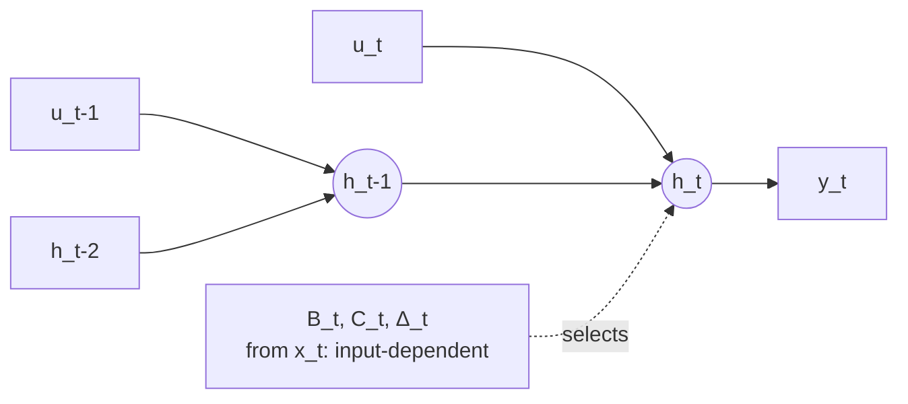

> **One-paragraph hook:** State Space Models (SSMs) mix tokens through a linear recurrence instead of pairwise attention. Training is O(N), and at inference the hidden state has a *constant size*, where a [[Concept - KV Cache]] grows with every generated token. Mamba made that recurrence input-dependent (selective) while keeping the hardware efficiency that made SSMs fast in the first place, which closed most of the quality gap to attention and kept the constant-memory decode.

## The mechanism

The continuous-time SSM is a linear ODE: $h'(t) = Ah(t) + Bu(t)$, $y(t) = Ch(t)$, with $A, B, C$ learned matrices. Discretize with step size $\Delta$ (zero-order hold) and you get a linear recurrence:

$$\bar{A} = \exp(\Delta A), \quad \bar{B} \approx \Delta B, \quad h_t = \bar{A} h_{t-1} + \bar{B} u_t, \quad y_t = C h_t$$

You can evaluate it sequentially: $O(N)$ time with $O(1)$ state per step (the RNN view). Or, if $\bar A, \bar B, C$ are fixed across time (linear time-invariant, LTI), you can unroll it into a long convolution and compute it in $O(N \log N)$ via FFT (the CNN view). S4 (Gu, Goel, and Ré 2021) is the LTI case done right. It initializes $A$ with HiPPO theory, a principled way to compress arbitrarily long history into a fixed-size state (approximating a projection onto orthogonal polynomials), and parameterizes $A$ as diagonal-plus-low-rank so the matrix exponentials stay tractable during training.

Mamba (Gu and Dao 2023) breaks LTI on purpose. $B$, $C$ and $\Delta$ become linear functions of the input $u_t$ instead of fixed weights. That's the *selection mechanism*: per token, the model decides how much to write into the state and how fast to forget it, so it can do content-based reasoning ("remember this token, ignore that one") that time-invariant S4 can't. The price: no more FFT-convolution trick, so you're back to a sequential recurrence. Mamba gets its speed from a hardware-aware **parallel scan**, a custom CUDA kernel that computes the recurrence as a parallel prefix-scan (so wall-clock time isn't literally sequential) and keeps the state tensor in SRAM instead of materializing it in HBM at every step. [[Deep Dive - FlashAttention]] makes the same trade for attention: fuse the computation to avoid the O(N) HBM round-trips.

Mamba-2 (Dao and Gu 2024) introduced State Space Duality (SSD), showing the selective-SSM recurrence is algebraically a form of masked linear attention, with a structured, data-dependent decay matrix where softmax would be. Seen that way, training runs as chained matmuls (better GPU utilization than the scan kernel), and the state dimension can grow from roughly 16 in original Mamba up to 64–256 in Mamba-2, which directly improves recall.

## In practice

The pitch is inference complexity: $O(N)$ time and $O(1)$ **constant** state per generated token, against an attention KV cache that grows linearly with sequence length ([[Concept - The Roofline Model]] explains why that growth eventually makes decode memory-bandwidth-bound). Real systems:

- Mamba itself (open checkpoints 130M–2.8B)
- Jamba (AI21): a 52B MoE hybrid interleaving Mamba, attention and MoE layers, 256k context on a single GPU's worth of KV cache
- Codestral Mamba (Mistral): pure Mamba for code
- Falcon-Mamba (TII)
- the Griffin / RecurrentGemma lineage (Google DeepMind's gated linear recurrence, architecturally a cousin of Mamba, not literal Mamba)

None of these is pure-SSM at the frontier on its own; SSMs show up almost exclusively as one ingredient in a [[Concept - Hybrid SSM-Attention Architectures]] stack.

## Failure modes

A fixed-size state has to compress the *entire* prefix, losslessly enough, into $d_{state}$ numbers. It can't do exact recall or verbatim copying the way attention can: attention keeps every past token's key/value pair addressable, and an SSM has already summarized them away. It shows up as a sharp accuracy cliff on associative-recall benchmarks (e.g., multi-query associative recall, needle-in-a-haystack-style exact lookup), where pure SSMs trail attention by a wide margin even when their language-modeling perplexity looks competitive. Run an in-context copy/recall eval alongside perplexity; most tokens in natural text don't need exact long-range lookup, so perplexity alone hides it.

## The non-obvious

Mamba is *not* a free-lunch RNN swap-in. The selection mechanism is what disqualifies it from the FFT-convolution speedup that made S4 practical, so Mamba's real-world throughput depends entirely on the custom parallel-scan kernel in the `mamba-ssm` package. A naive PyTorch reimplementation of the recurrence is dramatically slower than a well-tuned FlashAttention call at the same sequence length, to the point of being unusable for real training runs. "Mamba is O(N) so it's fast" is algorithmically true and operationally misleading. The speed is a systems-engineering result (keep the scan's intermediate state in SRAM, never write it to HBM) in the same family as FlashAttention's trick, and it doesn't fall out of the recurrence's asymptotic complexity.

## Connections

- [[Concept - KV Cache]] — the exact thing SSMs avoid at inference: a constant-size state versus a linearly growing cache is the entire value proposition.
- [[Concept - Linear Attention]] — Mamba-2's SSD result shows SSMs and linear attention are the same family with different decay/gating rules; understanding one illuminates the other.
- [[Concept - Hybrid SSM-Attention Architectures]] — how real production systems actually deploy SSMs: as most of the stack, with a thin layer of full attention restoring recall.
- [[Concept - Recurrent Networks and the LSTM]] — the RNN lineage SSMs revive, done right for modern hardware and gradient flow.
- [[Concept - Attention Mechanism]] — the O(N²)-but-exact-recall alternative that SSMs trade against; the recall-vs-cost axis is the whole story.
- [[Decision - Choosing a Sequence Mixer]] — where this tradeoff becomes an actual engineering decision with a decision flow.
- [[Deep Dive - FlashAttention]] — the closest mechanical analogue: both get their speed from SRAM-resident fused kernels, not from a different asymptotic complexity alone.
- [[Concept - The Roofline Model]] — why a linearly growing KV cache eventually dominates decode cost, the exact problem constant-state SSMs sidestep.
- [[Concept - Induction Heads]] — the attention circuit responsible for in-context copying that a fixed-size SSM state structurally cannot replicate.

## Sources
- Gu, Goel, and Ré (2021) — S4 / "Efficiently Modeling Long Sequences with Structured State Spaces": HiPPO-initialized structured SSMs.
- Gu and Dao (2023) — Mamba: input-selective SSM with a hardware-aware parallel-scan kernel.
- Dao and Gu (2024) — Mamba-2 / State Space Duality: SSMs reframed as structured linear attention, enabling larger states.
