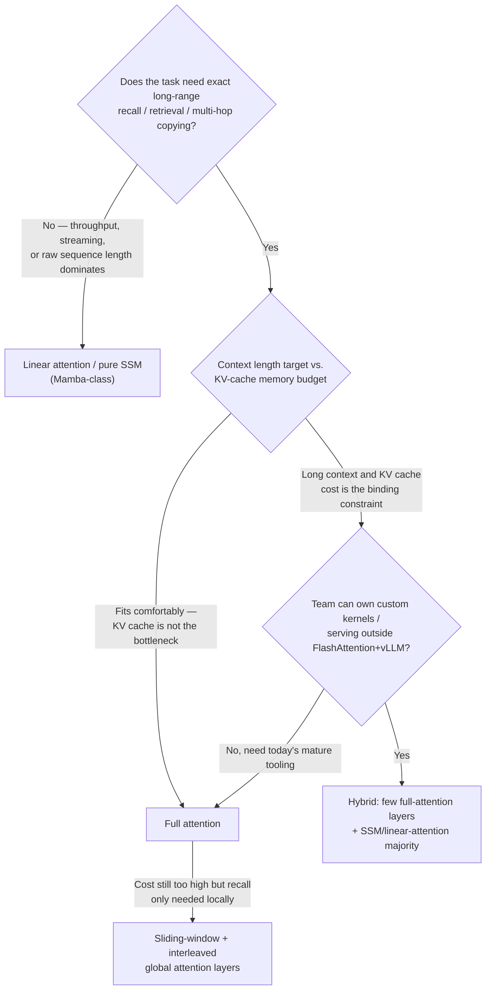

# Decision - Choosing a Sequence Mixer

> Default for the 80% case: full [[Concept - Attention Mechanism|attention]]. It remains the safest choice for quality and has by far the deepest kernel and serving ecosystem (as of 2026) — leave it only once long-context serving cost is a proven, binding constraint you can't engineer around.

## Decision flow

## Tradeoff matrix

| Mixer | Training cost | Inference memory scaling | Exact recall | Kernel/serving ecosystem (2026) | Example systems |
|---|---|---|---|---|---|
| Full attention | $O(N^2)$ | [[Concept - KV Cache]] grows linearly with context | Best — gold standard | Mature: [[Deep Dive - FlashAttention]], vLLM, SGLang | GPT-4-class, LLaMA-3, most frontier models |
| Sliding-window | $O(N\cdot w)$ | Bounded to window $w$ per layer | Bounded by $w\times$depth unless global layers added | Mature, shares FlashAttention-style kernels | Mistral 7B (window 4,096) |
| Linear attention | $O(N)$ | $O(1)$ recurrent state | Weak — loses softmax's sharp lookup | Thin — few production-grade serving stacks | RetNet, GLA, DeltaNet |
| SSM ([[Concept - State Space Models and Mamba|Mamba]]) | $O(N)$ (parallel scan) | $O(1)$ recurrent state, KV-free | Weak — fails associative-recall benchmarks | Thin but growing | Mamba, Mamba-2, Codestral Mamba, Falcon-Mamba |
| Hybrid | Mixed, dominated by the attention fraction | KV cache dominated by the few attention layers | Restored — a small attention fraction fixes recall | Mostly custom, growing fast | Jamba (~1 attention : 7 Mamba), Griffin/RecurrentGemma |

## The details that flip the decision

- **Recall is the axis that actually matters, not raw throughput.** A fixed-size recurrent state cannot do exact copying/associative recall the way attention's per-token KV cache can (Jelassi et al. 2024) — if your evals include needle-in-haystack, multi-hop QA, or precise code retrieval, budget for full attention or a hybrid; pure SSM/linear will underperform regardless of how good its throughput numbers look.
- **Hybrids are the emerging practical answer, and the ratio has a rough consensus.** Roughly 5–15% attention layers, interleaved with a recurrent majority, restores most of the recall while keeping the KV cache small — [[Concept - Hybrid SSM-Attention Architectures|Jamba]] runs about 1 attention layer per 7 Mamba layers and reaches 256K context on a single GPU's worth of KV memory. Treat this ratio as a starting point to tune, not a law.
- **Even frontier labs facing extreme cost pressure often keep the mixer itself as attention.** [[Breakdown - DeepSeek-V3 Architecture]] pushed on KV-cache compression (MLA) rather than swapping to an SSM or hybrid backbone — evidence that at the very top of the quality curve, the compute/memory fight has so far stayed inside the attention family rather than replacing it.
- **Ecosystem risk is often the decisive, unglamorous factor.** Full attention has years of kernel and serving investment (FlashAttention, vLLM, SGLang); exotic mixers have thin, fast-moving kernel support and almost no battle-tested serving stack. A team without spare systems capacity to own custom kernels should not bet a production model on a novel mixer, even if the architecture paper's numbers look good.
- **Sliding-window alone is a trap for anything requiring cross-document reasoning.** Information beyond the window can only propagate through depth, multi-hop at best, so pure local attention without any global/long layers degrades badly on long-range exact-match tasks even though its KV cache looks cheap; streaming variants that evict old tokens also have to special-case the first few positions, since trained models reliably dump attention mass there regardless of content.

## Connections
- [[Concept - Attention Mechanism]] — the mechanism this decision defaults to, and the recall/cost baseline every alternative is measured against.
- [[Concept - State Space Models and Mamba]] — the $O(N)$-training, constant-state alternative behind the SSM row and the recall weakness the hybrid branch works around.
- [[Concept - Linear Attention]] — the softmax-free reformulation that shares the SSM row's recurrent-inference profile and recall tradeoff.
- [[Concept - Hybrid SSM-Attention Architectures]] — the mechanism behind the hybrid branch, including the Jamba/Griffin attention-ratio data points cited above.
- [[Concept - Sparse and Sliding-Window Attention]] — the bounded-KV middle ground this decision routes to when local recall is enough.
- [[Concept - KV Cache]] — the memory structure whose linear growth with context is the whole reason this decision exists (cross-domain: inference & serving).
- [[Deep Dive - FlashAttention]] — the kernel-maturity argument behind "ecosystem risk is often decisive" (cross-domain: hardware & systems).
- [[Breakdown - DeepSeek-V3 Architecture]] — the frontier-scale evidence that even extreme cost pressure has, so far, stayed inside the attention family.
- [[Decision - Dense vs Mixture-of-Experts]] — a sibling architecture decision made at the same design stage, often traded off jointly against the same compute/memory budget.

## Sources
- Gu & Dao (2023) — "Mamba: Linear-Time Sequence Modeling with Selective State Spaces." The selective-SSM mechanism behind the Mamba row.
- Jelassi et al. (2024) — work establishing that a small fraction of attention layers is necessary for exact recall in otherwise-recurrent models, the core argument for hybrids.
- De et al. (2024) — "Griffin: Mixing Gated Linear Recurrences with Local Attention for Efficient Language Models." The Griffin/RecurrentGemma hybrid data point.
