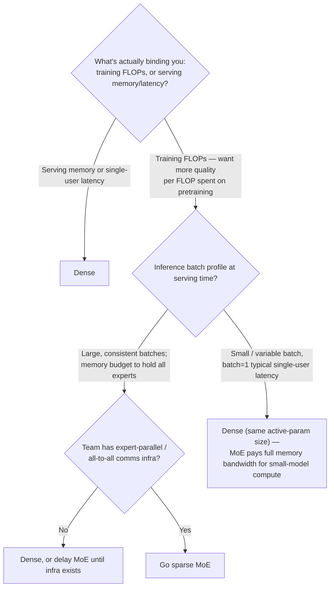

# Decision - Dense vs Mixture-of-Experts

> Default for the 80% case: stay dense. Reach for [[Concept - Mixture of Experts Architecture|Mixture-of-Experts]] only when training compute is your limit (serving memory and latency aren't), and you can guarantee large, consistent inference batches.

## Decision flow

## Tradeoff matrix

| Criterion | Dense | Sparse MoE |
|---|---|---|
| Quality per training FLOP | Baseline | Higher: more total parameters at ~constant active FLOPs (capacity win) |
| Quality per active parameter at inference | Baseline | Comparable or better, e.g. DeepSeek-V3's 37B active competes with much larger dense models |
| Total memory footprint (must stay resident) | = active params | All experts resident though only a few fire per token; Mixtral 8x7B holds 47B in memory for 13B active compute |
| Throughput at large, consistent batch | Good | Excellent: experts stay busy, compute-light per token |
| Latency/cost at batch=1 (single user) | Predictable, matches active size | Often a wash or worse: full memory-bandwidth cost of the whole resident model for small-model compute |
| Training/inference comms | Standard data/tensor parallel | Adds all-to-all expert dispatch, real overhead on top of [[Concept - Tensor and Pipeline Parallelism]] |
| Fine-tuning stability | Standard | Brittle: small-data fine-tunes can wreck routing/load balance |
| Post-training quantization | Standard PTQ pipelines apply cleanly | Routers and low-magnitude expert weights are quantization-sensitive |
| Real examples | LLaMA-2/3, dense Qwen2.5 | [[Breakdown - Mixtral 8x7B]] (47B/13B), [[Breakdown - DeepSeek-V3 Architecture]] (671B/37B) |

## What flips the decision

**The folklore sizing heuristic.** An MoE model gives roughly the quality of a dense model with $\sqrt{N_{total}\cdot N_{active}}$ parameters. Mixtral's 47B total / 13B active predicts quality near a ~25B dense model, which roughly matches reported benchmarks. Use it for planning; it isn't a proof, and token-choice vs. expert-choice routing shifts the constant.

**Batch=1 is where MoE loses without anyone noticing.** At single-user latency you pay full HBM bandwidth to stream the whole resident model (all experts, since you can't know in advance which will route) and get only the active subset's compute. That's often no faster, and sometimes slower, than a dense model of the same active size. It's the most common reason a promising MoE benchmark doesn't turn into a good latency-sensitive product.

**Being training-compute-bound is the real green light.** If pretraining FLOPs are your limit (the common case at frontier scale), not serving memory or latency, MoE turns spare memory budget into quality that dense scaling can't buy at the same FLOPs. That's the regime [[Breakdown - DeepSeek-V3 Architecture|DeepSeek-V3]] and Mixtral were built for.

**Infra maturity is a hidden precondition.** All-to-all expert dispatch, capacity-factor tuning and load balancing are distributed-systems work most teams haven't built. Underestimating it is the most common reason a from-scratch MoE project stalls. Without existing expert-parallel infra, default dense even in an otherwise MoE-favorable regime.

**Fine-tuning or quantizing an off-the-shelf MoE is riskier than doing the same to a dense checkpoint of similar active size.** Small-data LoRA fine-tunes can silently unbalance routing, and naive post-training quantization can flip routing decisions. Budget extra evaluation, or freeze the router, before shipping a fine-tuned MoE.

## Connections
- [[Concept - Mixture of Experts Architecture]] — the mechanism (router, top-k, capacity) this decision is choosing to adopt or skip.
- [[Breakdown - Mixtral 8x7B]] — the canonical open MoE data point behind the tradeoff-matrix numbers and the sqrt-heuristic sanity check.
- [[Breakdown - DeepSeek-V3 Architecture]] — the frontier-scale MoE data point (671B/37B) showing how far the "training-compute-bound" green light can be pushed.
- [[Concept - Scaling Laws]] — the training-FLOP-vs-quality framing MoE bends by decoupling parameters from active compute (cross-domain: training at scale).
- [[Concept - Cost Engineering for LLM Applications]] — where the batch=1 latency argument turns into an actual dollar figure in production (cross-domain: production & ops).
- [[Concept - Tensor and Pipeline Parallelism]] — the parallelism substrate expert-parallel all-to-all comms sits alongside (cross-domain: training at scale).
- [[Decision - Choosing a Sequence Mixer]] — a sibling architecture decision made at the same design stage, traded off against much of the same compute/memory budget.

## Sources
- Shazeer et al. (2017) — "Outrageously Large Neural Networks: The Sparsely-Gated Mixture-of-Experts Layer." The original sparse MoE layer with noisy top-k gating.
- Fedus, Zoph & Shazeer (2021) — "Switch Transformer." Simplifies routing to top-1 and demonstrates MoE scaling at trillion-parameter counts.
- Jiang et al. (2024) — "Mixtral of Experts." The 47B/13B config and the finding that expert routing is largely non-semantic — informs the "quality per active parameter" row.
