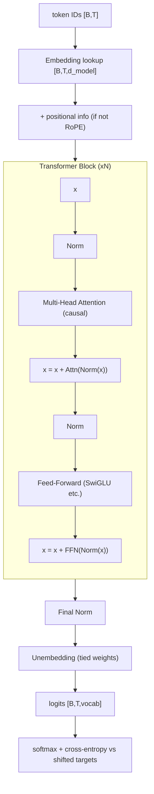

> **One-paragraph hook:** Every frontier LLM in 2026 (GPT, Claude, LLaMA, DeepSeek, Qwen) is the same skeleton in different clothes: a stack of identical pre-norm residual blocks around [[Concept - Attention Mechanism]] and a feed-forward sublayer, all reading and writing one shared vector per token. If you can trace a single token from embedding lookup to output logit through that stack, tensor shape by tensor shape, you can read any model's config file and know where its parameters and FLOPs live.

## The mechanism

The decoder-only transformer, the architecture that won for autoregressive LLMs, runs this forward path:

```
token IDs --embedding lookup--> [B, T, d_model]
        --(+ positional info, or none for RoPE)-->
        --N x { x = x + Attn(Norm(x)); x = x + FFN(Norm(x)) }-->
        --final Norm-->
        --unembedding (often tied to embedding)--> logits [B, T, vocab]
        --softmax + cross-entropy vs shifted targets (training)-->
```

All `N` blocks have the same structure and operate on the **residual stream**: a `d_model`-wide vector per token position that every sublayer reads from and adds back into. That's why [[Concept - The Residual Stream]] is the right mental model for the whole architecture. Attention and the FFN are less a pair of sequential "layers" transforming a representation than two different read/write operations on one shared bus.

### Pre-norm vs post-norm

The original Vaswani et al. (2017) block was post-norm: `x = Norm(x + Sublayer(x))`. Almost every model since GPT-2 uses pre-norm: `x = x + Sublayer(Norm(x))`. In post-norm, gradients heading back to early layers have to pass through every intervening normalization, which is unstable at depth and needs careful learning-rate warmup. In pre-norm the residual path is a clean, unnormalized gradient highway; the norm only changes what the sublayer *reads*. The cost is residual-stream magnitude growth with depth (handled in [[Concept - Normalization Placement (Pre-Norm, Post-Norm, DeepNorm)]]), and it's worth paying for trainability at 50-100+ layers.

### Tensor shapes

Input is `[batch, seq, d_model]`. Inside attention the projections reshape to `[batch, heads, seq, d_head]`, where `d_head = d_model / n_heads`, commonly 64 or 128. Each head attends independently in that view, then the heads are concatenated back to `d_model` and go through an output projection. The FFN never touches the head dimension. It processes each position's `d_model` vector on its own (hence "position-wise"), expanding to `d_ff` and projecting back down. `d_ff` is conventionally `4*d_model`, or `~(8/3)*d_model` with a gated variant (see [[Concept - Feed-Forward Networks and GLU Variants]]).

### Parameter budget

Per block, attention costs roughly `4*d_model^2` for the Q, K, V and output projections (less with GQA/MLA head-sharing, see [[Concept - Multi-Head Attention Variants (MHA MQA GQA MLA)]]). A vanilla 4x FFN costs `8*d_model^2`, two `d_model x 4*d_model` matrices. That gives the standard approximation:

$$N_{\text{params}} \approx 12 \cdot n_{\text{layers}} \cdot d_{\text{model}}^2$$

plus `vocab_size * d_model` embedding parameters (often shared between input embedding and output unembedding, see below). Worked example: GPT-3 175B has `n_layers=96`, `d_model=12288`. Plug in and `12 * 96 * 12288^2 ≈ 174B`, almost dead on the published count. It fits so well because GPT-3 is a plain dense MHA model with a 4x FFN, the regime the formula assumes.

### Causal masking and teacher forcing

The model learns to predict token `t+1` from tokens `≤t`. Training doesn't run it autoregressively one token at a time like an RNN. The causal mask sets attention score `S_ij = -inf` for `j > i`, so position `i` can only attend to itself and earlier positions. The whole sequence's next-token loss then comes out of **one parallel forward pass**, with every position's prediction computed at once and each blind to its own future. That's the transformer's central efficiency advantage over [[Concept - Recurrent Networks and the LSTM]]: no sequential dependency in training, full GPU parallelism along the sequence.

### Weight tying

Press and Wolf (2017) showed that tying the input embedding and output unembedding (the same `[vocab, d_model]` matrix, transposed for the final projection) improves quality and saves `vocab_size * d_model` parameters. For a 128k-vocabulary model at `d_model=4096` that's over 500M parameters. The final logit computation `hidden @ unembedding^T` costs `2 * seq_len * d_model * vocab` FLOPs. With large vocabularies (128k-256k, the modern trend) that's a non-trivial fraction of forward FLOPs, and it's the computation [[Concept - Multi-Token Prediction]] schemes have to duplicate per extra head.

### Where compute goes

Attention costs `O(N^2 * d)`, dominated by the `QK^T` and `softmax @ V` matmuls that scale with sequence length squared. The FFN costs `O(N * d^2)`: linear in sequence length, quadratic in width. At typical training lengths (a few thousand tokens) and widths (`d_model` in the thousands), the FFN dominates total FLOPs and attention is a minority of compute. At long context, though, attention's `O(N^2)` **memory** footprint (the score matrix) and its linearly growing [[Concept - KV Cache]] at inference dominate. So long-context work goes after attention and leaves the FFN alone.



## Architecture / walkthrough

One token through a concrete forward pass: position `t=50` in a 2048-token sequence, `d_model=4096`, `n_heads=32`, `d_head=128`.

1. **Embed.** The token ID indexes a `[vocab, 4096]` table and returns a 4096-dim vector. With RoPE, the modern default ([[Concept - Rotary Position Embeddings (RoPE)]]), no positional vector is added here; position gets injected later, inside attention.
2. **Enter block 1.** `Norm(x)` (almost always RMSNorm, per [[Concept - Normalization Placement (Pre-Norm, Post-Norm, DeepNorm)]]) makes a rescaled copy for the attention sublayer to read.
3. **Project to Q, K, V.** Three `[4096, 4096]` matrices produce `q, k, v`, each reshaped to `[32, 128]` (heads x d_head) for this position. Every earlier position up to `t=50` has already computed its own `k, v` in this block.
4. **Attend causally.** Position 50's query dots against keys 0..50 (never 51..2047; that's the causal mask), giving 51 raw scores per head. They're scaled by `1/sqrt(128)`, softmaxed and used to weight-sum the matching values. After merging heads and the output projection, the result is a 4096-dim content-based mixture of everything position 50 is "allowed" to see.
5. **First residual add.** The attention output is added onto the *original* `x`, not the normed copy: `x = x + Attn(Norm(x))`.
6. **FFN sublayer.** `Norm(x)` again, expand `4096 -> ~14336` (SwiGLU's `8/3` ratio), apply the gated nonlinearity, project back to 4096, add.
7. **Repeat for all N blocks.** Blocks only ever add to `x`. Nothing gets overwritten. By block 96 (GPT-3 scale), `x` is the embedding plus 96 attention contributions plus 96 FFN contributions.
8. **Final norm + unembed.** One last RMSNorm, then `x @ unembedding^T` does the 4096 -> vocab_size projection: the logits.
9. **Loss (training only).** Cross-entropy between the softmax of those logits and the actual token at position 51. Position 50's target is position 51's ID because the whole stack is trained to predict what comes next from everything causally visible.

## Evolution

The 2017 Vaswani et al. original was an **encoder-decoder** model for machine translation (see [[Concept - Encoder-Decoder and Decoder-Only Architectures]]), with post-norm blocks, learned or sinusoidal absolute positions, vanilla ReLU FFNs and full multi-head attention. Since then nearly every component has been swapped for a cheaper or more stable one while the block-and-residual-stream skeleton stayed put:

- **Post-norm → pre-norm** (GPT-2, 2019): stable training at depth without fragile warmup schedules.
- **LayerNorm → RMSNorm**: drops the mean-centering term, cheaper and just as effective.
- **Absolute positions → RoPE** (RoFormer, Su et al. 2021): relative position, no learned parameters, better length behavior.
- **Vanilla FFN → SwiGLU/GeGLU** (Shazeer 2020): a consistent perplexity win at matched parameter count.
- **Full MHA → GQA/MLA** ([[Concept - Multi-Head Attention Variants (MHA MQA GQA MLA)]]): once inference KV-cache cost, not training FLOPs, became the limit.
- **Dense FFN → sparse MoE** ([[Concept - Mixture of Experts Architecture]]): decouples parameter count from active compute.

What's striking, and covered in [[Lore - The Standardization of the Transformer Block]], is how little the *macro* structure moved given all that component churn. Nobody has displaced "pre-norm residual block with attention and a gated FFN" as the reference design. SSMs and linear attention ([[Concept - State Space Models and Mamba]]) compete at the sequence-mixing layer specifically.

## In practice

Real configs make this concrete. LLaMA-2 70B: 80 layers, `d_model=8192`, 64 query heads, 8 KV heads (GQA), `d_ff≈28672` (SwiGLU), 32k-ish vocab, context 4096 (extended later). Mixtral 8x7B keeps dense attention and replaces the FFN with 8 experts, top-2 routed ([[Breakdown - Mixtral 8x7B]]). DeepSeek-V3 goes furthest: 671B total / 37B active params via MLA + fine-grained MoE ([[Breakdown - DeepSeek-V3 Architecture]]). [[Reference - Transformer Architecture Cheat Sheet]] lays these out side by side with exact dimensions.

Before starting any training run on a new architecture, practitioners first reproduce a reference forward pass numerically, logit-matching against a known-good checkpoint. See [[Checklist - New Architecture Bring-Up]] and [[Playbook - Numerically Matching a Reference Implementation]].

## Failure modes

- **Silent shape bugs.** A reshape/transpose bug in the head split gives a model that trains (loss goes down) but attends to scrambled features. Output shapes look right everywhere, so casual review misses it. A per-head identity unit test catches it; details in [[Gotchas - Implementing Attention]].
- **Causal mask leakage.** An off-by-one lets position `i` see position `i+1`. The symptom is suspiciously low training loss (the model copies the label) that collapses at inference when the "future" isn't there.
- **Residual-stream magnitude blowup.** Pre-norm's additive stream grows with depth. Without the right init scaling (or a DeepNorm-style correction), late layers in very deep stacks contribute proportionally less, and in extreme cases bf16 activations overflow at the tail of the stack.
- **Precision mismatches at the softmax.** Running attention softmax in bf16 without upcasting to fp32 loses probability mass and destabilizes gradients. Mechanism in [[Concept - Attention Mechanism]].

## The non-obvious

The `12*n_layers*d_model^2` formula isn't some deep property of transformer "design". It falls straight out of picking `d_ff = 4*d_model` and 4 attention projection matrices, two ratios settled empirically with no deep theoretical justification (see the numerology discussion linked from [[Reference - Architecture Numerology]] in domain 18). Treat the formula as fundamental and a GQA or MoE model will trip you up, since the true parameter count there can be 30-90% off the naive estimate. Check a config's actual `n_kv_heads` and FFN width before trusting a back-of-envelope parameter count.

## Connections
- [[Concept - Attention Mechanism]] — the sequence-mixing sublayer this deep dive treats as a black box; its internals (Q/K/V, scaling, masking) live there.
- [[Concept - Feed-Forward Networks and GLU Variants]] — the other sublayer in every block, and the one that holds most of the parameters and FLOPs.
- [[Concept - Positional Encoding]] — how position enters the stack, surveyed as a family before RoPE is treated in depth.
- [[Concept - The Residual Stream]] — the correct mental model for what every block actually reads and writes.
- [[Concept - Backpropagation]] — the gradient-flow mechanism that pre-norm's residual highway is specifically designed to keep clean at depth.
- [[Concept - Byte-Pair Encoding]] — produces the token IDs that are the stack's actual input, and sets the vocab dimension of the embedding/unembedding matrices.
- [[Deep Dive - FlashAttention]] — the kernel-level execution of the attention sublayer traced here at the tensor-shape level.
- [[Concept - Scaling Laws]] — the parameter/FLOP formulas derived here are the basis for compute-optimal scaling calculations.
- [[Reference - Memory Math for Transformers]] — turns this note's shapes and formulas into concrete activation and optimizer-state memory budgets.

## Sources
- Vaswani et al. (2017) — "Attention Is All You Need." The original encoder-decoder transformer; post-norm, sinusoidal positions.
- Press and Wolf (2017) — "Using the Output Embedding to Improve Language Models." Establishes weight tying between embedding and unembedding.
- Radford et al. (2019) — GPT-2 technical report. Popularized the pre-norm block ordering used by nearly all modern LLMs.
- Shazeer (2020) — "GLU Variants Improve Transformer." SwiGLU and relatives replacing the vanilla FFN.
