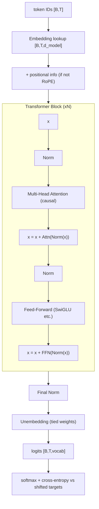

> **One-paragraph hook:** Every frontier LLM in 2026 — GPT, Claude, LLaMA, DeepSeek, Qwen — is the same skeleton wearing different clothes: a stack of identical pre-norm residual blocks around [[Concept - Attention Mechanism]] and a feed-forward sublayer, reading and writing one shared vector per token. If you can trace a single token from embedding lookup to output logit through that stack, tensor shape by tensor shape, you can read any model's config file and know exactly where its parameters and FLOPs live.

## The mechanism

The forward path for a decoder-only transformer, the architecture that won for autoregressive LLMs, is:

```
token IDs --embedding lookup--> [B, T, d_model]
        --(+ positional info, or none for RoPE)-->
        --N x { x = x + Attn(Norm(x)); x = x + FFN(Norm(x)) }-->
        --final Norm-->
        --unembedding (often tied to embedding)--> logits [B, T, vocab]
        --softmax + cross-entropy vs shifted targets (training)-->
```

Each of the `N` blocks is identical in structure and operates on the **residual stream**: a `d_model`-wide vector per token position that every sublayer reads from and additively writes back to. This is why [[Concept - The Residual Stream]] is the right mental model for the whole architecture — attention and the FFN are not sequential "layers" transforming a representation so much as two different read/write operations on a shared communication bus.

**Pre-norm vs post-norm.** The original Vaswani et al. (2017) block was post-norm: `x = Norm(x + Sublayer(x))`. Almost every model since GPT-2 uses pre-norm instead: `x = x + Sublayer(Norm(x))`. The swap matters because in post-norm, gradients flowing back to early layers must pass back through every intervening normalization, which is unstable at depth and demands careful learning-rate warmup. In pre-norm, the residual path is a clean, unnormalized gradient highway — the norm only affects what the sublayer *reads*, not what flows through the skip connection. The tradeoff (residual-stream magnitude growth with depth, addressed by [[Concept - Normalization Placement (Pre-Norm, Post-Norm, DeepNorm)]]) is a cost worth paying for trainability at 50-100+ layers.

**Tensor shapes through the stack.** Input is `[batch, seq, d_model]`. Inside attention, the projections reshape to `[batch, heads, seq, d_head]` where `d_head = d_model / n_heads` — commonly 64 or 128. Each head computes attention independently in this reshaped view, then the heads are concatenated back to `d_model` and passed through an output projection. The FFN sublayer never touches the head dimension at all; it processes each position's `d_model` vector independently (hence "position-wise"), expanding to `d_ff` (conventionally `4*d_model`, or `~(8/3)*d_model` with a gated variant — see [[Concept - Feed-Forward Networks and GLU Variants]]) and projecting back down.

**Parameter budget.** Per block, attention costs roughly `4*d_model^2` (the Q, K, V, and output projections; less with GQA/MLA head-sharing — see [[Concept - Multi-Head Attention Variants (MHA MQA GQA MLA)]]), and a vanilla 4x FFN costs `8*d_model^2` (two `d_model x 4*d_model` matrices). That gives the widely-used approximation:

$$N_{\text{params}} \approx 12 \cdot n_{\text{layers}} \cdot d_{\text{model}}^2$$

plus embedding parameters `vocab_size * d_model` (often shared between input embedding and output unembedding — see below). Worked example: GPT-3 175B has `n_layers=96`, `d_model=12288`. Plugging in: `12 * 96 * 12288^2 ≈ 174B`, matching the published parameter count almost exactly — the formula is accurate because GPT-3 is a plain dense MHA model with a 4x FFN, exactly the regime the formula assumes.

**Causal masking and teacher forcing.** The model is trained to predict token `t+1` from tokens `≤t`. Rather than running the model autoregressively during training (one token at a time, like an RNN), the causal mask sets attention score `S_ij = -inf` for `j > i`, so position `i` can only attend to itself and earlier positions. This means the entire sequence's next-token loss can be computed in **one parallel forward pass** — every position's prediction is computed simultaneously, each correctly blind to its own future. This single property is the transformer's central efficiency advantage over [[Concept - Recurrent Networks and the LSTM]]: no sequential dependency during training, full GPU parallelism across the sequence dimension.

**Weight tying.** Press and Wolf (2017) showed that tying the input embedding matrix and the output unembedding matrix (using the same `[vocab, d_model]` matrix transposed for the final projection) improves quality and saves `vocab_size * d_model` parameters — for a 128k-vocabulary model at `d_model=4096` that's over 500M parameters saved. The final logit computation `hidden @ unembedding^T` costs `2 * seq_len * d_model * vocab` FLOPs — for large vocabularies (128k-256k, the modern trend) this is a non-trivial fraction of total forward FLOPs, and is exactly the computation [[Concept - Multi-Token Prediction]] schemes have to duplicate per extra head.

**Where compute goes.** Attention costs `O(N^2 * d)` (dominated by the `QK^T` and `softmax @ V` matmuls scaling with sequence length squared), while the FFN costs `O(N * d^2)` (linear in sequence length, quadratic in width). At typical training sequence lengths (a few thousand tokens) and typical widths (`d_model` in the thousands), the FFN dominates total FLOPs — attention is a minority of the compute budget. But attention's `O(N^2)` **memory** footprint (the score matrix) and its linearly-growing [[Concept - KV Cache]] at inference time is what dominates at long context, which is why long-context work targets attention specifically rather than the FFN.



## Architecture / walkthrough

Trace one token through a concrete forward pass, say token position `t=50` in a 2048-token sequence, `d_model=4096`, `n_heads=32`, `d_head=128`:

1. **Embed.** Token ID indexes into a `[vocab, 4096]` table, producing a 4096-dim vector. With RoPE (the modern default — see [[Concept - Rotary Position Embeddings (RoPE)]]) no positional vector is added here; position is injected later, inside attention.
2. **Enter block 1.** `Norm(x)` (RMSNorm, almost universally, per [[Concept - Normalization Placement (Pre-Norm, Post-Norm, DeepNorm)]]) produces a rescaled copy for the attention sublayer to read.
3. **Project to Q, K, V.** Three `[4096, 4096]` matrices produce `q, k, v`, each reshaped to `[32, 128]` (heads x d_head) for this position. Every other position in the sequence up to `t=50` has already computed its own `k, v` in this same block.
4. **Attend causally.** Position 50's query dots against keys 0..50 (never 51..2047 — the causal mask), producing 51 raw scores per head, scaled by `1/sqrt(128)`, softmaxed, and used to weight-sum the corresponding values. Output: a 4096-dim vector (after merging heads and the output projection) that is a content-based mixture of everything position 50 is "allowed" to see.
5. **First residual add.** That attention output is added back onto the *original* `x` (not the normed copy) — `x = x + Attn(Norm(x))`.
6. **FFN sublayer.** `Norm(x)` again, then expand `4096 -> ~14336` (SwiGLU's `8/3` ratio), apply the gated nonlinearity, project back to 4096, and add.
7. **Repeat for all N blocks.** Each block only ever adds to `x`; nothing is ever overwritten. By block 96 (GPT-3 scale), `x` is the sum of the embedding plus 96 attention contributions plus 96 FFN contributions.
8. **Final norm + unembed.** One last RMSNorm, then `x @ unembedding^T` produces a 4096 -> vocab_size projection: the logits.
9. **Loss (training only).** Cross-entropy between the softmax of those logits and the actual token at position 51 — this is why position 50's target is position 51's ID: the whole stack is trained to predict "what comes next" given everything causally visible.

## Evolution

The 2017 Vaswani et al. original was an **encoder-decoder** design (see [[Concept - Encoder-Decoder and Decoder-Only Architectures]]) for machine translation, with post-norm blocks, learned or sinusoidal absolute positions, vanilla ReLU FFNs, and full multi-head attention. Since then, essentially every component has been independently replaced by a cheaper or more stable alternative while the block-and-residual-stream skeleton stayed fixed:

- **Post-norm → pre-norm** (GPT-2, 2019) for training stability at depth without fragile warmup schedules.
- **LayerNorm → RMSNorm** (dropping the mean-centering term) for a cheaper, equally effective normalization.
- **Absolute positions → RoPE** (RoFormer, Su et al. 2021) for relative position with no learned parameters and better length behavior.
- **Vanilla FFN → SwiGLU/GeGLU** (Shazeer 2020) for a consistent perplexity win at matched parameter count.
- **Full MHA → GQA/MLA** ([[Concept - Multi-Head Attention Variants (MHA MQA GQA MLA)]]) once inference KV-cache cost, not training FLOPs, became the binding constraint.
- **Dense FFN → sparse MoE** ([[Concept - Mixture of Experts Architecture]]) to decouple parameter count from active compute.

The remarkable fact, examined in [[Lore - The Standardization of the Transformer Block]], is how little the *macro* structure changed given how much churn happened at the component level — nobody has displaced "pre-norm residual block with attention and a gated FFN" as the reference design, even as SSMs and linear attention ([[Concept - State Space Models and Mamba]]) compete at the sequence-mixing layer specifically.

## In practice

Real configs make the abstractions concrete. LLaMA-2 70B: 80 layers, `d_model=8192`, 64 query heads, 8 KV heads (GQA), `d_ff≈28672` (SwiGLU), 32k-ish vocab, context 4096 (extended later). Mixtral 8x7B keeps dense attention but replaces the FFN with 8 experts, top-2 routed — see [[Breakdown - Mixtral 8x7B]]. DeepSeek-V3 pushes furthest: 671B total / 37B active params via MLA + fine-grained MoE — see [[Breakdown - DeepSeek-V3 Architecture]]. The [[Reference - Transformer Architecture Cheat Sheet]] tabulates these side by side with exact dimensions.

Practitioners bring up a new architecture by first reproducing a reference forward pass numerically (logit-matching against a known-good checkpoint) before ever starting a training run — see [[Checklist - New Architecture Bring-Up]] and [[Playbook - Numerically Matching a Reference Implementation]].

## Failure modes

- **Silent shape bugs.** A reshape/transpose bug in the head-split step produces a model that trains (loss goes down) but attends to scrambled features — output shapes look correct throughout, so this passes casual review. Catch it with a per-head identity unit test, detailed in [[Gotchas - Implementing Attention]].
- **Causal mask leakage.** An off-by-one in the mask lets position `i` see position `i+1`; symptom is suspiciously low training loss (the model is cheating by copying the label) that collapses at inference when the "future" isn't available.
- **Residual-stream magnitude blowup.** Pre-norm's additive stream grows with depth; without appropriate init scaling (or DeepNorm-style correction) very deep stacks see late layers contribute proportionally less, and in extreme cases numerical overflow in bf16 activations at the tail of the stack.
- **Precision mismatches at the softmax.** Computing attention softmax in bf16 instead of upcasting to fp32 causes probability mass loss and gradient instability — see [[Concept - Attention Mechanism]] for the mechanism.

## The non-obvious

The `12*n_layers*d_model^2` parameter formula is not a coincidence of transformer "design" — it falls straight out of choosing `d_ff = 4*d_model` and 4 attention projection matrices, both empirically-settled ratios with no deep theoretical justification (see the numerology discussion linked from [[Reference - Architecture Numerology]] in domain 18). Practitioners who assume the formula is somehow fundamental get tripped up the moment they meet a GQA or MoE model, where the true parameter count can be 30-90% off the naive estimate — always check a config's actual `n_kv_heads` and FFN width before trusting a back-of-envelope parameter count.

## Connections
- [[Concept - Attention Mechanism]] — the sequence-mixing sublayer this deep dive treats as a black box; its internals (Q/K/V, scaling, masking) live there.
- [[Concept - Feed-Forward Networks and GLU Variants]] — the other sublayer in every block, and the one that holds most of the parameters and FLOPs.
- [[Concept - Positional Encoding]] — how position enters the stack, surveyed as a family before RoPE is treated in depth.
- [[Concept - The Residual Stream]] — the correct mental model for what every block actually reads and writes.
- [[Concept - Backpropagation]] — the gradient-flow mechanism that pre-norm's residual highway is specifically designed to keep clean at depth.
- [[Concept - Byte-Pair Encoding]] — produces the token IDs that are the stack's actual input, and sets the vocab dimension of the embedding/unembedding matrices.
- [[Deep Dive - FlashAttention]] — the kernel-level execution of the attention sublayer traced here at the tensor-shape level.
- [[Concept - Scaling Laws]] — the parameter/FLOP formulas derived here are the basis for compute-optimal scaling calculations.
- [[Reference - Memory Math for Transformers]] — turns this note's shapes and formulas into concrete activation and optimizer-state memory budgets.

## Sources
- Vaswani et al. (2017) — "Attention Is All You Need." The original encoder-decoder transformer; post-norm, sinusoidal positions.
- Press and Wolf (2017) — "Using the Output Embedding to Improve Language Models." Establishes weight tying between embedding and unembedding.
- Radford et al. (2019) — GPT-2 technical report. Popularized the pre-norm block ordering used by nearly all modern LLMs.
- Shazeer (2020) — "GLU Variants Improve Transformer." SwiGLU and relatives replacing the vanilla FFN.
