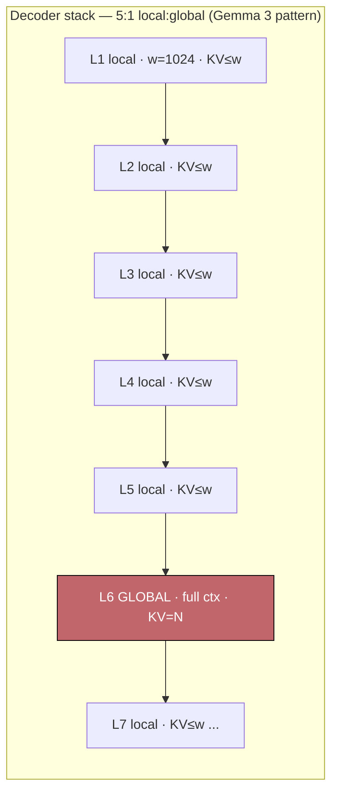

# Pattern - Interleaving Global and Local Attention

> **Problem:** full attention in every layer is `O(N²)` compute and a KV cache that grows linearly with context in *every* layer, but making every layer local (sliding-window) throws away exact long-range recall. **Solution shape:** make most layers local and sprinkle in a minority of full-context global layers, so the model keeps long-range mixing while the KV cache is dominated by the few global layers.

## Context & forces

The forces in tension are recall, compute, and — the one that actually drives 2024–2025 designs — **KV-cache memory at serve time**.

- **Full attention** ([[Concept - Attention Mechanism]]) gives exact recall over the whole context but costs `O(N²·d)` per layer and, worse for serving, keeps a per-layer [[Concept - KV Cache]] of `2·n_layers·n_kv_heads·d_head·N` elements. At long `N` and high batch, that cache — not the weights — is what fills the GPU.
- **Sliding-window (local) attention** ([[Concept - Sparse and Sliding-Window Attention]]) caps each token's attention to the previous `w` tokens, so per-layer cache is bounded by `w` instead of `N`. But a token can only reach information more than `w` away by hopping through depth, which degrades exact copy/retrieval.
- The insight that resolves the tension: **you do not need long-range mixing in every layer.** A small fraction of global layers is enough to move information across the full context, while the local majority does the cheap within-window work. This is the attention-side cousin of the SSM/attention split in [[Concept - Hybrid SSM-Attention Architectures]] — same "cheap-majority + a few expensive-recall layers" idea, different cheap primitive.

## The pattern

Stack local (sliding-window) layers and insert a global (full-context) layer every `k` layers. Only the global layers hold a full-length KV cache.



Effective receptive field compounds two ways: within a run of local layers, depth stacks windows (`L` local layers reach `~L·w`); and every global layer resets reach to the entire context in a single hop. So the model never has a "blind spot" longer than one global-layer interval.

**KV-cache payoff, made concrete.** Take 40 layers, context `N = 32k`, window `w = 1k`.

```
All-global:   40 layers × 32k  = 1,280k KV "rows" / token-dim
5:1 mix:      ~7 global × 32k + 33 local × 1k = 224k + 33k ≈ 257k
              → ~5× smaller KV cache, same context length
```

That multiplier is the whole reason the pattern exists: it converts a linear-in-context memory cost into something close to constant for most of the stack.

## Implementation notes

- **Ratio and window are the primary knobs.** Gemma 2 used a **1:1** local:global interleave with a **4096** window; Gemma 3 pushed to **5:1** with a **1024** window specifically to shrink the KV cache further for long-context serving. More global layers → better retrieval, larger cache; the ratio is where you spend your memory budget.
- **Placement:** periodic (every `k`-th layer is global) is the common choice; a few designs front-load or back-load global layers. Periodic is simplest for KV-paging bookkeeping.
- **Global and local layers can use different RoPE settings.** Gemma 3, for instance, uses a larger [[Concept - Rotary Position Embeddings (RoPE)]] base on the global layers (which must span the full context) than on the local layers (which only ever rotate within `w`) — a subtlety that silently breaks a port if you assume one base for all layers.
- **Attention sinks interact with the window.** Streaming-style local attention needs to retain the first few tokens or it destabilizes; the [[Concept - Attention Sinks]] phenomenon is why StreamingLLM keeps a few "sink" tokens alongside the sliding window.
- **Kernel support is the hidden cost.** [[Deep Dive - FlashAttention]] and mature serving stacks handle uniform full or uniform sliding-window attention well; a *mixed* per-layer pattern needs the engine to track two cache geometries and dispatch the right masked kernel per layer. This is real engineering, not a config flag.

## Tradeoffs & when NOT to use

- **Retrieval-heavy / long-range-exact workloads** (needle-in-haystack, long-document QA, code with distant references) may need a richer global ratio; a 5:1 mix trades measurable long-range accuracy for memory. Test on *your* long-context task, not passkey retrieval, which passes far too early.
- **KV-cache paging gets more complex:** two cache geometries per model complicate prefix caching and block allocation in the serving layer ([[Concept - KV Cache]]).
- **When NOT to use:** short-context models (if `N ≲ w` the pattern buys nothing), or when your serving stack lacks mixed-pattern kernel support and the eng cost outweighs the memory win. For a from-scratch long-context model where recall is paramount and memory is not the binding constraint, uniform full attention is still the safe default. If your binding constraint is *training* compute rather than serving memory, an SSM/linear hybrid or logit-stabilized full attention ([[Concept - Attention Logit Stabilization (QK-Norm and Soft-Capping)]], as in the same Gemma line) may be the better lever.

## Known uses

- **Gemma 2 (Google, 2024):** 1:1 local:global interleave, 4096-token sliding window — the design that popularized the pattern in an open model.
- **Gemma 3 (Google, 2025):** 5:1 local:global, 1024-token window, explicitly to cut long-context KV memory.
- **OpenAI gpt-oss (2025):** alternates full-context and sliding-window (banded) attention layers, echoing GPT-3's original alternating dense/locally-banded scheme.
- **Cohere Command (2025):** interleaves sliding-window layers with periodic full-attention layers for efficient long-context serving.
- **Character.AI inference work (Shazeer's team, 2024):** local sliding-window attention with a small minority of global layers plus cross-layer KV sharing, reported to cut KV cache by ~20× (company engineering blog — treat the exact multiplier as company-claimed).
- **Ancestors:** Longformer (Beltagy et al. 2020) window + global tokens, and Sparse Transformer (Child et al. 2019) alternating local/strided factorized attention.

## Connections

- [[Concept - Sparse and Sliding-Window Attention]] — the local primitive this pattern interleaves; the down-link to the sliding-window mechanism and its receptive-field math.
- [[Concept - Attention Mechanism]] — the full-attention baseline the global layers preserve and the pattern economizes on.
- [[Concept - Hybrid SSM-Attention Architectures]] — the same "cheap majority + a few recall layers" idea with SSM/linear layers as the cheap primitive instead of local attention.
- [[Concept - KV Cache]] — the serving-memory term this pattern exists to bound; the payoff calculation lives here.
- [[Deep Dive - FlashAttention]] — the kernel whose mixed-pattern support is the hidden implementation cost.
- [[Concept - Rotary Position Embeddings (RoPE)]] — the per-layer base-θ subtlety (different bases for local vs global layers) that trips up ports.
- [[Concept - Attention Sinks]] — why sliding-window local layers must retain the first tokens to stay stable.
- [[Concept - Attention Logit Stabilization (QK-Norm and Soft-Capping)]] — the companion Gemma-line technique for stability; the up-link to the deeper, unicorn-tier tricks shipped alongside this pattern.

## Sources

- Gemma Team (2024) — *Gemma 2 Technical Report.* 1:1 local/global interleave, 4096 window.
- Gemma Team (2025) — *Gemma 3 Technical Report.* 5:1 local/global, 1024 window, explicitly for KV-cache reduction on long context.
- Beltagy et al. (2020) — *Longformer.* Sliding window + global tokens, the direct ancestor.
- Child et al. (2019) — *Generating Long Sequences with Sparse Transformers.* Alternating local/strided factorized attention.
- Character.AI (2024) — *Optimizing AI Inference* (engineering blog). Local/global interleave + cross-layer KV sharing, ~20× KV reduction (company-claimed).
