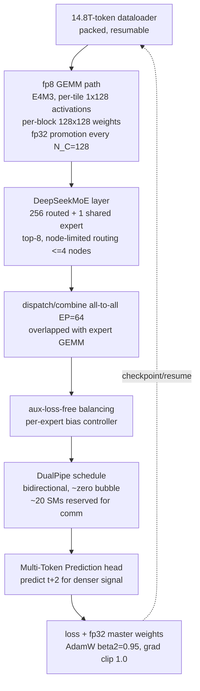

# Breakdown - DeepSeek-V3 Training

> DeepSeek-V3 (DeepSeek-AI, Dec 2024) is a 671B-parameter Mixture-of-Experts language model with 37B parameters active per token, pretrained on 14.8T tokens in **~2.788M H800 GPU-hours**, about **$5.6M of compute** at their stated $2/GPU-hour. It matched near-frontier quality at an order of magnitude less disclosed cost than the Western labs, on export-restricted, bandwidth-limited hardware. The model is less interesting than the systems co-design that made that number possible. This note covers the *training*; the architecture (MLA, DeepSeekMoE) is in [[Breakdown - DeepSeek-V3 Architecture]].

## The headline numbers

| Quantity | Value |
|---|---|
| Total / active params | 671B / 37B per token |
| Experts | 256 routed + 1 shared; **top-8** routed activated |
| Pretraining tokens | 14.8T |
| Precision | **fp8** for most GEMMs (bf16/fp32 for sensitive parts) |
| Pretraining cost | 2.664M H800-hours |
| Context extension + post-training | 0.119M + 0.005M H800-hours |
| **Total** | **2.788M H800-hours ≈ $5.576M** (their $2/hr assumption) |
| Training parallelism | PP=16, **EP=64**, ZeRO-1 DP — **no tensor parallelism** |
| Hardware | H800 (bandwidth-limited H100 variant, NVLink capped ~400 GB/s) |

The $5.6M is **compute-only**. It excludes salaries, data acquisition, ablations, failed runs and prior R&D. Read it as the marginal cost of the final successful run, not the cost of the program.

## How it works

Every choice in the design attacks the same problem: **communication on a slow interconnect**. The H800 has throttled NVLink and cross-node InfiniBand compared with an unrestricted H100, so DeepSeek couldn't use the usual [[Concept - Tensor and Pipeline Parallelism|tensor parallelism]], which floods the fabric with per-layer activation all-reduces. They built a comm-avoiding pipeline instead and paid for it in engineering.

Sensitive tensors stay high precision throughout: fp32 master weights and optimizer moments, layernorm statistics, the softmax, the embedding table and the output head. Everything else, which is the bulk of the FLOPs, runs fp8 on [[Concept - Tensor Cores|Hopper tensor cores]].

## The clever parts

**1. Production-scale fp8 with fine-grained scaling and fp32 promotion.** fp8's first problem is dynamic range. E4M3 tops out near ±448, so a single per-tensor scale factor is hostage to the largest outlier in the tensor. DeepSeek scales at **tile granularity** instead (1×128 blocks for activations, 128×128 blocks for weights), so an outlier only inflates its own tile's scale. The second problem is accumulation. Hopper's fp8 tensor cores accumulate partial products at only ~14-bit precision, and the error compounds catastrophically over the contraction dimension of a large matmul. DeepSeek's workaround is to **promote the partial sum to fp32 on the CUDA cores every N_C = 128 elements**. That gets back near-bf16 numerics and keeps the fp8 matmul throughput (~2× bf16). This recipe took fp8 pretraining from folklore-unstable to a shipping default; [[Concept - FP8 Training]] has the general mechanism.

**2. Aux-loss-free load balancing.** Top-k routers collapse onto a few experts unless something pushes back. The standard push is a Switch-style auxiliary loss (Fedus et al. 2021), but that loss injects a gradient **that fights the language-modeling objective**, so you buy balance with quality. DeepSeek's [[Concept - MoE Training and Load Balancing|load balancing]] adds a **per-expert bias term** to the routing affinities, used for *selection only* and not applied to the gating weights that scale the expert output. A feedback controller nudges each bias up when its expert is underloaded and down when it's overloaded. Balance comes from a control signal that never touches the loss, with a tiny sequence-wise balance term as a backstop. They report lower loss at equal balance than the aux-loss baseline.

**3. DualPipe.** A conventional 1F1B pipeline still leaves a fill/drain bubble, and it does nothing to hide the MoE all-to-all. DualPipe runs a **bidirectional schedule**, with micro-batches entering from both ends of the pipeline. It manually overlaps each chunk's forward/backward compute with the [[Concept - Expert Parallelism|expert-parallel all-to-all]], reserving ~20 SMs to run the communication kernels alongside compute. The bubble shrinks to near zero. The price is memory: DualPipe keeps two copies of the model parameters resident in the pipeline. DeepSeek could afford that because MLA and fp8 had already cut the memory bill hard.

**4. Node-limited routing.** With unconstrained routing, a token's 8 experts can land on 8 different nodes, and cross-node all-to-all over InfiniBand is the dominant MoE overhead. DeepSeek caps each token to experts on **at most 4 nodes**. That bounds cross-node traffic so it fits the fabric and overlaps cleanly. The constraint was chosen for the *network topology*, not the model.

**5. Multi-Token Prediction (MTP).** An auxiliary head predicts the token at position *t+2* alongside the main *t+1* objective. That gives a denser training signal and better representations at negligible cost (depth D=1; deeper MTP didn't pay off). The same MTP head then serves as a draft model for [[Concept - Speculative Decoding|speculative decoding]] at inference, reported at ~85–90% acceptance of the second token for ~1.8× decode throughput.

Post-training also **distilled long chain-of-thought** from an internal DeepSeek-R1 model into V3 ([[Concept - Knowledge Distillation]]), transferring reasoning behavior without the RL cost. That's downstream of the pretraining this note covers.

## What it got wrong / what's dated

- **The design is scar tissue from the H800.** Node-limited routing, no TP and the hand-rolled comm kernels exist because the interconnect was throttled. On a GB200 NVL72 rack with an order of magnitude more NVLink bandwidth, you'd shift toward more tensor/expert parallelism and fewer pipeline tricks, and DualPipe's memory cost stops being worth paying.
- **Reproducibility depends on their infra.** Much of the win sits in PTX-level communication kernels and the fp32-promotion path, not in a config you can copy into Megatron. The paper is unusually candid, but running it yourself is not a weekend project.
- **fp8 still needs a curated exclusion list.** Embeddings, the output head, norms and the softmax stay bf16/fp32. Get the list wrong and the run diverges silently. The fp8 recipe is a floor, not a switch.

## What to steal

- The **fp8 recipe** (fine-grained per-tile/block scaling + fp32 promotion every N_C=128) is now the template for anyone attempting fp8 pretraining.
- **Aux-loss-free routing.** Decoupling load balance from the loss is a strictly better default than a tuned aux-loss coefficient.
- **Overlap the all-to-all with compute, and constrain routing to the topology.** Both carry over to any MoE run on a bandwidth-limited cluster.
- **MTP** gives a denser training signal *and* a free draft model from one head.

## Connections

- [[Concept - FP8 Training]] — DeepSeek-V3 is the reference implementation of the fine-grained-scaling + fp32-accumulation recipe this concept describes.
- [[Concept - MoE Training and Load Balancing]] — its aux-loss-free bias controller is the load-balancing method that this note popularized.
- [[Concept - Expert Parallelism]] — EP=64 with overlapped all-to-all is the systems substrate; node-limited routing is an EP-driven design choice.
- [[Concept - Mixture of Experts Architecture]] — DeepSeekMoE (fine-grained + shared expert) is the architecture being trained here.
- [[Concept - Tensor and Pipeline Parallelism]] — the *absence* of TP and the DualPipe schedule are the load-bearing parallelism decisions.
- [[Concept - Multi-Head Attention Variants (MHA MQA GQA MLA)]] — MLA is why the KV/memory budget was small enough to afford DualPipe's parameter duplication.
- [[Concept - Speculative Decoding]] — the MTP head doubles as the inference-time draft model.
- [[Concept - Tensor Cores]] — the fp8 GEMM speed and the ~14-bit accumulation limitation are both Hopper-tensor-core facts.
- [[Concept - Knowledge Distillation]] — post-training distilled R1's reasoning into V3, complementing the cheap pretrain.
- [[Deep Dive - Anatomy of a Pretraining Run]] — V3 is the worked example of the fp8-MoE endpoint of that lifecycle.
- [[Breakdown - DeepSeek-V3 Architecture]] — the architecture companion (MLA, DeepSeekMoE internals) that this training note deliberately links to rather than re-derives.

## Sources

- DeepSeek-AI (2024) — *DeepSeek-V3 Technical Report.* The primary source for every number above; unusually detailed on the fp8 recipe, DualPipe, and aux-loss-free balancing.
- Micikevicius et al. (2022) — *FP8 Formats for Deep Learning.* Defines E4M3/E5M2, the format DeepSeek scales at fine granularity.
- Fedus et al. (2021) — *Switch Transformers.* The auxiliary-loss balancing that DeepSeek's bias controller was designed to replace.
- Lepikhin et al. (2020) — *GShard.* Origin of top-k expert routing and the capacity/all-to-all machinery DeepSeek optimizes.
