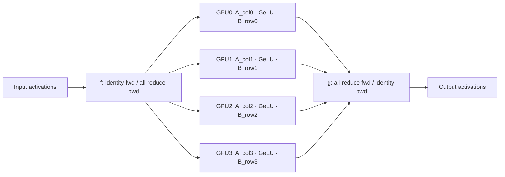

# Breakdown - Megatron-LM

> Megatron-LM is NVIDIA's framework for training transformers that don't fit on one GPU. Megatron-Core, the library extracted from it, is the parallelism engine under a large fraction of the frontier training stack, forked or vendored by DeepSpeed, NeMo and many lab-internal trainers. Narayanan et al. 2021 ("Efficient Large-Scale Language Model Training on GPU Clusters Using Megatron-LM") is the paper that made "3D parallelism" standard vocabulary. *(as of 2026, Megatron-Core remains the reference implementation most labs measure their own trainer against.)*

## The headline numbers

Narayanan et al. 2021 trained a **1-trillion-parameter** GPT model across **3072 A100 GPUs** at roughly **52% Model FLOPs Utilization** (MFU). At the time that was dramatically above what naive combinations of [[Concept - Data Parallelism and ZeRO]] and [[Concept - Tensor and Pipeline Parallelism]] achieved. The paper contributes systems engineering, not architecture: keeping thousands of GPUs doing useful matmuls instead of waiting on each other. Megatron-Core is the extracted, composable version of that engineering, and most "we trained an N-billion-parameter model" announcements sit on top of it.

## How it works

**Tensor parallelism via conjugate f/g operators.** The transformer MLP block is two linear layers with a nonlinearity between them: `Y = GeLU(X A) B`. Megatron splits `A` **column-parallel** (each of the $t$ ranks owns a vertical slice of columns) and `B` **row-parallel** (each rank owns a horizontal slice of rows). A column-split first matmul followed by a row-split second matmul equals the full matmul summed across ranks, so the layout needs **one all-reduce in the forward pass and one in the backward pass per block**, not one per matmul. Megatron writes this as two conjugate identity/all-reduce operators:

- `f`: identity on the forward pass, all-reduce on the backward pass. It duplicates the input, so gradients from all ranks have to be summed back together.
- `g`: all-reduce on the forward pass, identity on the backward pass. It combines the partial outputs, and gradients pass straight through because each rank already has the full result.

[[Concept - Attention Mechanism|Attention]] splits the same way, along the head dimension. Each of the $t$ tensor-parallel ranks owns a subset of heads and runs the full attention computation for them independently; the output projection is row-parallel and closes with a `g`-style all-reduce. [[Concept - Tensor and Pipeline Parallelism]] formalizes this tensor-parallel design more generally. Megatron-LM is where it was first shown at scale.

**Sequence parallelism for the TP-replicated regions.** TP shards the matmuls but leaves LayerNorm, dropout and the residual add fully replicated on every rank. They're cheap elementwise ops, so replicating them was originally treated as harmless. Korthikanti et al. 2022 noticed these regions still store full activations on every rank, wasting memory that scales with sequence length. [[Concept - Sequence and Context Parallelism|Sequence parallelism]] shards those regions along the sequence dimension instead. The TP `f`/`g` all-reduces become an all-gather before the sharded region and a reduce-scatter after it. Total communication volume matches plain TP, and activation memory drops by roughly the TP degree.

**Selective activation recomputation.** Full activation checkpointing recomputes the whole block on the backward pass, trading ~30-40% extra compute for large memory savings. Megatron's selective variant recomputes only what's cheap to recompute but expensive to store (the attention softmax and the block spanning it) and keeps the matmul outputs resident. You get most of full recomputation's memory savings for a fraction of its compute overhead.

**Interleaved (virtual) pipeline schedule.** In naive [[Concept - Tensor and Pipeline Parallelism|pipeline parallelism]] each device owns one contiguous block of layers, and the bubble fraction is $(p-1)/(m+p-1)$ for $p$ stages and $m$ microbatches. With few microbatches, most of the pipeline sits idle through fill and drain. Megatron's interleaved schedule gives each device several **non-contiguous** chunks of layers (e.g., device 0 owns layers 0-1 and 8-9 instead of 0-3), so a microbatch revisits each device multiple times per pass. The effective bubble shrinks by roughly the interleave factor, paid for with more frequent, smaller point-to-point sends.

**Distributed (ZeRO-1-style) optimizer + fused kernels.** Megatron shards Adam's optimizer state across the data-parallel group the way [[Concept - Data Parallelism and ZeRO|ZeRO-1]] does. It overlaps the pipeline's point-to-point activation sends with the data-parallel gradient all-reduce so neither stalls the other. On the kernel side it fuses bias-add+GeLU and the scaled-masked-softmax into single CUDA kernels, and fuses the gradient-accumulation loop too. Each win is small, but they compound across every layer of a 100+-layer model running for weeks.

## The clever parts

1. **The f/g operator formalization.** Writing TP as two operators with different forward/backward behavior is an elegant abstraction. "Where do I put the all-reduce" stops being per-model reasoning and becomes a mechanical rule applied to every linear-nonlinear-linear block, attention included.
2. **Column-then-row splitting.** The alternative, row-then-column, would need an all-reduce *inside* the nonlinearity. That's either wrong (reducing before GeLU changes the result) or costs an extra communication step. Column-then-row is the one layout where the nonlinearity runs locally per shard with no communication in between.
3. **Selective over full recomputation.** Activations don't all cost the same to recompute; the attention block is FLOP-cheap and memory-expensive to store. That kind of decision comes from profiling, after you've run the naive version at scale and watched where the time went.
4. **Sequence parallelism as a free lunch.** It converts TP's replicated-activation waste into sharded activations with no added communication volume (same all-reduce bytes, split into all-gather + reduce-scatter). Optimizations with no real downside are rare.
5. **Interleaved pipelining.** Trading more, smaller point-to-point messages for a smaller bubble is a bet. It pays off because intra-cluster interconnects (NVLink, InfiniBand) have plenty of message-rate headroom relative to what the bubble costs.

## What it got wrong / what's dated

Megatron-LM's original parameter sharding is closer to a flat, hand-managed tensor layout than to the composable `DeviceMesh`/DTensor abstractions that [[Concept - Fully Sharded Data Parallel (FSDP)|PyTorch FSDP2]] and TorchTitan now use. Composing TP with other parallelism dimensions in Megatron takes more manual bookkeeping, while FSDP2's per-parameter DTensor sharding was designed from the start to compose with TP through a shared mesh. The framework also predates fp8 training as a first-class feature. DeepSeek-V3's fp8 recipe (see [[Breakdown - DeepSeek-V3 Training]]) and its DualPipe schedule go further on bubble elimination and precision than Megatron-LM's 2021-era interleaved pipeline. And Megatron-LM's TP design assumes NVLink-class bandwidth is available and cheap. Inside an NVIDIA-topology node that holds; anywhere else it doesn't.

## What to steal

Learn the f/g operator framing even if you never touch Megatron-Core. It's the cleanest mental model for where the all-reduce goes in any tensor-parallel design. Selective activation recomputation (recompute what's cheap, keep what's expensive) applies beyond attention to any block with an asymmetric FLOPs-to-memory ratio. The rule of keeping TP strictly intra-node while pipeline and data parallelism cross node boundaries, formalized in [[Pattern - 3D Parallelism Composition]], goes straight back to Megatron-LM's original cluster topology decisions.

## Connections
- [[Concept - Tensor and Pipeline Parallelism]] — the general mechanisms (TP column/row split, PP bubble math) that Megatron-LM is the reference implementation of.
- [[Concept - Attention Mechanism]] — the operation Megatron's head-parallel TP split applies to, alongside the MLP block.
- [[Concept - Sequence and Context Parallelism]] — the companion technique that shards Megatron's TP-replicated norm/dropout regions along sequence.
- [[Concept - Fully Sharded Data Parallel (FSDP)]] — the composable-DTensor successor to Megatron's more manually-managed parameter sharding.
- [[Pattern - 3D Parallelism Composition]] — the device-mesh placement rules (TP intra-node, PP/DP across nodes) that Megatron-LM's cluster layout established as convention.
- [[Concept - Data Parallelism and ZeRO]] — the ZeRO-1-style distributed optimizer Megatron shards Adam state with, one axis of its full parallelism stack.
- [[Deep Dive - FlashAttention]] — the kernel-level attention optimization that composes with Megatron's TP-sharded attention heads.
- [[Concept - All-Reduce and Collective Operations]] — the collective primitive underlying every `f`/`g` operator boundary.
- [[Concept - Tensor Cores]] — the hardware Megatron's fused GEMM and softmax kernels are written to keep saturated.
- [[Concept - Activation Functions]] — GeLU is the nonlinearity Megatron's fused bias-add+GeLU kernel targets, and the reason column-then-row splitting (not row-then-column) is required.
- [[Deep Dive - Anatomy of a Pretraining Run]] — the end-to-end run that Megatron-LM's parallelism stack is one component of.
- [[Breakdown - DeepSeek-V3 Training]] — a frontier successor that pushes past Megatron-LM's 2021 design with fp8 precision and a bubble-eliminating DualPipe schedule.

## Sources
- Narayanan et al. (2021) — "Efficient Large-Scale Language Model Training on GPU Clusters Using Megatron-LM" — the 1T-parameter, 3072-A100, ~52% MFU result and the interleaved pipeline schedule.
- Shoeybi et al. (2019) — "Megatron-LM: Training Multi-Billion Parameter Language Models Using Model Parallelism" — the original column/row tensor-parallel design.
- Korthikanti et al. (2022) — "Reducing Activation Recomputation in Large Transformer Models" — sequence parallelism and selective activation recomputation.
