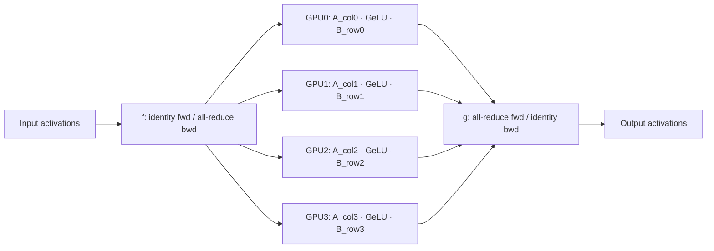

# Breakdown - Megatron-LM

> Megatron-LM is NVIDIA's framework for training transformers that don't fit on one GPU, and Megatron-Core (the library extracted from it) is the parallelism engine underneath a large fraction of the frontier training stack — forked or vendored by DeepSpeed, NeMo, and many lab-internal trainers. Narayanan et al. 2021 ("Efficient Large-Scale Language Model Training on GPU Clusters Using Megatron-LM") is the paper that made "3D parallelism" a standard vocabulary term. *(as of 2026, Megatron-Core remains the reference implementation most labs measure their own trainer against.)*

## The headline numbers

Narayanan et al. 2021 trained a **1-trillion-parameter** GPT model across **3072 A100 GPUs** at roughly **52% Model FLOPs Utilization** (MFU) — a number that was, at the time, dramatically above what naive combinations of [[Concept - Data Parallelism and ZeRO]] and [[Concept - Tensor and Pipeline Parallelism]] achieved. The paper's core contribution isn't a new architecture; it's the systems engineering that keeps thousands of GPUs doing useful matmuls instead of waiting on each other. Megatron-Core is the extracted, composable version of that engineering, and it is what most "we trained an N-billion-parameter model" announcements are quietly built on.

## How it actually works

**Tensor parallelism via conjugate f/g operators.** The transformer MLP block is two linear layers with a nonlinearity between them: `Y = GeLU(X A) B`. Megatron splits `A` **column-parallel** (each of the $t$ ranks owns a vertical slice of columns) and `B` **row-parallel** (each rank owns a horizontal slice of rows). Because a column-split first matmul followed by a row-split second matmul is mathematically equivalent to the full matmul summed across ranks, this layout needs exactly **one all-reduce in the forward pass and one in the backward pass per block** — not one per matmul. Megatron expresses this with two conjugate identity/all-reduce operators:

- `f`: identity on the forward pass, all-reduce on the backward pass (duplicates the input, so gradients from all ranks must be summed back together).
- `g`: all-reduce on the forward pass, identity on the backward pass (combines the partial outputs, so gradients pass straight through since each rank already has the full result).

[[Concept - Attention Mechanism|Attention]] is split the same way, along the head dimension — each of the $t$ tensor-parallel ranks owns a subset of heads and runs the full attention computation for those heads independently, then the output projection is row-parallel and closes with a `g`-style all-reduce. This is the same tensor-parallel design formalized more generally in [[Concept - Tensor and Pipeline Parallelism]]; Megatron-LM is where it was first demonstrated at scale.

**Sequence parallelism for the TP-replicated regions.** TP shards the matmuls but leaves LayerNorm, dropout, and the residual add fully replicated on every rank (they're cheap, elementwise ops, so replicating them was originally treated as harmless). Korthikanti et al. 2022 noticed these replicated regions still store full activations on every rank — wasted memory that scales with sequence length. [[Concept - Sequence and Context Parallelism|Sequence parallelism]] shards exactly these regions along the sequence dimension instead, turning the TP `f`/`g` all-reduces into an all-gather (before the sharded region) plus a reduce-scatter (after it) — same total communication volume as plain TP, but activation memory drops by roughly the TP degree.

**Selective activation recomputation.** Full activation checkpointing recomputes the entire block on the backward pass, trading ~30-40% extra compute for large memory savings. Megatron's selective variant recomputes only the parts that are cheap to recompute but expensive to store — the attention softmax and the block spanning it — while keeping the matmul outputs resident. This buys most of full recomputation's memory savings for a fraction of its compute overhead.

**Interleaved (virtual) pipeline schedule.** In naive [[Concept - Tensor and Pipeline Parallelism|pipeline parallelism]], each device owns one contiguous block of layers, and the pipeline bubble fraction is $(p-1)/(m+p-1)$ for $p$ stages and $m$ microbatches — with few microbatches, most of the pipeline is idle waiting for fill/drain. Megatron's interleaved schedule instead assigns each device several **non-contiguous** chunks of layers (e.g., device 0 owns layers 0-1 and 8-9 rather than 0-3), so a microbatch revisits each device multiple times per pass. This shrinks the effective bubble by roughly the interleave factor at the cost of more frequent, smaller point-to-point sends.

**Distributed (ZeRO-1-style) optimizer + fused kernels.** Megatron shards Adam's optimizer state across the data-parallel group the way [[Concept - Data Parallelism and ZeRO|ZeRO-1]] does, and overlaps the pipeline's point-to-point activation sends with the data-parallel gradient all-reduce so neither stalls the other. On the kernel side, it fuses bias-add+GeLU and the scaled-masked-softmax into single CUDA kernels, and fuses the gradient-accumulation loop itself — small wins individually, but they compound across every layer of a 100+-layer model running for weeks.

## The clever parts

1. **The f/g operator formalization.** Expressing TP as two operators with different forward/backward behavior is a genuinely elegant abstraction — it turns "where do I put the all-reduce" from a per-model reasoning exercise into a mechanical rule applied uniformly to every linear-nonlinear-linear block, including attention.
2. **Column-then-row splitting, specifically.** The alternative (row-then-column) would require an all-reduce *inside* the nonlinearity, which is either wrong (reducing before GeLU changes the result) or requires an extra communication step. Column-then-row is the one layout where the nonlinearity can be applied locally per shard with no communication in between.
3. **Selective recomputation over full recomputation.** Recognizing that not all activations cost the same to recompute — the attention block is FLOP-cheap and memory-expensive to store — is the kind of profiling-driven decision that only shows up after you've actually run the naive version at scale and watched where the time went.
4. **Sequence parallelism as a free lunch.** Converting TP's replicated-activation waste into sharded activations without adding communication volume (same all-reduce bytes, just split into all-gather + reduce-scatter) is the rare optimization with no real downside.
5. **Interleaved pipelining.** Trading more, smaller point-to-point messages for a smaller bubble is a bet that pays off specifically because intra-cluster interconnects (NVLink, InfiniBand) have plenty of message-rate headroom relative to the bubble's opportunity cost.

## What it got wrong / what's dated

Megatron-LM's original parameter sharding is closer to a flat, hand-managed tensor layout than to the composable `DeviceMesh`/DTensor abstractions that [[Concept - Fully Sharded Data Parallel (FSDP)|PyTorch FSDP2]] and TorchTitan now use — Megatron requires more manual bookkeeping to compose TP with other parallelism dimensions, whereas FSDP2's per-parameter DTensor sharding is designed from the start to compose with TP via a shared mesh. The framework also predates fp8 training as a first-class citizen; DeepSeek-V3's fp8 recipe (see [[Breakdown - DeepSeek-V3 Training]]) and its DualPipe schedule push further on bubble elimination and precision than Megatron-LM's 2021-era interleaved pipeline. And Megatron-LM's TP design assumes NVLink-class bandwidth is available and cheap — a good assumption inside an NVIDIA-topology node, a bad one anywhere else.

## What to steal

The f/g operator framing is worth internalizing even if you never touch Megatron-Core directly — it's the cleanest mental model for "where does the all-reduce go" in any tensor-parallel design. Selective activation recomputation (recompute what's cheap, keep what's expensive) generalizes past attention to any block with an asymmetric FLOPs-to-memory ratio. And the discipline of keeping TP strictly intra-node while letting pipeline and data parallelism cross node boundaries — the placement rule formalized in [[Pattern - 3D Parallelism Composition]] — traces directly back to Megatron-LM's original cluster topology decisions.

## Connections
- [[Concept - Tensor and Pipeline Parallelism]] — the general mechanisms (TP column/row split, PP bubble math) that Megatron-LM is the reference implementation of.
- [[Concept - Attention Mechanism]] — the operation Megatron's head-parallel TP split applies to, alongside the MLP block.
- [[Concept - Sequence and Context Parallelism]] — the companion technique that shards Megatron's TP-replicated norm/dropout regions along sequence.
- [[Concept - Fully Sharded Data Parallel (FSDP)]] — the composable-DTensor successor to Megatron's more manually-managed parameter sharding.
- [[Pattern - 3D Parallelism Composition]] — the device-mesh placement rules (TP intra-node, PP/DP across nodes) that Megatron-LM's cluster layout established as convention.
- [[Concept - Data Parallelism and ZeRO]] — the ZeRO-1-style distributed optimizer Megatron shards Adam state with, one axis of its full parallelism stack.
- [[Deep Dive - FlashAttention]] — the kernel-level attention optimization that composes with Megatron's TP-sharded attention heads.
- [[Concept - All-Reduce and Collective Operations]] — the collective primitive underlying every `f`/`g` operator boundary.
- [[Concept - Tensor Cores]] — the hardware Megatron's fused GEMM and softmax kernels are written to keep saturated.
- [[Concept - Activation Functions]] — GeLU is the nonlinearity Megatron's fused bias-add+GeLU kernel targets, and the reason column-then-row splitting (not row-then-column) is required.
- [[Deep Dive - Anatomy of a Pretraining Run]] — the end-to-end run that Megatron-LM's parallelism stack is one component of.
- [[Breakdown - DeepSeek-V3 Training]] — a frontier successor that pushes past Megatron-LM's 2021 design with fp8 precision and a bubble-eliminating DualPipe schedule.

## Sources
- Narayanan et al. (2021) — "Efficient Large-Scale Language Model Training on GPU Clusters Using Megatron-LM" — the 1T-parameter, 3072-A100, ~52% MFU result and the interleaved pipeline schedule.
- Shoeybi et al. (2019) — "Megatron-LM: Training Multi-Billion Parameter Language Models Using Model Parallelism" — the original column/row tensor-parallel design.
- Korthikanti et al. (2022) — "Reducing Activation Recomputation in Large Transformer Models" — sequence parallelism and selective activation recomputation.
