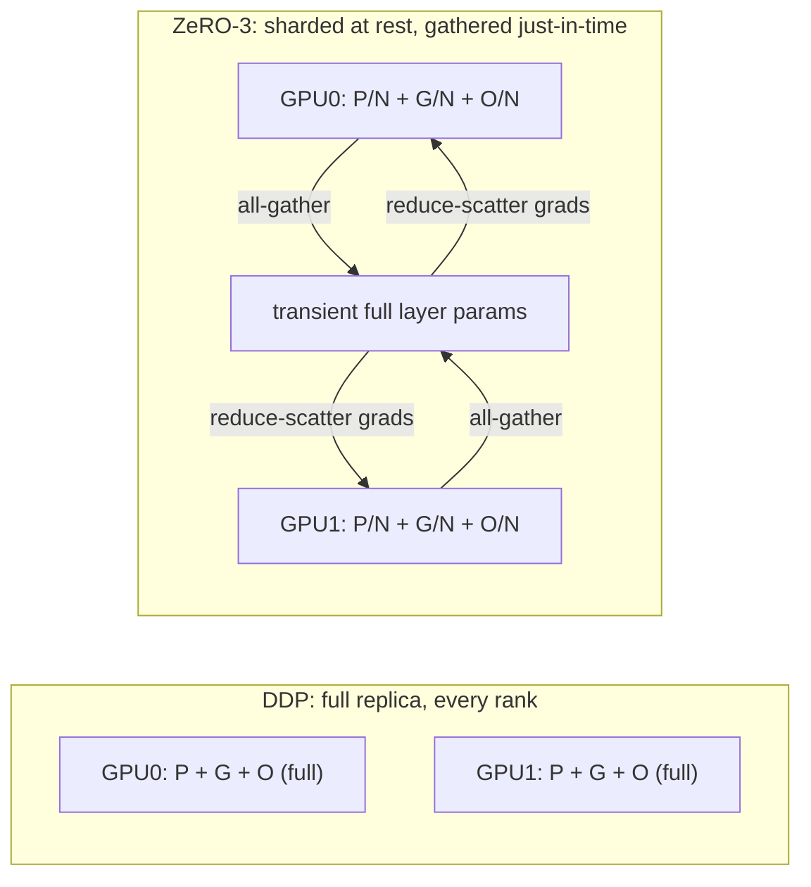

# Concept - Data Parallelism and ZeRO

> **One-paragraph hook:** Plain data parallelism scales throughput by giving every GPU a full copy of the model and syncing gradients. It does nothing for capacity, because every rank still pays the full memory bill. [[Concept - Why Models Don't Fit on One GPU]] put that bill at ~16-20 bytes/param, and most of it, the Adam optimizer state, is pure redundancy across ranks. ZeRO's idea is embarrassingly simple: if every GPU stores an identical copy of something, shard it, and rebuild the full copy only for the instant it's needed.

## The mechanism

**Plain DDP** (distributed data parallel): every rank holds a full model replica and runs forward/backward on its own data shard. Gradients are then synchronized with a ring [[Concept - All-Reduce and Collective Operations]], and every rank independently runs the same optimizer step:

```python
# DDP training step (per rank), conceptually
loss = model(microbatch)
loss.backward()                     # local gradients
all_reduce(model.grad, op=AVG)      # ring all-reduce, every rank ends up with the same averaged grad
optimizer.step()                    # every rank redundantly recomputes the same update
```

Per-rank memory stays at the full **params + gradients + optimizer state** whatever the world size. DDP buys more tokens/sec and zero extra capacity. A 70B model that doesn't fit on one GPU still doesn't fit under DDP, however many GPUs you add.

**ZeRO** (Rajbhandari et al. 2019, DeepSpeed) removes the redundancy in three stages, each sharding one more pool across the $N$ data-parallel ranks. With $\Psi$ as parameter count and the standard mixed-precision Adam byte budget (2 bytes bf16 param + 2 bytes grad + 12 bytes fp32 optimizer state = $16\Psi$ total; [[Concept - Adam and AdamW]] explains the 12):

| Stage | What's sharded | Per-GPU memory | Extra comm vs DDP |
|---|---|---|---|
| DDP (baseline) | nothing | $16\Psi$ | baseline (1 all-reduce/step) |
| ZeRO-1 | optimizer states | $4\Psi + 12\Psi/N$ | ≈ baseline |
| ZeRO-2 | + gradients | $2\Psi + 14\Psi/N$ | ≈ baseline |
| ZeRO-3 | + parameters | $16\Psi/N$ | ≈1.5x baseline |

ZeRO-1 and ZeRO-2 keep the standard gradient all-reduce (or a reduce-scatter variant) and change only how the *optimizer step* runs: each rank updates the slice of parameters it owns, and the sharded state is scattered back. Communication volume barely moves relative to DDP.

ZeRO-3 also shards the parameters. Each rank permanently holds just $1/N$ of every layer's weights. Right before a layer's forward (and again before its backward) needs the full weight, every rank **all-gathers** that layer's complete parameters, uses them, and **frees** the gathered copy immediately:

```python
# ZeRO-3 forward pass, per layer, per rank
for layer in model.layers:
    full_params = all_gather(layer.param_shard)   # reconstruct this layer's full weights, just-in-time
    activations = layer.forward(activations, full_params)
    free(full_params)                              # drop the transient full copy; keep only the shard
# backward mirrors this: all-gather params again to compute grads,
# then reduce-scatter the resulting gradients back to the owning rank
```

The gather happens twice per layer (forward and backward) instead of once, so ZeRO-3's total communication comes to roughly **1.5x** plain DDP's all-reduce volume. That memory-for-bandwidth trade is the whole design.



**ZeRO-Offload** (Ren et al. 2021) and **ZeRO-Infinity** (Rajbhandari et al. 2021) move the sharded optimizer states, and even parameters, off the GPU onto CPU DRAM or NVMe. That buys capacity at a severe bandwidth cost, since PCIe or NVMe is orders of magnitude slower than HBM. Use it to *fit* a model on a small GPU count, not to maximize throughput on a well-provisioned cluster.

## In practice

A 70B model's mixed-precision Adam footprint is $16 \times 70\text{e}9 \approx 1.12\text{TB}$. Sharded across 64 ranks under ZeRO-3, that's $1.12\text{TB}/64 \approx 18\text{GB/GPU}$, which fits comfortably alongside activations on an 80GB H100. Unsharded, it was flatly impossible on a single device.

DeepSpeed exposes the ZeRO stage as one config flag (`zero_optimization.stage`), so it's tempting to treat it as a pure memory dial. It isn't free. The comm cost above is real wall-clock time and has to be *overlapped* with compute or it stalls the pipeline. PyTorch's own implementation of the idea is [[Concept - Fully Sharded Data Parallel (FSDP)]] (functionally ZeRO-3), which composes more natively with [[Concept - Tensor and Pipeline Parallelism]] and other PyTorch parallelism primitives. [[Reference - Parallelism Strategies]] shows DP/ZeRO next to TP/PP/SP/CP/EP as one axis of a larger [[Pattern - 3D Parallelism Composition]].

## Failure modes

- **Comm becomes the bottleneck on slow interconnect.** ZeRO-2/3's extra reduce-scatter and all-gather traffic shares the fabric with everything else. Without fast intra-node links, the "free" memory win carries a real throughput tax. You'll see [[Concept - GPU Memory Hierarchy|HBM]] bandwidth utilization or MFU drop while compute time per layer stays flat.
- **ZeRO-3 param-gather stalls the pipeline if not overlapped with compute.** If the all-gather for layer $k{+}1$ waits for layer $k$ to finish, every layer pays the full gather latency serially. Fix: prefetch the next layer's gather during the current layer's compute.
- **Bucket sizing and prefetch depth need tuning.** Buckets that are too small under-use the network (many small messages). Too large, and they delay the first send and blow through the memory budget you were trying to save. Treat it as a real tunable, not a set-and-forget default.

## The non-obvious

Most engineers reach for ZeRO-3 at the first OOM, as if it were "the strong setting." ZeRO-3's extra gather traffic only pays off when you're actually parameter-memory-constrained. ZeRO-1 shards just the optimizer state, the largest pool at 12 of the 16 bytes/param. If that already gets the model under budget, moving to ZeRO-3 can *reduce* throughput for no benefit: you've swapped a communication-cheap configuration for a communication-heavy one you didn't need. Profile the per-rank memory breakdown before escalating stages. The OOM might be an activation problem, not a state-sharding one.

## Connections
- [[Concept - Why Models Don't Fit on One GPU]] — the memory-budget problem ZeRO exists to solve; this note is the primary mechanism for sharding the redundant state it identifies.
- [[Concept - Fully Sharded Data Parallel (FSDP)]] — PyTorch's native implementation of the same ZeRO-3 idea, with a different sharding unit and API.
- [[Concept - All-Reduce and Collective Operations]] — the ring collective DDP uses for gradient sync, and the all-gather/reduce-scatter primitives ZeRO-2/3 build on.
- [[Concept - Tensor and Pipeline Parallelism]] — the orthogonal axis: splitting the model itself rather than sharding its redundant per-replica state.
- [[Reference - Parallelism Strategies]] — places DP/ZeRO alongside every other sharding dimension with its comm pattern and interconnect sensitivity.
- [[Concept - Adam and AdamW]] — the source of the 12-bytes/param optimizer state that ZeRO-1 shards first because it's the largest pool.
- [[Pattern - 3D Parallelism Composition]] — how DP/ZeRO composes with TP and PP in a real large-scale run's device layout.
- [[Concept - GPU Memory Hierarchy]] — the HBM capacity and bandwidth that ZeRO is trading against communication volume.

## Sources
- Rajbhandari et al. (2019) — "ZeRO: Memory Optimizations Toward Training Trillion Parameter Models" — introduces the three ZeRO stages and their memory/communication accounting.
- Ren et al. (2021) — "ZeRO-Offload: Democratizing Billion-Scale Model Training" — offloads optimizer states and computation to CPU to fit larger models on fewer GPUs.
- Rajbhandari et al. (2021) — "ZeRO-Infinity: Breaking the GPU Memory Wall for Extreme Scale Deep Learning" — extends offload to NVMe for extreme-scale capacity.
