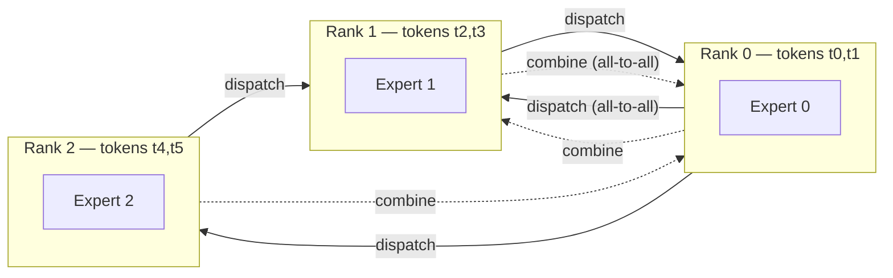

# Concept - Expert Parallelism

> **One-paragraph hook:** A [[Concept - Mixture of Experts Architecture|Mixture-of-Experts]] model with hundreds of experts can't replicate every expert on every GPU; the FFN parameters alone would dwarf HBM. Expert parallelism (EP) puts different experts on different devices and routes each token to wherever its chosen experts live. That turns MoE training from a compute problem into a network problem. In an EP-sharded MoE layer the dominant cost is the all-to-all collective that moves tokens there and back, and the expert matmuls come second.

## The mechanism

Dense-model parallelism shards weights or activations that every rank needs identically. EP shards the *experts themselves*, so each rank computes the FFN only for the experts it hosts. Every MoE layer then runs two all-to-all collectives per forward pass, plus their transposes in backward:

1. **Dispatch**: each rank's tokens go (per the top-$k$ router) to the ranks hosting their assigned experts. This is a real all-to-all. Every rank may send a different-sized chunk of tokens to every other rank, unlike an all-reduce, where every rank sends and receives the same volume.
2. **Combine**: once the local expert FFN has its output, results travel back to the token's originating rank (and, for top-$k>1$, get weighted-summed across the $k$ experts).

Communication volume per layer scales as $\text{tokens} \times \text{hidden} \times k$: proportional to how many tokens are routed and how many experts each token visits, independent of total expert count. All-to-all dominates because it behaves differently from all-reduce. An all-reduce's cost is largely insensitive to topology once bandwidth is saturated. All-to-all is **latency-sensitive** (many small messages, one per destination rank) and very sensitive to whether destinations are intra-node (NVLink) or cross-node ([[Concept - GPU Interconnects (NVLink, InfiniBand, RoCE)|InfiniBand]]).

Cross-node all-to-all is the dominant overhead in large-scale MoE training. [[Breakdown - DeepSeek-V3 Training|DeepSeek-V3]] caps it with **node-limited routing**: each token's chosen experts may span at most $M$ nodes, which bounds the all-to-all's worst-case fan-out whatever the total expert count. DeepSeek pairs this with **DualPipe** overlap and custom communication kernels tuned to its specific InfiniBand topology.

Load imbalance becomes a systems problem as well as a quality problem. The rank hosting an overloaded expert receives an outsized share of the dispatch all-to-all. Since all-to-all is a collective *barrier*, every other rank waits for that one to finish, so a single straggler expert stalls the whole layer. [[Concept - MoE Training and Load Balancing|Load-balancing losses]] are therefore more than an optimization nicety: routing imbalance costs wall-clock time directly, which ties the loss function to systems throughput in a way dense training never has to think about.

## In practice

EP is orthogonal to the other parallelism axes. It's typically composed as $\text{EP} \times \text{DP}$ over the expert dimension, with TP/PP layered on top for the non-expert parts of the model (attention, shared experts); see [[Pattern - 3D Parallelism Composition]]. Dropless expert execution uses **grouped GEMM** (MegaBlocks, Gale et al. 2022) in place of a fixed-capacity buffer. That avoids the token-dropping tradeoff and costs you variable-shaped matmuls.

DeepSeek-V3's 671B-total/37B-active MoE (1 shared expert + top-8-of-256 routed) runs EP across a large multi-node GPU pool. Even after node-limited routing and kernel tuning, all-to-all eats a meaningful fraction of step time; it's the largest systems-engineering cost specific to training MoE at that scale.

Always schedule the all-to-all to overlap with local expert GEMM compute: dispatch tokens for layer $l{+}1$ while layer $l$'s experts are still computing. Frameworks that run it as a blocking round-trip leave substantial MFU on the table from EP overhead alone.

## Failure modes

- **All-to-all hangs or deadlocks.** A rank that never gets its expected message stalls the whole collective indefinitely. The cause is often a routing-logic bug that sends zero tokens to an expert, or a capacity-factor edge case. You'll see a job that hangs with no error instead of crashing. To tell it apart from a real network fault, check whether *every* rank is idle or one rank is spinning.
- **Straggler stalls from load imbalance.** Intermittent step-time spikes that correlate with batches routing heavily toward a few experts. Tighten the load-balance loss coefficient or switch to an aux-loss-free balancing scheme.
- **Silent token dropping under capacity limits.** With a fixed capacity factor, overflow tokens skip their expert and pass through the residual unchanged. Nothing errors; quality on those tokens just degrades, and you'll miss it unless you log the drop rate.
- **EP+PP scheduling interactions.** Combining expert and pipeline parallelism adds synchronization points between the pipeline's microbatch schedule and the all-to-all's barrier semantics. A naive combination can serialize work that should overlap.
- **Fabric-specific NCCL all-to-all tuning.** Default NCCL all-to-all algorithms aren't necessarily tuned for a given InfiniBand/RoCE topology, and untuned collective parameters can leave 2x or more all-to-all bandwidth on the table versus a topology-aware configuration.

## The non-obvious

All-to-all cost depends mostly on how many nodes a token's routed experts are spread across, and much less on the *total* number of experts in the model. That's why node-limited routing pays off so well. It leaves total compute and total parameters untouched and only constrains the *routing decision* so dispatch traffic stays topologically local, turning an unbounded cross-cluster fan-out into a bounded intra-group one. People who scale expert count without revisiting the routing topology constraint routinely find MoE step time dominated by network, not FLOPs, which is the opposite of what dense-model training teaches you to expect.

## Connections
- [[Concept - MoE Training and Load Balancing]] — the loss-function side of the same imbalance problem that manifests as EP stragglers on the systems side.
- [[Concept - Mixture of Experts Architecture]] — the architecture EP distributes; routing top-$k$ and expert count set the all-to-all's shape.
- [[Breakdown - DeepSeek-V3 Training]] — the production system that pushed node-limited routing and DualPipe overlap to make EP at 671B-total scale tractable.
- [[Concept - Tensor and Pipeline Parallelism]] — the parallelism dimensions EP composes with for the non-expert portions of an MoE model.
- [[Reference - Parallelism Strategies]] — places EP's all-to-all comm pattern alongside DP/TP/PP/SP/CP's collectives in one lookup table.
- [[Concept - All-Reduce and Collective Operations]] — the collective-communication primitives (all-to-all included) that EP's dispatch/combine steps are built from.
- [[Pattern - 3D Parallelism Composition]] — how EP slots into a full device-mesh layout alongside DP, TP, PP, and CP.
- [[Concept - GPU Interconnects (NVLink, InfiniBand, RoCE)]] — the fabric whose topology directly determines whether all-to-all is cheap (intra-node) or the dominant cost (cross-node).

## Sources
- Lepikhin et al. (2020) — "GShard: Scaling Giant Models with Conditional Computation and Automatic Sharding" — early large-scale expert-parallel MoE training and dispatch/combine formulation.
- Gale et al. (2022) — "MegaBlocks: Efficient Sparse Training with Mixture-of-Experts" — grouped-GEMM dropless expert execution avoiding fixed-capacity token dropping.
- DeepSeek-AI (2024) — DeepSeek-V3 technical report — node-limited routing, DualPipe overlap, and custom communication kernels for EP at 671B-total/37B-active scale.
