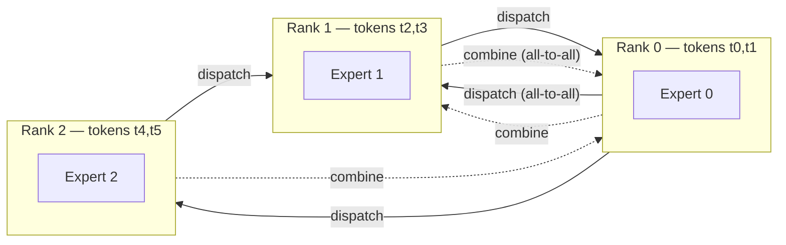

# Concept - Expert Parallelism

> **One-paragraph hook:** A [[Concept - Mixture of Experts Architecture|Mixture-of-Experts]] model with hundreds of experts can't replicate every expert on every GPU — the FFN parameters alone would dwarf HBM. Expert parallelism (EP) instead places different experts on different devices and routes each token to wherever its chosen experts live, which turns MoE training from a compute problem into a network problem: the dominant cost of an EP-sharded MoE layer isn't the expert matmuls, it's the all-to-all collective that gets tokens there and back.

## The mechanism

In a dense model, parallelism shards weights or activations that every rank needs identically. EP is different: it shards the *experts themselves*, so each rank only computes the FFN for the experts it hosts. Every MoE layer therefore executes two all-to-all collectives per forward pass (and their transposes in backward):

1. **Dispatch**: each rank's tokens are routed (per the top-$k$ router) to the ranks hosting their assigned experts. This is a genuine all-to-all — every rank potentially sends a different-sized chunk of tokens to every other rank, unlike an all-reduce where every rank sends/receives the same volume.
2. **Combine**: after the local expert FFN computes its output, results are routed back to the token's originating rank (and, for top-$k>1$, weighted-summed across the $k$ experts).

Communication volume per layer scales as $\text{tokens} \times \text{hidden} \times k$ — proportional to how many tokens are routed and to how many experts each token visits, independent of the total expert count. This is why all-to-all, not the expert compute itself, dominates: unlike an all-reduce whose cost is largely insensitive to topology once bandwidth is saturated, all-to-all is both **latency-sensitive** (many small messages, one per destination rank) and acutely sensitive to whether the destinations are intra-node (NVLink) or cross-node ([[Concept - GPU Interconnects (NVLink, InfiniBand, RoCE)|InfiniBand]]). Cross-node all-to-all is the dominant overhead in large-scale MoE training, which is why [[Breakdown - DeepSeek-V3 Training|DeepSeek-V3]] caps it with **node-limited routing**: constraining each token's chosen experts to span at most $M$ nodes bounds the worst-case fan-out of the all-to-all regardless of total expert count, and DeepSeek pairs this with **DualPipe** overlap and custom communication kernels tuned to the exact InfiniBand topology.

**Load imbalance turns into a systems problem, not just a quality problem.** An overloaded expert means the rank hosting it receives a disproportionate share of the dispatch all-to-all, and because all-to-all is a collective *barrier*, every other rank stalls waiting for that one rank to finish — a single straggler expert stalls the entire layer. This is why [[Concept - MoE Training and Load Balancing|load-balancing losses]] aren't purely an optimization nicety for MoE: routing imbalance directly costs wall-clock training time, coupling the loss function to systems throughput in a way dense-model training never has to reason about.

## In practice

EP is orthogonal to the other parallelism axes and is typically composed as $\text{EP} \times \text{DP}$ over the expert dimension, with TP/PP layered on top for the non-expert (attention, shared-expert) parts of the model — see [[Pattern - 3D Parallelism Composition]]. Dropless expert execution uses **grouped GEMM** (MegaBlocks, Gale et al. 2022) rather than a fixed-capacity buffer, avoiding the token-dropping tradeoff at the cost of variable-shaped matmuls. DeepSeek-V3's 671B-total/37B-active MoE (1 shared expert + top-8-of-256 routed) runs EP across a large multi-node GPU pool, with all-to-all consuming a meaningful fraction of total step time even after node-limited routing and kernel tuning — it is the single largest systems-engineering cost specific to training MoE at that scale. The all-to-all should always be scheduled to overlap with the local expert GEMM compute (dispatch tokens for layer $l{+}1$ while still computing layer $l$'s experts) rather than executed as a blocking round-trip; frameworks that don't do this leave substantial MFU on the table purely from EP overhead.

## Failure modes

- **All-to-all hangs or deadlocks**: a rank that never receives its expected message (often from a routing-logic bug sending zero tokens to an expert, or a capacity-factor edge case) stalls the whole collective indefinitely — detected by a training job that hangs with no error rather than crashing, distinguishable from a genuine network fault by checking whether *every* rank is idle versus one rank spinning.
- **Straggler stalls from load imbalance**: intermittent step-time spikes correlated with specific data batches that route heavily toward a few experts; fix is tightening the load-balance loss coefficient or switching to an aux-loss-free balancing scheme.
- **Silent token dropping under capacity limits**: with a fixed capacity factor, overflow tokens skip their expert and pass through the residual unchanged — this doesn't error, it just quietly degrades quality on the affected tokens, and is easy to miss without explicitly logging the drop rate.
- **EP+PP scheduling interactions**: combining expert parallelism with pipeline parallelism creates extra synchronization points between the pipeline's microbatch schedule and the all-to-all's barrier semantics, and a naive combination can serialize what should be overlapped work.
- **NCCL all-to-all tuning specific to the fabric**: default NCCL all-to-all algorithms aren't necessarily tuned for a given InfiniBand/RoCE topology, and untuned collective parameters can leave 2x or more all-to-all bandwidth on the table versus a topology-aware configuration.

## The non-obvious

The all-to-all's cost is not primarily a function of the *total* number of experts in the model — it's a function of how many nodes a token's routed experts are spread across. This is precisely why node-limited routing is such high-leverage: it doesn't reduce total compute or total parameters at all, it just constrains the *routing decision* to keep dispatch traffic topologically local, converting an unbounded cross-cluster fan-out into a bounded intra-group one. Practitioners who scale expert count without revisiting the routing topology constraint routinely discover that MoE step time is dominated by network, not FLOPs — the opposite of the intuition dense-model training builds.

## Connections
- [[Concept - MoE Training and Load Balancing]] — the loss-function side of the same imbalance problem that manifests as EP stragglers on the systems side.
- [[Concept - Mixture of Experts Architecture]] — the architecture EP distributes; routing top-$k$ and expert count set the all-to-all's shape.
- [[Breakdown - DeepSeek-V3 Training]] — the production system that pushed node-limited routing and DualPipe overlap to make EP at 671B-total scale tractable.
- [[Concept - Tensor and Pipeline Parallelism]] — the parallelism dimensions EP composes with for the non-expert portions of an MoE model.
- [[Reference - Parallelism Strategies]] — places EP's all-to-all comm pattern alongside DP/TP/PP/SP/CP's collectives in one lookup table.
- [[Concept - All-Reduce and Collective Operations]] — the collective-communication primitives (all-to-all included) that EP's dispatch/combine steps are built from.
- [[Pattern - 3D Parallelism Composition]] — how EP slots into a full device-mesh layout alongside DP, TP, PP, and CP.
- [[Concept - GPU Interconnects (NVLink, InfiniBand, RoCE)]] — the fabric whose topology directly determines whether all-to-all is cheap (intra-node) or the dominant cost (cross-node).

## Sources
- Lepikhin et al. (2020) — "GShard: Scaling Giant Models with Conditional Computation and Automatic Sharding" — early large-scale expert-parallel MoE training and dispatch/combine formulation.
- Gale et al. (2022) — "MegaBlocks: Efficient Sparse Training with Mixture-of-Experts" — grouped-GEMM dropless expert execution avoiding fixed-capacity token dropping.
- DeepSeek-AI (2024) — DeepSeek-V3 technical report — node-limited routing, DualPipe overlap, and custom communication kernels for EP at 671B-total/37B-active scale.
