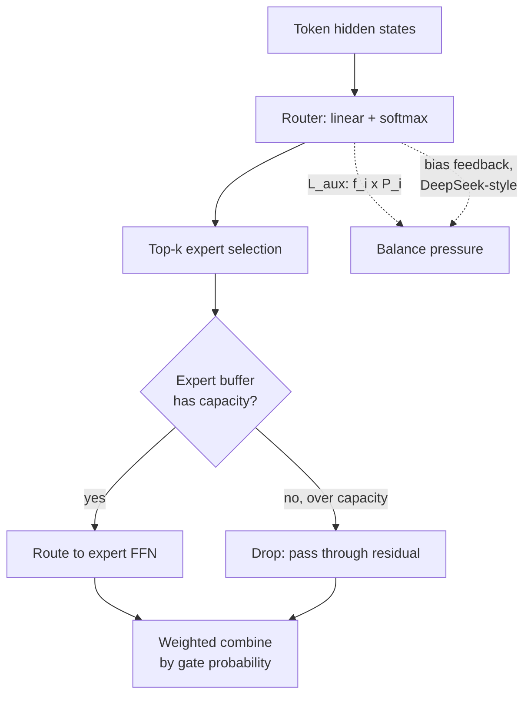

# Concept - MoE Training and Load Balancing

> **One-paragraph hook:** A [[Concept - Mixture of Experts Architecture]] layer only delivers its compute-for-parameters trade if tokens spread across experts. Left alone, the router collapses onto a handful of favorites within the first few hundred steps, and the rest of the network's parameters sit untrained. Everything in this note fights that one failure mode, from a 2020-era auxiliary loss to DeepSeek's 2024 trick of balancing load without touching the loss function at all.

## The mechanism

**Top-k routing** (GShard, Lepikhin et al., 2020; Switch Transformer, Fedus et al., 2021) sends each token through a learned router, typically a single linear layer over the hidden state softmaxed over experts, and dispatches it to its top-$k$ scoring experts ($k{=}1$ for Switch, $k{=}2$ for GShard and Mixtral, $k{=}8$ for DeepSeek-V3). Trained by gradient descent alone, this router is unstable in a specific way. An expert that's slightly ahead early gets routed more tokens, which improves it further relative to the others, which routes it even more tokens. That rich-get-richer loop collapses the router onto a small subset of experts while the rest go untrained.

The classic fix is an **auxiliary load-balance loss**. Switch Transformer adds this term to the LM loss:

$$L_{aux} = \alpha \cdot N \sum_{i=1}^{N} f_i \cdot P_i$$

Here $N$ is the number of experts, $f_i$ is the fraction of tokens in the batch actually routed to expert $i$, $P_i$ is the router's mean softmax probability on expert $i$ across the batch, and $\alpha \approx 0.01$. $f_i$ is a hard, non-differentiable routing decision, so gradient flows through $P_i$. The loss is minimized when both are uniform ($1/N$), i.e. balanced routing. A separate **router z-loss** penalizes large router logits directly, for numerical stability. An unconstrained router can push its logits to extreme magnitudes while staying balanced, which then destabilizes the softmax. It's one instance of the techniques in [[Concept - z-loss and Logit Soft-Capping]].

The auxiliary loss works, but it's a second objective competing with the language-modeling loss for the same gradient. Set $\alpha$ too high and you measurably hurt LM loss in exchange for balance; too low and the collapse comes back. **Aux-loss-free balancing** (DeepSeek-V2/V3, 2024) drops the loss term. It adds a per-expert bias to the routing logits, used only for top-k selection and not the combine weights, and adjusts that bias with a simple feedback controller outside the backprop graph: overloaded experts' bias goes down, underloaded experts' goes up. DeepSeek reports strictly lower LM loss at equal load balance compared to the auxiliary-loss approach, because the balancing pressure no longer fights the primary gradient.

A well-balanced router still doesn't guarantee each expert gets exactly its "fair share" in a given batch, and hardware needs a fixed buffer size per expert, set by the **capacity factor**. With $C$ tokens per batch and $N$ experts, each expert's buffer is:

$$\text{capacity} = \text{capacity\_factor} \times \frac{C}{N}, \quad \text{capacity\_factor} \in [1.0,\ 2.0]$$

Tokens that arrive after their target expert's buffer is full are **dropped**. They skip that expert and pass through the residual stream, losing that expert's contribution for that token with no signal. Dropless implementations (MegaBlocks) avoid this with grouped/block-sparse GEMM kernels that size compute to the actual, variable per-expert token count instead of a fixed buffer.

## In practice

[[Breakdown - DeepSeek-V3 Training]] (671B total parameters, 37B active per token) runs 256 routed experts plus 1 always-on shared expert with top-8 routing per token. Its experts are fine-grained (narrower than earlier MoE generations), and shared-expert isolation means common knowledge isn't re-learned redundantly across routed experts. **Upcycling** is the common way to bootstrap an MoE instead of training from scratch: copy a dense checkpoint's FFN weights into every expert slot, then let continued training and the router differentiate them. Moving tokens to their assigned experts across devices is [[Concept - Expert Parallelism]]'s job, built on [[Concept - All-Reduce and Collective Operations]]. Once experts live on different GPUs, imbalance is a systems problem as well as a quality one. Spreading experts (and their optimizer state) across devices at all follows from the memory pressure in [[Concept - Why Models Don't Fit on One GPU]]. Per-expert gradient statistics are also noisier than a dense layer's, which matters when tuning [[Concept - AdamW at Scale]]'s beta2 for an MoE run.

## Failure modes

- **Expert collapse.** Without balancing pressure the router concentrates on a handful of experts within the first few hundred steps. The rest never get meaningful gradient and stay near initialization. This commonly contributes to the pretraining instabilities in [[Concept - Training Stability and Loss Spikes]].
- **Router instability without z-loss.** Router logits drift to large magnitudes, saturating the softmax. Top-k selection becomes nearly deterministic and brittle to small input perturbations.
- **Silent capacity-drop quality loss.** Token dropping under a tight capacity factor doesn't error or warn. It degrades quality on whichever tokens hit an already-full expert, and that's easy to miss in aggregate loss curves.
- **Straggler experts stalling training.** Under expert parallelism, one overloaded expert's device makes every other rank wait at the all-to-all barrier. A load-balance failure turns into a cluster-wide throughput failure.
- **Aux-loss coefficient mistuning.** Too high hurts the primary LM loss; too low lets collapse creep back. Both look like a fine loss curve with bad balance underneath, so imbalance often isn't caught until someone plots a load histogram.

## The non-obvious

The auxiliary loss never really cost much compute. Its cost is a second gradient signal fighting the first on every training step for the life of the run. DeepSeek's bias trick looks like it does less (no loss term, no coefficient to tune) and actually does more. It moves load balancing out of the differentiable objective into a separate control loop, so nothing competes with the LM loss's gradient. The lesson applies beyond MoE. When you add an auxiliary objective to push training toward some property (balance, sparsity, calibration), ask whether a mechanism *outside* the loss could enforce it. It often can, and when it can it's usually cheaper in final quality.

## Connections
- [[Concept - Mixture of Experts Architecture]] — the architectural shape (routed FFN experts) this note's training dynamics operate on.
- [[Concept - Expert Parallelism]] — where a routing/capacity imbalance stops being a quality problem and becomes an all-to-all communication stall.
- [[Breakdown - DeepSeek-V3 Training]] — the production system that shipped aux-loss-free balancing and the 256-expert/top-8 configuration cited here.
- [[Concept - Training Stability and Loss Spikes]] — dead or exploding experts are one of the root causes of pretraining loss spikes at scale.
- [[Concept - z-loss and Logit Soft-Capping]] — the numerical-stability technique the router z-loss described here is one instance of.
- [[Concept - AdamW at Scale]] — the optimizer whose per-parameter state and beta2 tracking interact with an MoE's uneven per-expert gradient volume.
- [[Concept - All-Reduce and Collective Operations]] — the collective-communication substrate the dispatch/combine all-to-all is built from.
- [[Concept - Why Models Don't Fit on One GPU]] — the memory pressure that motivates spreading experts (and their optimizer state) across devices in the first place.

## Sources
- Lepikhin et al. (2020) — "GShard: Scaling Giant Models with Conditional Computation and Automatic Sharding" — top-k MoE routing at scale with load-balancing pressure.
- Fedus et al. (2021) — "Switch Transformers: Scaling to Trillion Parameter Models with Simple and Efficient Sparsity" — top-1 routing and the auxiliary load-balance loss formula.
- DeepSeek-AI (2024) — DeepSeek-V2/V3 technical reports — aux-loss-free bias-based load balancing and fine-grained expert design.
