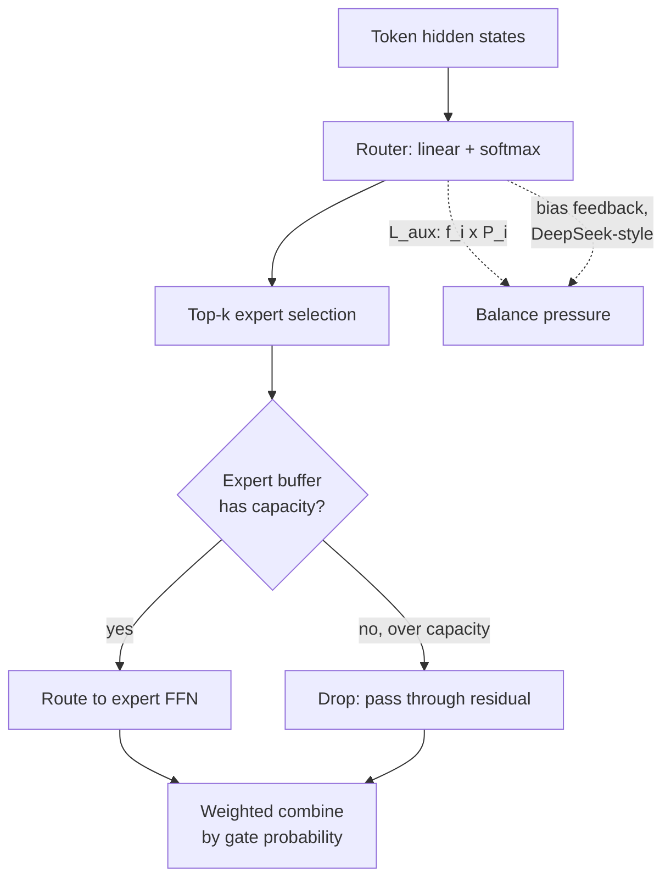

# Concept - MoE Training and Load Balancing

> **One-paragraph hook:** A [[Concept - Mixture of Experts Architecture]] layer only delivers its promised compute-for-parameters trade if tokens actually spread across experts — left alone, the router collapses onto a handful of favorites within the first few hundred steps, and the rest of the network's parameters sit untrained. Everything in this note exists to fight that one failure mode, from a 2020-era auxiliary loss to DeepSeek's 2024 trick of balancing load without touching the loss function at all.

## The mechanism

**Top-k routing** (GShard, Lepikhin et al., 2020; Switch Transformer, Fedus et al., 2021) sends each token through a learned router — typically a single linear layer over the hidden state, softmaxed over experts — and dispatches it to its top-$k$ scoring experts ($k{=}1$ for Switch, $k{=}2$ for GShard and Mixtral, $k{=}8$ for DeepSeek-V3). Left to gradient descent alone, this router is unstable in a specific way: an expert that happens to be slightly ahead early in training gets routed more tokens, which improves it further relative to the others, which routes it even more tokens — a rich-get-richer dynamic that collapses the router onto a small subset of experts while the rest go untrained.

The classic fix is an **auxiliary load-balance loss**. Switch Transformer's formulation adds a term to the LM loss:

$$L_{aux} = \alpha \cdot N \sum_{i=1}^{N} f_i \cdot P_i$$

where $N$ is the number of experts, $f_i$ is the fraction of tokens in the batch actually routed to expert $i$, $P_i$ is the router's mean softmax probability mass on expert $i$ across the batch, and $\alpha \approx 0.01$. Because $f_i$ is a hard (non-differentiable) routing decision, gradient flows through $P_i$; the loss is minimized when both are uniform ($1/N$), which is exactly balanced routing. A separate **router z-loss** penalizes large router logits directly, for numerical stability — an unconstrained router can drift its logits to extreme magnitudes even while staying balanced, which then destabilizes the softmax; it's one instance of the general family of techniques in [[Concept - z-loss and Logit Soft-Capping]].

The auxiliary loss works, but it's a second objective competing with the language-modeling loss for the same gradient — tune $\alpha$ too high and you measurably hurt LM loss trading it for balance; too low and the collapse comes back. **Aux-loss-free balancing** (DeepSeek-V2/V3, 2024) sidesteps this entirely: instead of an auxiliary loss term, add a per-expert bias to the routing logits (used only for top-k selection, not the combine weights) and adjust that bias with a simple feedback controller that nudges overloaded experts' bias down and underloaded experts' bias up, outside the backprop graph. DeepSeek reports strictly lower LM loss at equal load balance compared to the auxiliary-loss approach, because the balancing pressure no longer fights the primary gradient at all.

Even a well-balanced router doesn't guarantee every expert receives exactly its "fair share" in any given batch — hardware requires a fixed buffer size per expert, the **capacity factor**. With $C$ tokens per batch and $N$ experts, each expert's buffer is sized as:

$$\text{capacity} = \text{capacity\_factor} \times \frac{C}{N}, \quad \text{capacity\_factor} \in [1.0,\ 2.0]$$

Tokens that arrive after their target expert's buffer is full are **dropped** — they skip that expert and pass through via the residual stream instead, silently losing that expert's contribution for that token. Dropless implementations (MegaBlocks) avoid this entirely by using grouped/block-sparse GEMM kernels that size compute to the actual, variable per-expert token count rather than a fixed buffer.

## In practice

[[Breakdown - DeepSeek-V3 Training]] (671B total parameters, 37B active per token) runs 256 routed experts plus 1 always-on shared expert, top-8 routing per token, fine-grained (narrower) experts than earlier MoE generations, and shared-expert isolation so common knowledge doesn't have to be re-learned redundantly across routed experts. **Upcycling** — initializing an MoE's experts by copying a dense checkpoint's FFN weights into every slot, then letting the router differentiate them through continued training — is the common way to bootstrap an MoE rather than training from scratch. Moving tokens to their assigned experts across devices is the job of [[Concept - Expert Parallelism]], built on [[Concept - All-Reduce and Collective Operations]]; imbalance here isn't just a quality problem, it becomes a systems problem the moment experts live on different GPUs, and spreading experts (and their optimizer state) across devices at all is a direct consequence of the memory pressure in [[Concept - Why Models Don't Fit on One GPU]]. Per-expert gradient statistics are also noisier than a dense layer's, worth remembering when tuning [[Concept - AdamW at Scale]]'s beta2 for an MoE run.

## Failure modes

- **Expert collapse.** Without balancing pressure, the router concentrates on a handful of experts within the first few hundred steps; the rest never accumulate meaningful gradient and stay near their initialization — a common contributor to the broader pretraining instabilities cataloged in [[Concept - Training Stability and Loss Spikes]].
- **Router instability without z-loss.** Router logits drift to large magnitudes, saturating the softmax and making the top-k selection nearly deterministic and brittle to small input perturbations.
- **Silent capacity-drop quality loss.** Token dropping under a tight capacity factor doesn't error or warn — it just quietly degrades quality on the batches/tokens that happened to hit an already-full expert, making it easy to miss in aggregate loss curves.
- **Straggler experts stalling training.** In expert parallelism, one overloaded expert's device makes every other rank wait at the all-to-all barrier — a load-balance failure becomes a cluster-wide throughput failure, not just a quality one.
- **Aux-loss coefficient mistuning.** Too high hurts the primary LM loss; too low lets collapse creep back in — both failure directions look like a fine loss curve with quietly bad balance, so imbalance often isn't caught until a load histogram is actually plotted.

## The non-obvious

The auxiliary loss's real cost was never really the compute of computing it — it's that it is a second gradient signal permanently fighting the first one, on every single training step, for the life of the run. DeepSeek's aux-loss-free bias trick is non-obvious precisely because it looks like it's doing less (no loss term, no coefficient to tune) while actually doing more: it moves load balancing out of the differentiable objective entirely and into a separate control loop, so the LM loss's gradient is never distorted by a competing goal. The practitioner lesson generalizes past MoE: when an auxiliary objective is added to steer training toward a property (balance, sparsity, calibration), ask whether that property can instead be enforced by a mechanism *outside* the loss — it often can, and it's usually cheaper in final quality when it can.

## Connections
- [[Concept - Mixture of Experts Architecture]] — the architectural shape (routed FFN experts) this note's training dynamics operate on.
- [[Concept - Expert Parallelism]] — where a routing/capacity imbalance stops being a quality problem and becomes an all-to-all communication stall.
- [[Breakdown - DeepSeek-V3 Training]] — the production system that shipped aux-loss-free balancing and the 256-expert/top-8 configuration cited here.
- [[Concept - Training Stability and Loss Spikes]] — dead or exploding experts are one of the root causes of pretraining loss spikes at scale.
- [[Concept - z-loss and Logit Soft-Capping]] — the numerical-stability technique the router z-loss described here is one instance of.
- [[Concept - AdamW at Scale]] — the optimizer whose per-parameter state and beta2 tracking interact with an MoE's uneven per-expert gradient volume.
- [[Concept - All-Reduce and Collective Operations]] — the collective-communication substrate the dispatch/combine all-to-all is built from.
- [[Concept - Why Models Don't Fit on One GPU]] — the memory pressure that motivates spreading experts (and their optimizer state) across devices in the first place.

## Sources
- Lepikhin et al. (2020) — "GShard: Scaling Giant Models with Conditional Computation and Automatic Sharding" — top-k MoE routing at scale with load-balancing pressure.
- Fedus et al. (2021) — "Switch Transformers: Scaling to Trillion Parameter Models with Simple and Efficient Sparsity" — top-1 routing and the auxiliary load-balance loss formula.
- DeepSeek-AI (2024) — DeepSeek-V2/V3 technical reports — aux-loss-free bias-based load balancing and fine-grained expert design.
