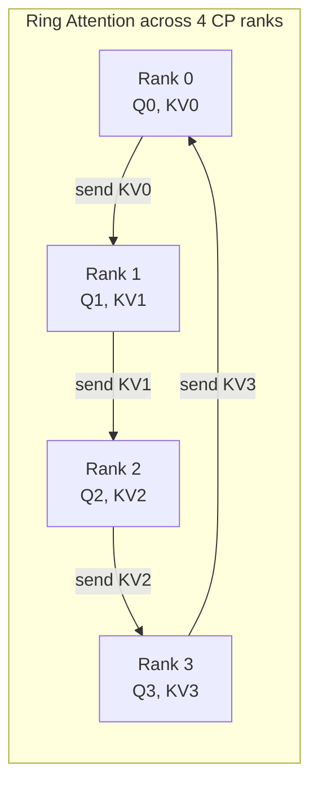

# Concept - Sequence and Context Parallelism

> **One-paragraph hook:** Tensor parallelism leaves the layernorm, dropout, and residual-add regions replicated on every rank — wasted activation memory that sequence parallelism reclaims essentially for free. Context parallelism solves a harder problem: training on sequences too long for any single GPU's activations to hold, by splitting the sequence itself across ranks and paying a communication tax to keep every query attending to every key. Both shard the same axis (sequence), but for different reasons and at different costs — conflating them is a common source of confused parallelism-layout decisions.

## The mechanism

**Sequence parallelism (SP)**, introduced alongside [[Concept - Tensor and Pipeline Parallelism|tensor parallelism]] in Megatron-LM (Korthikanti et al. 2022, "Reducing Activation Recomputation in Large Transformer Models"), targets the parts of a transformer block that TP *doesn't* split. TP shards the attention and MLP matmuls, but layernorm, dropout, and the residual connections operate elementwise and are cheap to replicate — except replication means every one of the TP-degree ranks stores the *full* activation tensor for those regions, not a $1/\text{TP}$ shard. SP fixes this by sharding those regions along the sequence dimension instead. Because the transition between TP-sharded and SP-sharded regions already needs a communication op, SP just changes what that op does: TP's forward all-reduce becomes an **all-gather** (SP-shard → TP-replicated) and its backward all-reduce becomes a **reduce-scatter** (TP-replicated → SP-shard). The total communication volume is unchanged from plain TP — SP is activation-memory reduction with **zero added communication**, which is the detail that makes it a default rather than a tradeoff.

**Context parallelism (CP)** solves a different problem: a sequence long enough that even a single rank's *share* of activations under TP/PP is too large, typically because attention's $O(\text{seq}^2)$ term (even tamed to $O(\text{seq})$ memory by [[Deep Dive - FlashAttention|FlashAttention]]'s block-wise recomputation) still scales linearly with sequence length per layer. CP shards the sequence itself across ranks. The complication: attention is not elementwise — every query position must see every key position, so a rank holding query-shard $i$ needs access to the KV shards on every other rank. **Ring attention** (Liu et al. 2023, "Ring Attention with Blockwise Transformers for Near-Infinite Context") solves this by arranging CP ranks in a logical ring: each rank computes attention against its local KV block, then passes that KV block to its neighbor while receiving the previous rank's block, repeating until every rank has seen every KV block. Because each step is itself a block-wise FlashAttention computation, the KV-passing communication overlaps with the block's attention compute — the same online-softmax rescaling FlashAttention uses to combine partial results across blocks is reused to combine partial results across ring steps. An alternative implementation just all-gathers the full KV sequence onto every rank up front, trading more peak memory for a simpler, non-overlapped comm pattern.

**Causal load balancing.** Under a causal mask, a naive contiguous sequence split assigns early tokens (which attend to few keys) to early ranks and late tokens (which attend to nearly the whole sequence) to late ranks — the last rank does far more attention FLOPs than the first, stalling the ring on the slowest participant. The fix is a **zigzag or striped** token-to-rank assignment: instead of rank $i$ owning contiguous tokens $[iL, (i+1)L)$, it owns an interleaved mix of early and late tokens so every rank's causal workload is roughly equal.

## In practice

CP composes with FlashAttention (both use block-wise online-softmax, so ring attention is essentially "FlashAttention with the KV blocks arriving over the network instead of from HBM") and with TP/SP simultaneously, via a multi-dimensional device mesh — but the mesh *ordering* matters: CP groups should sit on the fastest available link after TP, since ring communication happens every layer, every step. CP degree multiplies the trainable context length; combined with activation checkpointing, production runs push context from the 8k–32k range achievable on a single rank's activation budget toward 100k–1M tokens (e.g., the context lengths targeted by Ring Attention–style training for long-context frontier models). SP, by contrast, is essentially free to enable whenever TP is in use — Megatron-Core, TorchTitan, and DeepSpeed all turn it on by default alongside TP because there's no comm-volume cost to declining the activation-memory savings.

RoPE position bookkeeping needs explicit handling under CP: each rank only holds a sequence shard, so [[Concept - Rotary Position Embeddings (RoPE)|RoPE]]'s rotation angles must be computed from *global* sequence position, not local shard-relative position — a bug here silently corrupts positional information without crashing anything, and shows up only as unexplained quality loss on long-context evals.

## Failure modes

- **Unoverlapped ring communication becomes the bottleneck**: if the KV send/receive isn't scheduled to hide behind the current block's attention compute, CP degree scales step time roughly linearly with ring size instead of staying near-flat — profile per-rank idle time to catch this, not just aggregate throughput.
- **Causal load imbalance**: without zigzag/striped assignment, the last rank in a causal ring becomes the straggler every single step; symptom is a fixed per-step time gap between rank-0 and rank-(N-1) completion in the profiler trace.
- **Online-softmax rescaling bugs across ring steps**: an off-by-one in the running max/sum accumulation across ring iterations produces numerically-wrong-but-not-NaN attention output — the classic silent-correctness bug, caught only by comparing loss against a known-good non-CP run at matched hyperparameters.
- **RoPE global-position mismatch**: as above — plausible-looking loss curves with degraded long-context capability that only shows up in downstream eval, not in the training loss itself.

## The non-obvious

Practitioners default to treating "shard the sequence" as one decision, but SP and CP are opposite in their cost structure: SP is a strictly-free memory win you should always take when using TP, while CP is a genuine memory-for-communication trade you should only pay for when activation memory — not compute or parameter memory — is what's blocking a longer context. Conflating them leads to two symptomatic mistakes: turning SP off because "sequence parallelism sounds like it should cost something" (leaving free memory on the table), or reaching for CP to fix an OOM that's actually caused by unsharded optimizer state or a missing [[Concept - Fully Sharded Data Parallel (FSDP)|FSDP]]/ZeRO configuration (paying ring-communication cost for a problem CP doesn't solve).

## Connections
- [[Concept - Tensor and Pipeline Parallelism]] — SP is TP's direct companion, converting TP's replicated regions into sharded ones at no added communication cost.
- [[Deep Dive - FlashAttention]] — ring attention's block-wise combine step is FlashAttention's online-softmax algorithm extended across ranks instead of across SRAM tiles.
- [[Concept - Attention Mechanism]] — the reason CP is hard at all: every query must see every key, unlike the elementwise ops SP shards.
- [[Reference - Parallelism Strategies]] — places SP and CP in the full comm/memory/degree matrix alongside DP, TP, PP, and EP.
- [[Pattern - 3D Parallelism Composition]] — where CP and SP get slotted into the device-mesh ordering alongside the other parallelism dimensions.
- [[Concept - Rotary Position Embeddings (RoPE)]] — the positional-encoding bookkeeping that CP shards must get right to avoid silent corruption.
- [[Concept - Ring Attention and Extreme Context]] — the extreme-context-length framing of the same ring-communication mechanism, at the frontier of trainable sequence length.
- [[Concept - GPU Interconnects (NVLink, InfiniBand, RoCE)]] — the fabric that determines whether ring communication overlaps cleanly or becomes the bottleneck.

## Sources
- Korthikanti et al. (2022) — "Reducing Activation Recomputation in Large Transformer Models" — introduces Megatron sequence parallelism and selective activation recomputation.
- Liu et al. (2023) — "Ring Attention with Blockwise Transformers for Near-Infinite Context" — the ring-communication algorithm for distributed causal attention.
- Dao et al. (2022) — "FlashAttention: Fast and Memory-Efficient Exact Attention with IO-Awareness" — the block-wise online-softmax mechanism CP reuses across ranks.
