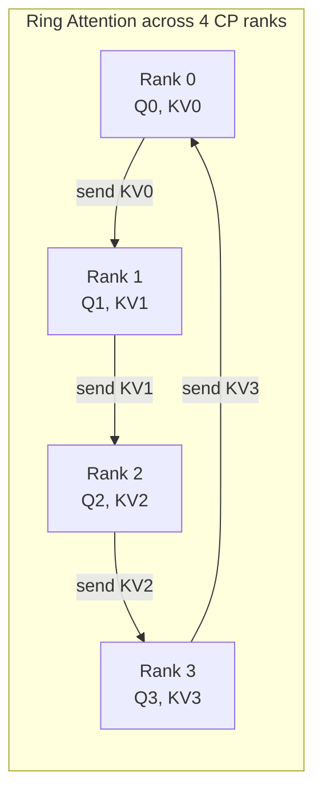

# Concept - Sequence and Context Parallelism

> **One-paragraph hook:** Tensor parallelism leaves the layernorm, dropout and residual-add regions replicated on every rank. That's wasted activation memory, and sequence parallelism gets it back essentially for free. Context parallelism solves a harder problem: sequences too long for any single GPU's activations to hold. It splits the sequence itself across ranks and pays a communication tax so every query still attends to every key. Both shard the same axis (sequence), for different reasons and at different costs, and mixing them up is a common source of confused parallelism-layout decisions.

## The mechanism

**Sequence parallelism (SP)** came in alongside [[Concept - Tensor and Pipeline Parallelism|tensor parallelism]] in Megatron-LM (Korthikanti et al. 2022, "Reducing Activation Recomputation in Large Transformer Models"). It targets the parts of a transformer block that TP *doesn't* split. TP shards the attention and MLP matmuls. Layernorm, dropout and the residual connections are elementwise and cheap to replicate, but replication means each of the TP-degree ranks stores the *full* activation tensor for those regions instead of a $1/\text{TP}$ shard. SP shards those regions along the sequence dimension. The transition between TP-sharded and SP-sharded regions already needs a communication op, so SP only changes what that op does: TP's forward all-reduce becomes an **all-gather** (SP-shard → TP-replicated) and its backward all-reduce becomes a **reduce-scatter** (TP-replicated → SP-shard). Total communication volume is the same as plain TP. You get activation-memory reduction with **zero added communication**, so SP is a default and not a tradeoff.

**Context parallelism (CP)** is for a sequence so long that even one rank's *share* of activations under TP/PP is too large. The usual culprit is attention's $O(\text{seq}^2)$ term: even after [[Deep Dive - FlashAttention|FlashAttention]]'s block-wise recomputation tames it to $O(\text{seq})$ memory, it still grows linearly with sequence length per layer. CP shards the sequence itself across ranks. The catch is that attention isn't elementwise. Every query position must see every key position, so a rank holding query-shard $i$ needs the KV shards from every other rank.

**Ring attention** (Liu et al. 2023, "Ring Attention with Blockwise Transformers for Near-Infinite Context") handles this by putting CP ranks in a logical ring. Each rank computes attention against its local KV block, passes that block to its neighbor while receiving the previous rank's, and repeats until every rank has seen every KV block. Each step is a block-wise FlashAttention computation, so the KV passing overlaps with the block's attention compute. The online-softmax rescaling FlashAttention uses to combine partial results across blocks is reused to combine them across ring steps. The alternative implementation all-gathers the full KV sequence onto every rank up front: more peak memory, simpler non-overlapped comms.

**Causal load balancing.** With a causal mask, a naive contiguous split gives early tokens (which attend to few keys) to early ranks and late tokens (which attend to nearly the whole sequence) to late ranks. The last rank does far more attention FLOPs than the first, and the ring stalls on it. The fix is a **zigzag or striped** token-to-rank assignment. Rank $i$ no longer owns contiguous tokens $[iL, (i+1)L)$; it owns an interleaved mix of early and late tokens, so every rank's causal workload is roughly equal.

## In practice

CP composes with FlashAttention, since both use block-wise online softmax. Ring attention is essentially "FlashAttention with the KV blocks arriving over the network instead of from HBM". It also composes with TP/SP at the same time via a multi-dimensional device mesh, but mesh *ordering* matters: CP groups should sit on the fastest available link after TP, because ring communication happens every layer, every step. CP degree multiplies trainable context length. With activation checkpointing added, production runs push context from the 8k–32k range a single rank's activation budget allows toward 100k–1M tokens (e.g., the context lengths targeted by Ring Attention–style training for long-context frontier models). SP is essentially free whenever TP is on. Megatron-Core, TorchTitan and DeepSpeed all enable it by default alongside TP, since declining the activation-memory savings buys you nothing on comm volume.

RoPE position bookkeeping needs explicit handling under CP. Each rank holds only a sequence shard, so [[Concept - Rotary Position Embeddings (RoPE)|RoPE]]'s rotation angles must come from *global* sequence position, not shard-relative position. Get this wrong and positional information is silently corrupted. Nothing crashes; you just see unexplained quality loss on long-context evals.

## Failure modes

- **Unoverlapped ring communication becomes the bottleneck.** If the KV send/receive isn't scheduled behind the current block's attention compute, step time grows roughly linearly with ring size instead of staying near-flat. Profile per-rank idle time to catch it; aggregate throughput alone won't show it.
- **Causal load imbalance.** Without zigzag/striped assignment, the last rank in a causal ring is the straggler every single step. In the profiler trace it shows up as a fixed per-step gap between rank-0 and rank-(N-1) completion.
- **Online-softmax rescaling bugs across ring steps.** An off-by-one in the running max/sum accumulation across ring iterations gives attention output that's numerically wrong but not NaN. That's the classic silent-correctness bug, and you only catch it by comparing loss against a known-good non-CP run at matched hyperparameters.
- **RoPE global-position mismatch.** As above: loss curves look plausible, long-context capability degrades, and it only shows up in downstream eval, never in training loss.

## The non-obvious

People tend to treat "shard the sequence" as one decision. SP and CP have opposite cost structures. SP is a strictly free memory win you should always take with TP. CP trades memory for communication, and you should only pay for it when activation memory (not compute or parameter memory) is what's blocking a longer context. Mixing them up produces two typical mistakes. One is turning SP off because "sequence parallelism sounds like it should cost something", which leaves free memory on the table. The other is reaching for CP to fix an OOM actually caused by unsharded optimizer state or a missing [[Concept - Fully Sharded Data Parallel (FSDP)|FSDP]]/ZeRO configuration, paying ring-communication cost for a problem CP doesn't solve.

## Connections
- [[Concept - Tensor and Pipeline Parallelism]] — SP is TP's direct companion, converting TP's replicated regions into sharded ones at no added communication cost.
- [[Deep Dive - FlashAttention]] — ring attention's block-wise combine step is FlashAttention's online-softmax algorithm extended across ranks instead of across SRAM tiles.
- [[Concept - Attention Mechanism]] — the reason CP is hard at all: every query must see every key, unlike the elementwise ops SP shards.
- [[Reference - Parallelism Strategies]] — places SP and CP in the full comm/memory/degree matrix alongside DP, TP, PP, and EP.
- [[Pattern - 3D Parallelism Composition]] — where CP and SP get slotted into the device-mesh ordering alongside the other parallelism dimensions.
- [[Concept - Rotary Position Embeddings (RoPE)]] — the positional-encoding bookkeeping that CP shards must get right to avoid silent corruption.
- [[Concept - Ring Attention and Extreme Context]] — the extreme-context-length framing of the same ring-communication mechanism, at the frontier of trainable sequence length.
- [[Concept - GPU Interconnects (NVLink, InfiniBand, RoCE)]] — the fabric that determines whether ring communication overlaps cleanly or becomes the bottleneck.

## Sources
- Korthikanti et al. (2022) — "Reducing Activation Recomputation in Large Transformer Models" — introduces Megatron sequence parallelism and selective activation recomputation.
- Liu et al. (2023) — "Ring Attention with Blockwise Transformers for Near-Infinite Context" — the ring-communication algorithm for distributed causal attention.
- Dao et al. (2022) — "FlashAttention: Fast and Memory-Efficient Exact Attention with IO-Awareness" — the block-wise online-softmax mechanism CP reuses across ranks.
