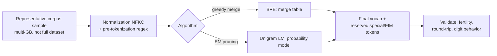

# Concept - Tokenizer Training

> **One-paragraph hook:** The tokenizer is trained once, before pretraining starts, and then frozen for the model's entire life. Vocab size, digit handling and multilingual fertility are all locked in by a training run that takes minutes, for a model that will take months. Getting it wrong doesn't crash anything. It just taxes every downstream capability for the model's lifetime.

## The mechanism

Two families of subword algorithms dominate: greedy [[Concept - Byte-Pair Encoding]], and the **unigram language model** approach used by SentencePiece (Kudo, 2018). BPE builds a vocabulary bottom-up by merging the most frequent adjacent pair. Unigram LM goes top-down. It starts from a large candidate subword set (e.g., all substrings above some frequency) and iteratively prunes the candidates that contribute least to corpus likelihood via an EM procedure, ending on a vocabulary that directly maximizes the corpus's segmentation likelihood instead of following a frequency-greedy heuristic. Because unigram LM is probabilistic, it supports **subword regularization**: sampling different valid segmentations of the same string during training as data augmentation. Greedy BPE can't do that natively.

Vocabulary size is a real engineering tradeoff, and bigger isn't automatically better:

- **Larger vocab → shorter sequences → cheaper compute per document** (fewer tokens to attend over and predict). But it **enlarges the embedding and unembedding matrices** by `vocab_size × hidden_dim` parameters each (often tied), and it **undertrains rare tokens**. A 256k-entry vocabulary spreads the same corpus over far more distinct symbols, so the tail of the vocabulary sees dramatically fewer training examples per token.
- Common operating points: **32k** (Llama-2), **128k** (GPT-4, Llama-3), **256k** (Gemma). A 128k-vocab x 4096-hidden embedding alone is roughly 512M parameters.

**Fertility**, tokens produced per word, is the metric that makes this tradeoff concrete. A tokenizer trained mostly on English under-segments (high fertility) on other languages and on code, because the merge/pruning statistics behind the vocabulary never saw those distributions in proportion. English-centric tokenizers commonly impose a 2-4x token tax on non-English text, which directly inflates cost and shrinks effective context for those users.

Several preprocessing decisions also get baked in permanently: **normalization** (typically NFKC), **byte fallback** (so any input is representable even outside the learned vocabulary), **pre-tokenization** rules and **digit handling**, which matters a lot for arithmetic. Llama splits digits into single-character tokens while GPT-4-family tokenizers group up to three digits per token, and that choice measurably changes multi-digit arithmetic behavior. Special and FIM sentinel token IDs (see [[Concept - Pretraining Objectives]]) must be reserved as vocabulary slots at training time. You can't append them afterward.

## In practice

Tokenizers are trained on a representative multi-gigabyte sample of the pretraining corpus, never the full multi-trillion-token dataset. The merge/EM procedure converges without that much data, and running it over everything would waste compute. [[Snippet - Training a BPE Tokenizer]] walks through the HuggingFace `tokenizers` recipe end to end, including reserving sentinel slots up front. Most frontier labs still ship BPE (via `tiktoken` or HF `tokenizers`) instead of SentencePiece's unigram LM, despite unigram's theoretically better fit to the data. Greedy BPE's determinism, tooling maturity and speed have outweighed unigram's likelihood-optimality advantage for large-scale production use as of 2026.

## Failure modes

- **Undertrained rare tokens.** Vocabulary entries that appear only a handful of times in the training sample get embeddings that never converge, producing the pathological outputs cataloged in [[Lore - Glitch Tokens]].
- **Post-hoc token addition.** Adding tokens after pretraining has started means resizing the embedding matrix and initializing new rows with no gradient history behind them. It's a common and avoidable mistake.
- **Digit-grouping arithmetic bugs.** Inconsistent or unexamined digit tokenization is a direct, well-documented contributor to poor multi-digit arithmetic.
- **Normalization mismatch.** If training-time normalization doesn't exactly match serving-time normalization, some inputs tokenize differently from anything the model saw in training. [[Gotchas - Tokenizers]] has the full inference-time catalog.

## The non-obvious

Vocab size is effectively **irreversible** once pretraining begins. The embedding matrix's row count is fixed, so resizing it later means retraining from scratch or accepting undertrained new rows. You can add training data or layers later via continued pretraining; there's no equivalent for vocabulary. Practitioners learn the corollary the hard way: a tokenizer bug caught after a multi-million-dollar pretraining run has started can't be fixed in config. You either live with the tax for the model's entire life or restart.

## Connections
- [[Concept - Byte-Pair Encoding]] — the greedy-merge algorithm this note contrasts with unigram LM and whose vocab-size tradeoffs this note resolves.
- [[Gotchas - Tokenizers]] — the inference-time pitfall catalog that stems directly from training-time tokenizer decisions.
- [[Lore - Glitch Tokens]] — the war story of undertrained vocabulary entries this note's failure modes predict.
- [[Concept - Data Mixtures]] — the corpus composition the tokenizer is trained to fit fertility to, which must match the pretraining mixture.
- [[Concept - Scaling Laws]] — vocab size and embedding parameters factor into the total parameter count that scaling laws budget.
- [[Snippet - Training a BPE Tokenizer]] — the runnable procedure for training the BPE variant of this note's mechanism.
- [[Concept - Pretraining Objectives]] — FIM and span-corruption sentinel tokens must be reserved during this training step, not after.
- [[Concept - Numeracy and Digit Tokenization]] — the deeper dive on exactly how digit-grouping choices made here propagate into arithmetic failures.

## Sources
- Kudo (2018) — "Subword Regularization: Improving Neural Network Translation Models with Multiple Subword Candidates" — the unigram LM tokenization algorithm and subword regularization.
- Kudo & Richardson (2018) — "SentencePiece: A Simple and Language Independent Subword Tokenizer and Detokenizer for Neural Text Processing" — the production implementation most unigram-LM tokenizers use.
