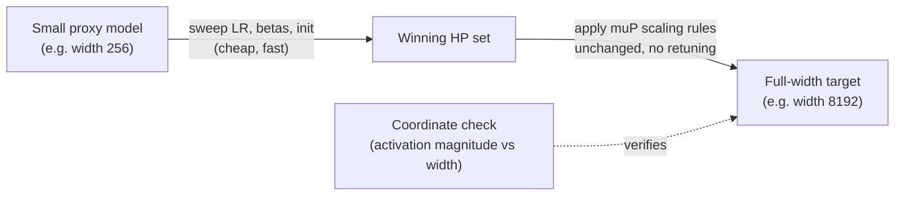

# Concept - muP and Hyperparameter Transfer

> **One-paragraph hook:** Under standard parametrization, a transformer's optimal learning rate moves every time you change its width. A 350M and a 35B model of the "same" architecture don't share a peak LR, so each new model size has traditionally needed its own expensive HP sweep. Maximal Update Parametrization (muP) is a specific set of init-variance and per-layer LR scaling rules that makes the *optimal* hyperparameters provably width-invariant. You tune them cheaply on a tiny proxy model and copy them, unchanged, onto a target hundreds of times larger.

## The mechanism

Standard parametrization (SP) means the usual $1/\sqrt{\text{fan\_in}}$ init with a single global LR. Under SP, as width $n \to \infty$, pre-activation and gradient magnitudes at different layers scale with $n$ in different, layer-type-dependent ways. Wide-enough SP networks drift toward the **NTK / lazy-training limit**: the *features* barely move during training (effectively only a linear readout on a fixed random feature map learns), and an LR small enough to keep the fastest-scaling layer from blowing up is far too small to move the slowest-scaling layer at a useful rate. So under SP the "right" LR keeps shrinking as models get wider.

muP (Yang & Hu 2021, "Tensor Programs V") uses the Tensor Programs framework to derive a different set of per-layer-type multipliers that keep every layer in the **maximal feature-learning limit**. In that regime each layer's activations *and* its per-step updates stay $\Theta(1)$ in coordinate magnitude as width grows, so features keep learning at every scale instead of collapsing into a kernel. The rules treat three layer classes differently:

- **Input/embedding layers**: init variance stays at the standard fan-in scale. Embeddings are the one place SP already behaves correctly as width scales.
- **Hidden layers** (attention QKVO and MLP matrices, i.e. anything whose fan-in and fan-out both grow with width): init variance and the per-layer LR multiplier are both scaled by fan-in factors relative to a fixed base width. Attention logits use **$1/d$ scaling instead of the usual $1/\sqrt{d}$**. The extra $1/\sqrt d$ compensates for Q and K entries being $\Theta(1)$ under muP init; they don't shrink with $d$ the way SP's justification for $1/\sqrt d$ implicitly assumes.
- **Output/unembedding layers**: final logits are scaled by $1/\text{width}$, which keeps the output distribution from collapsing or exploding as the residual stream widens.

The empirical test is the **coordinate check** (see [[Snippet - muP Coordinate Check]]). Train several widths of the same architecture (e.g. 128, 256, 512, 1024, 2048) for a handful of steps with identical muP-scaled hyperparameters, then plot mean absolute activation magnitude per layer against width. A correct implementation gives flat, overlapping curves across widths, both at init and after several optimizer steps, because feature magnitudes no longer depend on width. A curve that still trends with width means a missing or wrong multiplier in that layer.

## In practice

The payoff is **muTransfer**. Sweep learning rate, betas and init scale on a narrow proxy trained briefly (Yang et al. 2021 used a 40M-parameter proxy), then copy the winning hyperparameters onto the full-width target with zero retuning. They showed this reproduced near-optimal loss on a 6.7B target. A multi-million-dollar HP search at target scale becomes a search costing a small fraction of one full training run.

Public production users include Cerebras-GPT (Dey et al. 2023), which applied muP across its whole open model family, and MiniCPM (Hu et al. 2024), which paired muP-style transfer with a [[Concept - Learning Rate Schedules for Pretraining|WSD schedule]] so hyperparameter search and continued training were both cheap. Folklore, weakly sourced: the community widely believes that several frontier labs' "predictable scaling" method for picking pretraining hyperparameters without a full-scale trial run is muP or a close cousin. Nobody has confirmed this on the record for any specific frontier model.

Transferred LRs are reported stable across roughly 10-100x width ratios. **Width** transfer is the well-validated case. **Depth** transfer (depth-muP) is a newer, shakier extension with less agreement on the right multipliers, so don't assume a proxy that differs from the target in both width and depth will transfer as cleanly as a width-only proxy.

## Failure modes

- **Partial implementation is worse than none.** Apply the init-variance rules without the LR multipliers (or the reverse) and nothing errors. The model trains, and you wrongly believe you're at a good hyperparameter point. No crash will catch it; only the coordinate check will.
- **A coordinate check that looks fine early and diverges later.** Some scaling bugs appear only after several hundred steps, once accumulated momentum or the [[Concept - AdamW at Scale|AdamW]] second-moment estimate has warmed up. Check coordinates at several training steps as well as at init.
- **Weight decay doesn't muP-scale on its own.** Decoupled weight decay is a separate multiplicative pull on the weights, and the base muP rules don't derive how it interacts with the width-scaled LR. Think it through separately instead of copying it verbatim from the proxy.
- **Warmup length doesn't always transfer as cleanly as LR.** A warmup schedule tuned on a short proxy run may need re-checking at target scale even when the peak LR transfers correctly.

## The non-obvious

muP swaps hyperparameter-search compute for the risk of getting the engineering wrong, and that failure is unusually expensive to diagnose. Get one layer's multiplier wrong and there's no error. You get a large model that trains to a plausible loss curve with a suboptimal transferred LR, which looks like an unlucky large-scale run and not like an implementation bug. Skipping the coordinate check because "the loss curve looks fine" throws away the only cheap signal that would have caught it before the large-scale compute was spent.

## Connections
- [[Concept - Learning Rate Schedules for Pretraining]] — muP determines the peak LR a schedule then warms up to and decays from; without transfer, that peak has to be retuned at every new model size.
- [[Concept - Scaling Laws]] — Chinchilla-style laws implicitly assume near-optimal hyperparameters at every point on the scaling curve; muP is the mechanism that keeps that assumption cheap to satisfy.
- [[Snippet - muP Coordinate Check]] — the concrete diagnostic that verifies a muP implementation is actually width-invariant before trusting a transferred hyperparameter set.
- [[Concept - AdamW at Scale]] — muP's per-layer LR multipliers are layered directly on top of the AdamW update this note assumes as the base optimizer.
- [[Concept - Backpropagation]] — the gradient-flow mechanism muP is specifically engineered to keep width-invariant in magnitude at every layer.
- [[Reference - LLM Pretraining Hyperparameters]] — the concrete LR, init, and beta values a muP-derived hyperparameter set ultimately populates.
- [[Concept - RMSNorm and LayerNorm]] — normalization placement interacts with muP's width scaling and changes which layers need an explicit multiplier.
- [[Concept - The Hessian Spectrum in Deep Learning]] — the infinite-width feature-learning theory muP formalizes is directly tied to how curvature behaves as width grows.

## Sources
- Yang & Hu (2021) — "Tensor Programs V: Tuning Large Neural Networks via Zero-Shot Hyperparameter Transfer" — derives the muP scaling rules and demonstrates zero-shot LR transfer from a 40M proxy to a 6.7B target.
- Dey et al. (2023) — "Cerebras-GPT: Open Compute-Optimal Language Models Trained on the Cerebras Wafer-Scale Cluster" — a public model family trained with muP applied across the whole size range.
- Hu et al. (2024) — "MiniCPM: Unveiling the Potential of Small Language Models with Scalable Training Strategies" — pairs muP-style transfer with a WSD schedule in a public production recipe.
