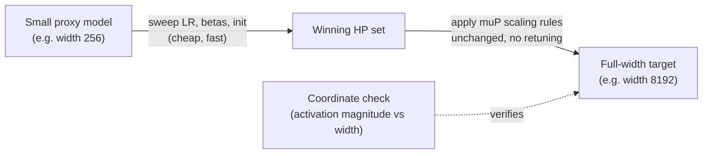

# Concept - muP and Hyperparameter Transfer

> **One-paragraph hook:** Under standard parametrization, the optimal learning rate for a transformer shifts every time you change its width — a 350M and a 35B model at the "same" architecture don't share a peak LR, so every new model size traditionally demands its own expensive HP sweep. Maximal Update Parametrization (muP) is a specific set of init-variance and per-layer LR scaling rules that makes the *optimal* hyperparameters provably width-invariant, so you can tune them cheaply on a tiny proxy model and copy them, unchanged, onto a target hundreds of times larger.

## The mechanism

Under standard parametrization (SP) — the usual $1/\sqrt{\text{fan\_in}}$ init with a single global LR — as width $n \to \infty$, pre-activation magnitudes and gradient magnitudes at different layers scale with $n$ in different, layer-type-dependent ways. Concretely, wide-enough networks under SP drift toward the **NTK / lazy-training limit**: the network's *features* barely move during training (only a linear readout on top of a fixed random feature map effectively learns), and the LR that avoids blowing up the biggest-scaling layer is far too small to move the smallest-scaling layer at a useful rate. That's why the "right" LR keeps shrinking as models get wider under SP.

muP (Yang & Hu 2021, "Tensor Programs V") derives, via the Tensor Programs framework, an alternative set of per-layer-type multipliers that keeps every layer in the **maximal feature-learning limit** instead — the regime where every layer's activations *and* its per-step updates stay $\Theta(1)$ in coordinate magnitude as width grows, so features actually keep learning at every scale rather than collapsing into a kernel. The concrete rules apply different treatment to three layer classes:

- **Input/embedding layers**: init variance stays at the standard fan-in scale; embeddings are the one place SP already behaves correctly under width scaling.
- **Hidden layers** (attention QKVO and MLP matrices — anything with both fan-in and fan-out growing with width): init variance and the per-layer LR multiplier are both scaled by fan-in factors relative to a fixed base width, and attention logits use **$1/d$ scaling instead of the usual $1/\sqrt{d}$** — the extra factor of $1/\sqrt d$ compensates for the fact that Q and K entries themselves are $\Theta(1)$ under muP init, not shrinking with $d$ the way they implicitly do under SP's justification for $1/\sqrt d$.
- **Output/unembedding layers**: the final logits are scaled by $1/\text{width}$, which prevents the output distribution from collapsing or exploding as the residual stream widens.

The empirical correctness test is the **coordinate check** (see [[Snippet - muP Coordinate Check]]): train several widths of the same architecture (e.g. 128, 256, 512, 1024, 2048) for a handful of steps under identical muP-scaled hyperparameters, and plot the average absolute activation magnitude per layer against width. A correct muP implementation produces flat, overlapping curves across widths, both at initialization and after several optimizer steps — feature magnitudes genuinely stop depending on width. Any layer whose curve still trends up or down with width flags a missing or wrong multiplier somewhere in that layer's treatment.

## In practice

The payoff is **muTransfer**: sweep learning rate, betas, and init scale on a narrow proxy model (Yang et al. 2021 used a 40M-parameter proxy) trained briefly, then copy the winning hyperparameters directly onto the full-width target with zero retuning — they showed this reproduced near-optimal loss on a 6.7B target model. This collapses what would be a multi-million-dollar HP search at target scale into a search that costs a small fraction of one full training run.

Public production users include Cerebras-GPT (Dey et al. 2023), which applied muP across its entire open model family, and MiniCPM (Hu et al. 2024), which paired muP-style transfer with a [[Concept - Learning Rate Schedules for Pretraining|WSD schedule]] to make hyperparameter search and continued training cheap simultaneously. Folklore, weakly sourced: several frontier labs' "predictable scaling" methodology for picking pretraining hyperparameters without a full-scale trial run is widely believed in the community to be muP or a close cousin, though this has never been confirmed on the record for any specific frontier model.

Numbers worth internalizing: transferred LRs are reported stable across roughly 10-100x width ratios. **Width** transfer is the well-validated case; **depth** transfer (depth-muP) is a newer, shakier extension with less consensus on the right multipliers, so don't assume a proxy that differs from the target in both width and depth transfers as cleanly as a width-only proxy would.

## Failure modes

- **Partial implementation is worse than none.** Applying the init-variance rules but not the LR multipliers (or vice versa) doesn't error — it just silently produces a model that trains, giving false confidence you're at a good hyperparameter point when you're not. There's no crash to catch this; only the coordinate check will.
- **A coordinate check that looks fine early and diverges later.** Some scaling bugs only show up after several hundred steps once accumulated momentum or the [[Concept - AdamW at Scale|AdamW]] second-moment estimate has warmed up — check coordinates at multiple training steps, not just at init.
- **Weight decay doesn't automatically muP-scale.** Decoupled weight decay is a separate multiplicative pull on the weights whose interaction with the width-scaled LR isn't derived by the base muP rules, so it needs its own consideration rather than being copied verbatim from the proxy.
- **Warmup length doesn't always transfer as cleanly as LR itself** — a warmup schedule tuned on a short proxy run may need re-checking at target scale even when the peak LR transfers correctly.

## The non-obvious

muP trades hyperparameter-search compute for engineering-correctness risk, and the failure mode is uniquely expensive to diagnose: get one layer's multiplier wrong and you don't get an error, you get a large model that trains to a plausible-looking loss curve with a suboptimal transferred LR — which looks exactly like an unlucky large-scale run, not an implementation bug. Teams that skip the coordinate check because "the loss curve looks fine" are skipping the only cheap signal that would have caught it before spending the large-scale compute budget.

## Connections
- [[Concept - Learning Rate Schedules for Pretraining]] — muP determines the peak LR a schedule then warms up to and decays from; without transfer, that peak has to be retuned at every new model size.
- [[Concept - Scaling Laws]] — Chinchilla-style laws implicitly assume near-optimal hyperparameters at every point on the scaling curve; muP is the mechanism that keeps that assumption cheap to satisfy.
- [[Snippet - muP Coordinate Check]] — the concrete diagnostic that verifies a muP implementation is actually width-invariant before trusting a transferred hyperparameter set.
- [[Concept - AdamW at Scale]] — muP's per-layer LR multipliers are layered directly on top of the AdamW update this note assumes as the base optimizer.
- [[Concept - Backpropagation]] — the gradient-flow mechanism muP is specifically engineered to keep width-invariant in magnitude at every layer.
- [[Reference - LLM Pretraining Hyperparameters]] — the concrete LR, init, and beta values a muP-derived hyperparameter set ultimately populates.
- [[Concept - RMSNorm and LayerNorm]] — normalization placement interacts with muP's width scaling and changes which layers need an explicit multiplier.
- [[Concept - The Hessian Spectrum in Deep Learning]] — the infinite-width feature-learning theory muP formalizes is directly tied to how curvature behaves as width grows.

## Sources
- Yang & Hu (2021) — "Tensor Programs V: Tuning Large Neural Networks via Zero-Shot Hyperparameter Transfer" — derives the muP scaling rules and demonstrates zero-shot LR transfer from a 40M proxy to a 6.7B target.
- Dey et al. (2023) — "Cerebras-GPT: Open Compute-Optimal Language Models Trained on the Cerebras Wafer-Scale Cluster" — a public model family trained with muP applied across the whole size range.
- Hu et al. (2024) — "MiniCPM: Unveiling the Potential of Small Language Models with Scalable Training Strategies" — pairs muP-style transfer with a WSD schedule in a public production recipe.
