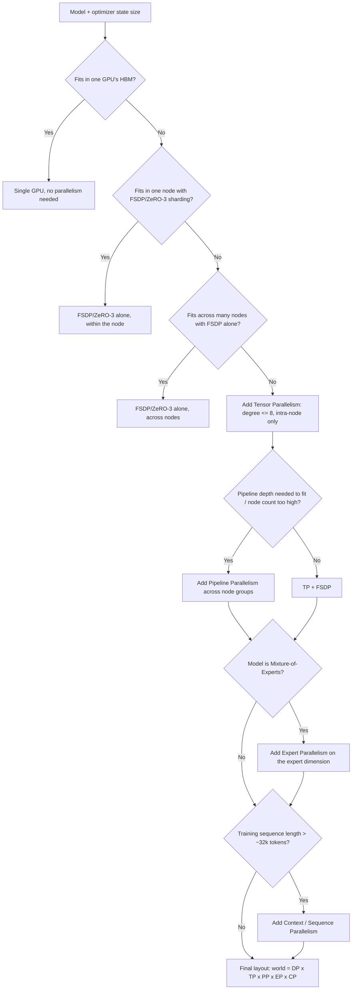

# Decision - Choosing a Parallelism Strategy

> The decision: which of [[Concept - Data Parallelism and ZeRO|DP/ZeRO]], [[Concept - Tensor and Pipeline Parallelism|TP and PP]], sequence/context parallelism and [[Concept - Expert Parallelism|EP]] to combine, and at what degree, for a given model size, GPU count and interconnect. **Default for the 80% case: shard everything with FSDP/ZeRO-3 alone. Add TP (intra-node, degree ≤ 8) or PP only once the model stops fitting under sharding alone, EP only for MoE, and CP only when context length demands it.**

## Decision flow

## Tradeoff matrix

| Strategy | Shards | Comm pattern | Interconnect need | Typical degree | MFU impact | Primary failure mode |
|---|---|---|---|---|---|---|
| DP / DDP | nothing (full replica) | all-reduce grads | tolerant (overlappable) | outermost, scales to cluster size | none by itself; adds throughput, not capacity | none unique; just doesn't solve memory |
| ZeRO-3 / FSDP | params, grads, optimizer state | all-gather params + reduce-scatter grads | tolerant, ~1.5x DDP comm volume | across node or cluster | small (~1.5x comm) if overlapped | param-gather stalls the pipeline if not overlapped with compute |
| Tensor Parallelism | within-layer weights | all-reduce activations, every layer | needs NVLink (~900 GB/s intra-node) | ≤ 8 (stay intra-node) | collapses hard if it crosses a node boundary onto InfiniBand (~400 Gb/s) | MFU collapse from an inter-node TP all-reduce |
| Pipeline Parallelism | layers, by stage | point-to-point activations | tolerant of higher latency | 8-16+ on large runs | bubble fraction $(p-1)/(m+p-1)$; needs $m \gtrsim 4p$ microbatches to amortize | stage imbalance (embedding/loss layers) inflates the bubble |
| Sequence Parallelism | norm/dropout/residual activations | all-gather + reduce-scatter, same volume as the TP region it replaces | rides the TP link | matches TP degree | net activation-memory win at ~no added comm | mesh ordering mismatch with TP |
| Context Parallelism | the sequence dimension for attention | ring or all-gather of KV blocks | needs overlap with compute to hide latency | grows with target context length | bottlenecks if not overlapped | causal load imbalance without zigzag/striped assignment |
| Expert Parallelism | experts (MoE only) | two all-to-alls per MoE layer (dispatch + combine) | latency- and topology-sensitive, InfiniBand-heavy | matches expert count / node topology | stragglers stall the whole all-to-all barrier | load imbalance from poor routing balance |

Worked examples. A 7B dense model on 8×H100 needs only FSDP. It fits comfortably, and TP would just add comm tax for nothing. A 70B model on 64 GPUs typically runs FSDP + TP8: TP8 keeps the per-layer working set inside a fast-NVLink node, and FSDP shards the remaining state across the outer 8-way node group. Llama-3 405B, trained on roughly 16k H100s, uses DP + TP8 + PP16 + SP (the layout referenced in [[Deep Dive - Anatomy of a Pretraining Run]]). DeepSeek-V3 (671B total / 37B active MoE) uses DP + EP + PP with DualPipe scheduling, putting EP on the expert dimension in place of a wider TP.

## The details that flip the decision

- **Slow inter-node interconnect** (older InfiniBand, or Ethernet-only fabrics) argues *against* any TP that crosses a node boundary. TP's every-layer all-reduce is latency- and bandwidth-hungry in a way PP's point-to-point activation sends are not. Cap TP at 8 and lean on PP + [[Concept - Fully Sharded Data Parallel (FSDP)]] instead.
- **Abundant NVLink domains** (rack-scale systems that push the fast-link boundary from 8 GPUs to dozens) make TP degrees well past the usual ≤8 viable without the normal MFU collapse. The ≤8 default comes from typical 8-GPU-per-node topology, not from the mechanism, so re-derive it from your actual NVLink domain size.
- **A tiny cluster** (a lab with one or two nodes and a model that needs more aggregate HBM than it has) may need ZeRO-Offload/Infinity to CPU or NVMe just to fit. That trades throughput for capacity, and the default flow above doesn't reach for it unless FSDP alone can't fit the model.
- **Inference-optimal layouts differ from training-optimal ones.** A layout tuned for training-time MFU (wide TP, deep PP, all sized for aggregate cluster throughput) is frequently wrong for serving. There, TP mostly exists to fit memory or cut single-request latency, and PP is largely avoided because its bubble turns into a latency tax instead of a throughput one. [[Concept - MoE Inference and Expert Parallelism]] covers how the EP degree gets retuned between training and serving.
- **Over-parallelizing a model that already fits** is the single most common waste. Sharding a 7B model across TP=8 when it fits on one node under FSDP alone pays a real all-reduce tax for zero capacity gain. Before adding a dimension, check whether the model fits under the simpler strategy.
- **Ignoring activation memory in the sizing math** is the second most common mistake. Teams size purely off parameter and optimizer bytes (see [[Reference - Memory Math for Transformers]]), pass that budget, then OOM on the first real batch because activation memory (scaling with batch × sequence × layers × hidden) was never in the calculation. Always leave headroom: usable GPU memory sits meaningfully below nominal HBM once CUDA context, NCCL buffers and allocator fragmentation are counted.

## Connections
- [[Reference - Parallelism Strategies]] — the full lookup matrix this decision's tradeoff table condenses; consult it for the complete per-dimension comm-volume and failure-mode detail.
- [[Pattern - 3D Parallelism Composition]] — the reusable design pattern for how these dimensions compose onto a physical device mesh once this decision has picked which ones to use.
- [[Concept - Data Parallelism and ZeRO]] — the default, first-choice strategy in the decision flow above.
- [[Concept - Tensor and Pipeline Parallelism]] — the two dimensions added once sharding alone stops being sufficient.
- [[Concept - Expert Parallelism]] — the MoE-specific branch of the decision flow.
- [[Reference - Memory Math for Transformers]] — the byte-level formulas that answer the flow's very first "does it fit" question.
- [[Concept - GPU Memory Hierarchy]] — why "fits in HBM" is the binding constraint driving this entire decision, not raw compute.
- [[Concept - MoE Inference and Expert Parallelism]] — the serving-time analogue of the EP decision made here for training, and why the two frequently diverge.
- [[Deep Dive - Anatomy of a Pretraining Run]] — where the parallelism layout chosen here becomes one concrete input to an actual run configuration.
- [[Breakdown - DeepSeek-V3 Training]] — the worked real-system example of a DP + EP + PP DualPipe layout chosen under this decision's MoE branch.
- [[Concept - Fully Sharded Data Parallel (FSDP)]] — the concrete PyTorch implementation of the ZeRO-3 sharding this decision defaults to before reaching for any other dimension.

## Sources
- Narayanan et al. (2021) — "Efficient Large-Scale Language Model Training on GPU Clusters Using Megatron-LM" — the source of the TP/PP composition rules and MFU numbers this decision's defaults are built on.
- Meta AI (2024) — Llama-3 herd of models — the 405B / ~16k H100 / DP+TP8+PP16+SP worked example.
- DeepSeek-AI (2024) — DeepSeek-V3 Technical Report — the 671B MoE / DP+EP+PP DualPipe worked example.
