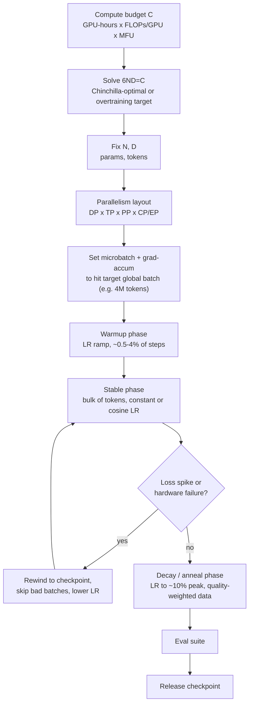

# Deep Dive - Anatomy of a Pretraining Run

> **One-paragraph hook:** A frontier pretraining run is a weeks-long operation, and it touches nearly every mechanism this domain owns. A compute budget becomes a parallelism layout. A training loop runs for millions of steps on a cluster whose hardware keeps failing underneath it. Someone gets paged when the loss curve does something it shouldn't. Every piece has its own note; this one is the wiring diagram showing where they meet, in the order a real run hits them.

## The mechanism

Every run starts from a compute budget $C$, typically expressed as GPU-hours × peak FLOPs/GPU × achieved MFU (model FLOPs utilization: achieved FLOPs as a fraction of hardware peak). The [[Concept - Scaling Laws]] relation $C \approx 6ND$ turns that budget into a parameter count $N$ and a token count $D$. You either take the Chinchilla-optimal ratio (~20 tokens/param) or pick an inference-optimal overtraining multiple on purpose, since serving cost tracks $N$, not $D$. Once $N$ and $D$ are fixed, two things follow. $N$ decides how the model gets sharded across the cluster (next paragraph). $D$ decides wall-clock once you know achieved throughput:

$$\text{tokens/sec} = \frac{\text{batch\_tokens}}{\text{step\_time}}, \qquad \text{wall-clock} = \frac{D}{\text{tokens/sec}}, \qquad \text{cost} = \text{GPU-hours} \times \$/\text{GPU-hour}$$

Sanity check with real numbers: Llama-3 405B on ~15T tokens gives $C \approx 6 \times 405\text{e}9 \times 15\text{e}12 \approx 3.6\times10^{25}$ FLOPs. Reported figures put the run on ~16,000 H100s for ~54 days. At H100's ~989 TFLOPs/s bf16-dense peak, that cluster-time has a theoretical ceiling of roughly $16000 \times 54{\times}86400\text{s} \times 989\text{e}12 \approx 7.4\times10^{25}$ FLOPs. That implies achieved MFU around 49%, inside the 40-55% range labs target. It's a handy back-of-envelope test of whether a reported run is physically plausible.

With $N$ fixed, the second decision is the parallelism layout. You pick DP × TP × PP × (EP/CP) degrees so per-GPU memory fits and MFU lands in that 40-55% band. Mechanics are in [[Concept - Data Parallelism and ZeRO]] and [[Concept - Tensor and Pipeline Parallelism]], the lookup table is [[Reference - Parallelism Strategies]], and the choice itself goes through [[Decision - Choosing a Parallelism Strategy]]. Don't confuse MFU with HFU (hardware FLOPs utilization). HFU counts the FLOPs spent recomputing activations as useful work, so a run can report high HFU while burning ~30% of its compute recomputing activations it threw away to fit memory. [[Concept - Why Models Don't Fit on One GPU]] covers why that recompute trade exists. Any reported MFU number should say which denominator it uses.

## Architecture / walkthrough

At the run level, the lifecycle is a straight line with one feedback loop:



Inside the stable phase every step runs the same inner loop. This is the only place code actually executes on GPUs:

```python
for step in range(total_steps):
    batch = dataloader.next()                    # resumable, packed sequences
    for micro in batch.split(grad_accum_steps):
        loss = model(micro).loss / grad_accum_steps
        loss.backward()                           # activation recompute inside fwd/bwd
    clip_grad_norm_(model.parameters(), max_norm=1.0)   # global-norm clip, post-accumulation
    all_reduce(grads)                             # DP/ZeRO gradient sync
    optimizer.step(); optimizer.zero_grad()
    log(loss, grad_norm, lr, tokens_seen, mfu)
    if step % checkpoint_interval == 0:
        async_checkpoint(model, optimizer, dataloader_state, rng_state)
```

A few constraints hide in that loop. The dataloader has to resume at exact token granularity, and epoch granularity isn't enough. Gradient clipping runs on the fully accumulated global-norm gradient, never per microbatch; [[Concept - Mixed Precision Training]] explains why loss-scale unscaling has to happen before it. The all-reduce is whatever collective the chosen [[Concept - Data Parallelism and ZeRO]] stage implies. Checkpoints write asynchronously in the background, so training doesn't stall for the seconds-to-minutes a multi-terabyte optimizer-state write would otherwise cost (see [[Concept - Distributed Checkpointing]]).

## In practice

Microbatch size and grad-accum steps are tuned to hit a fixed global batch, commonly 0.5M to 16M tokens depending on model size and target [[Concept - Critical Batch Size]]. How that batch is sharded across DP ranks doesn't change the target. [[Concept - Learning Rate Schedules for Pretraining]] sets the warmup/stable/decay shape on top of this loop. The decay phase is increasingly where a separate, higher-quality [[Concept - Data Mixtures]] gets blended in (data annealing), since much of a model's final capability lands in the last 10-20% of training.

Two production numbers anchor intuition. Llama-3 405B (Dubey et al. 2024) trained on roughly 16,000 H100s for about 54 days over ~15T tokens, in bf16, with a 4D parallelism layout (DP, TP, PP, plus context parallelism for long-context stages). DeepSeek-V3 (DeepSeek-AI 2024) trained in ~2.788 million H800 GPU-hours with most of its GEMMs in fp8 instead of bf16. It was the first production-scale fp8-pretrained frontier model, which is why the GPU-hour total looks small next to 671B total / 37B active parameters. You can only interpret either number against [[Concept - The Roofline Model]] and a per-GPU budget derived from [[Reference - Memory Math for Transformers]]. A GPU-hours figure by itself says nothing about whether a run was compute-bound or communication-bound.

## Failure modes

- **Loss spikes and grad-norm blowups** ([[Concept - Training Stability and Loss Spikes]]). You catch them by watching grad-norm and loss on every logged step. Standard recovery: rewind to the last good checkpoint, skip the batches implicated in the spike, optionally drop the LR for a while, then resume. OPT-175B, PaLM and GLM-130B all used this playbook.
- **Hardware failure is routine.** At 10,000+ GPUs a node failure (ECC error, NVLink drop, NIC flake) happens every few hours as a statistical certainty. Elastic restart from the last checkpoint is part of the normal operating loop, and a run's effective uptime usually limits total wall-clock more than its raw compute does.
- **A bad data shard.** A corrupted or anomalous shard (repeated text, encoding garbage, a scraped region heavy with duplicates) can cause a spike that looks identical to an optimizer instability. To tell them apart, correlate the spike's step number with the shard that was in flight; the loss curve alone won't tell you.
- **Checkpoint corruption from a crash mid-write.** A hard failure during an async write leaves a partial file. Use atomic rename-on-completion and keep the last N checkpoints. Never trust a single most-recent write.
- **Silent gradient desync.** One rank drifts from the others (a dropped NCCL message, a numerics bug on one device) without crashing and corrupts training for many steps before anyone notices. Periodic cross-rank checksums on parameters catch it. Loss curves don't.
- **Non-determinism breaks reproducibility.** bf16 reduction order, kernel selection and data sharding are rarely bit-exact across restarts, so "resume and get the identical loss curve" isn't a valid correctness bar. Track the statistical trajectory (loss and grad-norm bands) instead.

## The non-obvious

The MFU number in a technical report already has all this downtime removed from the denominator. It reports achieved FLOPs during compute, not achieved FLOPs over wall-clock including restarts. From the outside, a pretraining run looks like a machine-learning problem: right architecture, right data, right hyperparameters. From inside at 10,000+ GPU scale, most engineering hours go to fault-tolerant distributed-systems work: checkpoint cadence, elastic restart, straggler detection, data-pipeline resumability. The ML recipe is usually settled well before launch. The systems failures keep coming, unscheduled, for the whole run.

## Evolution

GPT-3 (2020) set the recipe of one very large training run with little parallelism beyond basic model+data parallelism. PaLM (2022) brought the Pathways system for efficient multi-pod training and publicly documented ~20 mid-run loss spikes, which made rewind-and-skip recovery normal. Chinchilla (Hoffmann et al. 2022) reset the field's sizing intuition and made the $6ND$ budget-allocation step above the standard first move. Llama-3 (2024) went past compute-optimality into deliberate inference-optimal overtraining, separating "cheapest to train" from "cheapest to serve." DeepSeek-V3 (2024) combined fp8 training with an MoE architecture and aggressive [[Concept - Expert Parallelism]] communication engineering. It showed precision reduction and sparsity could be pushed together at frontier scale without the instability that had made fp8 pretraining look risky a year earlier.

## Connections
- [[Concept - Scaling Laws]] — supplies the $6ND$ relation this note's sizing step solves.
- [[Concept - Why Models Don't Fit on One GPU]] — the memory ceiling that forces the parallelism-layout decision in the first place.
- [[Concept - Data Parallelism and ZeRO]] — one axis of the parallelism layout, and the source of the training loop's gradient all-reduce.
- [[Concept - Tensor and Pipeline Parallelism]] — the other primary axes of the layout, and the bubble/MFU tradeoff they impose.
- [[Concept - Mixed Precision Training]] — governs the dtype and loss-scaling sequencing inside every step of the inner loop.
- [[Concept - Learning Rate Schedules for Pretraining]] — the warmup/stable/decay shape overlaid on the run's timeline.
- [[Concept - Training Stability and Loss Spikes]] — the mechanism and recovery playbook behind the diagram's feedback loop.
- [[Concept - Distributed Checkpointing]] — the mechanism behind async checkpointing and elastic restart.
- [[Decision - Choosing a Parallelism Strategy]] — the decision procedure the "parallelism layout" step in this note's mechanism actually invokes.
- [[Concept - The Roofline Model]] — the compute/bandwidth framework needed to interpret a reported MFU or GPU-hours number honestly.
- [[Reference - Memory Math for Transformers]] — the per-GPU memory budget that a parallelism layout must satisfy.
- [[Concept - Data Mixtures]] — the data-annealing choices made during the decay phase of the run.
- [[Lore - The OPT-175B Logbook]] — a first-hand account of exactly the failure modes and interventions this note describes, at the scale where they first became public knowledge.
- [[Breakdown - DeepSeek-V3 Training]] — a full reverse-engineering of the most recent entry in this note's Evolution section.
- [[Concept - Critical Batch Size]] — the theory behind the global-batch-size target the microbatch/grad-accum setup in the inner loop is aiming for.
- [[Concept - Expert Parallelism]] — the extra parallelism dimension DeepSeek-V3's run required on top of the DP/TP/PP layout described here.
- [[Reference - Parallelism Strategies]] — the lookup table the "parallelism layout" step in this note's mechanism resolves against.

## Sources
- Hoffmann et al. (2022) — "Training Compute-Optimal Large Language Models" (Chinchilla) — the $6ND$ compute-optimal sizing relation this note's mechanism starts from.
- Dubey et al. (2024) — "The Llama 3 Herd of Models" — the 405B/16k-H100/54-day/~15T-token run used as this note's worked sanity check.
- DeepSeek-AI (2024) — "DeepSeek-V3 Technical Report" — the ~2.788M H800-hour, fp8-pretrained run cited in the Evolution and In Practice sections.
- Zhang et al. (2022) — "OPT: Open Pre-trained Transformer Language Models" — the public logbook documenting the spike-and-recovery pattern this note generalizes.
