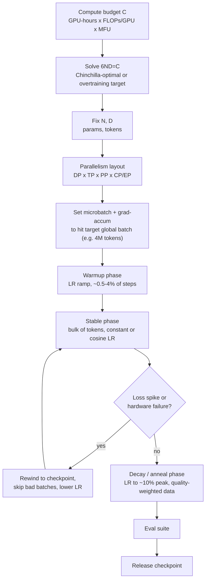

# Deep Dive - Anatomy of a Pretraining Run

> **One-paragraph hook:** A frontier pretraining run is not a script you kick off and check back on — it's a weeks-long operation that touches nearly every mechanism this domain owns: a compute budget becomes a parallelism layout, a training loop runs for millions of steps against a cluster that fails hardware underneath it, and someone is paged when the loss curve does something it isn't supposed to. Every piece here has its own note; this is the wiring diagram that shows where they meet, in the order a real run actually encounters them.

## The mechanism

Every run starts from a compute budget $C$, typically expressed as GPU-hours × peak FLOPs/GPU × achieved MFU (model FLOPs utilization — achieved FLOPs as a fraction of hardware peak). Using the [[Concept - Scaling Laws]] relation $C \approx 6ND$, that budget is converted into a parameter count $N$ and a token count $D$ — either at the Chinchilla-optimal ratio (~20 tokens/param) or at a deliberately chosen inference-optimal overtraining multiple, since a model's serving cost tracks $N$, not $D$. Fixing $N$ and $D$ fixes two downstream quantities: $N$ determines how the model must be sharded across the cluster (see the next paragraph), and $D$ determines wall-clock once you know achieved throughput:

$$\text{tokens/sec} = \frac{\text{batch\_tokens}}{\text{step\_time}}, \qquad \text{wall-clock} = \frac{D}{\text{tokens/sec}}, \qquad \text{cost} = \text{GPU-hours} \times \$/\text{GPU-hour}$$

As a sanity check on real numbers: Llama-3 405B trained on ~15T tokens gives $C \approx 6 \times 405\text{e}9 \times 15\text{e}12 \approx 3.6\times10^{25}$ FLOPs. Reported figures put the run on ~16,000 H100s for ~54 days. At H100's ~989 TFLOPs/s bf16-dense peak, that cluster-time offers a theoretical ceiling of roughly $16000 \times 54{\times}86400\text{s} \times 989\text{e}12 \approx 7.4\times10^{25}$ FLOPs — implying an achieved MFU around 49%, squarely inside the 40-55% range labs target and a useful back-of-envelope check that a reported run is physically plausible.

With $N$ fixed, the second design decision is the parallelism layout: pick DP × TP × PP × (EP/CP) degrees (full mechanics in [[Concept - Data Parallelism and ZeRO]], [[Concept - Tensor and Pipeline Parallelism]], and the [[Reference - Parallelism Strategies]] lookup table, chosen via [[Decision - Choosing a Parallelism Strategy]]) so that per-GPU memory fits and MFU lands in that 40-55% band. MFU must be distinguished from HFU (hardware FLOPs utilization): HFU counts the extra FLOPs spent on activation recomputation as "useful" work, so a run can report high HFU while actually burning ~30% of its compute recomputing activations it deliberately discarded to fit memory — see [[Concept - Why Models Don't Fit on One GPU]] for why that recompute trade exists in the first place. Reported MFU numbers should always specify which denominator they use.

## Architecture / walkthrough

At the run level, the lifecycle is a straight line with one feedback loop:



Inside the stable phase, every step runs the same inner loop — the one place the code actually executes on GPUs:

```python
for step in range(total_steps):
    batch = dataloader.next()                    # resumable, packed sequences
    for micro in batch.split(grad_accum_steps):
        loss = model(micro).loss / grad_accum_steps
        loss.backward()                           # activation recompute inside fwd/bwd
    clip_grad_norm_(model.parameters(), max_norm=1.0)   # global-norm clip, post-accumulation
    all_reduce(grads)                             # DP/ZeRO gradient sync
    optimizer.step(); optimizer.zero_grad()
    log(loss, grad_norm, lr, tokens_seen, mfu)
    if step % checkpoint_interval == 0:
        async_checkpoint(model, optimizer, dataloader_state, rng_state)
```

The dataloader must be resumable at exact token granularity (not just epoch granularity); gradient clipping runs on the fully accumulated global-norm gradient, never per microbatch (see [[Concept - Mixed Precision Training]] for why loss-scale unscaling must be sequenced before it); the all-reduce is whichever collective the chosen [[Concept - Data Parallelism and ZeRO]] stage implies; and checkpoints write asynchronously in the background so training doesn't stall for the seconds-to-minutes a multi-terabyte optimizer-state write would otherwise cost (see [[Concept - Distributed Checkpointing]]).

## In practice

Microbatch size and grad-accum steps are tuned to hit a fixed global batch — commonly 0.5M to 16M tokens depending on model size and target [[Concept - Critical Batch Size]] — independent of how that batch happens to be sharded across DP ranks. The [[Concept - Learning Rate Schedules for Pretraining]] governs the warmup/stable/decay shape overlaid on this loop, and the decay phase is increasingly where a separate, higher-quality [[Concept - Data Mixtures]] gets mixed in (data annealing), since much of a model's final capability lands in that last 10-20% of training.

At production scale, two numbers anchor intuition. **Llama-3 405B** (Dubey et al. 2024) trained on roughly 16,000 H100s for about 54 days over ~15T tokens, in bf16, using a 4D parallelism layout (DP, TP, PP, and context parallelism for long-context stages). **DeepSeek-V3** (DeepSeek-AI 2024) trained in ~2.788 million H800 GPU-hours, running most of its GEMMs in fp8 rather than bf16 — the first production-scale fp8-pretrained frontier model, which is why its total GPU-hour figure looks small relative to its parameter count despite training 671B total / 37B active parameters. Both numbers are only interpretable against [[Concept - The Roofline Model]] and a [[Reference - Memory Math for Transformers]]-derived per-GPU budget — a GPU-hours figure alone says nothing about whether a run was compute-bound or communication-bound.

## Failure modes

- **Loss spikes and grad-norm blowups** ([[Concept - Training Stability and Loss Spikes]]): detected by monitoring grad-norm and loss on every logged step; the standard recovery is rewind to the last good checkpoint, skip the batches implicated in the spike, and optionally lower the LR temporarily before resuming — the same playbook used across OPT-175B, PaLM, and GLM-130B.
- **Hardware failure as a routine event, not an exception**: at 10,000+ GPUs, a node failure (ECC error, NVLink drop, NIC flake) occurs every few hours as a statistical certainty, not a contingency. This makes elastic restart from the last checkpoint part of the normal operating loop, not an incident-response procedure — a run's effective uptime, not its raw compute, is usually the binding constraint on total wall-clock.
- **A bad data shard**: a corrupted or anomalous shard (repeated text, encoding garbage, a scraped duplicate-heavy region) can trigger a spike that looks identical to an optimizer instability; distinguishing the two requires correlating the spike's step number against which data shard was in flight, not just staring at the loss curve.
- **Checkpoint corruption from a crash mid-write**: a hard failure during an async checkpoint write leaves a partial file; the fix is atomic rename-on-completion plus retaining the last N checkpoints, never trusting a single most-recent write.
- **Silent gradient desync**: a rank that diverges from the others (a dropped NCCL message, a numerics bug on one device) without an outright crash can quietly corrupt training for many steps before anyone notices — periodic cross-rank checksums on parameters catch this; loss curves alone do not.
- **Non-determinism defeating reproducibility**: bf16 reduction order, kernel selection, and data sharding are rarely bit-exact across restarts, so "resume and get the identical loss curve" is not a valid correctness bar — track statistical trajectory (loss, grad-norm bands) instead of exact reproduction.

## The non-obvious

The MFU number in a model's technical report already has all of this downtime baked out of the denominator — it reports achieved-FLOPs-during-compute, not achieved-FLOPs-over-wall-clock-including-restarts. Read from the outside, "anatomy of a pretraining run" looks like a machine-learning problem: pick the right architecture, the right data, the right hyperparameters. Lived from the inside at 10,000+ GPU scale, the majority of engineering hours go to fault-tolerant distributed-systems work — checkpoint cadence, elastic restart, straggler detection, data-pipeline resumability — because the ML recipe is usually settled well before the run starts, while the systems failures are continuous and unscheduled for the run's entire duration.

## Evolution

**GPT-3** (2020) established the recipe of a single very large training run with minimal elaborate parallelism beyond basic model+data parallelism. **PaLM** (2022) introduced the Pathways system for efficient multi-pod training and publicly documented ~20 mid-run loss spikes, normalizing the rewind-and-skip recovery pattern. **Chinchilla** (Hoffmann et al. 2022) reset the field's sizing intuition, making the $6ND$ budget-allocation step described above the standard first move rather than an afterthought. **Llama-3** (2024) pushed past compute-optimality into deliberate inference-optimal overtraining, decoupling "cheapest to train" from "cheapest to serve." **DeepSeek-V3** (2024) combined fp8 training with an MoE architecture and aggressive [[Concept - Expert Parallelism]] communication engineering, showing that precision reduction and sparsity could be pushed together at frontier scale without the instability that made fp8 pretraining folklore-risky just a year earlier.

## Connections
- [[Concept - Scaling Laws]] — supplies the $6ND$ relation this note's sizing step solves.
- [[Concept - Why Models Don't Fit on One GPU]] — the memory ceiling that forces the parallelism-layout decision in the first place.
- [[Concept - Data Parallelism and ZeRO]] — one axis of the parallelism layout, and the source of the training loop's gradient all-reduce.
- [[Concept - Tensor and Pipeline Parallelism]] — the other primary axes of the layout, and the bubble/MFU tradeoff they impose.
- [[Concept - Mixed Precision Training]] — governs the dtype and loss-scaling sequencing inside every step of the inner loop.
- [[Concept - Learning Rate Schedules for Pretraining]] — the warmup/stable/decay shape overlaid on the run's timeline.
- [[Concept - Training Stability and Loss Spikes]] — the mechanism and recovery playbook behind the diagram's feedback loop.
- [[Concept - Distributed Checkpointing]] — the mechanism behind async checkpointing and elastic restart.
- [[Decision - Choosing a Parallelism Strategy]] — the decision procedure the "parallelism layout" step in this note's mechanism actually invokes.
- [[Concept - The Roofline Model]] — the compute/bandwidth framework needed to interpret a reported MFU or GPU-hours number honestly.
- [[Reference - Memory Math for Transformers]] — the per-GPU memory budget that a parallelism layout must satisfy.
- [[Concept - Data Mixtures]] — the data-annealing choices made during the decay phase of the run.
- [[Lore - The OPT-175B Logbook]] — a first-hand account of exactly the failure modes and interventions this note describes, at the scale where they first became public knowledge.
- [[Breakdown - DeepSeek-V3 Training]] — a full reverse-engineering of the most recent entry in this note's Evolution section.
- [[Concept - Critical Batch Size]] — the theory behind the global-batch-size target the microbatch/grad-accum setup in the inner loop is aiming for.
- [[Concept - Expert Parallelism]] — the extra parallelism dimension DeepSeek-V3's run required on top of the DP/TP/PP layout described here.
- [[Reference - Parallelism Strategies]] — the lookup table the "parallelism layout" step in this note's mechanism resolves against.

## Sources
- Hoffmann et al. (2022) — "Training Compute-Optimal Large Language Models" (Chinchilla) — the $6ND$ compute-optimal sizing relation this note's mechanism starts from.
- Dubey et al. (2024) — "The Llama 3 Herd of Models" — the 405B/16k-H100/54-day/~15T-token run used as this note's worked sanity check.
- DeepSeek-AI (2024) — "DeepSeek-V3 Technical Report" — the ~2.788M H800-hour, fp8-pretrained run cited in the Evolution and In Practice sections.
- Zhang et al. (2022) — "OPT: Open Pre-trained Transformer Language Models" — the public logbook documenting the spike-and-recovery pattern this note generalizes.
