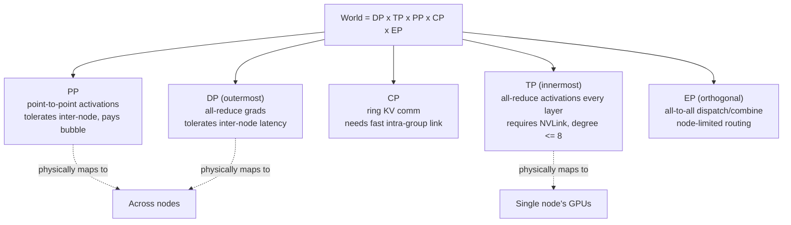

# Pattern - 3D Parallelism Composition

> **Problem:** No single parallelism strategy scales to frontier model sizes on its own — data parallelism hits a per-GPU memory wall, tensor parallelism hits the interconnect, pipeline parallelism hits the bubble. **Solution shape:** factor the total world size into orthogonal parallelism dimensions and place each factor on the hardware topology whose communication properties it matches.

## Context & forces

Every individual parallelism dimension has a hard scaling ceiling. Pure [[Concept - Data Parallelism and ZeRO|data parallelism]] (even with full ZeRO-3/[[Concept - Fully Sharded Data Parallel (FSDP)|FSDP]] sharding) keeps per-GPU memory proportional to $(\text{model} + \text{grad} + \text{optimizer})/\text{DP}$ but still requires an all-gather of full layer parameters during forward/backward, which becomes latency-bound at very high DP degree. [[Concept - Tensor and Pipeline Parallelism|Tensor parallelism]] needs an all-reduce on every layer's activations, so it only stays efficient over NVLink-class bandwidth (~900 GB/s) — cross a node boundary and MFU collapses. Pipeline parallelism tolerates slow inter-node links (point-to-point activation handoffs) but pays a fill/drain bubble of fraction $(p-1)/(m+p-1)$ for $p$ stages and $m$ microbatches, and needs deep, well-balanced layer counts to be worth the complexity. MoE models add a further axis — [[Concept - Expert Parallelism|expert parallelism]] — whose all-to-all collective has its own topology sensitivity, and long-context runs add [[Concept - Sequence and Context Parallelism|context parallelism]]. The forces in tension are: memory capacity (favors more sharding), communication bandwidth (favors keeping the most bandwidth-hungry dimension on the fastest link), latency/bubble (favors fewer pipeline stages or more microbatches), and implementation complexity (favors fewer active dimensions at once). No single axis relieves all four forces simultaneously, which is exactly why composition, not selection, is the pattern.

## The pattern

The pattern factors the total world size as:

$$\text{world} = \text{DP} \times \text{TP} \times \text{PP} \times \text{CP} \times \text{EP}$$

and assigns each factor to the level of the hardware topology whose communication characteristics match its cost profile: TP innermost (intra-node, NVLink), then PP and CP, with DP outermost (tolerates the slowest, highest-latency links because all-reduce overlaps well with compute). A [[Concept - GPU Memory Hierarchy|DeviceMesh]] (PyTorch DTensor / Megatron-Core) encodes this as a multi-dimensional grid of ranks, so that a collective along the "TP axis" of the mesh always resolves to physically adjacent GPUs.

Per-GPU memory under this composition is approximately:

$$\text{mem}_\text{GPU} \approx \frac{\text{model} + \text{grad} + \text{optimizer}}{\text{DP} \times \text{shard}} + \frac{\text{activations}}{\text{TP} \times \text{CP} \times \text{PP}}$$

where $\text{shard} \in \{1, \text{TP}, \text{TP} \times \text{PP}\}$ depending on whether ZeRO/FSDP sharding is applied on top of the model-parallel split. Microbatch count $m$ is set to at least ~4x the pipeline depth $p$ to amortize the bubble down to a small fraction of step time.

## Implementation notes

Set TP first: pick the largest TP degree that still fits within one NVLink domain (commonly $\leq 8$), since every point past a node boundary multiplies communication latency for a per-layer, per-step all-reduce. Set PP next to relieve remaining parameter-memory pressure across nodes, sized to keep the bubble fraction acceptable given the achievable microbatch count. Layer DP/FSDP outermost to absorb whatever memory headroom is still needed, since its all-reduce is the most latency-tolerant collective in the stack when overlapped with backward compute. For MoE models, EP is set independently on the expert dimension and composed as $\text{EP} \times \text{DP}$; for long-context runs, CP is added and placed adjacent to TP in the mesh ordering since both are per-layer, high-frequency collectives. Interleaved/virtual pipeline scheduling (assigning multiple non-contiguous stages per device) further shrinks the PP bubble without changing the factorization itself. The search over degrees is a small, physically-constrained grid guided by these placement rules — not a brute-force sweep — because the ceilings on each axis (NVLink domain size, node count, bubble tolerance) bound the search space tightly.

## Tradeoffs & when NOT to use

Raising TP lowers per-GPU memory and shortens the critical path per layer, but every increment raises communication volume and — once it crosses a node boundary — collapses MFU outright; don't raise TP past the NVLink domain size to solve a memory problem better solved by more PP or more sharding. Raising PP is comm-cheap (point-to-point, not all-reduce) but adds bubble overhead and requires enough layers and microbatches to amortize it — a shallow model or a run that can't tolerate the added latency-to-first-output shouldn't add PP stages it doesn't need. Composition itself adds implementation and debugging complexity: a bug can now live in any dimension's collective or in the interaction between two of them, and reasoning about a hung job across a 4D or 5D mesh is materially harder than debugging plain DP. If a model and its optimizer states fit in a single node under FSDP/ZeRO alone, skip TP and PP entirely — every additional parallelism dimension is complexity and communication paid for memory or bubble relief you may not need (see [[Decision - Choosing a Parallelism Strategy]] for the full decision flow).

## Known uses

- **Megatron-LM** (Narayanan et al. 2021, "Efficient Large-Scale Language Model Training on GPU Clusters Using Megatron-LM") — the paper that named this composition PTD-P (Pipeline, Tensor, Data-Parallel) and demonstrated ~1T-parameter training at ~52% MFU on 3072 A100s.
- **DeepSpeed 3D parallelism** — composes ZeRO-powered data parallelism with Megatron-style TP and PP under a unified configuration.
- **TorchTitan** — composes FSDP2 (per-parameter DTensor sharding) with TP and PP on a native PyTorch DeviceMesh, the current reference implementation for the FSDP2 migration path.
- **DeepSeek-V3** — composes DP with EP and PP under a custom DualPipe schedule, the MoE-specific instance of this same factor-and-place pattern (see [[Breakdown - DeepSeek-V3 Training]]).

## Connections
- [[Concept - Tensor and Pipeline Parallelism]] — the two innermost dimensions this pattern places on the fastest and most latency-tolerant links respectively.
- [[Concept - Data Parallelism and ZeRO]] — the outermost, most latency-tolerant dimension in the composition.
- [[Concept - Fully Sharded Data Parallel (FSDP)]] — the modern DTensor-based implementation of the DP/sharding axis that composes cleanly with TP via a shared DeviceMesh.
- [[Concept - Expert Parallelism]] — the orthogonal expert-dimension axis added for MoE models, composed as EP x DP.
- [[Concept - Sequence and Context Parallelism]] — the sequence-dimension axis added for long-context runs, placed adjacent to TP in the mesh.
- [[Decision - Choosing a Parallelism Strategy]] — the decision procedure that picks concrete degrees for this pattern given model size, cluster shape, and interconnect.
- [[Concept - GPU Memory Hierarchy]] — the memory budget this composition is solving for at each level of the mesh.
- [[Concept - The Roofline Model]] — the compute/bandwidth framing that explains why each axis has the specific ceiling this pattern places it against.
- [[Concept - MoE Inference and Expert Parallelism]] — the same EP composition question reappears at serving time, with different constraints (latency, not throughput).
- [[Breakdown - DeepSeek-V3 Training]] — a concrete, frontier-scale instance of this pattern composed as DP + EP + PP DualPipe.

## Sources
- Narayanan et al. (2021) — "Efficient Large-Scale Language Model Training on GPU Clusters Using Megatron-LM" — names and formalizes the PTD-P composition and its MFU results at ~1T parameters.
- Shoeybi et al. (2019) — "Megatron-LM: Training Multi-Billion Parameter Language Models Using Model Parallelism" — the original tensor-parallelism design this composition builds on.
