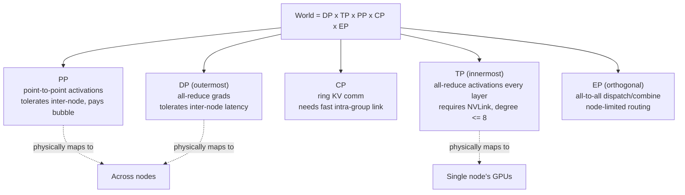

# Pattern - 3D Parallelism Composition

> **Problem:** No single parallelism strategy scales to frontier model sizes by itself. Data parallelism hits a per-GPU memory wall, tensor parallelism hits the interconnect, pipeline parallelism hits the bubble. **Solution shape:** factor the total world size into orthogonal parallelism dimensions and put each factor on the part of the hardware topology whose communication properties match it.

## Context & forces

Every parallelism dimension has a hard ceiling. Pure [[Concept - Data Parallelism and ZeRO|data parallelism]], even with full ZeRO-3/[[Concept - Fully Sharded Data Parallel (FSDP)|FSDP]] sharding, keeps per-GPU memory proportional to $(\text{model} + \text{grad} + \text{optimizer})/\text{DP}$, but it still all-gathers full layer parameters in forward/backward, which goes latency-bound at very high DP degree. [[Concept - Tensor and Pipeline Parallelism|Tensor parallelism]] needs an all-reduce on every layer's activations, so it only stays efficient over NVLink-class bandwidth (~900 GB/s). Cross a node boundary and MFU collapses. Pipeline parallelism tolerates slow inter-node links (only point-to-point activation handoffs) but pays a fill/drain bubble of fraction $(p-1)/(m+p-1)$ for $p$ stages and $m$ microbatches, and needs deep, well-balanced layer counts to be worth the complexity. MoE models add another axis, [[Concept - Expert Parallelism|expert parallelism]], whose all-to-all collective has its own topology sensitivity. Long-context runs add [[Concept - Sequence and Context Parallelism|context parallelism]].

Four forces pull against each other:

- memory capacity, which favors more sharding;
- communication bandwidth, which favors keeping the most bandwidth-hungry dimension on the fastest link;
- latency/bubble, which favors fewer pipeline stages or more microbatches;
- implementation complexity, which favors fewer active dimensions at once.

No single axis relieves all four, so you compose axes instead of picking one.

## The pattern

Factor the total world size as:

$$\text{world} = \text{DP} \times \text{TP} \times \text{PP} \times \text{CP} \times \text{EP}$$

and assign each factor to the topology level that fits its cost profile. TP goes innermost (intra-node, NVLink), then PP and CP, with DP outermost: its all-reduce overlaps well with compute, so it can sit on the slowest, highest-latency links. A [[Concept - GPU Memory Hierarchy|DeviceMesh]] (PyTorch DTensor / Megatron-Core) encodes this as a multi-dimensional grid of ranks, so a collective along the mesh's "TP axis" always resolves to physically adjacent GPUs.

Per-GPU memory under this composition is approximately:

$$\text{mem}_\text{GPU} \approx \frac{\text{model} + \text{grad} + \text{optimizer}}{\text{DP} \times \text{shard}} + \frac{\text{activations}}{\text{TP} \times \text{CP} \times \text{PP}}$$

where $\text{shard} \in \{1, \text{TP}, \text{TP} \times \text{PP}\}$ depending on whether ZeRO/FSDP sharding is applied on top of the model-parallel split. Set the microbatch count $m$ to at least ~4x the pipeline depth $p$ so the bubble shrinks to a small fraction of step time.

## Implementation notes

Set TP first. Pick the largest TP degree that still fits in one NVLink domain (commonly $\leq 8$), because TP runs an all-reduce every layer, every step, and each step past a node boundary multiplies its latency. Set PP next to relieve remaining parameter-memory pressure across nodes, sized so the bubble is acceptable at the microbatch count you can reach. Put DP/FSDP outermost to absorb whatever memory headroom is still needed; overlapped with backward compute, its all-reduce is the most latency-tolerant collective in the stack.

For MoE models, EP is set independently on the expert dimension and composed as $\text{EP} \times \text{DP}$. For long-context runs, add CP and place it next to TP in the mesh ordering, since both are per-layer, high-frequency collectives. Interleaved/virtual pipeline scheduling (several non-contiguous stages per device) shrinks the PP bubble further without changing the factorization.

Skip the brute-force sweep over degrees. The per-axis ceilings (NVLink domain size, node count, bubble tolerance) leave a small, physically constrained grid, and the placement rules walk it.

## Tradeoffs & when NOT to use

Raising TP lowers per-GPU memory and shortens the per-layer critical path, but each increment adds communication volume, and once TP crosses a node boundary MFU collapses outright. Don't push TP past the NVLink domain size to fix a memory problem that more PP or more sharding would handle better. Raising PP is cheap on communication (point-to-point instead of all-reduce) but adds bubble overhead and needs enough layers and microbatches to amortize it. A shallow model, or a run that can't tolerate the extra latency-to-first-output, shouldn't add PP stages it doesn't need.

Composition also costs debugging effort. A bug can live in any dimension's collective or in the interaction between two of them, and a hung job on a 4D or 5D mesh is materially harder to reason about than plain DP. If the model and its optimizer states fit in a single node under FSDP/ZeRO alone, skip TP and PP entirely. Each extra dimension is complexity and communication paid for memory or bubble relief you may not need (the full decision flow is in [[Decision - Choosing a Parallelism Strategy]]).

## Known uses

- **Megatron-LM** (Narayanan et al. 2021, "Efficient Large-Scale Language Model Training on GPU Clusters Using Megatron-LM"): the paper that named this composition PTD-P (Pipeline, Tensor, Data-Parallel) and showed ~1T-parameter training at ~52% MFU on 3072 A100s.
- **DeepSpeed 3D parallelism**: ZeRO-powered DP plus Megatron-style TP and PP under one config.
- **TorchTitan**: FSDP2 (per-parameter DTensor sharding) with TP and PP on a native PyTorch DeviceMesh. It's the current reference implementation for the FSDP2 migration path.
- **DeepSeek-V3**: DP with EP and PP under a custom DualPipe schedule, the MoE-specific version of the same factor-and-place pattern (see [[Breakdown - DeepSeek-V3 Training]]).

## Connections
- [[Concept - Tensor and Pipeline Parallelism]] — the two innermost dimensions this pattern places on the fastest and most latency-tolerant links respectively.
- [[Concept - Data Parallelism and ZeRO]] — the outermost, most latency-tolerant dimension in the composition.
- [[Concept - Fully Sharded Data Parallel (FSDP)]] — the modern DTensor-based implementation of the DP/sharding axis that composes cleanly with TP via a shared DeviceMesh.
- [[Concept - Expert Parallelism]] — the orthogonal expert-dimension axis added for MoE models, composed as EP x DP.
- [[Concept - Sequence and Context Parallelism]] — the sequence-dimension axis added for long-context runs, placed adjacent to TP in the mesh.
- [[Decision - Choosing a Parallelism Strategy]] — the decision procedure that picks concrete degrees for this pattern given model size, cluster shape, and interconnect.
- [[Concept - GPU Memory Hierarchy]] — the memory budget this composition is solving for at each level of the mesh.
- [[Concept - The Roofline Model]] — the compute/bandwidth framing that explains why each axis has the specific ceiling this pattern places it against.
- [[Concept - MoE Inference and Expert Parallelism]] — the same EP composition question reappears at serving time, with different constraints (latency, not throughput).
- [[Breakdown - DeepSeek-V3 Training]] — a concrete, frontier-scale instance of this pattern composed as DP + EP + PP DualPipe.

## Sources
- Narayanan et al. (2021) — "Efficient Large-Scale Language Model Training on GPU Clusters Using Megatron-LM" — names and formalizes the PTD-P composition and its MFU results at ~1T parameters.
- Shoeybi et al. (2019) — "Megatron-LM: Training Multi-Billion Parameter Language Models Using Model Parallelism" — the original tensor-parallelism design this composition builds on.
