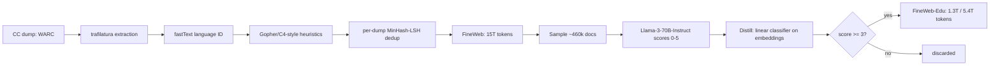

# Breakdown - FineWeb and FineWeb-Edu

> FineWeb is Hugging Face's 15-trillion-token open web corpus. FineWeb-Edu is its subset filtered for educational value. Penedo et al. released both in 2024, and it was the first web-scale corpus where nearly every filtering decision was checked by training models instead of argued from intuition. That swapped "trust me, we cleaned it" for a public, reusable ablation harness. By 2026 FineWeb, or its DataTrove tooling, shows up somewhere in the ancestry of a large share of open pretraining corpora (see [[Reference - Model Genealogy]]).

## The headline numbers

- **FineWeb**: 15T tokens extracted from 96 Common Crawl dumps spanning 2013-2024.
- **FineWeb-Edu**: two cuts drawn from the FineWeb pool. 1.3T tokens at an aggressive educational-value threshold, 5.4T tokens at a looser one.
- **Ablation unit**: each design decision was tested by training a 1.82B-parameter model on 350B tokens of the candidate variant and comparing on a curated early-signal eval suite (HellaSwag, MMLU, ARC-style tasks). That's about 192 tokens/parameter, far past the ~20-tokens/parameter [[Concept - Scaling Laws|Chinchilla-optimal]] point. The overtraining is deliberate: it makes the proxy a low-noise measuring instrument, not a compute-efficient model.
- **Result**: FineWeb matched or beat RefinedWeb, C4, Dolma, and RedPajama-v2 on that suite. FineWeb-Edu gave 5-7 point jumps on MMLU/ARC-style benchmarks over base FineWeb at equal token count.

## How it works

FineWeb runs the generic [[Deep Dive - The Pretraining Data Pipeline]] stage graph end to end, independently per Common Crawl dump, then merges:

Between extraction and dedup is a Gopher/C4-style heuristic filter stack; the thresholds are tabulated in [[Reference - Data Filtering Heuristics]]. On extraction, FineWeb re-extracts from raw WARC with [[Concept - Text Extraction from Web Pages|trafilatura]] and skips Common Crawl's pre-extracted WET files. This replicates the central claim of RefinedWeb (Penedo et al. 2023) that extraction quality alone is a major lever. Menus, nav chrome and cookie banners in WET output poison the training signal. On [[Concept - Deduplication at Scale|deduplication]], MinHash-LSH runs *per dump*, not globally across all 96 dumps. A global pass was ablated and hurt downstream accuracy (explained below).

FineWeb-Edu adds a second filtering pass over the finished FineWeb pool. Sample ~460k documents, prompt Llama-3-70B-Instruct to rate each 0-5 for "educational value," train a cheap linear classifier over document embeddings to reproduce those scores across all 15T tokens, and keep documents scoring ≥3 (a lower threshold gives the 5.4T cut).

## The clever parts

The main contribution is the method. Extraction tool, filter thresholds, dedup granularity: each is a measured result from the 1.82B/350B proxy protocol. You get a reusable harness as well as a dataset, and [[Concept - The Data-Centric View of Model Quality]] cites this kind of evidence.

Re-extracting from WARC showed the extractor matters as much as any downstream filter. Easy to skip because extraction "isn't filtering," but it dominates.

**Per-dump dedup** is the counterintuitive one. Global cross-dump MinHash dedup was tried and *hurt* performance. Content duplicated across many crawls tends to be duplicated *because it's good* (canonical reference pages, popular articles). Global dedup strips that repeated high-quality text and leaves unique low-quality junk relatively over-represented. Per-dump dedup avoids this survivorship inversion.

**Teacher-label, then distill.** Llama-3-70B-Instruct costs far too much to score 15T tokens directly. It scores a 460k sample, and a cheap classifier over embeddings copies its judgment at negligible per-token cost. The same expensive-teacher/cheap-scorer pattern runs through [[Concept - Quality Filtering for Pretraining Data]].

**The threshold is a knob.** Shipping a 1.3T aggressive cut and a 5.4T permissive cut lets users pick their own point on the quality/quantity frontier, where a single dataset would bake in one implicit tradeoff.

## What it got wrong / what's dated

The ablation suite and the educational classifier were built and validated mostly on English; multilingual FineWeb-2 came later. "Educational" is a *proxy*, not ground truth. The classifier inherits Llama-3-70B's idea of what's educational, which skews toward formal Wikipedia/textbook-register prose and under-represents dialogue, creative writing and informal-but-useful text. That's the distribution-narrowing failure of [[Lore - The C4 Blocklist Incident]], reached through a smarter mechanism than a blunt wordlist.

At release FineWeb was web-only, without the heavy [[Concept - Synthetic Training Data|synthetic]] augmentation some later recipes used. Its per-dump MinHash dedup still only catches *lexical* near-duplicates; paraphrase-level duplication was left to follow-up work like [[Concept - Semantic Deduplication]]. And the 1.82B/350B proxy, though far better than vibes, is a small-scale stand-in. Conclusions validated there can in principle fail to transfer at 70B+ scale and multi-trillion-token budgets, the same transfer risk documented for [[Concept - Learned Data Mixing (DoReMi and Mixing Laws)]].

## What to steal

Don't trust a filter's internal precision score. Validate each filtering decision the way FineWeb did, by training a small model and measuring real downstream benchmarks. A classifier's confidence says nothing about the model it will train.

If you dedup across partitions (crawls, sources, time windows), test per-partition against global dedup before assuming more aggressive is better. The FineWeb result generalizes beyond web text. Teacher labels plus a cheap distilled scorer works for any expensive-judgment-at-scale problem, not only "educational value."

In most production stacks FineWeb or FineWeb-Edu isn't used alone. It becomes one component of a larger [[Concept - Data Mixtures|data mixture]] alongside code, math and domain-specific sources. Read the public ablation logs and blog series (a named instance of [[Reference - Where Real AI Knowledge Lives]]) for the negative results, which get published less often than positive ones.

## Connections
- [[Concept - Quality Filtering for Pretraining Data]] — FineWeb-Edu's teacher-label/distill classifier is the canonical worked example of the LLM-annotator paradigm this concept catalogs.
- [[Concept - Text Extraction from Web Pages]] — FineWeb's extraction-quality finding directly replicates the trafilatura-over-WET lesson this concept explains.
- [[Concept - Deduplication at Scale]] — the per-dump-vs-global dedup result is FineWeb's most-cited empirical contribution to this mechanism.
- [[Reference - Data Filtering Heuristics]] — FineWeb's Gopher-style rule stack is one of the tabulated rule sets in this reference.
- [[Concept - The Data-Centric View of Model Quality]] — FineWeb's ablation numbers are primary evidence for this thesis.
- [[Deep Dive - The Pretraining Data Pipeline]] — FineWeb is a fully-documented, concrete instance of the abstract stage graph this note walks through.
- [[Concept - Data Mixtures]] — FineWeb/FineWeb-Edu are typically blended as components of a larger mixture rather than used standalone.
- [[Reference - Where Real AI Knowledge Lives]] — FineWeb's public blog series and ablation logs are a named example of curation knowledge published outside a paper.
- [[Concept - Scaling Laws]] — the deliberate overtraining of the 1.82B proxy model only makes sense measured against the Chinchilla-optimal baseline this concept defines.
- [[Reference - Model Genealogy]] — FineWeb and FineWeb-Edu are ancestor corpora for a large share of open models' pretraining mixtures.
- [[Concept - Semantic Deduplication]] — the natural next step past FineWeb's per-dump MinHash dedup, catching paraphrase-level duplicates lexical hashing misses.

## Sources
- Penedo et al. (2024) — "The FineWeb Datasets: Decanting the Web for the Finest Text Data at Scale." Introduces FineWeb, FineWeb-Edu, DataTrove, and the ablation methodology.
- Penedo et al. (2023) — "The RefinedWeb Dataset for Falcon LLM." Establishes the WARC re-extraction finding FineWeb replicates.
- Dodge et al. (2021) — "Documenting the English Colossal Clean Crawled Corpus." Background on why naive filtering narrows a corpus's distribution — the risk FineWeb-Edu's classifier inherits in subtler form.
