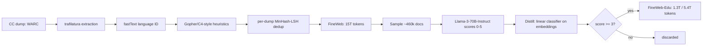

# Breakdown - FineWeb and FineWeb-Edu

> FineWeb is Hugging Face's 15-trillion-token open web corpus, and FineWeb-Edu is its educational-value-filtered subset — both released by Penedo et al. in 2024 as the first web-scale corpus where nearly every filtering decision was validated by actually training models rather than argued from intuition. It matters because it replaced "trust me, we cleaned it" with a public, reusable ablation harness, and by 2026 it — or its DataTrove tooling — sits somewhere in the ancestry of a large share of open pretraining corpora (see [[Reference - Model Genealogy]]).

## The headline numbers

- **FineWeb**: 15T tokens extracted from 96 Common Crawl dumps spanning 2013-2024.
- **FineWeb-Edu**: two released cuts drawn from the FineWeb pool — 1.3T tokens at an aggressive educational-value threshold, and 5.4T tokens at a looser one.
- **Ablation unit**: every design decision was tested by training a 1.82B-parameter model on 350B tokens of the candidate variant — about 192 tokens/parameter, far past the ~20-tokens/parameter [[Concept - Scaling Laws|Chinchilla-optimal]] point, a deliberate overtraining choice that turns the proxy model into a low-noise measuring instrument rather than a compute-efficient one — and comparing on a curated early-signal eval suite (HellaSwag, MMLU, ARC-style tasks).
- **Result**: FineWeb matched or beat RefinedWeb, C4, Dolma, and RedPajama-v2 on that suite; FineWeb-Edu produced 5-7 point jumps on MMLU/ARC-style benchmarks over base FineWeb at equal token count.

## How it actually works

FineWeb instantiates the generic [[Deep Dive - The Pretraining Data Pipeline]] stage graph end to end, run independently per Common Crawl dump before a final merge:

Between extraction and dedup sits a Gopher/C4-style heuristic filter stack, with thresholds tabulated in [[Reference - Data Filtering Heuristics]]. Two findings anchor the rest of the pipeline. First, extraction: FineWeb re-extracts from raw WARC with [[Concept - Text Extraction from Web Pages|trafilatura]] instead of using Common Crawl's pre-extracted WET files, replicating RefinedWeb's (Penedo et al. 2023) central claim that extraction quality alone is a major lever — menus, nav chrome, and cookie banners in WET output are training-signal poison. Second, [[Concept - Deduplication at Scale|deduplication]]: MinHash-LSH runs *per dump*, not globally across all 96 dumps, because a global pass was ablated and found to hurt downstream accuracy (see "the clever parts" below).

FineWeb-Edu adds a second filtering pass on top of the finished FineWeb pool: sample ~460k documents, prompt Llama-3-70B-Instruct to rate each 0-5 for "educational value," then train a cheap linear classifier over document embeddings to replicate those scores across all 15T tokens, and keep documents scoring ≥3 (or a lower threshold for the 5.4T cut).

## The clever parts

1. **Ablation-as-methodology.** Every claim — extraction tool, filter thresholds, dedup granularity — is a measured result from the 1.82B/350B proxy protocol, not an argument from priors. This is the paper's real contribution: a reusable harness, not just a dataset ([[Concept - The Data-Centric View of Model Quality]] cites exactly this kind of evidence).
2. **Re-extraction from WARC**, confirming the extractor is as consequential as any downstream filter — a lesson easy to skip because extraction "isn't filtering," but it dominates.
3. **Per-dump dedup, counterintuitively.** Global cross-dump MinHash dedup was tried and *hurt* performance: content duplicated across many crawls tends to be duplicated *because it's good* (canonical reference pages, popular articles), so global dedup preferentially strips high-quality repeated text while leaving unique low-quality junk over-represented in relative terms. Per-dump dedup avoids this survivorship inversion.
4. **Teacher-label-then-distill for "educational value."** Llama-3-70B-Instruct is far too expensive to score 15T tokens directly, so it scores a 460k sample and a cheap classifier over embeddings replicates its judgment at negligible per-token cost — the same expensive-teacher/cheap-distilled-scorer pattern used throughout [[Concept - Quality Filtering for Pretraining Data]].
5. **Threshold as a tunable knob, not a fixed verdict.** Shipping both a 1.3T aggressive cut and a 5.4T permissive cut lets downstream users pick their point on the quality/quantity frontier rather than being handed one dataset with one implicit tradeoff baked in.

## What it got wrong / what's dated

FineWeb's ablation suite and educational classifier were built and validated primarily on English (multilingual FineWeb-2 arrived later). "Educational" is a *proxy*, not ground truth: the classifier inherits Llama-3-70B's notion of what counts as educational, which skews toward formal, Wikipedia/textbook-register prose and under-represents dialogue, creative writing, and informal-but-useful text — the same distribution-narrowing failure mode as [[Lore - The C4 Blocklist Incident]], arrived at through a smarter mechanism instead of a blunt wordlist. At release, FineWeb was web-only with no heavy [[Concept - Synthetic Training Data|synthetic]] augmentation, unlike some of the recipes that followed it, and its per-dump MinHash dedup still only catches *lexical* near-duplicates — paraphrase-level duplication was left for follow-up work like [[Concept - Semantic Deduplication]]. The 1.82B/350B proxy, while far better than vibes, is still a small-scale stand-in; conclusions validated there can in principle fail to transfer at 70B+ scale and multi-trillion-token budgets — the same transfer risk documented for [[Concept - Learned Data Mixing (DoReMi and Mixing Laws)]].

## What to steal

Never trust a filter's internal precision score — validate every filtering decision by training a small model and measuring real downstream benchmarks, exactly as FineWeb did, rather than assuming a classifier's confidence means anything about the model it will train. If you dedup across multiple partitions (crawls, sources, time windows), test per-partition versus global dedup empirically before assuming more aggressive dedup is strictly better — the FineWeb result generalizes beyond web text. The teacher-labels/cheap-distill pattern is reusable for any expensive-judgment-at-scale problem, not just "educational value." And in most production stacks FineWeb or FineWeb-Edu isn't used alone — it becomes one component of a larger [[Concept - Data Mixtures|data mixture]], blended with code, math, and domain-specific sources; the public ablation logs and blog series (a named instance of [[Reference - Where Real AI Knowledge Lives]]) are worth reading directly for the negative results, which are rarer to find published than the positive ones.

## Connections
- [[Concept - Quality Filtering for Pretraining Data]] — FineWeb-Edu's teacher-label/distill classifier is the canonical worked example of the LLM-annotator paradigm this concept catalogs.
- [[Concept - Text Extraction from Web Pages]] — FineWeb's extraction-quality finding directly replicates the trafilatura-over-WET lesson this concept explains.
- [[Concept - Deduplication at Scale]] — the per-dump-vs-global dedup result is FineWeb's most-cited empirical contribution to this mechanism.
- [[Reference - Data Filtering Heuristics]] — FineWeb's Gopher-style rule stack is one of the tabulated rule sets in this reference.
- [[Concept - The Data-Centric View of Model Quality]] — FineWeb's ablation numbers are primary evidence for this thesis.
- [[Deep Dive - The Pretraining Data Pipeline]] — FineWeb is a fully-documented, concrete instance of the abstract stage graph this note walks through.
- [[Concept - Data Mixtures]] — FineWeb/FineWeb-Edu are typically blended as components of a larger mixture rather than used standalone.
- [[Reference - Where Real AI Knowledge Lives]] — FineWeb's public blog series and ablation logs are a named example of curation knowledge published outside a paper.
- [[Concept - Scaling Laws]] — the deliberate overtraining of the 1.82B proxy model only makes sense measured against the Chinchilla-optimal baseline this concept defines.
- [[Reference - Model Genealogy]] — FineWeb and FineWeb-Edu are ancestor corpora for a large share of open models' pretraining mixtures.
- [[Concept - Semantic Deduplication]] — the natural next step past FineWeb's per-dump MinHash dedup, catching paraphrase-level duplicates lexical hashing misses.

## Sources
- Penedo et al. (2024) — "The FineWeb Datasets: Decanting the Web for the Finest Text Data at Scale." Introduces FineWeb, FineWeb-Edu, DataTrove, and the ablation methodology.
- Penedo et al. (2023) — "The RefinedWeb Dataset for Falcon LLM." Establishes the WARC re-extraction finding FineWeb replicates.
- Dodge et al. (2021) — "Documenting the English Colossal Clean Crawled Corpus." Background on why naive filtering narrows a corpus's distribution — the risk FineWeb-Edu's classifier inherits in subtler form.
