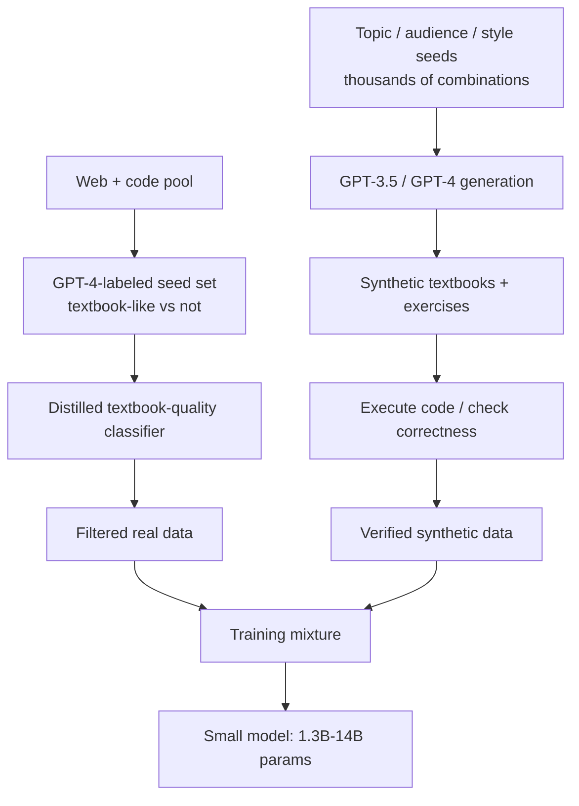

# Breakdown - The Phi Models and Textbook-Quality Data

> Microsoft's Phi line — Phi-1 through Phi-4, 2023-2024 — is the sharpest existence proof that curated and [[Concept - Synthetic Training Data|synthetic]] "textbook-quality" data lets a small model outperform models many times its size, hard evidence for [[Concept - The Data-Centric View of Model Quality]]. The claim isn't architectural: Phi models are ordinary dense transformers, and the lever is entirely the data pipeline — which is why Phi occupies its own branch of [[Reference - Model Genealogy]] built around small-model-plus-curated-data rather than a new architecture.

## The headline numbers

- **Phi-1** (Gunasekar et al. 2023, "Textbooks Are All You Need"): 1.3B parameters, ~7B training tokens (measured in [[Concept - Byte-Pair Encoding|BPE]] tokens, the standard unit for comparing counts across models), 50.6% pass@1 on HumanEval — beating open and closed models an order of magnitude larger on code generation at the time of release.
- **Phi-1.5**: 1.3B parameters, ~30B tokens, mostly synthetic "textbook-like" data, matched reasoning benchmarks of models roughly 5x its size.
- **Phi-2**: 2.7B parameters, continuing the curated-data recipe.
- **Phi-3-mini**: 3.8B parameters, 3.3T training tokens, reported by Microsoft as roughly competitive with Llama-3-8B and Mixtral 8x7B on standard benchmarks *(company-reported, as of 2024)* despite far fewer active parameters than the latter.
- **Phi-4**: 14B parameters (2024), a heavily synthetic-data-centric pipeline, tuned especially for math and reasoning density per parameter.

## How it actually works

The recipe has three moving parts, repeated with variations across generations:

First, a [[Concept - Quality Filtering for Pretraining Data|quality filter]] over real web and code data: GPT-4 labels a seed set of documents as "textbook-like" or not, and that seed trains a lightweight classifier that scores the full pool — the same teacher-label/cheap-distill pattern used by [[Breakdown - FineWeb and FineWeb-Edu]], applied here to a much stricter, narrower notion of "quality" than "educational value." Second, synthetic generation: GPT-3.5/GPT-4 write textbook-style explanations and exercises conditioned on randomized topic, target-audience, and vocabulary-constraint seeds — deliberately engineered for diversity rather than left to a single fixed prompt template. Third, for code specifically, generated exercises are filtered by actually *executing* them and checking correctness, turning "quality" into an objectively checkable property rather than a model's opinion. The filtered-real and verified-synthetic streams are then combined into a single training [[Concept - Data Mixtures|mixture]] before pretraining begins.

## The clever parts

1. **Diversity engineering, not diversity hoping.** Seeding generation with thousands of topic/audience/vocabulary combinations is the explicit mitigation against a single teacher model collapsing into repetitive output — the mechanism [[Concept - Model Collapse from Synthetic Data]] describes as tail-narrowing, headed off here by construction rather than detected after the fact.
2. **Classifier-then-distill filtering of real data**, reusing GPT-4 as a one-time expensive labeler and a lightweight model as the cheap scorer applied at scale — this is [[Concept - Knowledge Distillation]] operating at the *data* layer, not the weights layer.
3. **Generate-then-verify for checkable domains.** Because code has a ground truth (it runs or it doesn't), Phi-1's synthetic exercises are filtered by execution, sidestepping the need to trust any model's judgment of quality — the strategy transfers to math and other verifiable domains but not to open-ended prose.
4. **Quality-per-token over raw quantity.** ~7B tokens for Phi-1 against the many hundreds of billions used by comparable-era open models is the paper's whole bet, and it paid off on the benchmarks it targeted.
5. **Distillation dependency as a design choice, not an accident.** Phi's synthetic corpus is generated by GPT-3.5/GPT-4, so Phi's capability ceiling is bounded by what its teacher can articulate — the model is learning a compressed, curated version of the teacher's knowledge, not discovering capability from raw data at scale.

## What it got wrong / what's dated

The benchmark-contamination question never fully closed: because GPT-4 (the teacher) may echo benchmark-adjacent phrasing when generating "textbook exercises," independent observers raised concern that Phi's benchmark wins partly reflect the teacher's own exposure rather than pure generalization — the exact failure mode [[Concept - Training Set Decontamination]] exists to catch, and Microsoft's own decontamination analyses didn't fully settle the debate. Reproducibility is limited: the exact classifier seeds, prompts, and synthetic corpus were never fully released, so outside labs can replicate the *recipe* but not audit the *corpus* — a sharp contrast with FineWeb's full open release. And the "distillation, not new capability" critique holds structurally: a Phi-scale model trained without access to a frontier teacher would not obviously reproduce these results, so Phi is best read as "how much of GPT-4's knowledge compresses into 1.3B params," not "how much capability comes free from good data alone." By Phi-4, synthetic-heavy pretraining had become common industry practice elsewhere (Llama 3, Qwen), so later Phi releases read as continued execution rather than a fresh discovery.

## What to steal

Ask whether curation buys more than scaling before defaulting to "more tokens" — quality-per-token genuinely substitutes for parameter count within a domain. The classifier-then-distill labeling pattern generalizes to any quality signal that's expensive to judge once but cheap to apply after distillation. Engineer diversity explicitly into any synthetic-generation pipeline — never trust a single teacher and a single prompt template not to collapse. And in verifiable domains, generate-then-verify by execution beats trusting a model's self-assessment of correctness every time.

## Connections
- [[Concept - Synthetic Training Data]] — Phi is the flagship existence proof for the synthetic-pretraining-data thesis this concept covers.
- [[Concept - Quality Filtering for Pretraining Data]] — Phi's classifier-then-distill filtering of real data is a direct instance of the LLM-annotator paradigm.
- [[Concept - Knowledge Distillation]] — Phi's synthetic corpus is generated by GPT-3.5/GPT-4, making the pipeline distillation at the data layer.
- [[Concept - The Data-Centric View of Model Quality]] — Phi-1 beating 10x-larger models is a headline existence proof for this thesis.
- [[Breakdown - FineWeb and FineWeb-Edu]] — both breakdowns use the identical expensive-teacher/cheap-distilled-scorer filtering pattern for different definitions of "quality."
- [[Concept - Model Collapse from Synthetic Data]] — Phi's topic/audience/style seeding is precisely the diversity-engineering mitigation that prevents this failure mode.
- [[Concept - Data Mixtures]] — Phi's training set is itself a tuned mixture of filtered-real and synthetic components.
- [[Reference - Model Genealogy]] — Phi anchors the branch of Microsoft's model lineage built around small-model-plus-curated-data.
- [[Concept - Training Set Decontamination]] — the benchmark-contamination controversy around Phi is exactly the failure mode this concept's methods exist to catch.
- [[Concept - Byte-Pair Encoding]] — Phi's small token budgets ("~7B tokens") are BPE token counts, directly comparable to other models' reported figures because of this shared tokenization convention.

## Sources
- Gunasekar et al. (2023) — "Textbooks Are All You Need." Introduces Phi-1 and the curated+synthetic data recipe.
- Li et al. (2023) — "Textbooks Are All You Need II: phi-1.5 technical report." Extends the recipe with mostly-synthetic training data.
- Abdin et al. (2024) — "Phi-3 Technical Report." Scales the recipe to 3.3T tokens and a 3.8B model competitive with much larger open models.
- Microsoft (2024) — Phi-4 technical report. Heavier synthetic-data emphasis at 14B parameters.
