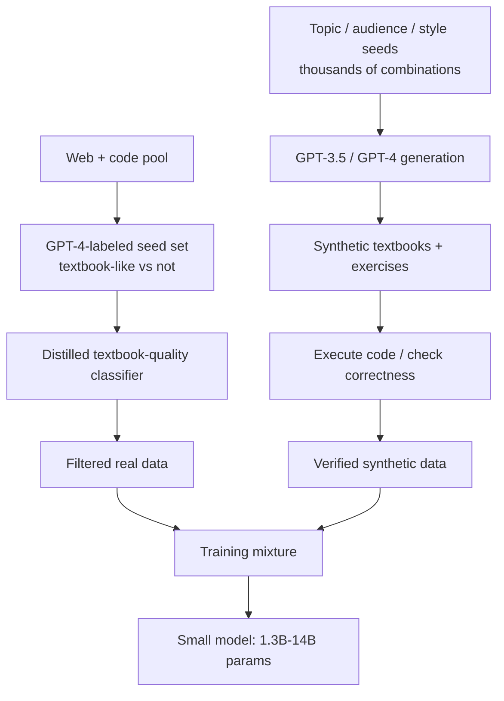

# Breakdown - The Phi Models and Textbook-Quality Data

> Microsoft's Phi line (Phi-1 through Phi-4, 2023-2024) is the sharpest existence proof that curated and [[Concept - Synthetic Training Data|synthetic]] "textbook-quality" data lets a small model outperform models many times its size. That makes it hard evidence for [[Concept - The Data-Centric View of Model Quality]]. Phi models are ordinary dense transformers; the lever is entirely the data pipeline. So Phi gets its own branch of [[Reference - Model Genealogy]], built around small-model-plus-curated-data instead of a new architecture.

## The headline numbers

- **Phi-1** (Gunasekar et al. 2023, "Textbooks Are All You Need"): 1.3B parameters, ~7B training tokens (counted in [[Concept - Byte-Pair Encoding|BPE]] tokens, the standard unit for comparing across models), 50.6% pass@1 on HumanEval. At release that beat open and closed models an order of magnitude larger on code generation.
- **Phi-1.5**: 1.3B parameters, ~30B tokens of mostly synthetic "textbook-like" data. Matched reasoning benchmarks of models roughly 5x its size.
- **Phi-2**: 2.7B parameters, same curated-data recipe.
- **Phi-3-mini**: 3.8B parameters, 3.3T training tokens. Microsoft reports it as roughly competitive with Llama-3-8B and Mixtral 8x7B on standard benchmarks *(company-reported, as of 2024)*, with far fewer active parameters than the latter.
- **Phi-4**: 14B parameters (2024). A heavily synthetic-data-centric pipeline, tuned for math and reasoning density per parameter.

## How it works

Three moving parts, repeated with variations across generations:

The first is a [[Concept - Quality Filtering for Pretraining Data|quality filter]] over real web and code data. GPT-4 labels a seed set of documents as "textbook-like" or not, and that seed trains a lightweight classifier that scores the full pool. [[Breakdown - FineWeb and FineWeb-Edu]] uses the same teacher-label/cheap-distill pattern, but Phi's notion of "quality" is much stricter and narrower than "educational value."

The second is synthetic generation. GPT-3.5/GPT-4 write textbook-style explanations and exercises, conditioned on randomized seeds for topic, target audience and vocabulary constraints. The diversity is engineered; nobody relies on a single fixed prompt template.

The third applies to code: generated exercises are filtered by *executing* them and checking correctness, which makes "quality" an objectively checkable property instead of a model's opinion. The filtered-real and verified-synthetic streams are then combined into one training [[Concept - Data Mixtures|mixture]] before pretraining starts.

## The clever parts

**Diversity by construction.** Seeding generation with thousands of topic/audience/vocabulary combinations is the explicit defense against a single teacher collapsing into repetitive output. [[Concept - Model Collapse from Synthetic Data]] describes that as tail-narrowing; Phi heads it off up front instead of detecting it afterward.

**Classifier-then-distill on real data.** GPT-4 is a one-time expensive labeler and a lightweight model is the cheap scorer applied at scale. That's [[Concept - Knowledge Distillation]] at the *data* layer instead of the weights layer.

**Generate-then-verify where you can check.** Code has a ground truth (it runs or it doesn't), so Phi-1's synthetic exercises are filtered by execution and no model's quality judgment has to be trusted. This carries over to math and other verifiable domains. It doesn't carry over to open-ended prose.

**Quality per token over raw quantity.** ~7B tokens for Phi-1, against the many hundreds of billions comparable-era open models used, was the paper's whole bet. It paid off on the benchmarks it targeted.

**Distillation dependency, on purpose.** GPT-3.5/GPT-4 generate Phi's synthetic corpus, so the teacher's ability to articulate things caps Phi's capability. The model learns a compressed, curated version of the teacher's knowledge. It isn't discovering capability from raw data at scale.

## What it got wrong / what's dated

The benchmark-contamination question never fully closed. GPT-4, the teacher, may echo benchmark-adjacent phrasing when writing "textbook exercises," and independent observers worried that Phi's benchmark wins partly reflect the teacher's exposure and not pure generalization. [[Concept - Training Set Decontamination]] exists to catch this, and Microsoft's own decontamination analyses didn't fully settle the debate.

Reproducibility is limited. The exact classifier seeds, prompts and synthetic corpus were never fully released, so outside labs can replicate the *recipe* but can't audit the *corpus*. FineWeb released everything.

The "distillation, not new capability" critique holds by construction. A Phi-scale model trained without a frontier teacher would not obviously reproduce these results, so read Phi as "how much of GPT-4's knowledge compresses into 1.3B params," not "how much capability good data gives you for free." By Phi-4, synthetic-heavy pretraining was common practice elsewhere (Llama 3, Qwen), and later Phi releases read as continued execution, not a fresh discovery.

## What to steal

Before defaulting to "more tokens," ask whether curation buys more than scaling. Within a domain, quality per token substitutes for parameter count. The classifier-then-distill labeling pattern works for any quality signal that's expensive to judge once but cheap to apply after distillation. Build diversity explicitly into any synthetic-generation pipeline. Never trust one teacher and one prompt template not to collapse. In verifiable domains, verifying by execution beats trusting a model's self-assessment of correctness every time.

## Connections
- [[Concept - Synthetic Training Data]] — Phi is the flagship existence proof for the synthetic-pretraining-data thesis this concept covers.
- [[Concept - Quality Filtering for Pretraining Data]] — Phi's classifier-then-distill filtering of real data is a direct instance of the LLM-annotator paradigm.
- [[Concept - Knowledge Distillation]] — Phi's synthetic corpus is generated by GPT-3.5/GPT-4, making the pipeline distillation at the data layer.
- [[Concept - The Data-Centric View of Model Quality]] — Phi-1 beating 10x-larger models is a headline existence proof for this thesis.
- [[Breakdown - FineWeb and FineWeb-Edu]] — both breakdowns use the identical expensive-teacher/cheap-distilled-scorer filtering pattern for different definitions of "quality."
- [[Concept - Model Collapse from Synthetic Data]] — Phi's topic/audience/style seeding is precisely the diversity-engineering mitigation that prevents this failure mode.
- [[Concept - Data Mixtures]] — Phi's training set is itself a tuned mixture of filtered-real and synthetic components.
- [[Reference - Model Genealogy]] — Phi anchors the branch of Microsoft's model lineage built around small-model-plus-curated-data.
- [[Concept - Training Set Decontamination]] — the benchmark-contamination controversy around Phi is exactly the failure mode this concept's methods exist to catch.
- [[Concept - Byte-Pair Encoding]] — Phi's small token budgets ("~7B tokens") are BPE token counts, directly comparable to other models' reported figures because of this shared tokenization convention.

## Sources
- Gunasekar et al. (2023) — "Textbooks Are All You Need." Introduces Phi-1 and the curated+synthetic data recipe.
- Li et al. (2023) — "Textbooks Are All You Need II: phi-1.5 technical report." Extends the recipe with mostly-synthetic training data.
- Abdin et al. (2024) — "Phi-3 Technical Report." Scales the recipe to 3.3T tokens and a 3.8B model competitive with much larger open models.
- Microsoft (2024) — Phi-4 technical report. Heavier synthetic-data emphasis at 14B parameters.
