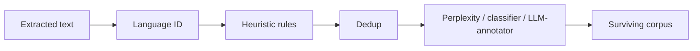

# Concept - Quality Filtering for Pretraining Data

> **One-paragraph hook:** After [[Concept - Text Extraction from Web Pages]] turns HTML into plaintext, most of that plaintext is still garbage: SEO spam, auto-generated boilerplate, keyword-stuffed listicles, gibberish. Quality filtering decides which documents survive, and it's arguably the highest-leverage lever in pretraining. What separates a mediocre corpus from a frontier one is a better filter deciding what to throw away, not more data.

## The mechanism

Quality filtering has a fixed position in the [[Deep Dive - The Pretraining Data Pipeline]]. It comes after language ID, because filters are language-specific (a Gopher rule tuned on English breaks on Chinese). It comes *before* the expensive stages, ideally after [[Concept - Deduplication at Scale]] has removed exact and near-duplicate documents, so you don't spend classifier compute scoring the same page ten times.

Three paradigms, rising in cost and semantic depth:

**1. Heuristic (rule-based) filters.** Cheap checks that catch boilerplate, spam and non-natural text without reading for meaning: minimum/maximum document length, mean word length between roughly 3 and 10 characters, symbol-to-word ratio under 0.1, fraction of lines ending in terminal punctuation, presence of common stopwords, bullet/ellipsis ratios. C4 (Raffel et al. 2020) and Gopher/MassiveText (Rae et al. 2021) are the canonical rule sets; the exact constants are in [[Reference - Data Filtering Heuristics]]. Nearly free per document; they run first.

**2. Perplexity-based filters.** Score each document with a small n-gram language model and bucket documents into head/middle/tail thirds by per-token perplexity. CCNet (Wenzek et al. 2019) trains a KenLM 5-gram model on Wikipedia:

$$\text{PPL}(x) = \exp\left(-\frac{1}{N}\sum_{i=1}^{N} \log p(w_i \mid w_{<i})\right)$$

Low perplexity relative to a "clean" reference (Wikipedia) means the text reads like fluent natural language. High perplexity flags boilerplate, keyword salad and non-natural text. It's cheap, needs no labels, and works for any language with reference text, which is how CCNet scales to 100+ languages.

**3. Classifier / LLM-annotator filters.** Train a fast classifier. GPT-3 (Brown et al. 2020) used a linear classifier over curated positives (Wikipedia, WebText-like references) versus random Common Crawl negatives, then kept documents probabilistically via a Pareto-distribution threshold instead of a hard cutoff, which preserved some tail diversity. FineWeb-Edu (Penedo et al. 2024, see [[Breakdown - FineWeb and FineWeb-Edu]]) goes further. It prompts Llama-3-70B-Instruct to rate ~460k samples for "educational value" on a 0–5 scale, then distills those ratings into a cheap linear classifier over embeddings that can run at trillion-token scale. Documents scoring ≥3 are kept.

## In practice

Order matters. Language ID runs first because every downstream rule is language-specific. Heuristics run before the expensive classifier because they're nearly free and cheaply remove the easy 50%+ of junk. Dedup should run before quality scoring so you don't pay classifier cost N times for N copies of the same page. Getting this order wrong is a common, expensive first-pass mistake.

Expect brutal survival rates. Filtering plus dedup strips the overwhelming majority of documents from a raw Common Crawl dump; typical open pipelines keep on the order of 1–15% of input as final tokens (RefinedWeb kept roughly 11%). A survival rate above ~50% after the full stack usually means your filters are too weak. Well under ~0.5% usually means they're too aggressive and you're discarding usable text with the garbage.

FineWeb-Edu's classifier moves results measurably. Filtering the same raw pool down to documents scoring ≥3 gave 5–7 point jumps on knowledge benchmarks like MMLU and ARC over the unfiltered or lightly-heuristic-filtered baseline at matched token count. That's a concrete case of [[Concept - The Data-Centric View of Model Quality]]'s claim that at fixed compute, curation moves downstream accuracy more than architecture does.

## Failure modes

**Over-filtering induces distribution shift.** Every filter is a value judgment about what "good" text looks like. Aggressive filtering also narrows the corpus toward whatever the filter's positives looked like. The standard cautionary tale is [[Lore - The C4 Blocklist Incident]]: a lexical "bad words" blocklist used to build C4 disproportionately deleted LGBTQ+ content, discussion of sexual health, and text in African-American-aligned English, while unrelated harmful content survived because it contained no listed words.

**Classifiers learn surface features, not quality.** Train with Wikipedia-like positives and the classifier learns to detect formality and topic, not truth or reasoning depth. Code, poetry, dialogue and dialect-marked text score low because they don't look like the reference class, whether or not they're bad. It's the same proxy-vs-target gap that shows up in reward modeling.

**Scoring before dedup wastes compute and biases thresholds.** Ten near-identical copies of a viral spam page cost ten classifier scores. If that page happens to score well, its weight in the survivor pool is inflated tenfold.

## The non-obvious

The best evidence against trusting a filter's internal precision is DCLM (Li et al. 2024, see [[Decision - Choosing a Quality Filtering Strategy]]). It fixes the model architecture and the raw candidate pool and makes the filtering pipeline the only variable. Nothing else tells you whether a filter change helped or just felt principled. FineWeb's methodology follows the same discipline: every filtering choice was validated by training a 1.8B model on 350B tokens and comparing against a fixed eval suite, not by checking the filter's precision on a held-out sample of its own training distribution. If you can't point to an ablation that trained a model with and without your filter, you don't know whether it helped.

## Connections
- [[Reference - Data Filtering Heuristics]] — the exact rule constants (Gopher, C4, RefinedWeb) this note deliberately leaves out to stay a mechanism note, not a lookup sheet.
- [[Decision - Choosing a Quality Filtering Strategy]] — how to pick among the three paradigms for a given compute budget and language set.
- [[Concept - Entropy and Cross-Entropy]] — perplexity-based filtering is literally cross-entropy under a reference language model; the filter *is* an entropy measurement.
- [[Breakdown - FineWeb and FineWeb-Edu]] — the reference example of an LLM-annotator filter taken to production scale with a published ablation harness.
- [[Concept - Deduplication at Scale]] — the pipeline-ordering partner: dedup should generally run before the expensive classifier pass.
- [[Lore - The C4 Blocklist Incident]] — the canonical failure mode of a filter encoding its author's blind spots as "clean."
- [[Concept - Common Crawl and Web Data at Scale]] — the raw material every quality filter operates on; filtering exists because Common Crawl is mostly not usable as-is.
- [[Concept - LLM-as-Judge]] — the FineWeb-Edu annotator is structurally the same move as LLM-as-judge evaluation: use a strong model's judgment as a cheap, distillable label source.

## Sources
- Raffel et al. (2020) — "Exploring the Limits of Transfer Learning with a Unified Text-to-Text Transformer": the C4 heuristic filter set.
- Rae et al. (2021) — "Scaling Language Models: Methods, Analysis & Insights from Training Gopher": the MassiveText heuristic rule set, more extensive than C4's.
- Wenzek et al. (2019) — "CCNet: Extracting High Quality Monolingual Datasets from Web Crawl Data": KenLM perplexity-bucket filtering, scaling to 100+ languages.
- Brown et al. (2020) — "Language Models are Few-Shot Learners" (GPT-3): the classifier + Pareto-threshold quality filter used for GPT-3's training corpus.
- Penedo et al. (2024) — "FineWeb: decanting the web for the finest text data at scale": the LLM-annotator-distilled classifier behind FineWeb-Edu.
- Li et al. (2024) — "DataComp-LM: In search of the next generation of training sets for language models": a standardized benchmark isolating filtering pipelines as the sole variable.
