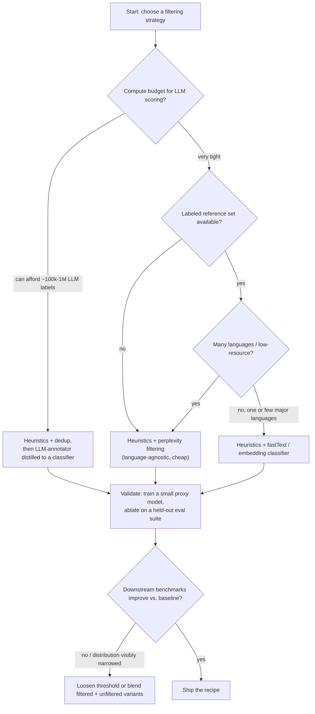

# Decision - Choosing a Quality Filtering Strategy

> The decision: which of heuristic rules, perplexity scoring, a trained classifier, or an LLM-annotator (or some ordered combination) should filter your pretraining corpus. **Default for the 80% case, as of 2026:** run cheap heuristics (thresholds in [[Reference - Data Filtering Heuristics]]) and dedup first to remove obvious junk, then put a classifier or LLM-annotator on the survivors. That's the [[Breakdown - FineWeb and FineWeb-Edu|FineWeb-Edu]] recipe. Heuristics alone plateau well before they capture semantic quality, and an LLM-annotator run over raw, unfiltered Common Crawl spends most of its budget scoring text that heuristics would have rejected for free.

## Decision flow

## Tradeoff matrix

| Strategy | Relative cost | Language coverage | Captures semantic quality | Main failure mode | Example system |
|---|---|---|---|---|---|
| Heuristic rules ([[Concept - Quality Filtering for Pretraining Data]]) only | ~1x (near-free) | Language-agnostic if rules are | No, structural only | Misses fluent but low-value text | C4, Gopher |
| Perplexity (KenLM, [[Concept - Entropy and Cross-Entropy]]) | ~1-5x | Language-agnostic, cheap per language | Weak, fluency proxy only | Penalizes valid non-prose: code, poetry, lists | CCNet |
| Classifier (fastText / embeddings) | ~10-50x | Needs a per-language reference set | Moderate, topic/formality proxy | Learns surface features, narrows distribution | GPT-3's Pareto filter |
| LLM-annotator + distill | ~500-1000x for the labeling phase (order-of-magnitude, not measured precisely); the distilled scorer is cheap at inference | Needs a teacher fluent in the target language | Strong, actual semantic judgment | Inherits the annotator's own biases and blind spots | FineWeb-Edu |

These costs are relative order-of-magnitude estimates for scoring one document, not audited benchmarks. Weigh them against the compute budget of the training run the corpus ends up feeding ([[Concept - Scaling Laws]]), not in isolation. [[Concept - The Data-Centric View of Model Quality]] quantifies the accuracy differences: filtering choices move downstream benchmark scores by several points at fixed compute.

## What flips the decision

Corpus spans 100+ languages and per-language reference sets don't exist? Then classifiers and LLM-annotators are impractical whatever the budget. Fall back to perplexity plus heuristics, which is CCNet's actual use case.

If the target domain is already narrow and objectively checkable (code, math), a small hand-built rule set or execution-based verification often beats a general semantic classifier. "Quality" there has a ground truth; you don't need a semantic judgment call.

At ablation scale (well under a million documents), the "1000x" relative cost of LLM-annotator labeling is trivial in absolute dollars. The expense only bites at trillion-token production scale.

If your classifier's positive labels all come from one narrow register (Wikipedia-only, "textbook-like" only), expect the corpus to drift toward that register's style. [[Lore - The C4 Blocklist Incident]] and FineWeb-Edu's own English/formal-prose skew are two different mechanisms that produce the same shape of failure. The fix is validating with held-out downstream training ablations; a classifier's internal confidence tells you nothing here (see [[Gotchas - Pretraining Data Pipelines]] for what happens when you skip this).

And if synthetic or model-generated text is already in your candidate pool, quality filtering interacts with [[Concept - Deduplication at Scale|dedup]] in unexpected ways. A filter tuned for "fluency" can preferentially keep the documents that sound most model-generated, i.e. the ones already contaminating the corpus.

## Connections
- [[Concept - Quality Filtering for Pretraining Data]] — this decision operationalizes the three paradigms that concept catalogs into an actual choice procedure.
- [[Reference - Data Filtering Heuristics]] — once "heuristics" is chosen, this reference has the exact thresholds to implement it.
- [[Breakdown - FineWeb and FineWeb-Edu]] — the default 80%-case recipe (heuristics + dedup, then LLM-annotator) is literally FineWeb-Edu's pipeline.
- [[Concept - Entropy and Cross-Entropy]] — perplexity filtering is cross-entropy under a reference language model, the direct mechanism this concept defines.
- [[Concept - Deduplication at Scale]] — dedup is bundled into the cheap first pass of the default recipe and must run before quality scoring to avoid wasting compute on duplicates.
- [[Concept - The Data-Centric View of Model Quality]] — this decision only matters because filtering strategy measurably moves downstream benchmark scores, the thesis this concept establishes.
- [[Concept - Scaling Laws]] — the "expensive at scale" framing for LLM-annotator labeling is only meaningful relative to the compute budget the resulting corpus feeds.
- [[Gotchas - Pretraining Data Pipelines]] — "quality classifier silently narrowed the corpus" is exactly the failure mode this decision's validation step exists to prevent.

## Sources
- Penedo et al. (2024) — "The FineWeb Datasets: Decanting the Web for the Finest Text Data at Scale." Source of the default 80%-case recipe (heuristics + dedup, then LLM-annotator distillation).
- Wenzek et al. (2019) — "CCNet: Extracting High Quality Monolingual Datasets from Web Crawl Data." The perplexity-bucketing approach this decision's low-resource-language branch defaults to.
- Rae et al. (2021) — "Scaling Language Models: Methods, Analysis & Insights from Training Gopher." Source of the Gopher-style heuristic rule stack this decision's first pass runs.
- Dodge et al. (2021) — "Documenting the English Colossal Clean Crawled Corpus." Evidence for the narrow-register classifier-bias risk this decision's edge cases warn about.
