# Deep Dive - The Pretraining Data Pipeline

> **One-paragraph hook:** A frontier pretraining corpus isn't a folder of text someone downloaded — it's the output of a multi-stage distributed system, and the order the stages run in is as load-bearing as what each stage does. [[Concept - Common Crawl and Web Data at Scale]] supplies the raw material, measured in hundreds of terabytes per snapshot; by the time it reaches a GPU, the overwhelming majority of it has been thrown away. Architectures have converged to a handful of decoder-only variants that every lab can read in a paper; this pipeline — the one thing that stays undocumented — is where the actual competitive advantage lives.

## The mechanism

The pipeline is a directed graph of stages, and the edges encode real constraints, not stylistic preference. Four ordering rules dominate:

**Language ID runs before filtering**, because every heuristic threshold downstream is language-specific. A [[Concept - Quality Filtering for Pretraining Data|Gopher-style]] symbol-to-word ratio tuned on English punctuation conventions misfires on Chinese or Arabic text; you cannot apply one rule set to an undifferentiated multilingual pool and expect it to mean the same thing everywhere.

**Deduplication runs before quality classification**, and this is a cost argument as much as a correctness one. A classifier or LLM-annotator pass — the expensive stage — has to be paid for per document scored. If a corpus is 30–50% duplicate content by volume (SlimPajama's dedup of RedPajama removed roughly half the corpus by [[Concept - Deduplication at Scale|token count]]), scoring before dedup means paying full classifier cost for the same page ten times over. Dedup first is the single largest compute-saving ordering decision in the entire pipeline.

**Decontamination runs late, against eval sets**, because it targets a moving list. New benchmarks ship continuously, and [[Concept - Training Set Decontamination]] has to be re-run against whatever the current eval suite is — it can't be baked into an early, one-time filtering pass the way heuristic rules can.

**Mixture weighting and the global shuffle run last, immediately before sharding.** Both operate on the already-curated pool: you cannot correctly upweight a domain's [[Concept - Data Mixtures|sampling rate]] until you know its final, post-filter, post-dedup size, and you cannot shuffle a corpus that still has stages ahead of it that might drop or reorder documents.

## Architecture / walkthrough

```mermaid
flowchart LR
    A["Raw WARC dump<br/>~90-100 TiB compressed"] --> B["Text extraction<br/>trafilatura / resiliparse"]
    B --> C["Language ID<br/>fastText lid.176"]
    C --> D["Heuristic filters<br/>Gopher / C4 rules"]
    D --> E["Deduplication<br/>MinHash-LSH / ExactSubstr"]
    E --> F["Quality scoring<br/>classifier or LLM-annotator"]
    F --> G["Decontamination<br/>vs eval benchmarks"]
    G --> H["Mixture weighting<br/>+ global seeded shuffle"]
    H --> I["Tokenize (BPE) + pack<br/>+ write shards"]
    I --> J["Training job"]
```



Each arrow is a volume collapse. A single Common Crawl snapshot is roughly 90–100 TiB of compressed [[Concept - Common Crawl and Web Data at Scale|WARC]] (250+ TiB uncompressed), holding a few billion pages. [[Concept - Text Extraction from Web Pages|Extraction]] strips the HTML down to plaintext; heuristics and dedup together do most of the volume destruction; quality scoring trims further. The end-to-end survival rate — final tokens divided by raw input tokens — typically lands at 1–15%: RefinedWeb (Penedo et al. 2023) reported keeping roughly 11% of its input as final tokens, and FineWeb (Penedo et al. 2024) surfaced 15T final tokens out of 96 processed Common Crawl dumps spanning 2013–2024. A survival rate far above 50% after the full stack is a sign the filters are too weak; well under 0.5% usually means legitimate text is being discarded along with the garbage.

The handoff into training is its own mini-pipeline. Surviving documents are tokenized with a [[Concept - Byte-Pair Encoding|BPE]] tokenizer, packed into fixed-length sequences with document-boundary separator tokens so the model doesn't attend across unrelated documents, globally shuffled under a fixed RNG seed, and written as memory-mapped shards for random-access reading during training:

```text
documents (post-mixture, post-shuffle)
  -> tokenize (BPE)
  -> pack into fixed-length sequences, insert <doc_sep> at boundaries
  -> write memmap shards: Megatron .bin/.idx | WebDataset .tar | Mosaic MDS
```

The shard format matters operationally: Megatron's `.bin`/`.idx` pair supports O(1) random-access token reads without deserializing the whole file, which is what makes exact, resumable dataloader state — required by the training loop in [[Deep Dive - Anatomy of a Pretraining Run]] — possible at trillion-token scale.

## In practice

Reproducibility in this pipeline is fragile in a way that's easy to underestimate. A "corpus" is not a fixed artifact — it's the output of a specific pipeline configuration: filter thresholds, dedup similarity threshold, RNG seed, and the exact versions of every tool involved. Bump the `trafilatura` extraction library's version and the same raw WARC produces measurably different plaintext; the corpus you get from "the same pipeline" six months later is not guaranteed to be the same corpus. This is why open efforts version and hash their entire toolchain — the Dolma toolkit (Soldaini et al. 2024, AI2), DataTrove (the library HuggingFace built to produce FineWeb), and the published RedPajama processing scripts (Together AI, 2023) all exist specifically to make "rerun this exact pipeline" a reproducible operation rather than an approximation.

The cost profile is dominated by CPU, not GPU. Extraction is embarrassingly parallel but has to touch every page in every dump; dedup is a distributed shuffle-and-join over the whole corpus. Producing a frontier-scale corpus is a multi-hundred-thousand CPU-hour distributed job run on Spark, Ray, or SLURM — an amount of engineering effort that rivals, and sometimes exceeds, the GPU-hours spent on the training run the corpus feeds. Almost none of it shows up in a technical report: labs publish parallelism layouts and optimizer choices in detail, and describe their data pipeline in a paragraph.

## Failure modes

- **Loss spikes or NaNs early in a run trace back to an unshuffled or corrupted shard** — one domain clustered contiguously because the global shuffle step was skipped, misconfigured, or seeded inconsistently across writer processes; detection is plotting loss against data order and checking for a step boundary that lines up with a shard or domain transition.
- **Verbatim memorization at inference time traces back to a dedup threshold that was too loose or exact-match-only** — near-duplicates with minor edits survive a hash-only pass; detection is prompting with document prefixes from the training set and measuring verbatim continuation length (Carlini-style extraction probing).
- **Suspiciously high benchmark scores trace back to decontamination that only ran against a fixed, known benchmark list** — a paraphrased or reformatted version of a test item, or a benchmark released after the crawl date, slips through n-gram matching entirely; detection is a per-benchmark train/test overlap report re-run against the current eval suite, not just the one used at build time.
- **A corpus silently regresses between "pipeline v1" and "pipeline v1, rerun six months later"** because a dependency (extractor, tokenizer, LSH library) updated its behavior without a version pin; detection requires hashing the full toolchain and diffing corpus statistics (token count, language histogram, survival rate) between runs, not trusting that "same config" means "same output."

## The non-obvious

The ordering constraints above aren't just about correctness — they're the pipeline's actual cost-optimization strategy. Running dedup before quality scoring isn't merely tidier: given that dedup routinely removes 30–50% of a raw pool by volume (the SlimPajama figure above), running the expensive classifier or LLM-annotator stage after dedup rather than before is frequently the single biggest lever on total pipeline compute cost — bigger than any individual filter tuning decision. Practitioners who build a first-pass pipeline in the "obvious" order (filter, then dedup, then decontaminate) often discover this the expensive way, by burning classifier compute on documents that get deleted three stages later anyway.

The second non-obvious point is about where the real intellectual property sits. The transformer architecture, the optimizer, even most of the training loop are public knowledge, reproducible from papers. The data pipeline — the exact filter thresholds, the classifier training data, the dedup granularity choices, the mixture weights — is the part frontier labs say the least about, because it's the part that isn't trivially reproducible from a paper's method section. If two labs start from the same Common Crawl dumps and end up with measurably different downstream models, the pipeline described in this note is almost always where that difference was manufactured.

## Evolution

The pipeline's sophistication tracks a roughly four-stage history. **C4** (Raffel et al. 2020) used Common Crawl's naive WET plaintext extraction plus a small set of heuristic line-level rules — cheap, but leaving real quality on the table by not re-extracting from raw HTML. **RefinedWeb** (Penedo et al. 2023) showed that re-extracting from WARC with a real content extractor and applying much heavier heuristics plus document- and line-level dedup was, by itself, a major quality lever — arguably the paper's central finding. **FineWeb-Edu and DCLM** (Penedo et al. 2024; Li et al. 2024) shifted the paradigm again: instead of hand-designed rules, they used ablation-driven pipeline design (train a small model, measure, iterate) and LLM-annotator-distilled classifiers to select for semantic properties like educational value, rather than just structural cleanliness. Through 2024–2025 the frontier moved toward augmenting the curated web pool with [[Concept - Synthetic Training Data|synthetic and rephrased data]] and reserving the highest-quality material for annealing/cooldown phases late in training, treating the pipeline's output not as one static corpus but as a sequence of mixtures presented over the course of a run — see [[Concept - Data Curriculum and Ordering]].

## Connections
- [[Concept - Common Crawl and Web Data at Scale]] — the raw material entering the pipeline's first stage, and the source of the volume numbers this note's collapse math is built on.
- [[Concept - Text Extraction from Web Pages]] — the first real quality lever in the pipeline; the RefinedWeb finding that motivates skipping WET entirely.
- [[Concept - Quality Filtering for Pretraining Data]] — the stage this note's ordering rules place after dedup and before decontamination, and why.
- [[Concept - Deduplication at Scale]] — the stage whose placement (before quality scoring) is this note's central cost-optimization argument.
- [[Concept - Training Set Decontamination]] — why this stage must run late, against a benchmark list that keeps growing after the corpus is built.
- [[Concept - Data Mixtures]] — the domain-weighting decision applied to the fully curated pool, right before the final shuffle.
- [[Concept - Byte-Pair Encoding]] — the tokenizer that consumes this pipeline's output and turns surviving text into the training-ready token stream.
- [[Deep Dive - Anatomy of a Pretraining Run]] — the system that consumes this pipeline's sharded output; its resumable-dataloader requirement is why shard format matters here.
- [[Playbook - Building a Pretraining Corpus from Common Crawl]] — the operational, step-by-step execution of the architecture this note describes.
- [[Gotchas - Pretraining Data Pipelines]] — the aggregated failure catalogue this note's Failure modes section samples from.
- [[Breakdown - FineWeb and FineWeb-Edu]] — a fully reverse-engineered, real instance of this exact pipeline, including the counterintuitive per-dump dedup finding.
- [[Concept - Data Curriculum and Ordering]] — governs how this pipeline's output is presented over time (shuffled vs. annealed), a decision made after this note's pipeline is done.
- [[Concept - Synthetic Training Data]] — the 2024–2025 evolution of this pipeline's output, augmenting curated web text rather than replacing it.
- [[Concept - Benchmark Contamination]] — the evaluation-side twin of this note's decontamination stage; contamination that survives here shows up there as an inflated score.

## Sources
- Raffel et al. (2020) — "Exploring the Limits of Transfer Learning with a Unified Text-to-Text Transformer": introduced C4 and the WET-plus-heuristics baseline this pipeline's evolution starts from.
- Penedo et al. (2023) — "The RefinedWeb Dataset for Falcon LLM": established WARC re-extraction plus heavy heuristic and dedup filtering as a major quality lever.
- Penedo et al. (2024) — "FineWeb: decanting the web for the finest text data at scale": the ablation-driven, fully open pipeline (and DataTrove tooling) this note's architecture diagram is modeled on.
- Soldaini et al. (2024) — "Dolma: an Open Corpus of Three Trillion Tokens for Language Model Pretraining Research": the versioned, reproducible open-source pipeline toolkit referenced in In Practice.
- Li et al. (2024) — "DataComp-LM: In search of the next generation of training sets for language models": DCLM's standardized benchmark isolating the filtering pipeline as the variable under test.
