# Deep Dive - The Pretraining Data Pipeline

> **One-paragraph hook:** A frontier pretraining corpus is the output of a multi-stage distributed system, and the order the stages run in matters as much as what each stage does. [[Concept - Common Crawl and Web Data at Scale]] supplies the raw material, hundreds of terabytes per snapshot; by the time it reaches a GPU, the overwhelming majority of it has been thrown away. Architectures have converged to a handful of decoder-only variants that every lab can read about in a paper. This pipeline is the part that stays undocumented, and it's where the competitive advantage lives.

## The mechanism

The pipeline is a directed graph of stages, and the edges encode real constraints. Four ordering rules dominate.

**Language ID runs before filtering**, because every heuristic threshold downstream is language-specific. A [[Concept - Quality Filtering for Pretraining Data|Gopher-style]] symbol-to-word ratio tuned on English punctuation misfires on Chinese or Arabic text. One rule set applied to an undifferentiated multilingual pool won't mean the same thing everywhere.

**Deduplication runs before quality classification.** That's as much about cost as correctness. The classifier or LLM-annotator pass is the expensive stage, and you pay for it per document scored. If a corpus is 30–50% duplicate content by volume (SlimPajama's dedup of RedPajama removed roughly half the corpus by [[Concept - Deduplication at Scale|token count]]), scoring before dedup means paying full classifier cost for the same page ten times over. Dedup-first is the single largest compute-saving ordering decision in the whole pipeline.

**Decontamination runs late, against eval sets**, because its target list moves. New benchmarks ship continuously, so [[Concept - Training Set Decontamination]] has to be re-run against whatever the current eval suite is. It can't be baked into an early one-time pass the way heuristic rules can.

**Mixture weighting and the global shuffle run last, right before sharding.** Both work on the already-curated pool. You can't correctly upweight a domain's [[Concept - Data Mixtures|sampling rate]] until you know its final post-filter, post-dedup size, and you can't shuffle a corpus that still has stages ahead of it that might drop or reorder documents.

## Architecture / walkthrough

```mermaid
flowchart LR
    A["Raw WARC dump<br/>~90-100 TiB compressed"] --> B["Text extraction<br/>trafilatura / resiliparse"]
    B --> C["Language ID<br/>fastText lid.176"]
    C --> D["Heuristic filters<br/>Gopher / C4 rules"]
    D --> E["Deduplication<br/>MinHash-LSH / ExactSubstr"]
    E --> F["Quality scoring<br/>classifier or LLM-annotator"]
    F --> G["Decontamination<br/>vs eval benchmarks"]
    G --> H["Mixture weighting<br/>+ global seeded shuffle"]
    H --> I["Tokenize (BPE) + pack<br/>+ write shards"]
    I --> J["Training job"]
```



Each arrow is a volume collapse. A single Common Crawl snapshot is roughly 90–100 TiB of compressed [[Concept - Common Crawl and Web Data at Scale|WARC]] (250+ TiB uncompressed) holding a few billion pages. [[Concept - Text Extraction from Web Pages|Extraction]] strips the HTML to plaintext. Heuristics and dedup together do most of the volume destruction, and quality scoring trims further.

End-to-end survival (final tokens over raw input tokens) typically lands at 1–15%. RefinedWeb (Penedo et al. 2023) reported keeping roughly 11% of its input as final tokens; FineWeb (Penedo et al. 2024) got 15T final tokens out of 96 processed Common Crawl dumps spanning 2013–2024. Survival far above 50% after the full stack means the filters are too weak. Well under 0.5% usually means legitimate text is going out with the garbage.

Handoff into training is its own mini-pipeline. Surviving documents get tokenized with a [[Concept - Byte-Pair Encoding|BPE]] tokenizer, packed into fixed-length sequences with document-boundary separator tokens so the model doesn't attend across unrelated documents, globally shuffled under a fixed RNG seed, and written as memory-mapped shards for random-access reads during training:

```text
documents (post-mixture, post-shuffle)
  -> tokenize (BPE)
  -> pack into fixed-length sequences, insert <doc_sep> at boundaries
  -> write memmap shards: Megatron .bin/.idx | WebDataset .tar | Mosaic MDS
```

Shard format matters operationally. Megatron's `.bin`/`.idx` pair supports O(1) random-access token reads without deserializing the whole file. At trillion-token scale, that's what makes exact, resumable dataloader state possible, and the training loop in [[Deep Dive - Anatomy of a Pretraining Run]] requires it.

## In practice

Reproducibility here is more fragile than it looks. A "corpus" is the output of one specific pipeline configuration: filter thresholds, dedup similarity threshold, RNG seed, and the exact versions of every tool involved. Bump the `trafilatura` extraction library's version and the same raw WARC produces measurably different plaintext. Run "the same pipeline" six months later and you aren't guaranteed the same corpus. So open efforts version and hash their entire toolchain. The Dolma toolkit (Soldaini et al. 2024, AI2), DataTrove (the library HuggingFace built to produce FineWeb) and the published RedPajama processing scripts (Together AI, 2023) all exist to make "rerun this exact pipeline" a reproducible operation instead of an approximation.

The cost is mostly CPU. Extraction is embarrassingly parallel but has to touch every page in every dump; dedup is a distributed shuffle-and-join over the whole corpus. A frontier-scale corpus is a multi-hundred-thousand CPU-hour distributed job on Spark, Ray, or SLURM, an engineering effort that rivals and sometimes exceeds the GPU-hours of the training run it feeds. Almost none of it shows up in a technical report. Labs publish parallelism layouts and optimizer choices in detail and give the data pipeline a paragraph.

## Failure modes

- **Loss spikes or NaNs early in a run trace back to an unshuffled or corrupted shard.** One domain ended up clustered contiguously because the global shuffle was skipped, misconfigured, or seeded inconsistently across writer processes. Detect it by plotting loss against data order and looking for a step boundary that lines up with a shard or domain transition.
- **Verbatim memorization at inference time traces back to a dedup threshold that was too loose or exact-match-only.** Near-duplicates with minor edits survive a hash-only pass. Detect it by prompting with document prefixes from the training set and measuring verbatim continuation length (Carlini-style extraction probing).
- **Suspiciously high benchmark scores trace back to decontamination that only ran against a fixed, known benchmark list.** A paraphrased or reformatted test item, or a benchmark released after the crawl date, slips through n-gram matching entirely. Detect it with a per-benchmark train/test overlap report re-run against the current eval suite, not just the one used at build time.
- **A corpus silently regresses between "pipeline v1" and "pipeline v1, rerun six months later"** because a dependency (extractor, tokenizer, LSH library) changed behavior without a version pin. Detecting it means hashing the full toolchain and diffing corpus statistics (token count, language histogram, survival rate) between runs. "Same config" doesn't mean "same output."

## The non-obvious

The ordering constraints are also the pipeline's cost-optimization strategy. Dedup routinely removes 30–50% of a raw pool by volume (the SlimPajama figure above), so putting the expensive classifier or LLM-annotator stage after dedup is frequently the single biggest lever on total pipeline compute, bigger than any individual filter-tuning decision. People who build a first-pass pipeline in the "obvious" order (filter, then dedup, then decontaminate) often find this out the expensive way, burning classifier compute on documents that get deleted three stages later.

The second point is about where the intellectual property sits. The transformer architecture, the optimizer and most of the training loop are public and reproducible from papers. The data pipeline (exact filter thresholds, classifier training data, dedup granularity, mixture weights) is what frontier labs say least about, because it can't be trivially rebuilt from a methods section. When two labs start from the same Common Crawl dumps and end up with measurably different downstream models, the difference was almost always made in this pipeline.

## Evolution

Pipeline sophistication follows a roughly four-stage history. **C4** (Raffel et al. 2020) used Common Crawl's naive WET plaintext extraction plus a small set of heuristic line-level rules. Cheap, but it left quality on the table by not re-extracting from raw HTML. **RefinedWeb** (Penedo et al. 2023) showed that re-extracting from WARC with a real content extractor, plus much heavier heuristics and document- and line-level dedup, was by itself a major quality lever; arguably that's the paper's central finding. **FineWeb-Edu and DCLM** (Penedo et al. 2024; Li et al. 2024) shifted the paradigm again. They replaced hand-designed rules with ablation-driven pipeline design (train a small model, measure, iterate) and LLM-annotator-distilled classifiers that select for semantic properties like educational value, beyond structural cleanliness. Through 2024–2025 the frontier moved toward augmenting the curated web pool with [[Concept - Synthetic Training Data|synthetic and rephrased data]] and saving the highest-quality material for annealing/cooldown late in training. The pipeline's output stopped being one static corpus and became a sequence of mixtures presented over a run; see [[Concept - Data Curriculum and Ordering]].

## Connections
- [[Concept - Common Crawl and Web Data at Scale]] — the raw material entering the pipeline's first stage, and the source of the volume numbers this note's collapse math is built on.
- [[Concept - Text Extraction from Web Pages]] — the first real quality lever in the pipeline; the RefinedWeb finding that motivates skipping WET entirely.
- [[Concept - Quality Filtering for Pretraining Data]] — the stage this note's ordering rules place after dedup and before decontamination, and why.
- [[Concept - Deduplication at Scale]] — the stage whose placement (before quality scoring) is this note's central cost-optimization argument.
- [[Concept - Training Set Decontamination]] — why this stage must run late, against a benchmark list that keeps growing after the corpus is built.
- [[Concept - Data Mixtures]] — the domain-weighting decision applied to the fully curated pool, right before the final shuffle.
- [[Concept - Byte-Pair Encoding]] — the tokenizer that consumes this pipeline's output and turns surviving text into the training-ready token stream.
- [[Deep Dive - Anatomy of a Pretraining Run]] — the system that consumes this pipeline's sharded output; its resumable-dataloader requirement is why shard format matters here.
- [[Playbook - Building a Pretraining Corpus from Common Crawl]] — the operational, step-by-step execution of the architecture this note describes.
- [[Gotchas - Pretraining Data Pipelines]] — the aggregated failure catalogue this note's Failure modes section samples from.
- [[Breakdown - FineWeb and FineWeb-Edu]] — a fully reverse-engineered, real instance of this exact pipeline, including the counterintuitive per-dump dedup finding.
- [[Concept - Data Curriculum and Ordering]] — governs how this pipeline's output is presented over time (shuffled vs. annealed), a decision made after this note's pipeline is done.
- [[Concept - Synthetic Training Data]] — the 2024–2025 evolution of this pipeline's output, augmenting curated web text rather than replacing it.
- [[Concept - Benchmark Contamination]] — the evaluation-side twin of this note's decontamination stage; contamination that survives here shows up there as an inflated score.

## Sources
- Raffel et al. (2020) — "Exploring the Limits of Transfer Learning with a Unified Text-to-Text Transformer": introduced C4 and the WET-plus-heuristics baseline this pipeline's evolution starts from.
- Penedo et al. (2023) — "The RefinedWeb Dataset for Falcon LLM": established WARC re-extraction plus heavy heuristic and dedup filtering as a major quality lever.
- Penedo et al. (2024) — "FineWeb: decanting the web for the finest text data at scale": the ablation-driven, fully open pipeline (and DataTrove tooling) this note's architecture diagram is modeled on.
- Soldaini et al. (2024) — "Dolma: an Open Corpus of Three Trillion Tokens for Language Model Pretraining Research": the versioned, reproducible open-source pipeline toolkit referenced in In Practice.
- Li et al. (2024) — "DataComp-LM: In search of the next generation of training sets for language models": DCLM's standardized benchmark isolating the filtering pipeline as the variable under test.
