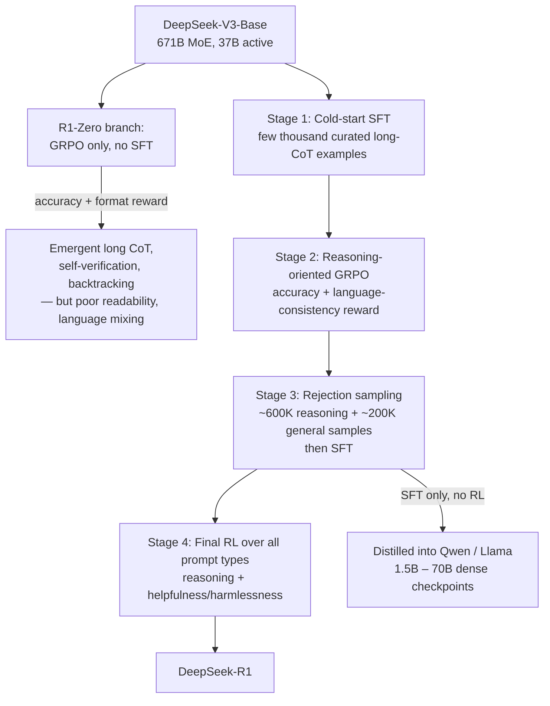

> **What it is:** DeepSeek-R1 and its sibling R1-Zero, released by DeepSeek-AI in January 2025, are the open, MIT-licensed model and training recipe that reproduced OpenAI o1-style extended reasoning with reinforcement learning on verifiable rewards, built on [[Concept - GRPO and RL with Verifiable Rewards]]. With open weights and a readable report, it showed publicly that long chain-of-thought reasoning can be *elicited by RL alone* instead of imitated from curated human demonstrations. It also made RLVR + GRPO + cold-start + distillation the default template the industry reached for through 2025-2026 *(as of 2026)*.

## The headline numbers
- **Base model:** [[Breakdown - DeepSeek-V3 Architecture]], a 671B-parameter [[Concept - Mixture of Experts Architecture]] with 37B active parameters per token.
- **R1-Zero:** GRPO applied *directly* to the base model with zero SFT. The pure-RL proof of concept.
- **R1:** a four-stage pipeline (cold-start SFT → reasoning-RL → 800K-sample rejection-sampling SFT → final all-purpose RL).
- **Reported performance:** approaches OpenAI o1 on AIME 2024, MATH-500 and Codeforces, per the DeepSeek-R1 technical report (AIME 2024 pass@1 and Codeforces percentile in the same range as o1). Treat exact leaderboard values as *(as of early 2025, since superseded)*.
- **Distillation yield:** 800K curated samples (~600K reasoning + ~200K general) SFT'd into Qwen and Llama dense checkpoints from 1.5B to 70B parameters, released as the DeepSeek-R1-Distill family.
- **License:** MIT. Weights, distilled checkpoints and the technical report all released: unusually complete disclosure for a frontier-adjacent reasoning result.

## How it works

**R1-Zero** runs GRPO straight on DeepSeek-V3-Base with two rule-based rewards: accuracy (does the final answer match) and format (is the `<think>...</think>` structure present). There's no neural reward model and no SFT. That alone produces long CoT, self-verification and backtracking ("wait, let me reconsider"), including the widely quoted "aha moment" where the model catches and fixes its own error mid-trace. The price is poor readability and language mixing, because an outcome-only reward puts no constraint on the reasoning staying coherent or monolingual.

**R1** fixes that in four stages. Stage 1 is a small cold-start SFT on a few thousand curated long-CoT examples, so RL starts from a readable distribution instead of a raw base model. Stage 2 runs reasoning-oriented GRPO with the accuracy reward plus a **language-consistency reward** to stop code-switching. Stage 3 has that checkpoint generate its own next training set by rejection sampling: ~600K reasoning samples filtered for correctness and readability, plus ~200K general samples (writing, factual QA, self-cognition) drawn from DeepSeek-V3's own SFT pipeline, for an 800K-example SFT run. Stage 4 is a final RL pass over all prompt types, mixing reasoning-accuracy reward with helpfulness/harmlessness preference-style reward. It's closer to a conventional [[Deep Dive - RLHF End to End]] finish and produces the released checkpoint.

The **distillation branch** uses the 800K stage-3 dataset as plain SFT data on Qwen2.5- and Llama-3-family dense models, with no RL on the small models at all. Result: the DeepSeek-R1-Distill checkpoints, 1.5B to 70B.

## The clever parts
1. **RL-only reasoning emergence.** GRPO on a bare base model, with no SFT, produced long CoT and self-verification. So structured reasoning doesn't have to be imitated from curated human CoT; it can be *discovered* under optimization pressure against a verifiable reward. It's the paper's most cited claim and feeds directly into [[Concept - Reasoning Training and Long Chain-of-Thought]].
2. **Rule-based rewards over a learned reward model.** Exact-match and unit-test verifiers sidestep the reward hacking a differentiable reward invites under sustained optimization ([[Concept - Reward Hacking]]). DeepSeek also tried [[Concept - Process and Outcome Reward Models]]-style PRMs and MCTS-guided search and reported both as unstable and hackable at the scale of their RL runs. Public "we tried this and it didn't work" results are rare.
3. **The language-consistency reward.** Instead of writing off R1-Zero's code-switched CoT as cosmetic, the team added a small explicit reward for staying in one language and accepted a modest accuracy cost for a large readability/UX gain, deliberately not maximizing the "real" reward for a product reason.
4. **No value model.** GRPO (from DeepSeekMath, Shao et al. 2024) replaces full PPO and drops the value/critic network, roughly halving the memory PPO needs in the four-model RLHF setup ([[Deep Dive - RLHF End to End]]). That's a big part of why reasoning RL was tractable at 671B-parameter (37B active) scale at all.
5. **Rejection-sampling data flywheel.** In stage 3 the RL checkpoint writes its own next-stage SFT data, closing the loop between RL and SFT without fresh external data. It's a large-scale version of the STaR-style bootstrap in [[Concept - Rejection Sampling and Expert Iteration]].
6. **Distill, don't RL, for small models.** SFT on R1's traces transferred more reasoning into small dense models than running the same RLVR recipe on a small base. That matters economically: shipping small reasoning models takes a strong teacher and cheap SFT, not small-model-scale RL infrastructure ([[Concept - Knowledge Distillation]]).

## What it got wrong / what's dated
PRM-guided and MCTS-style search were tried and reported as failures at this scale, against the pre-R1 intuition that structured search was necessary for strong reasoning. It's a widely cited cautionary result against process supervision in RL training specifically. It doesn't rule PRMs out elsewhere, e.g. inference-time reranking (see [[Concept - Process and Outcome Reward Models]]).

Reasoning gains sit in verifiable domains: math, code, structured logic. The paper's own limitations section acknowledges weaker or unclear transfer to open-ended tasks, a gap later work on [[Concept - Spurious Rewards and RLVR Failure Modes]] pushed on harder by asking how much RLVR teaches versus elicits from the base model.

Readability didn't come free either; it took the language-consistency reward and the cold-start SFT. "Pure RL discovers reasoning" held up; "pure RL discovers reasoning humans want to read" needed extra scaffolding.

As of 2026, later frontier reasoning releases from multiple labs have passed R1's benchmark numbers. The recipe shape (RLVR plus GRPO plus a cold start plus a distillation flywheel) is what stuck and got widely copied, so this breakdown is dated on leaderboard position, not on method.

## What to steal
Where verifiable rewards exist, use rule-based ones instead of training a neural RM. They're cheaper and harder by construction to reward-hack than a learned scorer under sustained RL pressure. If you need readable, controllable output style from scratch, put a small cold-start SFT before RL, since pure RL optimizes for reward and not for a process a human can read. Bootstrap the next round of SFT data from the current RL checkpoint via rejection sampling, not only from external data. For small, cheap reasoning models, distill from a large RL-trained teacher with SFT; don't run RL on the small model directly. And budget for a dedicated auxiliary reward (like language consistency) whenever the primary reward would let the model drift into output that's technically correct but unusable in practice.

## Connections
- [[Concept - GRPO and RL with Verifiable Rewards]] — R1's core RL algorithm; its group-relative, value-model-free advantage is what makes reasoning RL tractable at this scale.
- [[Concept - Reasoning Training and Long Chain-of-Thought]] — R1 is the canonical worked example of the entire long-CoT RL paradigm described in that note.
- [[Concept - Knowledge Distillation]] — the distilled Qwen/Llama checkpoints are R1's most widely deployed artifact and its headline distill-don't-RL finding.
- [[Concept - Rejection Sampling and Expert Iteration]] — stage 3's data generation is a large-scale rejection-sampling bootstrap from the RL checkpoint.
- [[Concept - Reward Hacking]] — the decision to avoid a neural RM was explicitly to sidestep reward hacking at scale.
- [[Breakdown - Tulu 3]] — the other major transparent post-training recipe of the era; contrast RLVR-as-final-polish-stage (Tulu 3) against RLVR-as-core-engine (R1).
- [[Concept - Mixture of Experts Architecture]] — the 671B/37B-active MoE base that every R1 stage trains on top of.
- [[Reference - Model Genealogy]] — R1 and its distilled family are a major branch point in the open-model lineage.
- [[Concept - Chain-of-Thought and Why It Works]] — R1's `<think>` traces are long-form CoT elicited by RL rather than prompted or demonstrated.
- [[Concept - Spurious Rewards and RLVR Failure Modes]] — later work questioning how much of RLVR's gain, as demonstrated by R1, is new capability versus elicitation of latent base-model behavior.
- [[Lore - Reward Hacking Hall of Fame]] — R1's abandoned PRM/MCTS experiments are a documented instance of the verifier-gaming pattern that collection catalogs.
- [[Breakdown - DeepSeek-V3 Architecture]] — the base architecture that R1 and R1-Zero are both trained on top of.

## Sources
- DeepSeek-AI (2025) — DeepSeek-R1: Incentivizing Reasoning Capability in LLMs via Reinforcement Learning. The primary technical report: R1-Zero, the four-stage R1 pipeline, and the distillation results.
- Shao et al. (2024) — DeepSeekMath: Pushing the Limits of Mathematical Reasoning in Open Language Models. Introduces GRPO, the RL algorithm R1 builds on.
- Lightman et al. (2023) — Let's Verify Step by Step. The PRM approach R1 tried against MCTS-style search and reported abandoning.
