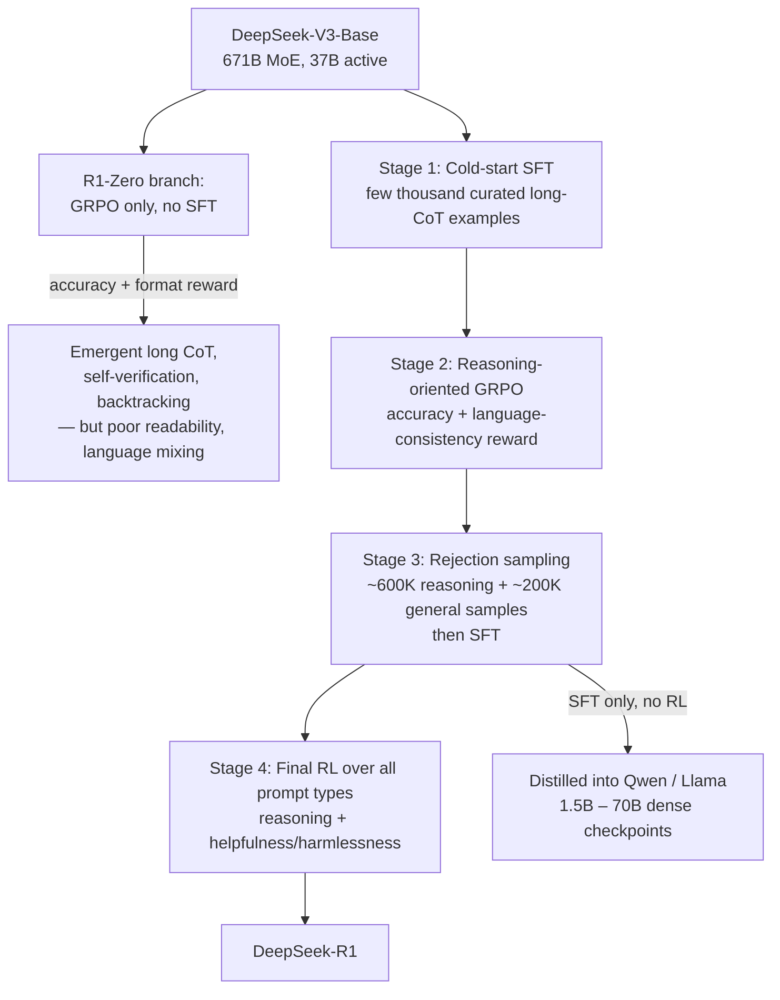

> **What it is:** DeepSeek-R1 (and its sibling R1-Zero), released by DeepSeek-AI in January 2025, is the open, MIT-licensed model and training recipe that reproduced OpenAI o1-style extended reasoning using reinforcement learning with verifiable rewards on top of [[Concept - GRPO and RL with Verifiable Rewards]]. Why it matters: it demonstrated in public, with open weights and a readable technical report, that long chain-of-thought reasoning can be *elicited by RL alone* rather than imitated from curated human demonstrations — and it turned the RLVR + GRPO + cold-start + distillation recipe into the default template the rest of the industry reached for through 2025-2026 *(as of 2026)*.

## The headline numbers
- **Base model:** [[Breakdown - DeepSeek-V3 Architecture]], a 671B-parameter [[Concept - Mixture of Experts Architecture]] with 37B active parameters per token.
- **R1-Zero:** GRPO applied *directly* to the base model with zero SFT — the pure-RL proof of concept.
- **R1:** a four-stage pipeline (cold-start SFT → reasoning-RL → 800K-sample rejection-sampling SFT → final all-purpose RL).
- **Reported performance:** approaches OpenAI o1 on AIME 2024, MATH-500, and Codeforces (per the DeepSeek-R1 technical report; e.g. AIME 2024 pass@1 and Codeforces percentile scores in the same range as o1 — treat exact leaderboard values as *(as of early 2025, since superseded)*).
- **Distillation yield:** 800K curated samples (~600K reasoning + ~200K general) SFT'd into Qwen and Llama dense checkpoints from 1.5B to 70B parameters, released as the DeepSeek-R1-Distill family.
- **License:** MIT — weights, distilled checkpoints, and the technical report all released openly, an unusually complete disclosure for a frontier-adjacent reasoning result.

## How it actually works

**R1-Zero** applies GRPO directly to DeepSeek-V3-Base with only two rule-based rewards: an accuracy reward (does the final answer match) and a format reward (is the `<think>...</think>` structure present) — no neural reward model, no SFT. Under this pressure alone, the model develops long CoT, self-verification, and backtracking ("wait, let me reconsider"), including a widely-quoted "aha moment" where the model catches and corrects its own error mid-trace. The cost: poor readability and language mixing, since nothing in an outcome-only reward constrains the reasoning to stay coherent or monolingual.

**R1** fixes that with a four-stage pipeline. Stage 1 is a small cold-start SFT on a few thousand curated long-CoT examples, giving the RL stage a readable starting distribution instead of a raw base model. Stage 2 runs reasoning-oriented GRPO with accuracy plus an added **language-consistency reward** to stop code-switching. Stage 3 uses the resulting checkpoint to generate its own next training set via rejection sampling: ~600K reasoning samples (filtered for correctness and readability) plus ~200K general-purpose samples (writing, factual QA, self-cognition, drawn from DeepSeek-V3's own SFT pipeline), combined into an 800K-example SFT run. Stage 4 is a final RL pass over all prompt types, blending reasoning-accuracy reward with helpfulness/harmlessness preference-style reward, closer to a conventional [[Deep Dive - RLHF End to End]] final stage, to produce the released checkpoint.

The **distillation branch** reuses the 800K stage-3 dataset as pure SFT data on Qwen2.5- and Llama-3-family dense models — no RL at all on the small models — producing the DeepSeek-R1-Distill checkpoints from 1.5B to 70B.

## The clever parts
1. **Proving RL-only reasoning emergence.** Skipping SFT entirely and letting GRPO alone, on a base model, produce long CoT plus self-verification demonstrated that structured reasoning doesn't have to be imitated from curated human CoT — it can be *discovered* under optimization pressure against a verifiable reward. This is the paper's most cited claim and it directly informs [[Concept - Reasoning Training and Long Chain-of-Thought]].
2. **Rule-based rewards over a learned reward model.** Choosing exact-match/unit-test verifiers instead of training a neural RM sidestepped the reward-hacking failure a differentiable reward invites under sustained optimization ([[Concept - Reward Hacking]]). DeepSeek went further and explicitly tried [[Concept - Process and Outcome Reward Models]]-style PRMs and MCTS-guided search, and reported both unstable and hackable at the scale of their RL runs — a rare public "we tried this and it didn't work" data point.
3. **The language-consistency reward.** Rather than treating R1-Zero's code-switched, unreadable CoT as a cosmetic footnote, the team added a small explicit reward for staying in one language, accepting a modest accuracy cost for a large readability/UX win — a deliberate refusal to maximize the "real" reward for a product reason.
4. **GRPO's dropped value model.** Reusing GRPO (originally from DeepSeekMath, Shao et al. 2024) instead of full PPO removes the value/critic network entirely, roughly halving the memory footprint PPO needs relative to the four-model RLHF setup ([[Deep Dive - RLHF End to End]]) — a big part of what makes running RL for reasoning tractable at 671B-parameter (37B active) scale at all.
5. **The rejection-sampling data flywheel.** Stage 3 uses the RL checkpoint itself to generate its own next-stage SFT data, closing the loop between RL and SFT instead of sourcing fresh external data — a large-scale version of the STaR-style bootstrap described in [[Concept - Rejection Sampling and Expert Iteration]].
6. **Distill-don't-RL for small models.** SFT-distilling R1's reasoning traces into small dense models transferred more reasoning capability than running the same RLVR recipe directly on a small base — an economically important finding, since it means labs don't need small-model-scale RL infrastructure to ship small reasoning models, only a strong teacher and cheap SFT ([[Concept - Knowledge Distillation]]).

## What it got wrong / what's dated
PRM-guided and MCTS-style search were explicitly tried and reported as failed experiments at this scale, contradicting the pre-R1 intuition that structured search would be necessary for strong reasoning — a widely cited cautionary result against process supervision in RL training specifically, though it doesn't rule PRMs out for other setups like inference-time reranking (see [[Concept - Process and Outcome Reward Models]]). Reasoning gains are concentrated in verifiable domains — math, code, structured logic — and the paper's own limitations section acknowledges weaker or unclear transfer to open-ended tasks, a gap later scrutinized more sharply by work on [[Concept - Spurious Rewards and RLVR Failure Modes]] questioning how much RLVR teaches versus elicits from the base model. Readability required deliberate engineering — the language-consistency reward, the cold-start SFT — rather than emerging for free: "pure RL discovers reasoning" held up, but "pure RL discovers reasoning humans want to read" needed extra scaffolding. As of 2026, R1's specific benchmark numbers have been surpassed by later frontier reasoning releases from multiple labs, but the recipe shape — RLVR plus GRPO plus a cold start plus a distillation flywheel — is the one that stuck and was widely copied; the breakdown is dated on leaderboard position, not on method.

## What to steal
Use rule-based, verifiable rewards wherever they exist instead of training a neural RM — cheaper and structurally more reward-hack-resistant than a learned scorer under sustained RL pressure. Add a small cold-start SFT before RL if you need readable, controllable output style from scratch; pure RL optimizes for reward, not for a human-readable process. Bootstrap your own next round of SFT data from your current RL checkpoint via rejection sampling rather than relying only on externally sourced data. If you need small, cheap reasoning models, distill from a large RL-trained teacher via SFT rather than running RL on the small model directly. And budget for a dedicated auxiliary reward (like language-consistency) whenever the primary reward alone would let the model drift into output that's technically correct but practically unusable.

## Connections
- [[Concept - GRPO and RL with Verifiable Rewards]] — R1's core RL algorithm; its group-relative, value-model-free advantage is what makes reasoning RL tractable at this scale.
- [[Concept - Reasoning Training and Long Chain-of-Thought]] — R1 is the canonical worked example of the entire long-CoT RL paradigm described in that note.
- [[Concept - Knowledge Distillation]] — the distilled Qwen/Llama checkpoints are R1's most widely deployed artifact and its headline distill-don't-RL finding.
- [[Concept - Rejection Sampling and Expert Iteration]] — stage 3's data generation is a large-scale rejection-sampling bootstrap from the RL checkpoint.
- [[Concept - Reward Hacking]] — the decision to avoid a neural RM was explicitly to sidestep reward hacking at scale.
- [[Breakdown - Tulu 3]] — the other major transparent post-training recipe of the era; contrast RLVR-as-final-polish-stage (Tulu 3) against RLVR-as-core-engine (R1).
- [[Concept - Mixture of Experts Architecture]] — the 671B/37B-active MoE base that every R1 stage trains on top of.
- [[Reference - Model Genealogy]] — R1 and its distilled family are a major branch point in the open-model lineage.
- [[Concept - Chain-of-Thought and Why It Works]] — R1's `<think>` traces are long-form CoT elicited by RL rather than prompted or demonstrated.
- [[Concept - Spurious Rewards and RLVR Failure Modes]] — later work questioning how much of RLVR's gain, as demonstrated by R1, is new capability versus elicitation of latent base-model behavior.
- [[Lore - Reward Hacking Hall of Fame]] — R1's abandoned PRM/MCTS experiments are a documented instance of the verifier-gaming pattern that collection catalogs.
- [[Breakdown - DeepSeek-V3 Architecture]] — the base architecture that R1 and R1-Zero are both trained on top of.

## Sources
- DeepSeek-AI (2025) — DeepSeek-R1: Incentivizing Reasoning Capability in LLMs via Reinforcement Learning. The primary technical report: R1-Zero, the four-stage R1 pipeline, and the distillation results.
- Shao et al. (2024) — DeepSeekMath: Pushing the Limits of Mathematical Reasoning in Open Language Models. Introduces GRPO, the RL algorithm R1 builds on.
- Lightman et al. (2023) — Let's Verify Step by Step. The PRM approach R1 tried against MCTS-style search and reported abandoning.
