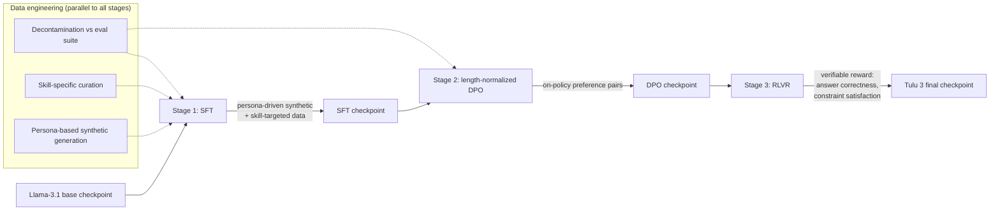

> Tulu 3 (Lambert et al., 2024) is the Allen Institute for AI's (AI2) fully-open post-training recipe — open weights, open training data, and open code — built on top of [[Concept - Supervised Fine-Tuning (SFT)]]'d [[Reference - Model Genealogy|Llama-3.1]] base checkpoints. It matters because, as of 2026, it is the reference recipe for what a competitive, fully-reproducible open alignment pipeline actually looks like end to end, at a moment when most labs publish weights but not the data or code that produced them.

## The headline numbers

- Released November 2024 by AI2, at three scales: **8B, 70B, and 405B** parameters, all post-trained from Llama-3.1 base checkpoints of the matching size.
- Three-stage pipeline: curated [[Concept - Supervised Fine-Tuning (SFT)]] mix → length-normalized [[Concept - Direct Preference Optimization (DPO)]] on preference data → **RLVR** (Reinforcement Learning with Verifiable Rewards) on math and precise-instruction-following tasks.
- Everything is open: the SFT and preference datasets, the training and evaluation code, and the intermediate checkpoints after each stage — not just the final weights, which is the unusual part relative to most contemporaneous open-weight releases.
- Targeted evaluation gains landed specifically on the skills the RLVR stage trained for: math reasoning (GSM8K, MATH) and precise instruction-following (IFEval), using answer-correctness and constraint-satisfaction rewards rather than a learned reward model.
- Result: closed the gap to, and beat on several evaluations, Llama-3.1-Instruct and other open-weight peers of the same parameter count, backed by a transparent evaluation suite released alongside the models.

## How it actually works

Tulu 3 runs the three post-training stages of [[Concept - The Post-Training Pipeline]] in sequence, but with deliberate engineering at each handoff rather than treating them as independent recipes bolted together.

**Stage 1 — SFT.** The base model is behavior-cloned on a curated mix that combines persona-driven synthetic instructions (varying the assistant's implied persona to broaden instruction-following coverage) with data targeted at specific skills the team wanted to move the needle on (math, coding, precise formatting, multilinguality). This is the same objective as any [[Concept - Supervised Fine-Tuning (SFT)]] stage — next-token cross-entropy on completion tokens — but the data mixture is the deliberate lever, not the loss.

**Stage 2 — length-normalized DPO.** Rather than vanilla [[Concept - Direct Preference Optimization (DPO)]], Tulu 3 length-normalizes the preference objective, directly counteracting the length-exploitation failure mode where summed log-probs reward verbosity regardless of quality. Preference pairs are generated on-policy where practical (sampling from the SFT checkpoint itself, then labeling), reducing the train/inference distribution gap that off-policy pairs suffer from.

**Stage 3 — RLVR.** This is Tulu 3's most consequential contribution: the paper introduced the term "Reinforcement Learning with Verifiable Rewards" to describe replacing a learned reward model with a programmatic verifier — exact-match correctness on math problems, constraint satisfaction on formatting/length instructions (IFEval-style) — as the training signal for [[Concept - GRPO and RL with Verifiable Rewards]]-style on-policy RL. No reward model is trained or held in memory for this stage; the reward comes directly from checking the output against a ground-truth answer or a programmatic constraint checker.

Running underneath all three stages is a data-engineering discipline the paper documents explicitly: aggressive decontamination of every training set against the evaluation suite (n-gram and embedding overlap, per [[Concept - Benchmark Contamination]]), skill-specific data curation rather than generic instruction-mixing, and heavy use of [[Concept - Synthetic Training Data]] for both the SFT persona data and later-stage preference pairs.

## The clever parts

1. **RLVR as a named, reusable pattern, ahead of the reasoning-model wave.** Tulu 3 (November 2024) coined and operationalized "RL with Verifiable Rewards" as a general post-training stage for any domain with a checker, months before [[Breakdown - DeepSeek-R1]] (January 2025) made the same reward-design idea famous via long chain-of-thought reasoning. The mechanism is the same — replace a learned, hackable reward model with a cheap, correct-by-construction verifier — applied here to targeted skills (math, formatting) rather than open-ended reasoning.
2. **DPO before RL, not RL alone.** Tulu 3 explicitly sequences length-normalized DPO before RLVR rather than either skipping straight to on-policy RL or stopping at DPO. This matters because DPO is cheap and stable and gets most of the preference-alignment gain first, leaving RLVR to do the narrower, more expensive job of pushing specific verifiable skills further — a pragmatic division of labor documented in the paper's ablations as capturing most of full RL's benefit at a fraction of the cost, echoing the same iterated-DPO-closes-the-PPO-gap finding used by Llama-3.
3. **Length-normalizing DPO instead of adopting a whole new loss family.** Rather than switching to SimPO or another member of [[Concept - The DPO Variant Family (IPO KTO ORPO SimPO)]] wholesale, the team kept DPO's reference-model anchor (which those reference-free variants drop) and fixed length bias with a targeted normalization — a smaller, more legible change that preserves DPO's overoptimization brake.
4. **Persona-driven synthetic SFT data as a coverage lever, not a decoration.** Varying the implied persona across synthetic instruction-generation runs is used deliberately to widen instruction-following coverage in the SFT mix, an early instance of the persona-as-data-augmentation technique that later shows up under [[Concept - Persona and Character Training]].
5. **Radical transparency as the actual contribution.** The clever part isn't a novel algorithm at any single stage — DPO, RLVR-style verifiable rewards, and rejection-sampling-adjacent data curation via [[Concept - Rejection Sampling and Expert Iteration]] all existed in some form already. The contribution is documenting and open-sourcing the *entire* recipe, including intermediate checkpoints and the decontamination pipeline, at a scale (405B) where almost nobody else had shown their work.

## What it got wrong / what's dated

The RLVR stage is verifiable-only: it improves math and format-constrained instruction-following because those domains have cheap, correct checkers, but it says nothing about aligning open-ended helpfulness, tone, or safety — those still come from the SFT and DPO stages using mixed-provenance preference data (a blend of human and AI-generated labels), with the usual [[Concept - Length Bias in Preference Optimization]] and calibration caveats that apply to any preference dataset. As RLVR-style training matured through 2025 (notably in reasoning models trained with [[Concept - GRPO and RL with Verifiable Rewards]] at much larger RL compute budgets), Tulu 3's RL stage looks comparatively modest in scale and scope — it targets specific skills rather than eliciting the long, self-verifying chain-of-thought behavior later work achieved by scaling RLVR compute substantially further.

## What to steal

- **The three-stage sequencing itself** — SFT for format and skill coverage, length-normalized DPO for cheap broad preference alignment, RLVR for narrow, verifiable-skill sharpening — is a reusable template regardless of base model.
- **Decontamination discipline as a first-class engineering step**, applied at every stage rather than once at the end, using the same rigor as [[Concept - Benchmark Contamination]] mitigation in pretraining.
- **RLVR for any domain with a cheap verifier** (unit tests, exact-match answers, regex/constraint checkers) before reaching for a learned reward model and the instability that comes with it.
- **Publishing intermediate checkpoints**, not just the final model — makes it possible for others to isolate which stage contributed which capability gain, a level of reproducibility most post-training write-ups skip.

## Connections

- [[Concept - Supervised Fine-Tuning (SFT)]] — Tulu 3's stage 1; the persona-driven and skill-targeted data mixture is the specific lever applied to this general mechanism.
- [[Concept - Direct Preference Optimization (DPO)]] — Tulu 3's stage 2, modified with length normalization; understanding vanilla DPO is a prerequisite for the modification.
- [[Concept - GRPO and RL with Verifiable Rewards]] — the on-policy RL mechanism family that Tulu 3's RLVR stage belongs to, applied here to math and instruction-constraint verifiers specifically.
- [[Breakdown - DeepSeek-R1]] — the later, larger-scale RLVR application that made the same reward-design idea famous via emergent long chain-of-thought; Tulu 3 is the earlier, narrower proof of the same pattern.
- [[Concept - Rejection Sampling and Expert Iteration]] — the filtered-sampling data-generation technique underlying much of Tulu 3's synthetic and on-policy preference data.
- [[Concept - Data Mixtures]] — cross-domain (05) grounding for why the SFT mix's skill-targeted composition, not just its size, drives the reported gains.
- [[Concept - Synthetic Training Data]] — cross-domain (05) grounding for the persona-driven generation technique used to build the SFT and preference sets.
- [[Concept - Benchmark Contamination]] — cross-domain (13) grounding for the decontamination methodology applied across every training stage.
- [[Reference - Model Genealogy]] — cross-domain (19) grounding for where Tulu 3's Llama-3.1 base checkpoints sit in the broader open-model lineage.
- [[Concept - The Post-Training Pipeline]] — the general surface-level map of SFT → preference optimization → RL that Tulu 3 is a fully-documented, concrete instance of.

## Sources

- Lambert et al. (2024) — Tulu 3: Pushing Frontiers in Open Language Model Post-Training (AI2). The primary source for the pipeline, data curation, RLVR framing, and released checkpoints described above.
