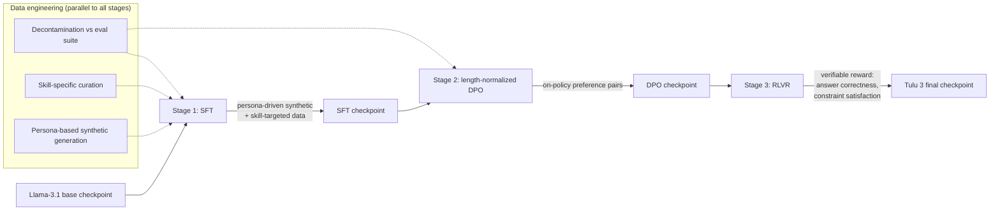

> Tulu 3 (Lambert et al., 2024) is the Allen Institute for AI's (AI2) fully open post-training recipe: open weights, open training data and open code, built on [[Concept - Supervised Fine-Tuning (SFT)]]'d [[Reference - Model Genealogy|Llama-3.1]] base checkpoints. It's the reference, as of 2026, for what a competitive, fully reproducible open alignment pipeline looks like end to end, at a time when most labs publish weights but not the data or code behind them.

## The headline numbers

- Released November 2024 by AI2 at three scales, **8B, 70B and 405B**, each post-trained from the Llama-3.1 base checkpoint of matching size.
- Three stages: a curated [[Concept - Supervised Fine-Tuning (SFT)]] mix → length-normalized [[Concept - Direct Preference Optimization (DPO)]] on preference data → **RLVR** (Reinforcement Learning with Verifiable Rewards) on math and precise instruction-following.
- Everything is open: SFT and preference datasets, training and eval code, and the intermediate checkpoint after each stage. The final weights alone would have been normal for the time; the rest is what's unusual.
- Tulu 3's eval gains landed on the skills RLVR trained: math reasoning (GSM8K, MATH) and precise instruction-following (IFEval), using answer-correctness and constraint-satisfaction rewards instead of a learned reward model.
- It closed the gap to Llama-3.1-Instruct and other same-size open-weight peers, and beat them on several evaluations, with a transparent evaluation suite released alongside the models.

## How it works

Tulu 3 runs the three stages of [[Concept - The Post-Training Pipeline]] in order, with deliberate engineering at each handoff instead of three independent recipes bolted together.

**Stage 1, SFT.** The base model is behavior-cloned on a mix of persona-driven synthetic instructions (the assistant's implied persona is varied to broaden instruction-following coverage) and data aimed at specific skills the team wanted to move: math, coding, precise formatting, multilinguality. The objective is the same as any [[Concept - Supervised Fine-Tuning (SFT)]] stage, next-token cross-entropy on completion tokens. The lever is the data mixture.

**Stage 2, length-normalized DPO.** Tulu 3 length-normalizes the [[Concept - Direct Preference Optimization (DPO)]] objective, which counters the failure where summed log-probs reward verbosity regardless of quality. Where practical, preference pairs are generated on-policy (sampled from the SFT checkpoint, then labeled), shrinking the train/inference distribution gap that off-policy pairs have.

**Stage 3, RLVR.** This is the paper's most consequential piece. It introduced the term "Reinforcement Learning with Verifiable Rewards" for swapping the learned reward model for a programmatic verifier as the signal in [[Concept - GRPO and RL with Verifiable Rewards]]-style on-policy RL: exact-match correctness on math, constraint satisfaction on formatting/length instructions (IFEval-style). No reward model is trained or held in memory. The reward comes from checking output against a ground-truth answer or a constraint checker.

Under all three stages sits a data-engineering discipline the paper documents explicitly. Every training set is aggressively decontaminated against the eval suite (n-gram and embedding overlap, per [[Concept - Benchmark Contamination]]). Curation is skill-specific instead of generic instruction-mixing. And [[Concept - Synthetic Training Data]] is used heavily, for the SFT persona data and for later-stage preference pairs.

## The clever parts

1. **RLVR named as a reusable pattern before the reasoning-model wave.** Tulu 3 (November 2024) coined and operationalized "RL with Verifiable Rewards" as a general post-training stage for any domain with a checker, months before [[Breakdown - DeepSeek-R1]] (January 2025) made the same reward-design idea famous through long chain-of-thought reasoning. Same mechanism: replace a learned, hackable reward model with a cheap, correct-by-construction verifier. Here it's aimed at targeted skills (math, formatting), not open-ended reasoning.
2. **DPO before RL.** Tulu 3 puts length-normalized DPO ahead of RLVR, instead of jumping straight to on-policy RL or stopping at DPO. DPO is cheap and stable and gets most of the preference-alignment gain first. RLVR then does the narrower, pricier job of pushing specific verifiable skills. The paper's ablations show this split capturing most of full RL's benefit at a fraction of the cost, echoing Llama-3's finding that iterated DPO closes the PPO gap.
3. **Length-normalizing DPO instead of switching loss families.** The team didn't move wholesale to SimPO or another member of [[Concept - The DPO Variant Family (IPO KTO ORPO SimPO)]]. They kept DPO's reference-model anchor, which those reference-free variants drop, and fixed length bias with a targeted normalization. It's a smaller, more legible change that keeps DPO's brake on overoptimization.
4. **Persona-driven synthetic SFT data for coverage.** Varying the implied persona across synthetic instruction-generation runs is a deliberate way to widen instruction-following coverage in the SFT mix. It's an early case of persona-as-data-augmentation, the technique that later shows up under [[Concept - Persona and Character Training]].
5. **Transparency is the contribution.** No single stage has a novel algorithm. DPO, RLVR-style verifiable rewards and rejection-sampling-adjacent curation via [[Concept - Rejection Sampling and Expert Iteration]] all existed in some form. What's new is documenting and open-sourcing the *entire* recipe, intermediate checkpoints and decontamination pipeline included, at a scale (405B) where almost nobody else had shown their work.

## What it got wrong / what's dated

RLVR here is verifiable-only. It improves math and format-constrained instruction-following because those domains have cheap, correct checkers. It does nothing for open-ended helpfulness, tone or safety, which still come from SFT and DPO on mixed-provenance preference data (human plus AI-generated labels), with the usual [[Concept - Length Bias in Preference Optimization]] and calibration caveats of any preference dataset.

As RLVR matured through 2025, notably in reasoning models trained with [[Concept - GRPO and RL with Verifiable Rewards]] on much larger RL compute budgets, Tulu 3's RL stage started to look modest in scale and scope. It targets specific skills. It doesn't elicit the long, self-verifying chain-of-thought that later work got by scaling RLVR compute much further.

## What to steal

- **The three-stage sequence** is a reusable template on any base model: SFT for format and skill coverage, length-normalized DPO for cheap broad preference alignment, RLVR to sharpen narrow verifiable skills.
- **Decontamination at every stage**, not once at the end, with the same rigor as [[Concept - Benchmark Contamination]] mitigation in pretraining.
- **RLVR for any domain with a cheap verifier** (unit tests, exact-match answers, regex/constraint checkers) before you reach for a learned reward model and its instability.
- **Publish intermediate checkpoints** along with the final model. Others can then isolate which stage produced which capability gain, a level of reproducibility most post-training write-ups skip.

## Connections

- [[Concept - Supervised Fine-Tuning (SFT)]] — Tulu 3's stage 1; the persona-driven and skill-targeted data mixture is the specific lever applied to this general mechanism.
- [[Concept - Direct Preference Optimization (DPO)]] — Tulu 3's stage 2, modified with length normalization; understanding vanilla DPO is a prerequisite for the modification.
- [[Concept - GRPO and RL with Verifiable Rewards]] — the on-policy RL mechanism family that Tulu 3's RLVR stage belongs to, applied here to math and instruction-constraint verifiers specifically.
- [[Breakdown - DeepSeek-R1]] — the later, larger-scale RLVR application that made the same reward-design idea famous via emergent long chain-of-thought; Tulu 3 is the earlier, narrower proof of the same pattern.
- [[Concept - Rejection Sampling and Expert Iteration]] — the filtered-sampling data-generation technique underlying much of Tulu 3's synthetic and on-policy preference data.
- [[Concept - Data Mixtures]] — cross-domain (05) grounding for why the SFT mix's skill-targeted composition, not just its size, drives the reported gains.
- [[Concept - Synthetic Training Data]] — cross-domain (05) grounding for the persona-driven generation technique used to build the SFT and preference sets.
- [[Concept - Benchmark Contamination]] — cross-domain (13) grounding for the decontamination methodology applied across every training stage.
- [[Reference - Model Genealogy]] — cross-domain (19) grounding for where Tulu 3's Llama-3.1 base checkpoints sit in the broader open-model lineage.
- [[Concept - The Post-Training Pipeline]] — the general surface-level map of SFT → preference optimization → RL that Tulu 3 is a fully-documented, concrete instance of.

## Sources

- Lambert et al. (2024) — Tulu 3: Pushing Frontiers in Open Language Model Post-Training (AI2). The primary source for the pipeline, data curation, RLVR framing, and released checkpoints described above.
