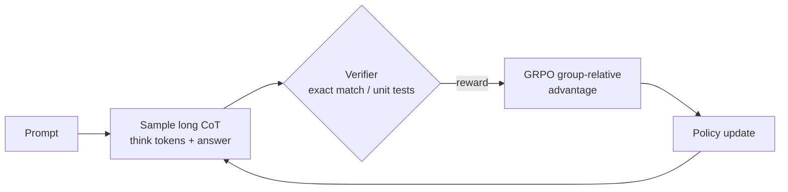

> **One-paragraph hook:** Between 2024 and 2025 the field found that reinforcement learning against verifiable rewards could make a model spontaneously think for thousands of tokens before answering: checking its own work, backtracking, switching approach mid-reasoning. More parameters and more pretraining tokens weren't the source. OpenAI's o1 and DeepSeek-R1 made this the default recipe for hard reasoning tasks, and it opened a second scaling axis orthogonal to the pretraining [[Concept - Scaling Laws]]: how long the model is allowed to think.

## The mechanism
Ordinary SFT/DPO-trained models produce chain-of-thought because they were shown demonstrations that reason step by step ([[Concept - Chain-of-Thought and Why It Works]]). The length and style of the reasoning is whatever the demonstrator wrote. Reasoning training uses on-policy RL against a **verifiable** reward instead, with [[Concept - GRPO and RL with Verifiable Rewards]] as the workhorse algorithm, on math, code, and other domains with a checkable answer. The model finds its own reasoning length and style under optimization pressure.

A response is structured as `<think> ... </think> <answer> ... </answer>`, and the reward is

$$R = R_{\text{accuracy}}(\text{answer}, \text{ground truth}) + R_{\text{format}}(\text{structural compliance})$$

with no term rewarding length. What follows is emergent. Longer internal deliberation correlates with getting hard problems right, so gradient ascent under GRPO/PPO shifts probability mass toward longer, more thorough traces over training. Average response length grows as a *side effect* of optimizing for correctness; nobody put length in the reward.

Along with length growth, DeepSeek-R1-Zero (pure RL directly on a base model, no SFT; see [[Breakdown - DeepSeek-R1]]) showed emergent **self-verification** ("let me check this") and **backtracking** ("wait, that's wrong, let me reconsider"). Nobody wrote a reward term for either. They showed up because they raise the odds of landing on the verifiably correct final answer.

Two training regimes matter. **Zero** (R1-Zero) is pure RL straight from a base model, which showed the emergent reasoning comes from RL and isn't imitated. **Cold-start** (R1) adds a small SFT stage on curated long-CoT examples before RL, specifically to fix R1-Zero's poor readability and language-mixing. At inference, some systems hide the thinking tokens from the user (OpenAI o1 shows only a summary) and others show the full trace (DeepSeek-R1).

## In practice
Reward design keeps accuracy dominant and format light: a small reward for well-formed `<think>`/`<answer>` tags so outputs stay parseable. Over-weighting format invites models to emit the wrapper without doing real reasoning. Verifiable domains are a hard requirement: exact-match or normalized numeric answers for math, passing unit tests for code, checkable proof steps for formal reasoning. Without a verifiable signal there's no RLVR-style reasoning training as currently practiced, which is why reasoning-RL gains concentrate so heavily in math and code.

Test-time scaling is the other half. Pass@1 improves with how much CoT the model may generate, or with how many samples are aggregated (majority vote, best-of-N), an axis roughly orthogonal to parameters × pretraining tokens. Budget forcing (Muennighoff et al. 2025, "s1: Simple test-time scaling") is the cheapest version of this lever. When the model tries to stop thinking early, you inject a token like "Wait" to extend the trace. No extra training, and often a direct accuracy bump.

Once you have a reasoning model, its long traces are also the cheapest path to a smaller one. SFT-distilling the traces into a dense model ([[Concept - Knowledge Distillation]]) frequently transfers more reasoning capability than running the same RL recipe on the small model directly.

## Failure modes
**Overthinking** is the reasoning-model version of length bias. The model burns thousands of think-tokens on a trivial prompt for no accuracy gain, raising latency and cost for nothing.

**Language mixing and unreadable CoT** appear in pure-RL regimes (R1-Zero), because an outcome-only reward puts no constraint on the reasoning staying in one language or reading naturally to a human. Only an explicit language-consistency reward or a cold-start SFT stage fixes it.

The **generalization ceiling** is real. Gains concentrate in verifiable domains, and transfer to open-ended, non-verifiable tasks (writing, general dialogue, judgment calls) is weak or absent; [[Concept - Spurious Rewards and RLVR Failure Modes]] goes further into this. That work also raises the deeper, contested question: does long-CoT RL teach new reasoning strategies, or mainly resample and sharpen strategies already latent in the pretrained base? Yue et al. 2025 found pass@k can be flat or even worse after RL while pass@1 rises. That's evidence for elicitation over creation, and a live fault line tied to [[Concept - The Emergent Abilities Debate]].

## The non-obvious
Nobody explicitly rewards length, yet response length is the most-watched leading indicator that reasoning RL is "working." Teams track the length-vs-training-step curve like a loss curve, even though length was never the target and rising length can just as well signal overthinking or hacking. Read it jointly with accuracy, never alone.

Budget forcing gives a sharper lesson. RL apparently doesn't install a fixed policy for how long to think so much as a willingness to keep going once started. After training, a single injected "Wait" token coerces more of that willingness at zero training cost, so the length the model settled on during RL was never a hard ceiling.

## Connections
- [[Concept - GRPO and RL with Verifiable Rewards]] — the core RL algorithm that makes reasoning training tractable at scale, via its group-relative, value-model-free advantage.
- [[Breakdown - DeepSeek-R1]] — the canonical worked example of this entire paradigm, including the zero-vs-cold-start distinction.
- [[Concept - Chain-of-Thought and Why It Works]] — long-CoT reasoning training is what happens when you optimize the length and content of chain-of-thought with RL instead of just prompting or demonstrating it.
- [[Concept - Spurious Rewards and RLVR Failure Modes]] — the evidence base for the elicitation-vs-new-capability debate and for RLVR's generalization limits.
- [[Concept - Process and Outcome Reward Models]] — the reward-granularity question (score the whole trace or every step) that reasoning training has to answer.
- [[Concept - Scaling Laws]] — test-time think-token scaling is a second axis alongside parameter/data scaling, with its own diminishing-returns curve.
- [[Concept - The Emergent Abilities Debate]] — the elicitation-vs-creation question for reasoning RL is a specific instance of the broader debate over what counts as an emergent capability.
- [[Concept - Sampling and Decoding Parameters]] — think-token budgets, temperature, and majority-vote aggregation are all decoding-time knobs on top of a reasoning-trained model.
- [[Concept - Knowledge Distillation]] — the cheapest way to get a small reasoning model is usually SFT-distilling a large reasoning model's traces, not RL-training the small model directly.
- [[Lore - Let's Think Step by Step]] — the zero-shot CoT lineage this paradigm ultimately descends from, now with RL choosing the reasoning instead of a human writing it into a prompt.

## Sources
- OpenAI (2024) — o1 system card. Introduces RL-trained, largely hidden long-CoT reasoning at inference time.
- DeepSeek-AI (2025) — DeepSeek-R1: Incentivizing Reasoning Capability in LLMs via Reinforcement Learning. Open recipe reproducing o1-style reasoning via GRPO/RLVR, including the R1-Zero pure-RL result.
- Muennighoff et al. (2025) — s1: Simple test-time scaling. Budget forcing via forced continuation tokens.
- Kojima et al. (2022) — Large Language Models are Zero-Shot Reasoners. The "let's think step by step" lineage this paradigm builds on and ultimately automates via RL.
