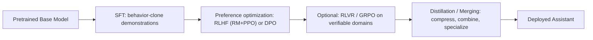

> **One-paragraph hook:** A pretrained base model is a next-token predictor over web text — ask it a question and it is as likely to continue the question, list five similar questions, or trail off into unrelated prose as it is to answer. The post-training pipeline is the sequence of stages — supervised fine-tuning, preference optimization, optionally reinforcement learning with verifiable rewards, then distillation and merging — that reshapes that raw completion engine into something that reliably behaves like an assistant. Every deployed chat model you have used is a base model plus this pipeline.

## The mechanism

A base model is trained on the pretraining objective — next-token prediction over web-scale text — and has no built-in notion of "conversation" beyond whatever conversational text happened to appear in its corpus. Ask it "What's the capital of France?" and it may continue with "What's the capital of Germany? What's the capital of Spain?" because that continuation is a statistically plausible completion of a quiz-style document. The base-vs-instruct distinction is entirely a post-training artifact: architecture and weights are otherwise identical at the moment training finishes on the pretraining corpus, which is the whole reason post-training exists as a discipline.

The canonical stack:

[[Concept - Supervised Fine-Tuning (SFT)]] clones a demonstrator's behavior via cross-entropy on completions. It teaches format and surface instruction-following, but it is fundamentally an imitation objective: the loss is per-example, so it has no way to express a comparative judgment like "response A is better than response B," and it imitation-ceilings at whatever the demonstrator could produce. Preference optimization — [[Deep Dive - RLHF End to End]], or its offline cousin [[Concept - Direct Preference Optimization (DPO)]] — fixes exactly that gap: it consumes pairwise or ranked comparisons and pushes probability mass toward the preferred continuation, a strictly richer signal than "here is one correct answer." For domains where correctness is checkable by program rather than by a human or a learned reward model — math, code execution, formal proofs — [[Concept - GRPO and RL with Verifiable Rewards]] (RLVR) adds a further RL stage using an automatic verifier as the reward, sidestepping the reward-model calibration problem for those tasks entirely; this is also the stage that elicits and amplifies the extended reasoning behavior described in [[Concept - Chain-of-Thought and Why It Works]], rather than teaching it from a blank slate. Finally, [[Concept - Knowledge Distillation]] compresses a large aligned model into a cheaper one, and [[Concept - Model Merging]] combines multiple fine-tunes in weight space to consolidate skills without a joint retrain.

This entire pipeline is a bet that fine-tuning is the right tool in the first place — see [[Decision - Fine-Tuning vs RAG vs Prompting]] for when solving the same problem at inference time (retrieval, a longer prompt) is cheaper than running any of these stages at all.

## In practice

Scale: SFT sets typically run $10^3$–$10^6$ curated examples; preference datasets run $10^4$–$10^6$ pairwise comparisons. Total post-training compute is usually under 1–5% of the pretraining FLOPs that produced the base checkpoint (see [[Deep Dive - Anatomy of a Pretraining Run]] for what that larger budget bought) — post-training is cheap relative to pretraining but disproportionately determines the product experience a user actually judges.

Historical arc: InstructGPT (Ouyang et al. 2022) established the three-stage recipe — SFT, then a Bradley-Terry reward model, then PPO — and showed a 1.3B RLHF-tuned model beat a 175B raw GPT-3 on human preference ratings. DPO (Rafailov et al. 2023) collapsed stages two and three into a single closed-form loss computed directly on the policy, removing the reward model and the RL loop and driving the 2023–2024 wave of open alignment (Zephyr, Tulu 2). GRPO and RLVR (DeepSeek, 2024–2025) then made on-policy RL matter again specifically for reasoning-heavy domains, because verifiable rewards sidestep the reward-hacking failure mode that made PPO fragile against a learned reward model. Anchor recipes to study: InstructGPT, the Llama-2/3 post-training reports, [[Breakdown - Tulu 3]] (the most transparent fully-open recipe), and [[Breakdown - DeepSeek-R1]] (RLVR at frontier scale); [[Reference - Model Genealogy]] is the lookup table for which named model used which recipe and which base checkpoint it descends from.

## Failure modes

The alignment tax: post-training, especially aggressive preference optimization, can regress capabilities the base model actually had — mechanically related to [[Concept - Catastrophic Forgetting]] in narrower fine-tuning settings. Symptom: a post-trained model scoring worse on held-out pretraining-style evals than its own base checkpoint. Mitigation: mix a slice of pretraining or SFT data into later stages, and anchor the RL objective to the reference policy with a KL penalty so the model cannot drift arbitrarily far from where its capabilities were last calibrated.

A second failure mode is stage-ordering error: skipping SFT and running preference optimization directly on a base model produces unstable, format-incoherent outputs, because both DPO and RLHF assume the starting policy already produces roughly on-distribution completions worth ranking.

## The non-obvious

The biggest misconception is that post-training teaches new knowledge or capability. Mostly it does not — it *elicits* and *reweights* capability pretraining already put into the weights. LIMA-style results (see [[Concept - Supervised Fine-Tuning (SFT)]]) and the "superficial alignment hypothesis" are the sharpest evidence: a few thousand well-chosen examples can align a strong base model, which only makes sense if the model already knew how to be helpful and post-training is mostly pointing it at the right output distribution rather than installing new facts. This reframes what post-training data work is actually for — it is UX and calibration engineering on top of a capability ceiling mostly fixed at pretraining, which is also why post-training compute is a rounding error next to pretraining compute yet accounts for most of what a user perceives as "how good the model is."

## Connections

- [[Concept - Supervised Fine-Tuning (SFT)]] — the first pipeline stage; behavior-cloning on demonstrations that this note treats as one box in the flow.
- [[Deep Dive - RLHF End to End]] — the classic three-model preference-optimization stage that slots in after SFT.
- [[Concept - Direct Preference Optimization (DPO)]] — the offline alternative to RLHF that collapsed two pipeline stages into one loss.
- [[Concept - GRPO and RL with Verifiable Rewards]] — the optional RL stage for verifiable domains that made reasoning training practical.
- [[Concept - Knowledge Distillation]] — the compression stage that turns an aligned model into a cheaper deployable one.
- [[Concept - Model Merging]] — the weight-space combination stage used to consolidate multiple fine-tunes without joint retraining.
- [[Concept - Catastrophic Forgetting]] — the mechanism behind the alignment tax when post-training overwrites base capability.
- [[Deep Dive - Anatomy of a Pretraining Run]] — the upstream stage whose output this entire pipeline consumes and whose compute budget dwarfs post-training's.
- [[Decision - Fine-Tuning vs RAG vs Prompting]] — the adjacent decision of whether to touch weights at all versus solving a problem at inference time.
- [[Concept - Chain-of-Thought and Why It Works]] — the reasoning behavior that later RLVR stages specifically train and amplify.
- [[Reference - Model Genealogy]] — where to look up which named model used which post-training recipe.
- [[Breakdown - Tulu 3]] — a fully transparent worked example of the whole pipeline end to end.
- [[Breakdown - DeepSeek-R1]] — a worked example of the RLVR stage producing emergent reasoning at frontier scale.

## Sources

- Ouyang et al. (2022) — "Training language models to follow instructions with human feedback" (InstructGPT). Establishes the SFT → RM → PPO recipe and shows a 1.3B RLHF model beating 175B raw GPT-3 on preference.
- Rafailov et al. (2023) — "Direct Preference Optimization: Your Language Model is Secretly a Reward Model." Collapses the RM+RL stages into a single closed-form loss.
- Zhou et al. (2023) — "LIMA: Less Is More for Alignment." Evidence that post-training elicits rather than installs capability.
